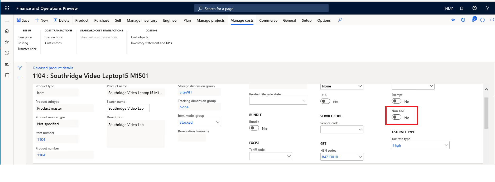

---
# required metadata

title: What's new or changed for India GST in 10.0.01 (April 2019)
description: This topic describes new or changed functionality for India GST features released in Dynamics 365 Finance version 10.0.01.
author: prabhatb
ms.date: 06/15/2020
ms.topic: article
ms.prod: 
ms.technology: 

# optional metadata

ms.search.form: 
audience: Application User
# ms.devlang: 
ms.reviewer: kfend
# ms.tgt_pltfrm: 
ms.custom: 
ms.search.region: India
# ms.search.industry: 
ms.author: prabhatb
ms.search.validFrom: 
ms.dyn365.ops.version: 10.0.1

---

# What's new or changed for  India GST in 10.0.01 (April 2019)

[!include [banner](../includes/banner.md)]

This topic includes a summary of the new features and critical bug fixes released in Dynamics 365 Finance version 10.0.01 for India GST localization. 

## New configuration 
The following configurations are available from the Shared Asset Library in LCS for use in version 10.0.1:
 
- GSTReturns.version.14.xml
- GST Returns model mapping.version.14.5.xml
- GSTR1CSV.version.14.28.xml
- GSTR2CSV.version.14.32.xml
 
The following GSTR issues are also resolved:
- Total item discount amount is not showing in GSTR.
- Item unit of measurement should show both unit and its description, and for service item, it should be **Nos**.
- No customer billing name for stock transfer in GSTR.

## Non-GST item
You can create a non-GST item that is the default for **Tax information** in taxable transactions.

## Critical fixes 

- Can't post a purchase invoice for a service item with load in inventory.
- The HSN summary is empty and there are no records in B2CL(Supply to Large customer >INR 2,50,000) in GST offline tool format.
- Total transaction value in GSTR1/GSTR2 does not equal the invoice amount when a transaction price includes tax.
- Editing a request for quotation (RFQ) reply results in the following error, "Posting exception has been thrown by
  the target of an invocation”.
- Amount origin of withholding tax is incorrect.
- Unable to save a purchase order after changing a financial dimension. The following error occurs, 
  "Function MarkupTrans.parmSourceDocLineTypeEnumName has  been incorrectly called".
- Posting a sales invoice can result in the error, "Voucher xxx is already used as of date”.
- After changing the tax formula, the condition is updated with the same content as the formula.
- Invoice date is incorrect in GSTR1/GSTR2.
- Can't create a project invoice proposal for the on-account journal when the journal includes withholding tax with the error,
  "Object reference not set to an instance of an object".
- The Tax journal with a tax component of **IGST** and the posting type as **Tax Payable** is posted with SGST and CGST
  with zero amount.
- The **Tax transaction inquiry** page allows only 11 fields to be selected.
- GSTR2 takes the bill of entry posting date instead of the posting date for the import order.
- Can't open a tax document when the GST configuration is extended with the error, "Object reference not set an instance of an object".
- After edit formula/condition, the condition of other nodes shows the same value string.
- Auto-block importing of previous Microsoft Dynamics AX (AX2012) configuration versions to Dynamics 365 Finance.
- GSTR configuration for two companies cannot be set up.
- Can't add multiple tax measures with the same name.
- Retail statement posting fails during sales invoice posting when there is price include tax sales order with a service item,
  and the tax is different from the tax in the head quarter.

## Upcoming fixes in 10.0.2 

- Fixed exchange rate is not considered in GSTR1.
- Unable to view the tax information for a timesheet in Indian legal entity.
- GSTIN of e-commerce operator is always blank in GSTR1.
- Place of supply is incorrect in GSTR2.
- Project expense can't be posted when there is a sales tax group and an item sales tax group.

[!INCLUDE[footer-include](../../includes/footer-banner.md)]