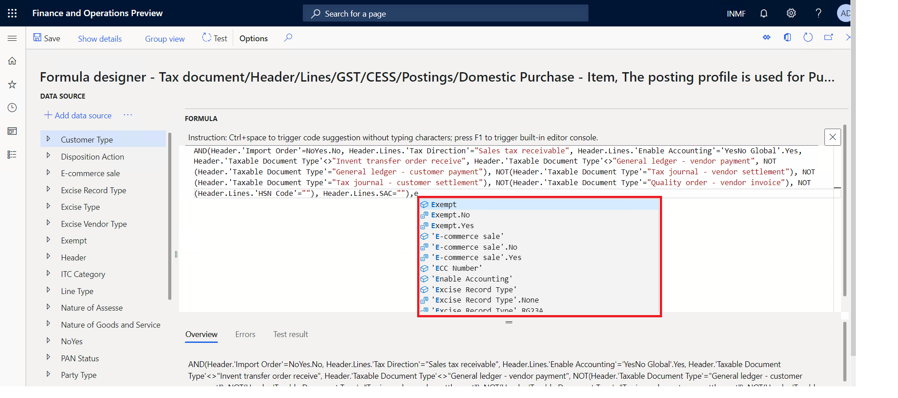

---
# required metadata

title: What's new or changed for India GST in 10.0.02 (May 2019)
description: This topic describes new or changed functionality for India GST features released in Dynamics 365 Finance version 10.0.02.
author: prabhatb
ms.date: 06/15/2020
ms.topic: article
ms.prod: 
ms.technology: 

# optional metadata

ms.search.form: 
audience: Application User
# ms.devlang: 
ms.reviewer: kfend
# ms.tgt_pltfrm: 
ms.custom: 
ms.search.region: India
# ms.search.industry: 
ms.author: prabhatb
ms.search.validFrom: 
ms.dyn365.ops.version: 

---

# What's new or changed for India GST in 10.0.02 (May 2019)

[!include [banner](../includes/banner.md)]

This topic includes a summary of the new features and critical bug fixes released in Dynamics 365 Finance version 10.0.02 forIndia GST localization. 

## New features
### Auto completion when editing tax formulas or conditions
Advanced editor is enabled for Global Tax Engine formulas/conditions to improve user productivity. To enable this functionality, go to **Electronic Reporting** > **Tax Configuration** > **Configurations** > **User Parameter** and set the **Enable advanced formula editor** field to **Yes**.

 

## Critical fixes 

- Fixed exchange rate in sales order header used for invoice posting but not used for the **GSTR 1** report.
-	Invoice date and GST tax document date are different when posting the credit note invoice. 
-	An incorrect financial dimension posted for GST in the stock transfer receipt. 
-	Unable to post free text invoices with GST information when signed in with the **Accounts Receivable clerk** role. 
-	**TDS/TCS group** field is editable only for the first line on the **Pending invoice** page.  
-	The tax rate is not the same for bill of entry (BOE) and purchase invoice if the date is not the same.
-	GST does not calculate correctly when the **Unit price** and **Discount %/Discount amount** fields are updated at the 
  purchase invoice level.
-	The **UQC** field from the HSN file in the **GSTR** report is not showing the full value because the length is ten characters.
-	The **Production order** page stops responding when selecting a production order.
-	The tax adjustment value is not posted when the voucher number allocation on the posting parameter is enabled.
-	GST is not updated in tax documents when consolidated invoices with miscellaneous charges that have GST are generated and posted 
  by consolidation of two or more product receipts or purchase orders.  
-	The **Tax journal** does not update the correct tax component and amount.  
-	**State place of supply** is incorrect for the **GSTR 2** report.
-	IGST credit posted through a tax journal is showing as recoverable on the **Tax settlement** page. 
-	Unable to view tax information for a timesheet in the India legal entity.
-	The assessable value does not update on the **Project milestone** (Billing rule) page.
-	The financial dimension is not pushed to the **Site in stock transfer** page.
-	Duplicate tax transactions are posted for the tax journal when the tax rate and the tax amount are equal to zero (0). 
-	After synchronizing a new configuration, GST tax codes with a name such as CGST1, are populated.
-	While selecting tax information, it's not possible to see the **GSTIN** table in time sheets.
-	The **Tax document** page fails to open from the **Stock transfer order** page. 
-	The **Tax** column has no value in the **Invoice journal** report in the **Accounts payable** module.

## Upcoming fixes in 10.0.3 

- Subtotal amount value is incorrect on the **Adjustment** page for settle and post sales tax.
-	Adjusted withholding tax origin amount is not reflected on the **Posted withholding tax inquiry** page.
-	**Project adjust transactions** is not working properly.
-	Invoice amount is shown incorrectly in the **Invoice journal** report.
-	The **Tax** column is not updated with tax value in the **Invoice journal** report.
-	The delivery address does not autoflow on the **Tax information** page for the sales order lines.
-	Tax information is not editable on the **Sales order after delivery** page.
-	The invoice number does not show in Posted withholding tax inquiry.
 

[!INCLUDE[footer-include](../../includes/footer-banner.md)]