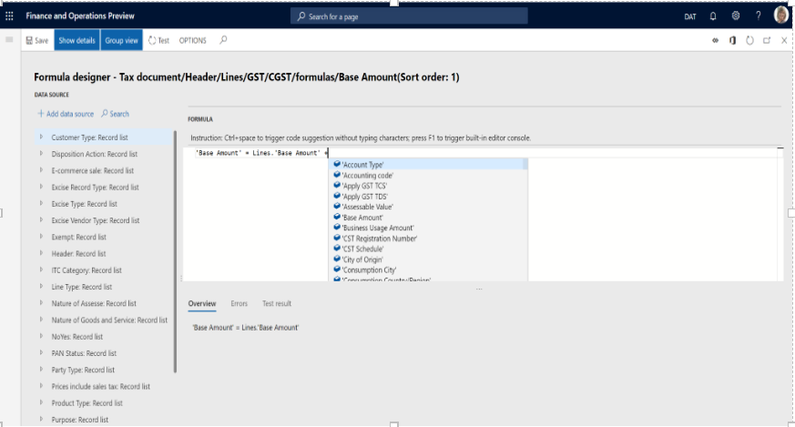

---
# required metadata

title: APAC India GST Localization Newsletter 10.0.02
description: This topic describes changes incorporated in Dynamics 365 Finance version 10.0.02.
author: prabhatb
manager: Wangcheng
ms.date: 06/08/2020
ms.topic: article
ms.prod: 
ms.service: dynamics-ax-applications
ms.technology: 

# optional metadata

ms.search.form: 
audience: Application User
# ms.devlang: 
ms.reviewer: kfend
ms.search.scope: Core, Operations
# ms.tgt_pltfrm: 
ms.custom: 
ms.search.region: India
# ms.search.industry: 
ms.author: prabhatb
ms.search.validFrom: 
ms.dyn365.ops.version: 

---
[!include [banner](../includes/banner.md)]

# Welcome to the newsletter for version 10.0.2

This topic includes a summary of the new features and critical bug fixes released in version 10.0.02 for India. You can learn more about the shipped features in the topic, [ What's new or changed in Finance and Operations version ](../../fin-and-ops/get-started/whats-new-changed-10-0-2.md).

## New Features
### Auto completion when editing tax formulas or conditions
Advanced editor is enabled for Global Tax Engine formulas/conditions to improve user productivity. To enable this functionality, go to **Electronic Reporting** > **Tax Configuration** > **Configurations** > **User Parameter** and set the **Enable advanced formula editor** field to **Yes**.

 

## Critical Fixes 

- Fixed exchange rate in sales order header used for invoice posting but not used for **GSTR 1** report .
-	Invoice date and GST tax document date are different when posting the credit note invoice. 
-	The wrong financial dimension posted for GST in the stock transfer receipt. 
-	Unable to post free text invoices with GST information when logged in with the **Accounts Receivable clerk** role. 
-	**TDS/TCS group** field is editable only for the first line on the **Pending invoice** page.  
-	The tax rate is not the same for BOE and purchase invoice if the date is not the same.
-	GST does not calculate correctly when the **Unit price** and **Discount %/Discount amount** fields are updated at the Purchase invoice level.
-	The **UQC** field from the HSN file in the **GSTR** report is not showing the full value because the length is ten characters.
-	The **Production order** page hangs when selecting a production order.
-	The tax adjustment value is not posted when the voucher number allocation on the posting parameter is enabled.
-	GST is not updated in tax documents when consolidated invoices with miscellaneous charges that have GST are generated and posted 
  by consolidation of two or more product receipts or purchase orders.  
-	The **Tax journal** does not update the correct tax component and amount.  
-	**State place of supply** is wrong for the report, **GSTR 2**.
-	IGST credit posted through a tax journal is showing as recoverable in the **Tax settlement** page. 
-	Unable to see tax information for a timesheet in the India legal entity.
-	The assessable value not updating in the **Project milestone** (Billing rule) page.
-	The Financial dimension is not pushed to the **Site in stock transfer** page.
-	Duplicate tax transactions are posted for the tax journal when the tax rate and the tax amount are equal to zero (0). 
-	After synchronizing a new configuration, GST tax codes with name like CGST1, are populated.
-	While selecting tax information, it's not possible to see the **GSTIN** table in time sheets.
-	The **Tax document**page fails to open from the **Stock transfer order** page. 
-	The **Tax** column has no value in the **Invoice journal** report in the **Accounts payable** module.

## Upcoming critical fixes in 10.0.3 

- Subtotal amount value is wrong on the **Adjustment** page in Settle and post sales tax.
-	Adjusted withholding tax origin amount is not reflected in the **Posted withholding tax inquiry** page.
-	**Project adjust transactions** is not working properly.
-	Invoice amount is shown incorrectly in the **Invoice journal** report.
-	The **Tax** column not updated with tax value in the **Invoice journal** report.
-	The delivery address does not autoflow on the **Tax information** page for the SO lines.
-	Tax information is not editable on the **Sales order after delivery** page.
-	The invoice number does not come in Posted withholding tax inquiry.
 
