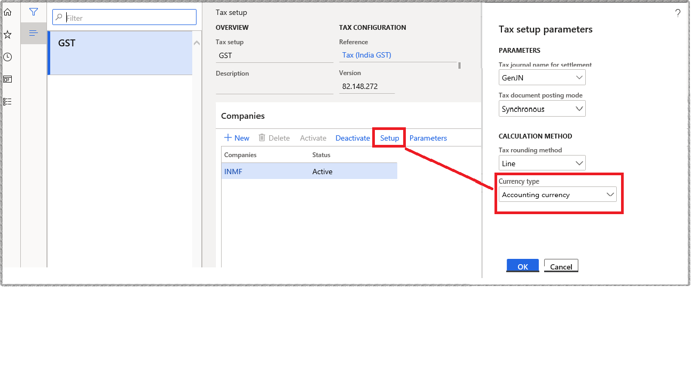

---
# required metadata

title: What's new or changed for India GST Localization in 10.0.03 (June 2019)
description: This topic describes new or changed functionality for India GST features released in Dynamics 365 Finance version 10.0.03.
author: prabhatb
manager: Wangcheng
ms.date: 06/15/2020
ms.topic: article
ms.prod: 
ms.service: dynamics-ax-applications
ms.technology: 

# optional metadata

ms.search.form: 
audience: Application User
# ms.devlang: 
ms.reviewer: kfend
ms.search.scope: Core, Operations
# ms.tgt_pltfrm: 
ms.custom: 
ms.search.region: India
# ms.search.industry: 
ms.author: prabhatb
ms.search.validFrom: 
ms.dyn365.ops.version: 10.0.3

---

# What's new or changed for India GST Localization in 10.0.03 (June 2019)

[!include [banner](../includes/banner.md)]

This topic includes a summary of the new features and critical bug fixes released in Dynamics 365 Finance version 10.0.03 for India GST localization. 

## New features and updates
### GST solution document is updated 
Updates have been made to the following topic, [India Goods and Services Tax (GST) overview](apac-ind-gst.md).

### GSTR report performance improvement
**GSTR** report generation time reduced 30% because of the replacement of line-by-line data fetch with dataset operation.
 
### Delete the selected (multiple) tax lookup condition record
In addition to deleting a single record or all records, you can now delete multiple selected records.

### Enable tax calculation based on the accounting currency for import/export order
For more information about calculating tax in the accounting currency for import/export orders, see [What's new or changed in Finance and Operations version 10.0.3 (June 2019)](../../fin-ops-core/fin-ops/get-started/whats-new-changed-10-0-3.md#calculate-tax-in-accounting-currency-for-importexport-order).

### Use Tax transaction inquiry 
With the release of 10.0.04, use the Tax transaction inquiry functionality for TDS/TCS instead of post withholding tax.

## Critical fixes 

- When you create an export order, there is Basic Custom Duty (BCD) and Social Welfare Surcharge (SWS). When the export order is posted, only BCD is posted. The following configurations are needed to resolve this issue:
 
  -	Taxable Document .version.81.xml
  -	Taxable Document (India) .version.81.138.xml
  -	Tax (India GST) .version.81.138.248.xml

-	GST related accounts are posted without financial dimensions in the project invoice proposal.
-	The subtotal amount value is incorrect on the **Adjustment** page for settling and posting sales tax.
-	The adjusted withholding tax origin amount is not reflected on the **Posted withholding tax inquiry** page.
-	Project adjust transactions are not working properly.
-	The invoice amount is incorrect in the **Invoice journal** report when posted through an invoice journal with TDS.
-	The **Tax** column is not updated with the tax value in the **Invoice journal** report.
-	The delivery address does not populate on the **Tax information** page for the sales order lines.
-	HSN or SAC code is not editable in the tax information sales return order after delivery. 
- Can't post free text invoice (FTI) and confirm the purchase order because one or more accounting distributions is over distributed.
-	Assessable value is not updated in a sales order after the **Personalized** field is updated.
-	Charges on the header level don’t calculate the sales tax amount for the India entity.
-	The invoice number does not show in the posted withholding tax inquiry after posting the **Withholding tax adjustment** journal.

## Upcoming fixes in 10.0.4 

- GSTR-2 mismatch in figures when the invoice journal is posted with a multi-line transaction.
-	Standard sales tax does not get calculated in Accounts payable.
-	Proforma invoices consumes a number from the invoice number sequence. 
