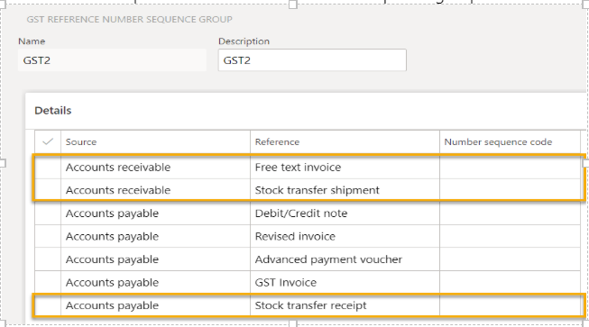

---
# required metadata

title: What's new or changed for India GST in 10.0.04 (July 2019)
description: This topic describes new or changed functionality for India GST features released in Dynamics 365 Finance version 10.0.04.
author: prabhatb
ms.date: 06/15/2020
ms.topic: article
ms.prod: 
ms.technology: 

# optional metadata

ms.search.form: 
audience: Application User
# ms.devlang: 
ms.reviewer: kfend
# ms.tgt_pltfrm: 
ms.custom: 
ms.search.region: India
# ms.search.industry: 
ms.author: prabhatb
ms.search.validFrom: 
ms.dyn365.ops.version: 10.0.04

---

# What's new or changed for India GST in 10.0.04 (July 2019)

[!include [banner](../includes/banner.md)]

This topic includes a summary of the new features and critical bug fixes released in Dynamics 365 Finance version 10.0.04 for India GST localization. 
.

## New features
### Define GST reference number sequence group

You can define a separate GST reference number sequence group for free text invoice, stock transfer receipt, and stock transfer shipment. 
 
 
 
### Financial dimension linked to the inventory dimension site 
Financial dimensions that are linked to the inventory dimension site will be automatically populated on the order line of the stock transfer receipt. 

## Critical fixes 

- Total transaction value in GSTR2 is incorrect for multi-line invoice journals with both debit and credit ledger lines.
-	Performing Settle and post sales tax does not reach the vendor account.
-	Tax is not calculated in return orders.
-	The GST registration ID is not updated after the delivery address is changed in a purchase order.
-	Adjustment of project transactions is not working correctly.
-	Financial dimensions are not updated for the GST ledger after project invoices are posted.
-	Proforma invoices consume a number from the invoice number sequence.

## Upcoming fixes in 10.0.5 

- TDS is not deducted correctly when an invoice is settled with prepayment.
-	Calculated GST is not posting to the expense account when the Service Accounting Codes (SAC) is selected with ITC category is **Others**.
-	Charge allocation on the sales lines is in proportion to the GST regulation change.
-	Save the tax document in the purchase order confirmation so that the tax document can be opened after the purchase order is posted.
-	IGST isn't calculating on a Special Economic Zone (SEZ) purchase.
-	In a partial invoice against the purchase receipt quantity, the assessable value is not updated and the GST is not calculated. 
-	The load on inventory amount is not posting to the fixed asset account when a fixed asset is acquired through a purchase order.

[!INCLUDE[footer-include](../../includes/footer-banner.md)]