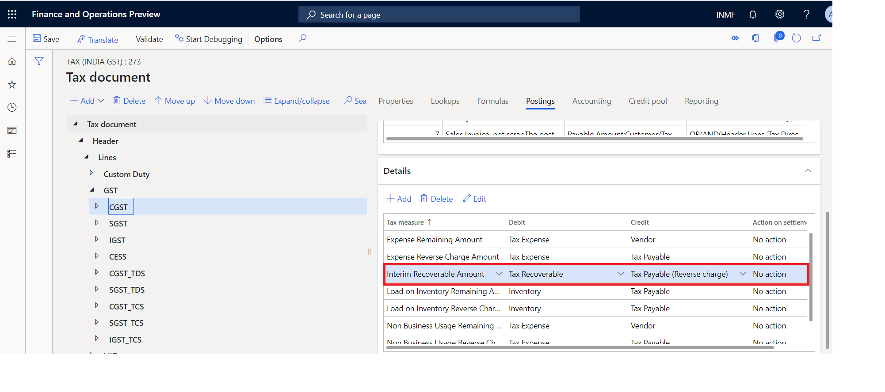

---
# required metadata
title: What's new or changed for India GST in 10.0.05 (October 2019)
description: This topic describes new or changed functionality for India GST features released in Dynamics 365 Finance version 10.0.05.
author: prabhatb
ms.date: 06/08/2020
ms.topic: article
ms.prod: 
ms.technology: 

# optional metadata

ms.search.form: 
audience: Application User
# ms.devlang: 
ms.reviewer: kfend
# ms.tgt_pltfrm: 
ms.custom: 
ms.search.region: India
# ms.search.industry: 
ms.author: prabhatb
ms.search.validFrom: 
ms.dyn365.ops.version: 10.0.5

---

# What's new or changed for India GST in 10.0.05 (October 2019)

[!include [banner](../includes/banner.md)]

This topic includes a summary of the new features and critical bug fixes released in Dynamics 365 Finance version 10.0.05 for India GST localization. 

## New configuration 
The following configurations are available from the Shared Asset Library in LCS for use in version 10.0.5. For more information about the released configuration details, see [India Goods and Services Tax (GST) overview](apac-ind-gst.md).
 
- Taxable Document.version.82.xml
- Taxable Document (India).version.82.143.xml
- Tax (India GST).version.82.143.263.xml 
 
 The following features or fixes are also included:
- Resolved the issue of zero tax-base for tax exempt transactions.
- Support CGST and SGST for intra-state stock transfer orders between warehouses with different GST registrations. 
- Support VAT for non-GST items.
- Enable tax rate type.
 
In most of the taxation system, there is concept of tax rate type, similar to standard tax rate, reduced tax rate, and super reduced tax rate. In India GST, there are following five slabs. 

| Rate       | Type             | Products                                                                                                                                                                                                             |
|------------|------------------|----------------------------------------------------------------------------------------------------------------------------------------------------------------------------------------------------------------------|
|     0%     |     Nil          |     Basic foods, including fish, meat, dairy, vegetables, bread, and salt. Postal services. Books and newspapers. Accommodation below Rs 999 per night.                                                              |
|     5%     |     Low          |     Household necessities such as edible oil, sugar, spices, tea, and coffee (except instant) are included. Coal, Mishti/Mithai (Indian Sweets), and lifesaving drugs are also covered under this GST slab.    |
|     12%    |     Standard1    |     This includes computers and processed food.                                                                                                                                                                      |
|     18%    |     Standard2    |     Hair oil, toothpaste and soaps, capital goods, and industrial intermediaries are covered in this slab.                                                                                                         |
|     28%    |     High         |     Luxury items such as small cars, consumer durables like AC and refrigerators, premium cars, cigarettes and aerated drinks, and high-end motorcycles are included here.                                        |

You can now associate the Tax rate type to a Released product, Procurement/Sales categories, and Charge code.

Use the Tax rate type to determine the tax rate which will dramatically reduce the number of tax setup data records.

For Retail customers whose terminals haven't been updated to 10.0.5, use the following configurations. The only difference is tax rate types are not supported. 

- Taxable Document.version.82.xml
-	Taxable Document (India).version.82.143.xml
-	Tax (India GST).version.82.143.264.xml 

### Improve GTE calculation performance by skipping model mapping

This feature was released in 10.0.2, but more details are now available. If you are using Microsoft's standard configuration, or you extended only the tax document, you can skip model mapping which will improve the tax calculation and posting performance.

### Support calculate/adjust tax in accounting currency
This feature was released in 10.0.3, but more details are now available. You can adjust the actual tax amount in the accounting currency for import/export orders to mitigate the difference for customs duty.

To enable this functionality, go to **Tax** > **Setup** > **Tax Configuration** > **Tax Setup** > **Parameter** and select the appropriate information in the **Calculation method** field group.

### Financial dimension linked to inventory dimension site is not auto-populated in stock transfer receipt order line

This feature was released in 10.0.4, but more details are now available. When you activate the financial dimension, the following occurs in stock transfer orders:
 
- The financial dimension value that is specified for the site defaults as the financial dimension value for the respective site in the stock transfer order.
- You can change the dimension value for the financial dimension before you post the stock transfer shipment and receipt. However if you lock the financial dimension link, you can't modify the financial dimension value that is associated with a site.
- The default financial dimension in stock transfer orders will be based on the standard functionality of the financial dimension and its association with the site inventory dimension.

To set up this feature, complete the following steps: 

1. Go to **Inventory management** > **Setup** > **Posting** > **Dimension link**.
2. In the **Reference** field, select the financial dimension to link to the site inventory dimension.
3. Select **Sites** to open the **Sites** page. The financial dimension selected in the **Reference** field is displayed 
  on the **Financial dimensions** FastTab, where you can also select a financial dimension value for the dimension.
4. Select a site, and on the **Financial dimensions** FastTab, select a financial dimension value. The specified financial
  dimension value is associated with the selected site.
5. Repeat step 4 for each site.
6. When you have finished with the sites, go to **Inventory management** > **Outbound Orders** > **Transfer Order** > **Stock transfer order** and create a new stock transfer order.
7. Select a stock order line, and on the **Financial dimension** tab, select **Line details** > **Default financial dimension**. 

### Address reverse charge transactions per the government clarification

With few changes in the released standard configuration, the Reverse charge feature can be made simple as it relates to accounting. 

 
Based on the clarification, in the configuration, you can post GST tax in interim recoverable at the same time that you post a purchase invoice. GST input tax is posted directly into a tax recoverable account. 

To make these changes, complete the following steps.

1. Create new posting account called **Tax payable reverse charge**. 

2. Identify the reverse charge liability in a separate account such as **Tax Payable (Reverse charge)**. This should be defined as a **Ledger account** instead of **Tax account** because reverse charge liability can't be directly settled with input tax credit. Instead, it must first be paid separately from the **Cash Ledger account**.
3. Set the following field information:

**Under posting**
- Tax measure: Interim recoverable  
- Debit: Tax Recoverable 
- Credit: Interim Tax payable 

**Vendor payment** 
- Tax measure: Interim Recoverable account
- Debit: Interim Tax payable 
- Credit: Tax payable reverse charge 

Settle the reverse charge liability from the cash account on the last day of the month in which reverse charge liability was created. 

## Critical fixes 

- TDS is not deducted correctly when an invoice is settled with prepayment.
-	Save the tax document on the **Purchase order confirmation** page so the **Tax document** page can be opened after posting.
-	The same exchange rate is not picked in the tax document on the **BOE** page and the **Import invoice/product receipt** if the 
  date is not the same for both documents. 
-	Tax information is carried over to the customer history. 
-	The financial dimension is defined for the ledger account, which is used as the offset account for a vendor transaction. An error could display during withholding tax settlement with TDS authority.
-	The TDS amount shows as incorrect in vendor transactions when the TDS amount is adjusted to zero (0).
-	The **Open vendor invoice line** disappears when the line is saved.
-	On the partial invoice against the purchase receipt quantity, the assessable value is not updated and the GST is not calculated. 
-	The load on inventory amount is not posting to the fixed asset account when the fixed asset is acquired through a purchase order with a service item.
-	Location ID of legal entity, **IN** does not default on the project timesheet.
-	Tax is not populated on the **Invoice journal inquiry** page.
-	A shipping bill can't post when the default values for a summary update are set to **Invoice account**.
-	GST amount and assessable value should not be rounded by the rounding rule.
-	The totals in the GST tax invoice (shipment) are not displaying correctly.
-	Vendor tax information is missing in the purchase order line when the Purchase order is created from a purchase requisition.
-	Tax documents are not refreshed when the transaction date is updated for a vendor invoice.
-	Free text invoices are not posting with terms of payment, such as **Cash on delivery**, **Payment term**, and **GST**.

## Upcoming fixes in 10.0.6 

- Accounting entry issue on Import PO invoicing, along with bill of entry (BOE) feature, when an invoice is posted with reference 
  to product receipt quantity.
-	TDS is not working for customers with TDS threshold enabled.
-	Taxable value in the **GSTR1 offline** report does not match the invoice amount in the accounting currency on the 
  **Invoice journal** page for an export order. 
- Unable to view the Transaction ID in posted tax document transactions and posted Tax component transactions after adding a column.
-	Base amount should not be zero (0) for a sales order when the transaction line is marked as exempt tax.
-	Reversal of invoice posted with TDS displays incorrectly in the total invoice amount.
 

[!INCLUDE[footer-include](../../includes/footer-banner.md)]