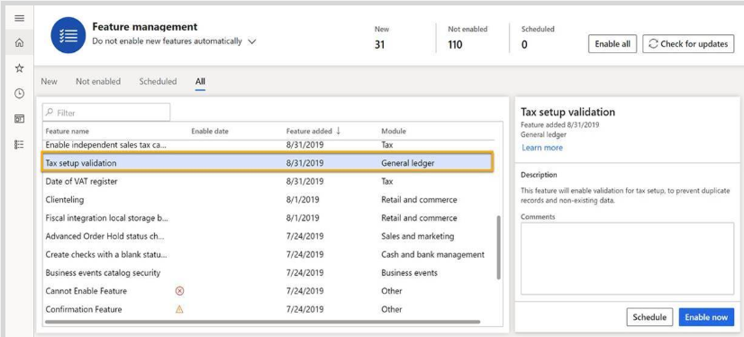
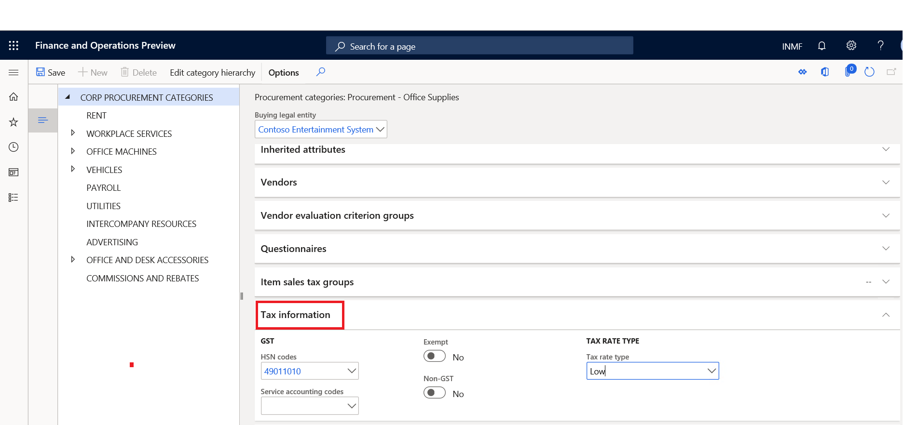

---
# required metadata

title: What's new or changed for  India GST in 10.0.06 (November 2019)
description: This topic describes new or changed functionality for India GST features released in Dynamics 365 Finance version 10.0.06.
author: prabhatb
ms.date: 06/15/2020
ms.topic: article
ms.prod: 
ms.technology: 

# optional metadata

ms.search.form: 
audience: Application User
# ms.devlang: 
ms.reviewer: kfend 
# ms.tgt_pltfrm: 
ms.custom: 
ms.search.region: India
# ms.search.industry: 
ms.author: prabhatb
ms.search.validFrom: 
ms.dyn365.ops.version: 10.0.6

---

# What's new or changed for India GST in 10.0.06 (November 2019)

[!include [banner](../includes/banner.md)]

This topic includes a summary of the new features and critical bug fixes released in version 10.0.06 for India. You can learn more about the shipped features in the topic, [What's new or changed in Finance and Operations version 10.0.6](../../fin-ops-core/fin-ops/get-started/whats-new-changed-10-0-6.md).

## New features
### Validate non-existent and duplicate records when importing tax setup 
During the process of importing tax setup, the system will validate the data correctness for master data like HSN and SAC, 
as well as data duplication. Duplicate data means the lookup records result in the same tax rate, load on inventory percentage, etc. 
This functionality can be turned on in the **Feature management** workspace.

### Tax information enabled for procurement category
Tax information has been enabled for procurement categories. Tax information can be added on the **Tax information** FastTab on the **Procurement categories** page. 

**Path : Procurement and Sourcing > Consignment > Procurement categories** 

 
### Enable multi-batch processing for GSTR reports

1. To turn on the multi-batch processing feature, go to **Workspaces** > **Feature management**.
2. On the **Features management** page, enable the **Multi-batch processing for GSTR reports** feature.
3. Go to **Tax** > **Sales tax reports** > **GER export to GSTR CSV** and generate a **GSTR** report.
3. Go to **Organization administration** > **Electronic reporting** > **Electronic reporting jobs**. 
4. Select the comma-separated values (CSV) files that you want.
   For example, select **GER export** to **GSTR CSV__Merged**. This file is generated as a merged file. 

 For more information, see [Enable multi-batch processing for GSTR reports](apac-ind-gst-multi-batch-processing-gstr-return.md).

## Critical fixes 

-	The transaction ID in posted tax document transactions and posted tax component transactions can't be viewed after a column is added.
-	Accounting entry issues occur when you import purchase order invoicing, and the invoice is posted with reference to a product receipt's quantity. 
-	Invoicing for customers in the Indian legal entity takes a long time to process.   
-	Base amount should not be zero (0) for a sales order when the **Exempt** check box is selected.   
-	CGST and SGST should be applicable for intra-state transfer orders if the GST registration number is different in two warehouses.
-	TDS is not working for customers that have "TDS threshold" enabled.   
-	Reversal of the Invoice journal posted with TDS shows an incorrect total invoice amount.  
-	Withholding Tax (TDS) threshold is not working correctly in typical TDS deduction scenarios.   
-	The TDS calculation in the open vendor invoice screen is incorrect.   
-	Incorrect calculation of GST for credit notes.   

## Upcoming fixes in 10.0.7 

- Printing multiple copies using print management is not working for the **Sales invoice** report.  
-	The imported customer free text invoice is not updating for the India legal entity.  
-	Data not showing in the **Tax Transaction inquiry for TDS** if the TDS settlement period character length is more than 10 characters. 
-	Transactions posted through the **Tax** journal are not showing on the **Vendor open transaction for settlement** page. 
-	The system is not considering the threshold defined for withholding tax.
-	Incorrect calculation of GST for a credit note. 
-	Incorrect TDS calculation on the **Open vendor invoice** page.  
-	The **Business verticals** field for the GST registration number on the **Enterprise Tax Registration Numbers** page should be editable and not greyed out. 

[!INCLUDE[footer-include](../../includes/footer-banner.md)]