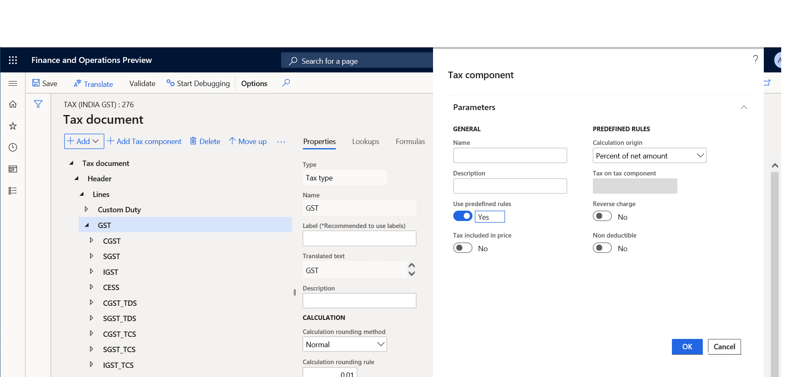

---
# required metadata

title: What's new or changed for India GST in 10.0.07 (January 2020)
description: This topic describes new or changed functionality for India GST features released in Dynamics 365 Finance version 10.0.07.
author: prabhatb
ms.date: 06/15/2020
ms.topic: article
ms.prod: 
ms.technology: 

# optional metadata

ms.search.form: 
audience: Application User
# ms.devlang: 
ms.reviewer: kfend
# ms.tgt_pltfrm: 
ms.custom: 
ms.search.region: India
# ms.search.industry: 
ms.author: prabhatb
ms.search.validFrom: 
ms.dyn365.ops.version: 

---

# What's new or changed for India GST in 10.0.07 (January 2020) 

[!include [banner](../includes/banner.md)]

This topic includes a summary of the new features and critical bug fixes released in Dynamics 365 Finance version 10.0.07 for India GST localization. 

## New features
### Create tax component with pre-defined rules 

You can create a new component with pre-defined rules that support GST behaviors including non-deductible and 
reverse charge for purchases and sales. With this feature, you do not need to create a tax component, which includes adding tax measures, configuring the tax calculation formula, and configuring a tax posting profile. 

You can enable the feature in **Feature management** workspace. The feature name is **Enable creating tax component with pre-defined rules**.
 
 
 With the feature enabled, there are several controls enabled in the dialog box. You can use them to control the behavior 
 of the tax component. For more information, see [Create tax components](tax-engine-create-tax-component.md).
 
 
 
## Critical fixes 

- Printing multiple copies of the **Sales invoice report** by using print management is not working.
-	Invoice address is not automatically populating in the customer tax information included in the timesheet.
-	Importing customer data to a free text invoice is not updating for the Indian legal entity. 
-	Transactions posted through the **Tax journal** are not showing in open vendor transactions for settlement.
-	Sales tax settlement might have an update conflict when the **TaxsalesTaxpaymentHistory** detail is updated multiple times. 
-	Incorrect Withholding tax (TDS/TCS) posting in the reporting currency when the exchange rate is changed at the time of payment 
  with the transaction settled for foreign vendor transactions. 
- Incorrect calculation of GST for credit note. 
-	Lines that are imported using the **VendorInvoiceLine** entity are not visible on the **Pending vendor invoice** page in the India entity. 
-	The **Business verticals** field on the **GST registration numbers** page should always be editable. 

## Upcoming fixes in 10.0.8 

- Tax amount showing in purchase order totals and purchase invoice total is posted with 100 percent reverse charges. 
-	TDS transactions are not updated in the **Withholding tax transaction (TDS/TCS)** report when settled in the **Prepayment with invoice** report. 
-	Assessable value is updated after the charge code is removed from the Purchase order invoice line. 
-	When you change the selected vendor on a purchase requisition, vendor tax information is not updated on the **Tax information** page.
-	Incorrect Free on board (FOB) and Cost, insurance, and freight (CIF) calculation on exported sales orders. 
-	Assessable value is not updated correctly on the **Vendor invoice** page when posted changes are incorporated in the **Excel import** file and published to Dynamics 365 Finance.

[!INCLUDE[footer-include](../../includes/footer-banner.md)]