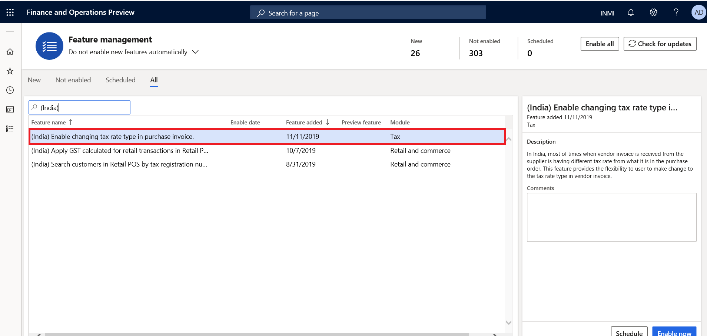
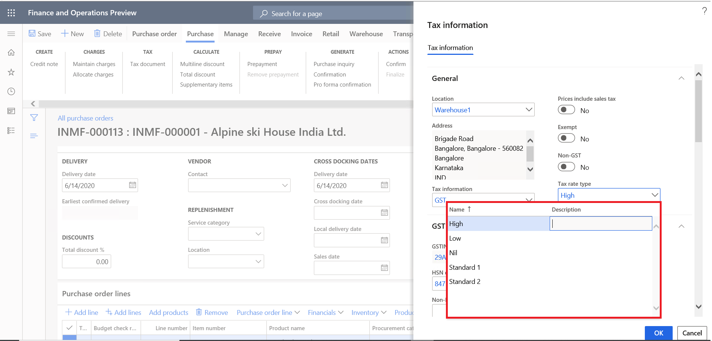
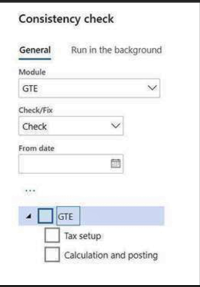

---
# required metadata

title: What's new or changed for India GST in 10.0.08 (February 2020)
description: This topic describes new or changed functionality for India GST features released in Dynamics 365 Finance version 10.0.08.
author: prabhatb
ms.date: 06/15/2020
ms.topic: article
ms.prod: 
ms.technology: 

# optional metadata

ms.search.form: 
audience: Application User
# ms.devlang: 
ms.reviewer: kfend
# ms.tgt_pltfrm: 
ms.custom: 
ms.search.region: India
# ms.search.industry: 
ms.author: prabhatb
ms.search.validFrom: 
ms.dyn365.ops.version: 10.0.8

---

# What's new or changed for India GST in 10.0.08 (February 2020)

[!include [banner](../includes/banner.md)]

This topic includes a summary of the new features and critical bug fixes released in Dynamics 365 Finance version 10.0.08 for India GST localization.

## New features
### Change the tax rate type on a purchase invoice 
In India, the invoice received from the supplier may have different tax rates from the purchase order, which is supported by the tax rate type functionality.
 
You can enable the feature in the **Feature management** workspace. The name of the feature is **(India) Enable changing tax rate type in purchase invoice**.
 
 
With the feature enabled, you can update the tax rate type in the tax information for a purchase invoice, so you can apply a different tax rate if needed.

### Data consistency check

You can verify and fix a data inconsistency issue regarding GTE. To do this, go to **System administration** > **Periodic tasks** > **Database** > **Consistency check**. We recommend that you run this consistency check in your environment.

### GST number sequence issue
A posting failure can occur due to missing or incorrect setup of the GST number sequence. To resolve the issue and set up the GST number sequence correctly, complete the procedures in the [Define GSTINs and reference number sequences](apac-ind-gst-define-gstin-numbers-number-sequences.md) and [Set up GST reference number groups](apac-ind-gst-reference-groups.md) topics.

## Critical fixes 

- After defining the tax information on a purchase order, the tax account lines on the **View distribution** page are not visible. 
-	TDS transaction is not updated in **Withholding tax transaction** reports when the invoice is settled with prepayment. 
- Tax amount showing in purchase order totals and purchase invoice totals is posted with 100 percent reverse charges.
- Assessable value is updated after the charge code is removed from the purchase order invoice line.
- When you change the selected vendor on a purchase requisition, vendor tax information is not updated on the **Tax information** page.
- Incorrect Free on board (FOB) and Cost, insurance, and freight (CIF) calculation on exported sales orders.
- Assessable value is not updated correctly on the **Vendor invoice** page when posted changes are incorporated in the Excel import file and published into Dynamics 365 Finance.

## Upcoming fixes in 10.0.9 

- Free text invoice print is not working for non-GST invoices. 
-	Tax is not calculated when data is imported through the data entity file. 
-	When a free text invoice is generated from an Indian company, an error occurs. 
-	The system generates a sales order invoice instead of a  GST tax invoice when the tax value becomes zero (0). 
-	The value in the GSTR-2 column, **Is Reverse charge applicable** is updating incorrectly. 
-	The **Tax code** lookup filter option is unavailable in the tax configuration.
-	The GTE set off hierarchy version is not the latest version. 
-	There is an issue with the journal voucher description transaction for GST transactions.
-	Per government notification, there is a change in the hierarchy of the tax settlement components.

[!INCLUDE[footer-include](../../includes/footer-banner.md)]