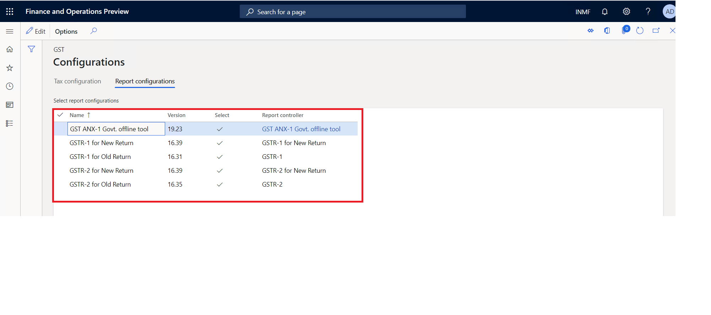
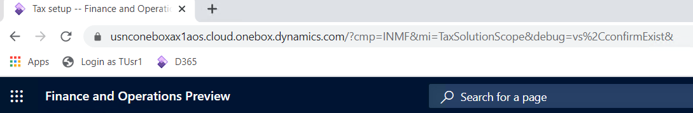
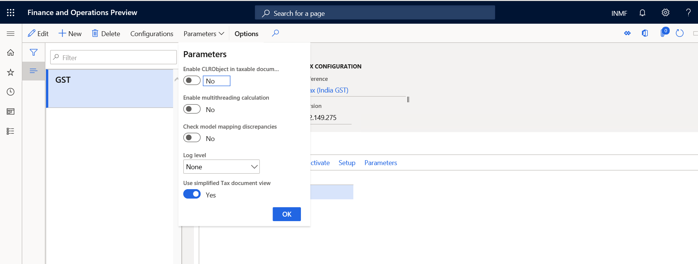

---
# required metadata

title: APAC-IND-Newsletter-10-0-09
description: This topic describes changes incorporated in Dynamics 365 Application version 10-0-09
author: prabhatb
manager: Wangcheng
ms.date: 05/31/2020
ms.topic: article
ms.prod: 
ms.service: dynamics-ax-applications
ms.technology: 

# optional metadata

ms.search.form: 
audience: Application User
# ms.devlang: 
ms.reviewer: 
ms.search.scope: Core, Operations
# ms.tgt_pltfrm: 
ms.custom: 
ms.search.region: India
# ms.search.industry: 
ms.author: 
ms.search.validFrom: 
ms.dyn365.ops.version: 

---
[!include [banner](../includes/banner.md)]

# Welcome to the newsletter for version 10.0.9! 

This newsletter includes a summary of the new features and critical bug fixes released in version 10.0.09 for India.
You can learn more about the shipped features in 
-[ What's new or changed in Finance and Operations version ] (https://docs.microsoft.com/en-us/dynamics365/unified-operations/fin-and-ops/get-started/whats-new-changed-10-0-9)

# New Features
## Charge allocation feature in sales order  
Introducing new feature charge allocation to all sales order lines.
To enable this feature Go to feature management > check for updates > enable the below features
Charges allocation on a sales order

## Sales order :

In the header user can mark "Assessable value" on charge line . Based on this selection  distributed charge value added 
to line item taxable value and taxes are computed accordingly 
 
## Defaulting of customer business address in the tax information 

This feature will default customer business address in the tax information tab of a sales transaction and company address
in the tax information tab of a direct delivery purchase order.
User can enable this feature through feature management. 
 

By using Direct delivery functionality user can create deliveries directly from vendors to customers,
reducing delivery time and order administration. During direct delivery when purchase order is created Customer 
Delivery address defaults from Sales order form . However from the GST prospective company own address should 
default in tax information. 

## New GSTR Return offline tool (Trial Version Prototype) for India in Dynamics 365 Finance 

Under New GSTR return process GST ANX-1 (Annexure of  supplies) and Annexure of Inward Supplies 
(GST ANX-2) will be filed as part of FORM GST RET-1 (Normal)  returns. User can generate following GSTR returns 

Please find all the details about the New GSTR Return offline Tool report in KB article:
(https://support.microsoft.com/en-us/help/4549665)  

## GTE debug mode
Sometimes tax cannot be calculated and/or posted properly after you extend the GST configuration. If you change the data model,
sometimes there are discrepancies between the inputs from Dynamics 365 Finance and the GTE. If you update/add posting profiles, 
you might encounter posting imbalance issues. It’s time consuming to troubleshooting such issue.

Now with debug mode enabled, system will dump a log file which contains the discrepancies between the inputs fields from 
Dynamics 365 Finance and the GTE, and the hit posting profile. 

Step 1: Append &debug=vs%2CconfirmExit& to D365 AOS URL and press enter to open a new session

Step 2: Go to Tax > setup > Tax configuration > Tax setup and check ‘Check model mapping discrepancies’ parameter
 
 
 
Step 3: Calculate tax for the transaction or re-calculate tax for the transaction, and then click Save to save 
the ‘GTETroubleshotingLog.txt, and provide the file to Microsoft for investigation.
 
  
 
# Critical Fixes 

- Business address is not updated automatically by system in tax information field while crating Sales order .
-	While generating "Free text invoice" from legal entity system throw error " Something went wrong while generating the request" 
-	Tax is not getting calculated when we import the data through data entity files. 
-	System is generating normal sales order invoice instead of GST tax invoice when tax value become zero. 
-	GSTR-2 - "Is reverse charge applicable value is wrong 
-	Fixed Assets value not updated with load on inventory amount when import order invoice with service item. 
-	GTE set off hierarchy version not get the latest version 
-	Journal voucher description truncation issue for GST transaction. 
-	Stock transfer order shipment voucher is not showing in GSTR-2 Report 
-	Direct Delivery Purchase order , customer address getting flow in tax information 
-	GSTIN registration numbers are TDS  registration number are not sharing with the other legal entities while 
  importing from the data management module even after sharing option enable . 
-	GST tax amount is deducted twice from the sale of assets net amount when price inclusive tax option enabled.
-	System is throwing error " Object reference not set to an instance of an object" while settling the vendor invoice transactions. 
-	In Purchase order invoice HSN/SAC numbers are not populating from PO when selecting PO using "+" sign 
  (Used for booking consolidated invoices) 
-	List all posting profile in GTE trouble shooting file when enabled debug mode. 
-	Transfer order posting not picking up IGST account .

# Upcoming critical fixes in 10.0.10 

- Import order-over-delivery setup respected at invoice registration stage 
-	Enable date time tracking for tax run time lookup condition table 
-	Transaction type not showing in case of Tax Journal posting 
-	Unable to generate recurring invoice as getting the error message " The menu item with name customer recurrence 
  invoice service operation could not be opened" . 
-	Tax calculation is wrong when post customer discount through general Journal 
-	Adjusted amount origin field showing wrong value. 
-	Difference between sales tax payment and actual transaction posted to tax authority .
