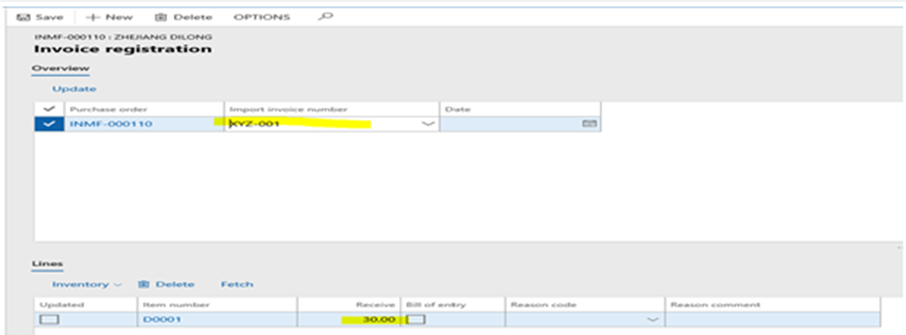
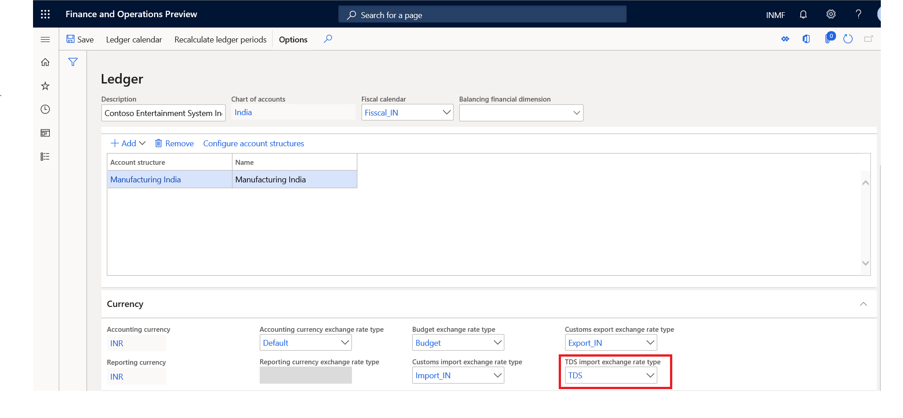

---
# required metadata

title: What's new or changed for India GST in 10.0.10 (May 2020)
description: This topic describes new or changed functionality for India GST features released in Dynamics 365 Finance version 10.0.10.
author: prabhatb
ms.date: 06/15/2020
ms.topic: article
ms.prod: 
ms.technology: 

# optional metadata

ms.search.form: 
audience: Application User
# ms.devlang: 
ms.reviewer: 
# ms.tgt_pltfrm: 
ms.custom: 
ms.search.region: India
# ms.search.industry: 
ms.author: prabhatb
ms.search.validFrom: 
ms.dyn365.ops.version: 

---

# What's new or changed for India GST in 10.0.10 (May 2020) 

[!include [banner](../includes/banner.md)]

This topic includes a summary of the new features and critical bug fixes released in Dynamics 365 Finance version 10.0.10 for India GST localization.

## New features

### Import order over delivery 

Previously, you could not adjust import order quantities on the **Invoice registration** page. This meant that customers couldn't accept a delivery of more items than what was originally ordered. With this new feature, you can update the invoice registration quantity to match the over delivery quantity. Complete the following steps to set up accepting over delivery.

1. Go to **Procurement and sourcing** > **Setup** > **Procurement and sourcing parameters**. 
2. On the **Deliver** tab, set **Accept delivery** to **Yes**, and then select **Save**.

Complete the following steps to update the over delivery quantity.

1. On the **Invoice registration** page, in the **Overview** pane, in the **Import invoice number** field, select the invoice you want to update.
2. In the **Lines** pane, in the **Receive** field, update the quantity.

### TDS on foreign vendor transactions
TDS on a foreign vendor invoice results in a voucher imbalance error because the transactions on voucher do not balance. 
As per rule 26 of Income tax act, TDS on a foreign currency transaction is converted on the TTR buying rate instead of normal GAP rate.

**TDS on transaction in foreign currency**

- Main transaction in GAP rate or manually updated exchange rate 
- TDS on transaction as per TDS exchange rate 

You can set up the **TDS exchange rate** as **TDS** and the **Accounting currency exchange rate type** as **Default** on the **Ledger** page.

**Accounting entries**

| Description                | Dr. (US$)     | Dr. (INR)          | Cr. (US$)                | Cr. (INR)                                        |
|----------------------------|--------------|-------------------|-------------------------|-------------------------------------------------|
|     Service/lease exp.    |     100      |     GAP rate      |                         |                                                 |
|     CGST                   |        9     |      GAP rate     |                         |                                                 |
|     SGST                   |        9     |      GAP rate     |                         |                                                 |
|     Vendor                 |              |                   |     108     (118-10)    |     (118@GAP rate - 10@TDS exchange rate)    |
|     TDS payable            |              |                   |     10                  |     TDS exchange rate                           |
|     Total                  |     118      |                   |     118                 |                                                 |

## Critical fixes 

- Enable date time tracking for the **Tax run time lookup condition** table. 
- Transaction type is not showing when the **Tax journal** is posted. 
- Unable to generate a recurring free text invoice using the **Free text invoice template**. 
- There is a difference between the sales tax payment and the actual transaction posted to tax authorities. This fix ensures
  that the sales tax settlement amount and the actual amount posted to the tax authority is matched. 
-**Adjusted amount origin** field shows an incorrect value. The system is picking the adjusted base amount posted in the
   initial transaction and that same amount is used for subsequent transactions. 
-  Tax calculation appears incorrect when a discount is applied through the **General Journal** in multi-line transactions.
   This happens with the discount ledger account for debit or credit. Two scenarios include:

    - Creating a credit note for a customer (GST is calculating negative value for discount).
    - Creating an invoice/debit note for a customer (GST is calculating positive value for discount). 

## Upcoming fixes in 10.0.11 

-	When a vendor record is created with multiple sub-vendors, the main supplier name and address are displayed in GSTR-2,
    which is not the information selected on the **Tax information** tab during posting. 
-	The **Withholding tax journal** is created to adjust the withholding tax (TDS) amount and select the voucher transaction
    for adjustment. An error occurs when the journal is posted and the transaction has been selected and transferred to 
    the **General journal**. 
-	Warning message is displayed when you define a charge code with the posting type of **Ledger** and an item combination
    on the transaction. 
-	A system error occurs while running withholding (TDS) tax payment.
-	Incorrect tax information is created from sales agreement and pushed to the sales order. Specifically, 
    the **Address** field displays the address of the legal entity instead of the warehouse address. 
-	When you post a free text invoice with GST tax and you selected to round off when setting up currencies, the system is
    not rounding the invoice amount for the customer sub-ledger account, but is rounding off correctly in the customer
    main ledger for the voucher.
-	The TDS section code and invoice number are not appearing in TDS inquiries. 
 

[!INCLUDE[footer-include](../../includes/footer-banner.md)]