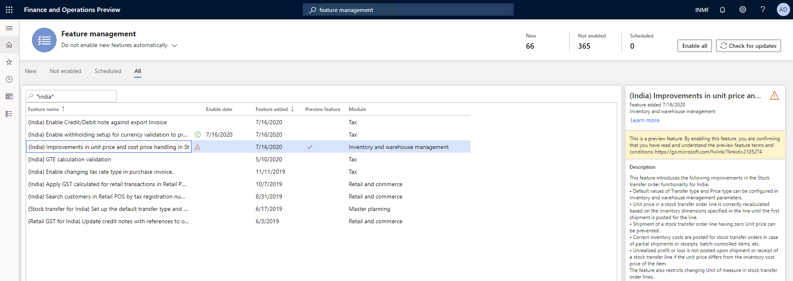
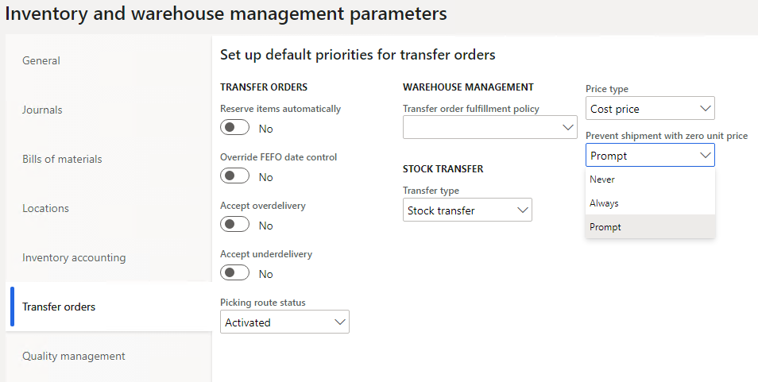

---
# required metadata

title: What's new or changed for India GST in 10.0.12 (July 2020)
description: This topic describes new or changed functionality for India GST features released in Dynamics 365 Finance version 10.0.12.
author: prabhatb
ms.date: 08/07/2020
ms.topic: article
ms.prod: 
ms.technology: 

# optional metadata

ms.search.form: 
audience: Application User
# ms.devlang: 
ms.reviewer: kfend
# ms.tgt_pltfrm: 
ms.custom: 
ms.search.region: India
# ms.search.industry: 
ms.author: prabhatb
ms.search.validFrom: 
ms.dyn365.ops.version: 10.0.12

---

# What's new or changed for India GST in 10.0.12 (July 2020)

[!include [banner](../includes/banner.md)]

This topic includes a summary of the new features and critical bug fixes released in Dynamics 365 Finance version 10.0.12 for India GST localization. 

## New features

### Improvements in unit price and cost price handling in stock transfer orders  

The following improvements are included in the stock transfer order functionality: 

- Default **Transfer type** and **Price type** values can be configured in the **Inventory and warehouse management parameters**. 
- The unit price on a stock transfer order line is recalculated based on the inventory dimensions specified in the line until the first shipment is posted for the line. 
- Shipment of a stock transfer order line with a unit price of zero (0) isn't possible. 
- Inventory costs are posted for stock transfer orders if there's partial shipment or receipts or batch-controlled items. 
- Unrealized profit or loss is no longer posted during the shipment or receipt of a stock transfer line if the unit price differs from the inventory cost price of the item. 
- Changing the unit of measure on stock a transfer order line is restricted. 

This feature can be enabled through Feature management.

### New parameter under Inventory management

The parameter, **Enable stock transfer for master planning** has been added to the **Inventory management parameters** page (**Inventory & warehouse management** > **Setup** > **Parameters**, **Transfer orders** tab) and the **Transfer type** page (**Master planning** > **Parameters** > **Transfer type**).  

## Critical fixes 

- A stock transfer has the same tax rate applicability at the time of shipment and receipt, including partial receipt. This means that tax was calculated on the new HSN code percentage instead of on the transfer order before the change in the HSN code percentage, which caused revenue loss to the customer.    
- Tax information fields weren't updated automatically when copied from the original free text invoice. The system updates the tax information related fields in the free text invoice lines that were copied from the original invoice line after tax. The tax document now displays the correct tax amount.   
- When the invoice journal was posted with TDS, users could reverse one transaction line from the **Vendor transaction** page and adjust the withholding tax through the General journal. Then, when the withholding tax payment was run, an error would occur. This occurred because the vendor invoice journal with TDS wasn't getting the ledger account through the **TaxWHTransGeneralJournalAccountEntry** table.
- In a multi-line invoice journal, when the transaction date is modified, only the first line in the tax document is updated with the corrected date when all of the lines must be updated with the latest transaction date.  
- When posting the general journal entry by using **Account type as project** and **Offset account type as a vendor** with the load on inventory and a reverse charge of 100 percent, the system doesn't allow the entry and the following error displays, “The transactions on voucher INMF-00545 do not balance as per 3/25/2020 (Accounting currency: -2500, Reporting currency: -2500).” After this fix, posting the project entry with the load on inventory and reverse charge percentage from the general journal system will allow posting without any imbalance error.  
- Removed and inactive addresses are appearing under the **Location** field on the **Tax information** page for invoices that are generated through the **Invoice journal** and the **Free text invoice**. The removed and inactive addresses will no longer appear in the **Location** field.  
- Lookup condition is linked to two different component measure owners.
- Voucher details are not showing in the posted journal during the process of settling the post-dated check. With this fix, the line shows on the grid.  
- An error occurs when posting an invoice journal that has multiple lines with TDS where the exchange rate changed after creating lines in the invoice journal. 
-  With this fix, the system posts the invoice journal (multiline) transaction successfully including TDS where the exchange rate is changed after all the lines are created in the invoice journal. The system will select the latest defined exchange rate for the whole transaction.  
- The WHT tax group isn't editable during invoice processing in India Legal Entity when a transaction is posted through the **Pending invoice** page. With this fix, the TDS/TCS group will be editable on the **Purchase order pending invoice** page for the line. You will be able to update the TDS/ TCS-related fields on the **Pending invoice** page during invoicing.  
- The source details in the **GST** number sequence group were deleted. With this fix, you can't delete the source details in the **GST reference** number sequence group if they are attached to a transaction. If you don't attach the source details to the transaction, you can delete the source details and then add them again.  
- Charges are not automatically updated in the **Assessable value** field on the sales order line when charges are applied through the **Auto charges** functionality even when the **Assessable value** check box is selected during setup. Charges are not auto-updating on the sales order line to include the charge amount in the assessable value of goods. After this fix, charges will be auto-updated on the sales order line when the **Assessable value** check box in selected and it will be part of the assessable value for tax calculation.  
- It is now possible to import general journal lines with tax using the data import-export feature. However, when the tax document was verified, all of the tax information from the imported general journal transaction was missing. To fix this issue, updates were made to the data entity, **Ledger journal line transaction tax information**.  
- When a balancing financial dimension is updated in the ledger and the financial dimension isn't set in the authority vendor, the following error occurred, **The transactions on voucher xxx do not balance as per xxx**. This message is misleading. With this fix, when the balancing the financial dimension is updated on the **Ledger** page, an error message will appear to check whether the financial dimension is set in the authorized vendor.   
- When you create a new customer, the system writes a record, **TaxInformationCustTable_IN** with **TaxInformationCustTable_IN.CustTable=''**, and then updates it with the customer account number. When the second step is canceled by exception, the first step will not roll back and the record is still there. When you try to create the customer record again, you can't because the column, **TaxInformationCustTable_IN.CustTable** is a unique index of the table. The system shouldn't save the record wit h**TaxInformationCustTable_IN.CustTable=''**. After this fix, when the **CustTable** field exists, records can be inserted into the related table.  
- Bill of entry (BOE) assessable value isn't updating per the assessable value on the purchase order line. After this fix, when a user creates new BOE after the cancellation of the earlier value, the new BOE will display the updated assessable value of the import order line.  
- Importing data by using the data entity **Ledger journal line transaction tax information** results in the following errors. The data entity, **Ledger journal line transaction tax information** was updated to resolve this.   
    - Matching record with key 'Registration Number': 29AGNPB4831B1Z1 for the data source 'GSTIN' doesn't exist  
    - Update not allowed for field **TransTaxInformationEntity.TaxWithholdNatureOfAssessee**. 

## Upcoming fixes in 10.0.13

- In an intercompany transaction, when a sales order is posted in one company, a purchase order is automatically generated in another company. However, the tax information based on the location of the purchasing company doesn't correctly default in the auto-generated purchase order. After this fix, the generated purchase order tax location of the purchasing company will default based on the warehouse information attached to the purchase order.
- When a withholding tax transaction is posted in a foreign currency, at the time of the withholding tax settlement to the authority, an imbalance error will occur. After this fix is implemented, you will able to successfully run settlements to the authority. After the line details are updated, the withholding tax (TCS) is calculated correctly for intercompany purchase return orders.
- When you import data by using the data entity, **Ledger journal line transaction tax information**, the following error occurs: **Results: Matching record with key tax information" to resolve the issue**.
- Vendor tax information is imported through the **Data entity** page. The system allows you to select more than one set of primary tax information details for vendor tax information. After this fix, the system will only allow you to enable one set of primary tax information details for the same vendor.
- When you import a purchase order, the value of the IGST tax isn't displayed on the **Totals** tab after generating the purchase order totals and purchase order invoice. After this fix, the value of IGST tax will display on the **Totals** tab on the purchase order and the purchase order invoice. However, you have to select the check box for the parameter to enable this option.
- The **Transaction type** field shouldn't be enabled on the **Sales quotation** page. You can manually add and update the field on the **Sales quotation** page. If it is updated to any value except **None** or **Expense**, the customer tax information will not be visible.
- While posting a foreign vendor payment and the applied the withholding tax of non-residence, if the currency rates on the transaction are changed, a similar exchange rate isn't applied for withholding tax calculation. Instead, the exchange rate is taken from the system. As a result, there's an imbalance in the posting and it's not completed. With this fix, vendor payments with TDS in foreign currency will post successfully.
- Tax-adjusted amounts are not showing the bill of entry on the tax document section on the **Invoice posting** page. After this fix, the adjusted amount on the bill of entry will flow and display in the tax document section on the **Posting invoice** page. 
- The **Bill of entry (BOE) number** column is present on the **Product receipt** page, but it's not displayed. After this fix, the BOE number will show by default in the lines on the **Product receipt** page.
- The load on inventory tax amount is posted to the purchase expenditure for an expense account instead of the cost of project account/fixed asset account when a purchase order is placed with a procurement category (Transaction posted with Project -vendor or fixed asset – vendor combination). After this fix, the tax amount will load to an offset account.
- After you post an imported purchase order, the system still allows you to create an invoice by selecting **Products receipt** on the **Pending vendor invoice** page. With this fix, after you post the imported purchase order invoice, it will not be available on the **Pending vendor invoice** page when you select **Product receipt**.

[!INCLUDE[footer-include](../../includes/footer-banner.md)]