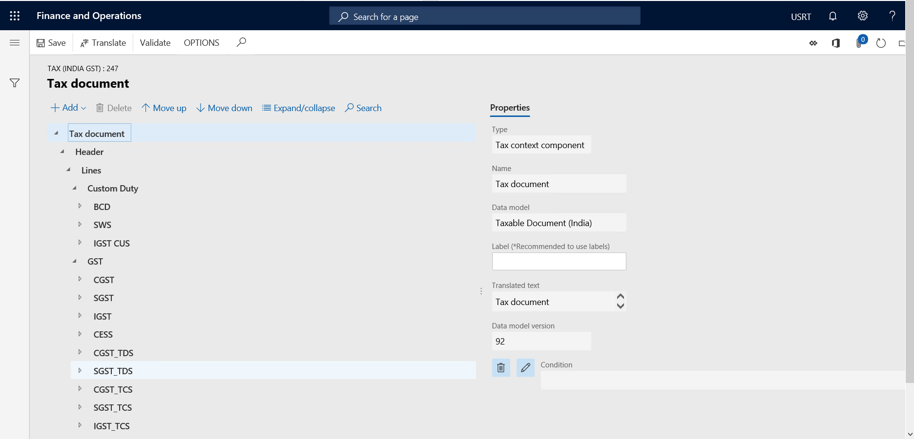

---
# required metadata

title: Scope of the Indian localization
description: This article provides information about the strategy and scope of the tax, finance, and accounting laws and regulations in India that were implemented as part of Microsoft Dynamics 365 Finance. 
author: kfend
ms.date: 08/21/2019
ms.topic: article
ms.prod: 
ms.technology: 

# optional metadata

#ms.search.form:
audience: IT Pro, Application User
# ms.devlang: 
ms.reviewer: kfend
# ms.suite: 
# ms.tgt_pltfrm: 
# ms.custom: 
ms.search.region: India
# ms.search.industry: 
ms.author: ralin
ms.dyn365.ops.version: 7.3.1
ms.search.validFrom: 2019-6-21
---

# Scope of the Indian localization

[!include [banner](../includes/banner.md)]

In general, Microsoft devotes significant resources to generating the business process functionality of our applications by developing features and functionality that address specific tax accounting or financial regulatory requirements in countries or regions where Dynamics 365 Finance is generally available.

The software, which helps business operations comply with country/region-specific laws, regulations, and common business practices for handling routine activities, is designed to include features and functionality that address the specific central and state government tax, accounting, and financial or statutory reporting laws or regulations that usually govern business in India. However, because laws and regulations are diverse and numerous, not all laws, regulations, or commercial requirements in India are covered. For example, regulatory features that Microsoft develops and makes generally available in India don't usually support industry-specific laws or national/regional standards, laws that are specific to particular states, or city or municipal legal requirements, except as noted in this article.

Channel partners are a very important part of the global strategy for delivering Dynamics 365 Finance. Their deliberation helps crystallize the thought process and helps Microsoft design a roadmap for achieving excellence in localization requirements. The flexible, need-based architecture of Finance is useful to channel partners as they try to address a customer's specific business needs during development, configuration, and implementation. Although channel partners might provide solutions that meet specific regulatory requirements that are unique to cities, states, or other regions in India, Microsoft doesn't provide any guarantees or warranties (expressed, implied, statutory, or otherwise) that partner-created solutions comply with local business, tax, and regulatory, legal, or other applicable requirements. Channel partners and customers are solely responsible for any configurations, customizations, localizations, or translations (and any updates to these configurations, customizations, localizations, or translations) that they create or implement on behalf of customers. They are also solely responsible for any support or other service that is provided to customers for such solutions. Users must contact their channel partner for information about the solutions that the channel partner creates for licensed versions of Finance.

This article outlines the strategy and scope of the localization that Microsoft has implemented as part of the version of Finance that is commercially available in India.

## Definitions

- **Customization:**

    - Any configurations or modifications that partners or customers make to Microsoft Dynamics software or applicable software documentation to fit a customer's specific business needs. For example, a partner or customer might add or rename fields or tables, create custom reports, or integrate with third-party solutions.
    - Any software that is developed for the Microsoft Dynamics software by or for partners or customers.

- **Localization:** Any modification to, addition to, or adaptation of Microsoft Dynamics software to enable or include specific features or functionality for compliance with applicable regulatory requirements. Localization can apply to, for example, versions and updates of the Microsoft Dynamics software, user assistance tools, or end-user documentation. Examples of laws or regulatory requirements that might require localization of software include local tax reporting (Goods and Services Tax \[GST\], Customs, and Tax Deduction at Source \[TDS\]/Tax Collection at Source \[TCS\]), specific law-driven tax calculations (reverse charge, price exclusive, and price inclusive tax), local accounting rules, and local regulatory and statutory reporting.
- **National/Regional standards:** Local requirements that aren't required by law or regulation, but that are widely adopted inside a geographic region and critical to the sale of licenses for business management software in that geographic region.

## Indian localization strategy

To address the tax (direct and indirect), financial accounting, and statutory reporting requirements for India, the strategy that Microsoft adopted involves providing localizations. This strategy consists of the following elements:

- Meet the central-level tax requirements that are described in the [Indian localization scope](#indian-localization-scope) section of this article.
- Meet state-specific and region-specific tax requirements if they are generic across all states in India.
- Meet tax requirements for export and import transactions.
- Deliver new regulatory feature requirements through configurations or new development, according to the localization scope and rules that are specified in this article, and according to implementation opportunities that are driven by the Finance roadmap.
- Deliver new regulatory features for all supported versions of Finance.

> [!NOTE]
> There is no focus on the requirements of specific businesses, segments, verticals, or regions, even when this focus is required by laws, statutes, or regulations at the federal, state, or city level. Only those city-specific tax requirements that are described in the [Indian localization scope](#indian-localization-scope) section are included.

Some laws and requirements are out of scope for this app. The localization that Microsoft develops for Finance is limited to the features and functionality that are described in this article. Therefore, the localization must be analyzed by prospective customers or a tax professional, such as an accounting and tax auditor, a tax law firm, or a tributary consulting firm that can assess whether the functionality will meet the customer's business needs, or whether custom solutions are required.

## Indian localization scope

The localization of this app provides a configuration for language, user interface, and Help settings. The Indian localization is available in English-IN. Additional documentation, such as white papers and comprehensive training materials, is also available in English.

The localization scope for Finance in India is limited to fiscal and financial accounting transactions in the following areas:

- Tax
- General ledger
- Accounts payable
- Accounts receivable
- Inventory management
- Product information and management
- Organization and management
- Project and service management
- Fixed assets
- Retail

The features that Microsoft delivers and supports as part of the Indian localization are listed later in this article.

## Market availability

Microsoft tries to deliver regulatory updates and changes so that there is enough time to install and implement them. For tax and regulatory updates that must be incorporated into Finance, the goal is to release the updates before the effective date or other date that is mandated by the tax authorities, regardless of whether the tax is central or state government tax. In that way, channel partners can acquaint themselves with features and have enough time to update their customer solutions. Internally, Microsoft calls this delivery date the "market required date" (MRD).

Microsoft tries to meet its established MRDs and dates that are mandated by the various government authorities. However, various factors can adversely affect the timely delivery of tax and regulatory updates. Here are some examples:

- Legislative or regulatory changes that the government makes at short notice before the date of law enforcement
- Feature, functionality, infrastructure, or architectural limitations of the affected software versions that are generally available in the marketplace
- The complexity and coverage of any coding, redesign, or improvement of the software that is required to implement the legislation or regulatory requirements
- Schedule conflicts

In any situation where Microsoft finds it difficult to meet these dates, it makes reasonable efforts to develop and release tax and regulatory updates as soon as possible.

#### Disclaimer

Any dates that Microsoft publishes are for planning only and are subject to change at any time, without notice.

Microsoft makes no representations, warranties, or guarantees about the timeliness or completeness of any tax or regulatory updates that it provides and, to the maximum extent that is permitted under applicable law, disclaims all implied warranties and conditions, such as implied warranties or conditions of merchantability and fitness for a particular purpose.

## Indian localization: Key benefits

- Configurable localization of [the Tax engine (GTE)](../general-ledger/tax-engine.md) and [Electronic reporting (ER)](../../fin-ops-core/dev-itpro/analytics/general-electronic-reporting.md) offers major benefits:

    - **Extensible transaction type** – A unified model is used in the tax calculation. The addition of transaction types requires additions only to the model mapping.
    - **Extensible tax calculation** – Formula-based calculation can be done by a power user.
    - **Extensible tax behavior** – Tax posting and accounting can be configured. Settlement rules can also be configured.
    - **Extensible tax return**
    - **Database-independent**
    - **Easy to upgrade**
    - **Lean**

- Configurations are generated in XML format.
- Base configurations (India GST and GSTR) are provided by Microsoft.
- Independent software vendors (ISVs) can create their own configurations on top of Microsoft software.
- Delta customization is supported for configuration.
- The Indian localization can work in parallel with the standard Dynamics 365 features in a global environment.
- The registration number details of the company, vendors, and customers for GST and direct taxes can be stored in a centralized location.
- The tax settlement process is flexible. The tax settlement hierarchy can be defined based on the user's needs.
- User-definable inquiry pages provide the relevant information that is required for statutory reporting.
- Users can make manual adjustments to taxes before they run the periodic tax settlement process.
- Component depreciation is calculated according to the Companies Act 2013 and the Income-tax Act, 1961, as required by the user.

## Indian localization: Key tax areas that are covered

Here are the main features that are covered in this localization:

- Direct taxes:

    - TDS
    - TCS

- GTE and ER:

    - The Tax engine is configurable.
    - Tax calculation, accounting logic, and reports are now configuration-based instead of code-based. Multiple tax bases can be selected.
    - Functional consultants can do the configuration alongside power users and can immediately confirm the outcome.
    - The lead time before a user can test how the system is likely to work can be counted in days or even hours. Faster interaction with the user can help increase satisfaction and decrease project risk.

- GST:

    - Outward supplies:

        - Business-to-business (B2B) sales
        - Business-to-consumer (B2C) sales
        - Export sales
        - Goods
        - Services

    - Deemed export
    - Sales:

        - Non-GST items
        - Zero-rated goods and services
        - Exempted goods and services

    - Reverse charge sales
    - E-commerce sales

- Inward supplies:

    - Supply from registered vendors
    - Supply from composite vendors
    - Supply from unregistered vendors
    - Supply from reverse charge vendors
    - Supply from foreign vendors:

        - General import
        - Import from an associate enterprise

    - Supply of exempted goods and services
    - Supply of non-GST items

- Depreciation on fixed assets:

    - Depreciation per the Companies Act 2013:

        - Component depreciation accounting
        - Depreciation per reducing balance with residual value

    - Depreciation per the Income-tax Act, 1961:

        - Depreciation per block of assets
        - Depreciation per period \> 180 days or \< 180 days

- GST report:

    - GSTR -1 Govt. Offline tool
    - GSTR -1
    - GSTR -2

- Retail:

    - Intrastate and interstate transactions
    - Normal sales
    - Customer orders
    - Return orders
    - Price-inclusive GST
    - Price-exclusive GST
    - Discounts and offers
    - Exempted sales
    - Replenishment
    - Uniform invoice numbers and point of sale (POS) receipt numbers

## Indian localization features

The Indian localization for Finance provides a configurable Tax engine that helps users comply with complex Indian statutory requirements by extending the configuration.

The following table lists the localization features that are supported in Finance. Any specific feature that isn't listed in this table isn't supported in the current version of the localization.

<table>
<thead>
<tr>
<th>Tax area</th>
<th>Features</th>
</tr>
</thead>
<tbody>
<tr>
<td>Direct tax – TDS</td>
<td>
<ul>
<li>The feature is simple and user-friendly.</li>
<li>Define the Tax Deduction and Collection Account Numbers (TANs) of the company, vendors, and customers on a master page.</li>
<li>Users can set the TDS authority account and define settlement periods specifically for the settlement process for TDS tax component groups.</li>
<li>Users can create TDS tax component groups, components, and tax codes per the legal requirements.</li>
<li>The threshold designer feature lets users define threshold hierarchies as either single-threshold or progressive-threshold hierarchies.</li>
<li>Various threshold types can be applied to the selected threshold. These threshold types include cumulative, per transaction, and per transaction line.</li>
<li>Users can set up withholding tax groups for each TDS type and define the tax calculation formula by using the designer.</li>
<li>The threshold limits and exception threshold limits can be defined through the advanced threshold feature.</li>
<li>TDS is automatically calculated at a higher rate if the Permanent Account Number (PAN) isn't quoted by the deductee.</li>
<li>Users can include or exclude GST, or any other tax or charge, for the TDS calculation.</li>
<li>Calculation and financial posting of TDS are provided on purchase invoices and payments to residents and non-residents.</li>
<li>Calculation and financial posting of TDS are provided on advance payments, and those advance payments are set off against related invoices.</li>
<li>Calculation and financial posting of TDS recoverable are provided on sales invoices and payments.</li>
<li>Reversal of TDS is provided through the Withholding tax journal.</li>
<li>Calculation and accounting of TDS are provided on centralized payments and cross-company payments.</li>
<li>Users can record the TDS concessional certificate numbers that are received from vendors under sections 197 and 197A.</li>
<li>Users can adjust posted TDS before it's paid to the Income Tax Authority.</li>
<li>The TDS adjustment feature can adjust excess TDS.</li>
<li>Periodic settlement of TDS can be done and can transfer the net payable amount to the authority account.</li>
<li>A user-defined inquiry page lets users view detailed information about tax that is deducted on transactions and deposited to the authority.</li>
<li>Users can generate quarterly e-TDS and e-TDS correction reports for 26Q and 27Q.</li>
<li>Users can print Form 27A.</li>
<li>Users can print Forms 26, 26Q, 27, and 27Q together with Annexures.</li>
</ul>
</td>
</tr>
<tr>
<td>Direct tax – TCS</td>
<td>
<ul>
<li>The feature is simple and user-friendly.</li>
<li>Users can set the TCS authority account and define settlement periods specifically for the settlement process for TCS tax component groups.</li>
<li>Users can create TCS tax component groups, components, and tax codes according to the legal requirements.</li>
<li>Users can set up withholding tax groups for each TCS type and define the tax calculation formula by using the designer.</li>
<li>Calculation and financial posting of TCS are provided on sales invoices and receipts, and on advance receipts, and those documents are set off against related invoices.</li>
<li>Users can adjust posted TCS before it's paid to the Income Tax Authority.</li>
<li>Users can record the TCS concessional certificate numbers that are received from customers under section 206C.</li>
<li>Calculation and financial posting of TCS recoverable are provided on purchase invoices and payments.</li>
<li>Calculation and accounting of TCS are provided on centralized payments and cross-company payments.</li>
<li>Periodic settlement of TCS can be done and can transfer the net payable amount to the authority account.</li>
<li>A user-defined inquiry page lets users view detailed information about tax that is collected on transactions and deposited to the tax authority.</li>
<li>A process for creating user-defined TCS certificate numbers is available.</li>
<li>Users can generate TCS certificates for customers and record information about the TCS certificates that are received from vendors.</li>
<li>Users can generate the quarterly e-TCS and e-TCS correction reports for 27EQ.</li>
<li>Users can print Form 27D.</li>
<li>Users can print Form 27B.</li>
<li>Users can print Form 27EQ together with Annexures.</li>
<li>A TCS adjustment feature is provided to adjust excess TCS.</li>
</ul>
</td>
</tr>
<tr>
<td>Indirect tax – GST</td>
<td>
<ul>
<li>Automatically compute CSGT, SGST, and IGST on intrastate and interstate transactions for sales and purchases.</li>
<li>Calculate tax for goods and services.</li>
<li>Easily extend the configuration of any tax calculation logic for new tax components that are added by the government, such as Special Cess, and Karala Cess.</li>
<li>Calculation of forward charges and reverse charges of taxes can be managed through the tax setup.</li>
<li>Tax calculation on import and export transactions in the transaction currency or the accounting currency can be managed through the tax setup.</li>
<li>By selecting a tax rate type, users can consolidate the rate setup for multiple tax rates.</li>
<li>Configuration extension lets users handle complex scenarios, such as tax on a slab price basis.</li>
<li>A flexible posting mechanism lets users post tax in any desired account.</li>
<li>Sequential tax document numbers can be generated for a set of transaction types that the government defines for purchase and sales transactions.</li>
<li>Separate ledger accounts can be maintained for the taxes for each GST Identification Number (GSTIN).</li>
<li>Tax can automatically be posted in recoverable, payable, expense, refund, or interim accounts, according to your business requirements.</li>
<li>Tax for import and export transactions of goods is calculated in a standardized manner, according to the customs exchange rate.</li>
<li>Tax can be computed on a "Ship to" and "Bill to" basis.</li>
<li>Tax invoices can be generated for the following transaction types: <strong>Sales</strong>, <strong>Export</strong>, <strong>Reverse charge</strong>, and <strong>Advance payment</strong>.</li>
<li>Users can calculate tax as of the invoice date or the posting date through the setup.</li>
<li>By extending the GST configuration, exporters and Special Economic Zone (SEZ) sellers can post tax transactions with or without the desired calculation of tax. When the necessary calculations are complete, the transactions can be posted.</li>
<li>GST on project supplies covers the project contract, project quotation, and project invoice.</li>
<li>Users can apply GST-TDS when payment is received from a government customer or when a payment is made to a government company.</li>
<li>When payment is received from the e-commerce operator, e-commerce companies can apply GST-TCS when they make a payment to a vendor or any selling company.</li>
<li>Users can compute and claim input credit of GST that is paid on bank charges and bank fees.</li>
<li>Automatic reversal of posted tax can be done through credit notes, debit notes, or return orders, or through negative purchase or sales transactions.</li>
<li>Users can adjust recoverable amounts and payable amounts per transaction during the tax payment process.</li>
<li>A flexible tax settlement process lets users set off GST tax components in any priority against other GST tax components.</li>
<li>Users can record e-way bills for posted purchase and sales transactions.</li>
<li>User-defined posted tax inquiries are provided to generate transaction details that show taxes.</li>
<li>There is an easy process for generating GST return (GSTR) reports in comma-separate values (CSV) format for any time frame. These reports include GSTR -1 Govt. Offline tool, GSTR -1 Return (Clear Tax format), and GSTR -3 Return (Clear Tax format).</li>
<li>Reports can be exported to Microsoft Excel.</li>
</ul>
</td>
</tr>
<tr>
<td>Indirect tax – Customs duty</td>
<td>
<ul>
<li>Users can define Import Exporter Codes (IECs) in alphanumeric or numeric format.</li>
<li>On the <strong>Exchange rates</strong> page, customs exchange rates that are applicable to imports and exports can be defined as specified by the authority.</li>
<li>Users can define customs import and export tariff codes for items that are used in the business. They can then link this definition to the items.</li>
<li>Users can create custom tax components and tax codes, according to the legal requirements and as applicable to the business. The tax code rates can be defined for each tariff code, according to the statutory requirements.</li>
<li>A vendor account or a customer account can be identified as a preferential vendor or customer. Customs code rates can be defined separately for preferential vendors and customers.</li>
<li>Assessable value can be calculated on the order pages by using the transaction amount, landing charges, and other miscellaneous charges, according to the statutory requirements for customs.</li>
<li>On the <strong>Purchase order</strong> page, users can post import orders together with the importer invoice details and the fill of entry details.</li>
<li>Users can post export orders for partially and fully invoiced sales orders, and they can update the shipping bill details separately for each export order.</li>
<li>The customs tax amounts can be viewed in the transaction currency and also in the base currency that is converted by using the customs exchange rate.</li>
</ul>
</td>
</tr>
<tr>
<td>Retail transactions</td>
<td>Not applicable</td>
</tr>
<tr>
<td>Stock-transfer transactions</td>
<td>
<ul>
<li>Calculation and financial posting of indirect taxes can be done on the shipment and receive pages for transfer orders.</li>
<li>Users can define the financial dimension in a stock transfer order.</li>
<li>GST tax documents show the system-calculated tax amounts. These calculated amounts can be adjusted separately for shipments and receipts.</li>
<li>GST is automatically calculated on interstate transactions, based on the setup. No tax is calculated on intrastate transfers that have the same GSTIN. If the GSTIN differs, a configuration extension is required.</li>
<li>The duty on short-receipt quantities on stock transfer orders can be charged to Profit and Loss, and the GSTR report reflects the duty on short-receipt quantities.</li>
</ul>
</td>
</tr>
<tr>
<td>Depreciation – The Companies Act 2013</td>
<td>Depreciation can be calculated according to the Companies Act 2013. Here are some feature highlights:
<ul>
<li>Depreciation can be calculated on a component accounting basis.</li>
<li>Depreciation can be calculated on a shift basis (single shift, double shift, or triple shift).</li>
<li>Depreciation can involve a decrease in the asset's life.</li>
<li>Depreciation can involve an increase in the asset's life.</li>
<li>The balance asset value can be posted to the retained earnings if the asset's life has already ended after the change in rates.</li>
<li>Shift depreciation rates can be applied to the depreciation for an asset.</li>
<li>A <strong>Component depreciation schedule</strong> report can be generated.</li>
</ul>
</td>
</tr>
<tr>
<td>Depreciation – The Income-tax Act, 1961</td>
<td>Depreciation can be calculated according to the Income-tax Act, 1961. Here are some feature highlights:
<ul>
<li>Depreciation can be calculated on the fixed asset group value for a period.</li>
<li>Depreciation on the fixed asset group value can be applied to depreciation books and tax layer value models.</li>
<li>The acquisition and sale values of assets that are part of a block of assets are adjusted to the group value.</li>
<li>Fifty percent (or another predefined percentage) of the actual depreciation can be applied to an asset that is used for less than the minimum number of days that are defined for a financial year.</li>
<li>Future depreciation and the net book value (balance) can be viewed for the group value of the fixed asset.</li>
</ul>
</td>
</tr>
</tbody>
</table>

[!INCLUDE[footer-include](../../includes/footer-banner.md)]