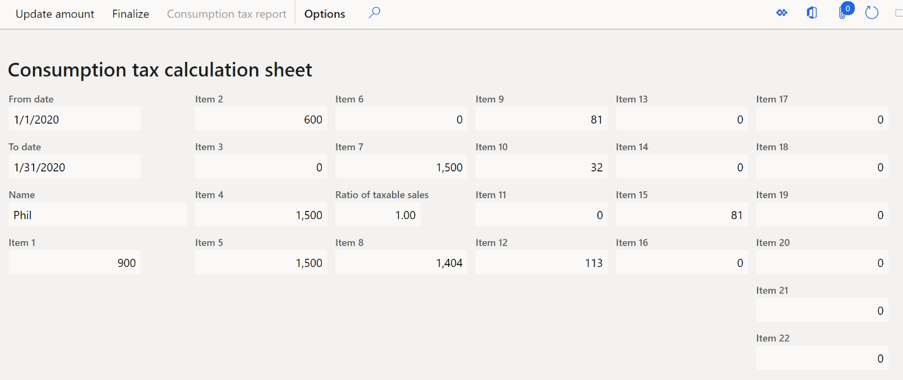
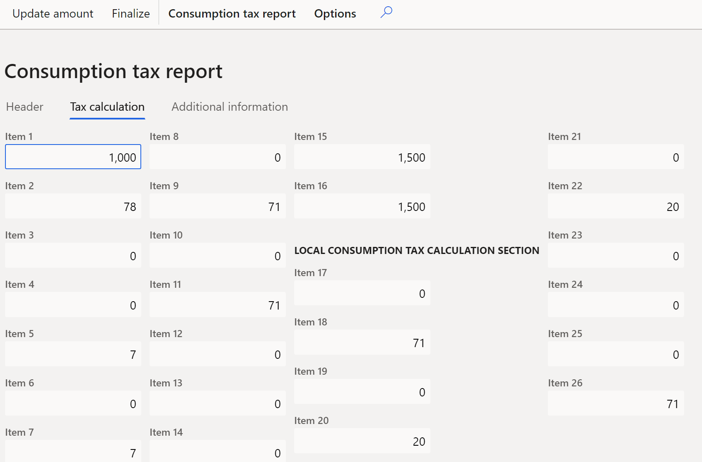
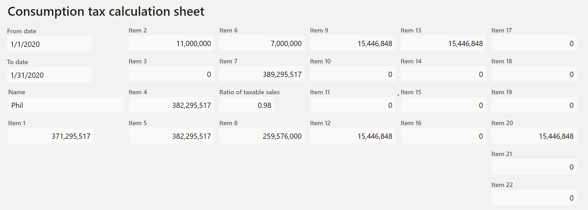
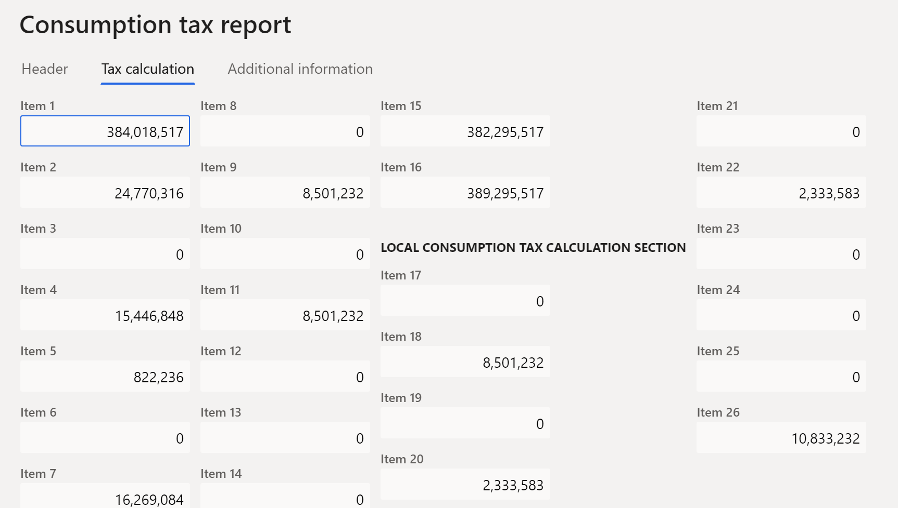
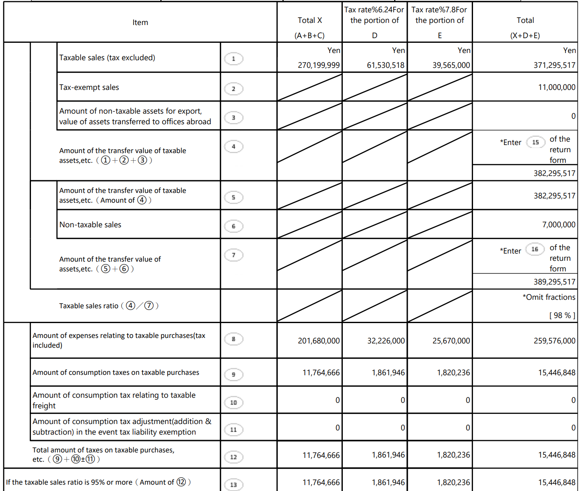
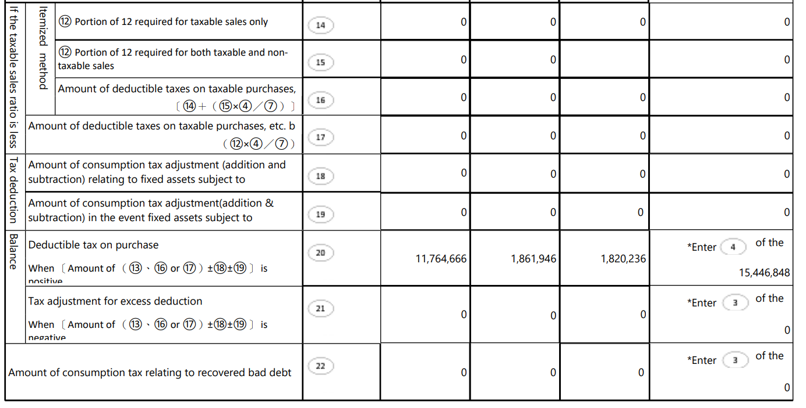
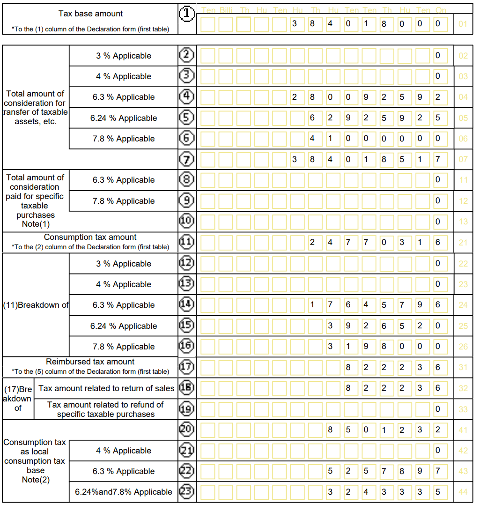

# Japan consumption tax report

[!include [banner](../includes/banner.md)]

This topic explains how to set up and generate the Japan consumption tax report for legal entities in Japan.

The Japan consumption tax report consists of two reports: **Consumption tax calculation sheet** and **Consumption tax report**.

- **Consumption tax calculation sheet** – This report corresponds to Table 2-1, "Calculation table of taxable sales ratio/deductible purchase tax amount."
- **Consumption tax report** – This report corresponds to Table 3-(2), "Consumption tax return form."

For a description of the calculation rules for Table 2-1 and Table 3-(2), see [Procedure 1 for preparing a tax return](https://www.nta.go.jp/taxes/shiraberu/zeimokubetsu/shohi/keigenzeiritsu/pdf/0018008-056_01.pdf).

## Prerequisites

To calculate the consumption tax report that should be submitted from October 1, 2019, you must enable the **Japanese sales tax report** feature in the **Feature management** workspace. For more information, see [Feature management overview](../../fin-ops-core/fin-ops/get-started/feature-management/feature-management-overview.md).

## Setup

### Enable the consumption tax report

1. Go to **Tax** > **Setup** > **Parameters** > **General ledger parameters**.
2. On the **Sales tax** tab, on the **Japanese tax reporting** FastTab, set the **Consumption tax reports** option to **Yes**.

### Enter Japan reporting information for a legal entity

1. Go to **Organization administration** > **Organizations** > **Legal entities**.
2. On the **Registration numbers** FastTab, select **Edit**.
3. In the **Accounting personnel** field, enter a value.
4. In the **Company representative** field, enter a value.

### Set up sales tax reporting codes for consumption tax reporting

Set up sales tax reporting codes by following the instructions in [Set up sales tax reporting codes](../general-ledger/tasks/set-up-sales-tax-reporting-codes.md).

The following table provides an example of sales tax reporting codes for Japan.

The "Where it's used for Consumption tax calculation sheet" column shows which **Item** field on the **Consumption tax calculation sheet** page and which row on the **Consumption tax calculation sheet** report (Table 2-1) each reporting code is used in. (For more information about the **Item** fields, see step 4 in the [Generate the Japan consumption tax report](#generate-the-japan-consumption-tax-report) section of this topic. For more information about the rows on the report, see step 15 in the [Example](#example) section.)

The "Where it's used for Consumption tax report" column shows which **Item** field on the **Consumption tax report** page and which row on the **Consumption tax report** report (Table 3-(2)) each reporting code is used in. (For more information about the **Item** fields, see step 8 in the [Generate the Japan consumption tax report](#generate-the-japan-consumption-tax-report) section of this topic. For more information about the rows on the report, see step 15 in the [Example](#example) section.)

| Reporting code | Reporting code name | Where it's used for Consumption tax calculation sheet | Where it's used for Consumption tax report | Sales tax codes setup  |
|----------------|---------------------|-------------------------------------------------------|--------------------------------------------|------------------------|
| **1**          | **Taxable sales**   | Item1 (Row1)   | Item1 (Row1..Row6 (at tax rates), Row7 (total)) | Taxable sales     |
| 8001           | Consumption tax amount of taxable sales   | Not used  | Item2 (Row11..Row16 (at tax rates))      | Sales tax payable     |
| 9001           | Taxable sales credit note   | Item1 (Row1)   | Not used    | Taxable sales credit note    |
| 7001           | Consumption tax amount of taxable sales credit note     | Not used   | Item5 (Row18)    | Sales tax on sales credit note    |
| **202**        | **Tax-exempt sales**    | Item2 (Row2)    | Not used     | Tax-free sale      |
| 9202           | Tax-exempt sales credit note    | Same as 202   | Not used     | Tax exempt sales credit note    |
| **203**        | **Non-taxable export**    | Item3 (Row3)    | Not used        | Tax-free sale    |
| 9203           | Credit note on non-taxable export     | Same as 203     | Not used   | Tax exempt sales credit note    |
| **206**        | **Non-taxable sales**    | Item6 (Row6)   | Not used    | Tax-free sale      |
| 9206           | Non-taxable sales credit note   | Same as 206    | Not used     | Tax exempt sales credit note    |
| **208**        | **Taxable purchases related to taxable sales**     | Item8 (Row9), Item14 (Row17) (if the ratio is less than 0.95 and **Individual method** is selected as the calculation method) | Not used    | Taxable purchases     |
| 8208           | Consumption tax amount of taxable purchases related to taxable sales   | Same as 208   | Row22, Row23   | Sales tax receivable     |
| 9208           | Taxable purchase credit note related to taxable sales   | Same as 208  | Not used    | Taxable purchase credit note     |
| 7208           | Consumption tax amount of taxable purchase credit note related to taxable sales   | Same as 208    | Row22, Row23   | Sales tax on purchase credit note |
| **214**        | **Taxable purchases related to non-taxable sales**     | Item8 (Row9)  | Not used    | Taxable purchases   |
| 8214           | Consumption tax amount of taxable purchases related to non-taxable sales  | Same as 214  | Row22, Row23   | Sales tax receivable     |
| 9214           | Taxable purchase credit note related to non-taxable sales   | Same as 214   | Not used   | Taxable purchase credit note   |
| 7214           | Consumption tax amount of taxable purchase credit note related to non-taxable sales | Same as 214 | Row22, Row23  | Sales tax on purchase credit note |
| **215**        | **Common taxable purchases (related to both taxable and non-taxable sales)**        | Item8 (Row9), Item15 (Row18) (if the ratio is less than 0.95 and **Individual method** is selected as the calculation method) | Not used   | Taxable purchases   |
| 8215           | Consumption tax amount of common taxable purchases    | Same as 215    | Row22, Row23      | Sales tax receivable    |
| 9215           | Common taxable purchase сredit note    | Same as 215  | Not used      | Taxable purchase credit note      |
| 7215           | Consumption tax amount of common taxable purchase credit note   | Same as 215  | Row22, Row23   | Sales tax on purchase credit note |
| **210**        | **Taxable import**     | Item10 (Row13)     | Not used     | Taxable import   |
| 8210           | Consumption tax amount of taxable import  | Same as 210    | Row22, Row23   | Use tax  |
| 9210           | Taxable import credit note   | Same as 210    | Not used    | Taxable import credit note        |
| 7210           | Consumption tax amount of taxable import credit note   | Same as 210    | Row22, Row23   | Sales tax on import credit note   |
| **8308**       | **Bad debt**   | Not used   | Item6       | Sales tax receivable  |
| 8310           | Bad debt - paid    | Item22 (Row25)    | Not used   | Sales tax on purchase credit note |

## Set up sales tax codes

Set up sales tax codes by following the instructions in [Sales tax codes for VAT reporting](emea-vat-reporting.md#sales-tax-codes-for-vat-reporting) and [Sales tax overview](../general-ledger/indirect-taxes-overview.md).

> [!NOTE]
> In the **Tax type** field, select the **Reduced** or **Standard** tax type.

The following table shows the correspondence between sales tax rates in the sales tax code and consumption tax rates on the reports.

| Sales tax rate | Consumption tax rate | Calculation of the consumption tax amount |
|----------------|----------------------|-------------------------------------------|
| 3              | 3                    | Sales amount including tax × 3 ÷ 103      |
| 5              | 4                    | Sales amount including tax × 4 ÷ 105      |
| 8 (standard)   | 6.3                  | Sales amount including tax – 6.3 ÷ 108    |
| 8 (reduced)    | 6.24                 | Sales amount including tax × 6.24 ÷ 108   |
| 10             | 7.8                  | Sales amount including tax × 7.8 ÷ 110    |

### Set up tax reporting accounts for bad debts

Set up ledger accounts for bad debt and collected bad debt that will be used to select the transactions to report.

1. Go to **Tax** > **Setup** > **Sales tax** > **Tax reporting accounts**.
2. Select **Edit**.
3. In the **Bad debt** field, specify the ledger account. For example, in the **JPMF** legal entity, select **84720**.
4. In the **Collected bad debt** field, specify the ledger account. For example, in the **JPMF** legal entity, select **84710**.

## Generate the Japan consumption tax report

1. Go to **Tax** > **Declarations** > **Sales tax** > **Japanese sales tax report**.
2. In **Consumption tax working sheet** dialog box, set the following fields.

    | Field              | Description   |
    |--------------------|---------------|
    | From date, To date | Enter the first and last dates of the sales tax settlement period to calculate consumption tax for. |
    | Settlement period  | Select the applicable settlement period.    |
    | Declaration type   | Select **Final** or **Interim**. |
    | Calculation method | If you have both taxable and non-taxable sales, select the method that is used to calculate the tax deduction amount.  |
    | Amendment          | Set this option to **Yes** if you're printing the amendment report for the previously generated report. This setting changes the formula for Item26 on the **Consumption tax report** report. For more information, see the remaining sections of this topic. - Individual method   - Lump sum method|

3. Select **OK** to calculate amounts on the **Consumption tax calculation sheet** page.

    

4. Review the values in the **Item** fields. These values represent the amounts that will be entered in the rows of Table 2-1 ("Calculation table of taxable sales ratio/deductible purchase tax amount") of the official recommendations to generate the Consumption tax return form.

    > [!NOTE] 
    > In the "Calculation" column of the following table, brackets ([…]) in the formulas enclose the values of the reporting codes.

    | Field (Row)     | Description   | Calculation  |
    |-----------------|---------------|--------------|
    | Item1 (Row1)   | Taxable sales (excluding tax amount)  | The value of this field is calculated as [1] – [9001].  |
    | Item2 (Row2)   | Tax-exempt sales  | The value of this field is calculated as [202] – [9202].   |
    | Item3 (Row3)   | Amount of non-taxable assets for export, amount of assets transferred to offices abroad | The value of this field is calculated as [203] – [9203]. |
    | Item4 (Row4)   | Amount of all taxable sales  | The value of this field is calculated as **Item1** + **Item2** + **Item3**. |
    | Item5 (Row5)   | Amount of the transfer value of taxable assets, etc.  | The value of this field equals **Item4**.   |
    | Item6 (Row6)   | Non-taxable sales   | The value of this field is calculated as [206] – [9206].    |
    | Item7 (Row7)   | Total amount of sales   | The value of this field is calculated as **Item5** + **Item6**.   |
    | Ratio of taxable sales (Row8)   | Ratio of taxable sales   | The value of this field is calculated as **Item4** ÷ **Item7**.    |
    | Item8 (Row9)   | Amount of taxable purchases (including tax amount)  | The value of this field is calculated as [208] + [214] + [215] + [8208] + [8214] + [8215] – [9208] – [9214] – [9215] – [7208] – [7214] – [7215].  |
    | Item9 (Row10)  | Amount of consumption tax on taxable purchases   | The value of this field is calculated as the sum of consumption tax amounts of **Item8** by tax rate.   |
    | Item10 (Row13)  | Amount of consumption tax on taxable import  | The value of this field is calculated as the sum of consumption tax amounts of ([210] + [8210] – [9210] – [7210]) by tax rate.  |
    | Item11 (Row14)    | Amount of consumption tax adjustment (addition and subtraction)  | The value of this field is **0** (zero).   |
    | Item12 (Row15)  | Total amount of taxes on taxable purchases    | The value of this field is calculated as **Item9** + **Item10** + **Item11**.   |
    | Item13 (Row16)  | Total amount of taxes on taxable purchases, if **Ratio of taxable sales** is \>= 0.95    | If the value of the **Ratio of taxable sales** field is 0.95 or more, the value of this field equals **Item12**. Otherwise, the value is **0** (zero).  |

    **Item14**, **Item15**, and **Item16** are calculated if both the following conditions are met: 
    
    - The value of the **Ratio of taxable sales** field is less than 0.95.
    - **Individual method** is selected in the **Calculation method** field in the **Consumption tax working sheet** dialog box.
    
    Otherwise, the value of these fields is **0** (zero).

    | Field (Row)  | Description  | Calculation   |
    |--------------|--------------|---------------|
    | Item14 (Row17)   | Portion of Item12 related to taxable sales only  | The value of this field is calculated as the sum of consumption tax amounts of ([208] + [8208] – [9208] – [7208]) by tax rate.   |
    | Item15 (Row18)   | Portion of Item12 related to both taxable and nontaxable sales  | The value of this field is calculated as the sum of consumption tax amounts of ([215] + [8215] – [9215] – [7215]) by tax rate.  |
    | Item16 (Row19)  | Amount of deductible taxes on taxable purchases. | The value of this field is calculated as **Item14** + **Item15** × **Ratio of taxable sales**  |
    | Item17 (Row20)  | Amount of deductible taxes on taxable purchases calculated by the lump sum distribution method  | If the value of the **Ratio of taxable sales** field is less than 0.95, and **Lump sum method** is selected in the **Calculation method** field in the **Consumption tax working sheet** dialog box, the value of this field is calculated as **Item12** × **Ratio of taxable sales**. Otherwise, the value is **0** (zero).  |
    | Item18 (Row21)  | Adjustment (addition or decrease) of consumption tax on fixed assets subject to adjustment when sales ratio changes | The value of this field is **0** (zero).     |
    | Item19 (Row22)   | Adjustment (addition or decrease) of consumption tax amount when the fixed assets are moved to taxable business (from non-taxable business) | The value of this field is **0** (zero).  |
    | Item20 (Row23)     | Deductible tax on purchase  | If the value of the **Ratio of taxable sales** field is 0.95 or more, the value of this field is calculated as **Item13** + **Item18** + **Item19**. If the value of the **Ratio of taxable sales** field is less than 0.95, and **Individual method** is selected in the **Calculation method** field in the **Consumption tax working sheet** dialog box, the value of this field is calculated as **Item16** + **Item18** + **Item19**. If the value of the **Ratio of taxable sales** field is less than 0.95, and **Lump sum method** is selected in the **Calculation method** field in the **Consumption tax working sheet** dialog box, the value of this field is calculated as **Item17** + **Item18** + **Item19**. |
    | Item21 (Row24)   | Excess deduction on purchases    | If the value of the **Item20** field is more than 0, the value of this field is **0** (zero). Otherwise, the value of this field is calculated as ABS(Item20), and the **Item20** field is set to **0** (zero).   |
    | Item22 (Row25)  | Amount of consumption tax relating to recovered bad debt    | The value of this field is calculated as [8310] × 6.3 ÷ 108. **Note:** The amount of reporting code 8310 is related to the ledger account that is set up in the **Collected bad debt** field on the **Tax reporting accounts** page. For more information, see the [Set up tax reporting accounts for bad debts](#set-up-tax-reporting-accounts-for-bad-debts) section of this topic.  |

5. Select **Finalize** to finalize tax amounts.
6. After you've finalized tax amounts, select **Consumption tax report** to generate amounts on the **Consumption tax report** page.

    

7. On the **Header** tab, review the header information.

    | Field                                                                | Description                              |
    |----------------------------------------------------------------------|------------------------------------------|
    | Taxation office name                                                 | The details of the tax office name.      |
    | Company representative, Accounting personnel                         | The name of the company representative.  |
    | From date, To date                                                   | The tax calculation period.              |
    | From date for mid term declaration, To date for mid term declaration | The dates for interim sales tax reports. |

8. On the **Tax calculation** tab, review the tax amounts in the **Items** fields. The values represent the amounts that will be entered in the rows of Table 3-(2) ("Consumption tax return form").

    > [!NOTE]
    > In the "Calculation" column of the following table, brackets ([…]) in the formulas enclose the values of the reporting codes. The values of **Item** fields on the **Consumption tax calculation sheet** page are referenced as **CalcSheet.Item**.
    > 
    > Fields that are marked with an asterisk (\*) in the "Field (Row)" column aren't used on the **Consumption tax report** report (Table 3-(2)) as of October 1, 2019.

    | Field (Row)  | Description   | Calculation  |
    |--------------|---------------|--------------|
    | **Calculation of consumption tax**   |   &nbsp;   |   &nbsp;  |
    | Item1 (Row1..Row6 (at tax rates), Row7 (total)) | Taxable base amount   | The value of this field equals [1] rounded to the thousands.  |
    | Item2 (Row11..Row16 (at tax rates))  | Consumption tax amount  | The value of this field is calculated as the sum of the consumption tax amounts of ([1] + [8001]) by tax rate.   |
    | Item3\*   | Adjustment amount of excessive tax deduction | The value of this field is calculated as **CalcSheet.Item21** + **CalcSheet.Item22**.  |
    | Item4\*    | Deductible tax on purchases     | The value of this field equals **CalcSheet.Item20**.  |
    | Item5 (Row18)  | Tax amount refund from sales credit notes   | The value of this field is calculated as the sum of the consumption tax amounts of ([9001] + [7001]) by tax rate.     |
    | Item6\*        | Tax amount related to uncollectable debts   | The value of this field is calculated as [8308] × 6.3 ÷ 108. **Note:** The amount of reporting code 8308 is related to the ledger account that is set up in the **Bad debt** field on the **Tax reporting accounts** page. For more information, see the [Set up tax reporting accounts for bad debts](#set-up-tax-reporting-accounts-for-bad-debts) section of this topic. |
    | Item7\*    | Tax deduction subtotal   | The value of this field is calculated as **Item4** + **Item5** + **Item6**.   |
    | Item8\*      | Tax refund        | The value of this field is calculated as **Item7** – **Item2** – **Item3** if the resulting value is positive. Otherwise, the value is **0** (zero).   |
    | Item9\*     | Netted tax amount     | The value of this field is calculated as **Item2** + **Item3** – **Item7** if the resulting value is positive. Otherwise, the value is zero.     |
    | Item10\*     | Intermediate tax payment  | The value of this field is zero.    |
    | Item11\*     | Tax to be paid          | If **Item9** is more than **Item10**, the value of this field is calculated as **Item9** – **Item10**. Otherwise, the value is zero.     |
    | Item12\*    | Tax to be refunded     | If **Item10** is more than **Item9**, the value of this field is calculated as **Item10** – **Item9**. Otherwise, the value is zero.    |
    | Item13\*    | Previously declared tax (If this declaration is an amended declaration)   | The value of this field is zero.   |
    | Item14\*    | Tax due (If this declaration is an amended declaration)    | The value of this field is zero.     |
    | Item15\*    | Amount of taxable sales (taxable sales percentage)    | The value of this field equals **CalcSheet.Item4**.    |
    | Item16\*    | Total amount of sales (taxable sales percentage)    | The value of this field is calculated as **Item15** + [206] – [9206] and equals **CalcSheet.Item7**.    |
    | **Calculation of local consumption tax**  | &nbsp; |   &nbsp; |
    | Item17\*   | Tax refund     | The value of this field equals **Item8**.   |
    | Item18\*   | Netted tax amount      | The value of this field equals **Item9**.  |
    | Item19\*   | Tax refund amount (Transfer amount)      | The value of this field is calculated as -((Row22 × 17 ÷ 63) + (Row23 × 22 ÷78)) rounded to the thousands if the value in parentheses is negative. You can find an example of the calculation of Row22 and Row23 at the end of the [Example](#example) section of this topic.  |
    | Item20\*   | Tax payment amount (Transfer amount)    | The value of this field is calculated as (Row22 × 17 ÷ 63) + (Row23 × 22 ÷ 78) rounded to the thousands if the resulting value is positive. You can find an example of the calculation of Row22 and Row23 at the end of the [Example](#example) section. |
    | Item21\*   | Interim tax payment (local)   | The value of this field is zero.   |
    | Item22\*   | Tax to be paid     | If **Item20** is more than **Item21**, the value of this field is calculated as **Item20** – **Item21**. Otherwise, the value is **0** (zero).    |
    | Item23\*    | Tax to be refunded     | If **Item21** is more than **Item20**, the value of this field is calculated as **Item21** – **Item20**. Otherwise, the value is **0** (zero).    |
    | Item24\*    | Previously declared tax (if this declaration is an amended declaration)   | The value of this field is zero.   |
    | Item25\*      | Netted tax payment amount (if this declaration is an amended declaration) | The value of this field is zero.   |
    | Item26\*    | Total consumption tax and local consumption tax (payment or refund)    | If you set the **Amendment** option to **Yes** in the **Consumption tax working sheet** dialog box, the value of this field is calculated as **Item14** + **Item25**. Otherwise, the value is calculated as **Item11** + **Item22** – **Item8** – **Item12** – **Item19** – **Item23**.    |

9. On the **Consumption tax report** page, on the **Additional information** tab, set the following fields.

    | Field                                    | Description                                                                       |
    |------------------------------------------|-----------------------------------------------------------------------------------|
    | Installment basis                        | Set this option to **Yes** to apply the installment basis.                        |
    | Deferred payment basis                   | Set this option to **Yes** to apply deferred payment.                             |
    | Percentage of completion basis           | Set this option to **Yes** to apply the percentage of completion basis.           |
    | Cash basis accounting                    | Set this option to **Yes** to apply the cash basis accounting.                    |
    | Exceptional tax calculation treatment    | Set this option to **Yes** to apply the exceptional tax calculation treatment.    |
    | Individual method                        | Set this option to **Yes** for the individual method of tax calculation.          |
    | Lump sum method                          | Set this option to **Yes** for the lump sum method of tax calculation.            |
    | Fully deductible                         | Set this option to **Yes** if the tax amount is fully deductible.                 |
    | Taxable sales amount of benchmark period | Enter the taxable sales amount of the benchmark period.                           |
    | Bank information                         | Select the bank account if **Bank** is selected for the refund payment method.    |
    | Comments                                 | Enter comments for the report.                                                    |
    | Name of the tax accountant               | Enter the name of the tax accountant.                                             |
    | Document submitted law No.30             | Set this option to **Yes** if the document is submitted according to law No.30.   |
    | Document submitted law No.33-2           | Set this option to **Yes** if the document is submitted according to law No.33-2. |

10. Select **Finalize** to finalize tax amounts.
11. After you've finalized tax amounts, select **Consumption tax report \> Print** to print the **Consumption tax calculation sheet** and **Consumption tax report** reports.

## Example

The following example in the **JPMF** legal entity shows how you can set up sales tax codes and sales tax reporting codes, post transactions, and generate and print the Japan consumption tax report.

1. Go to **Tax** > **Setup** > **Sales tax** > **Ledger posting groups**, and set up main accounts for **Sales tax payable**, **Sales tax receivable**, **Use tax expense**, and **Use tax payable**.
2. Go to **Workspaces** > **Feature management**, select the **Japanese sales tax report** feature, and then select **Enable now**.
3. Go to **Tax** > **Indirect taxes** > **Sales tax** > **Sales tax codes**, and set up the following sales tax codes.

    | Sales tax code | Percentage | Tax type | Description                                                      |
    |----------------|------------|----------|------------------------------------------------------------------|
    | JP Cons        | 10         | Standard | Taxable sales at a rate of 10 percent.                           |
    | JP Cons 8S     | 8          | Standard | Taxable sales at a rate of 8 percent.                            |
    | JP Cons 8R     | 8          | Reduced  | Taxable sales at a rate of 8 (reduced) percent.                  |
    | JP ConsPoC     | 10         | Standard | Taxable common purchases at a rate of 10 percent.                |
    | JP PoC 8S      | 8          | Standard | Taxable common purchases at a rate of 8 percent.                 |
    | JP PoC 8R      | 8          | Reduced  | Taxable common purchases at a rate of 8 (reduced) percent.       |
    | JP ConsEx      | 0          | Standard | Export sales where the **Exempt** option is set to **Yes**.      |
    | JP ConsNt      | 0          | Standard | Non-taxable sales where the **Exempt** option is set to **Yes**. |

4. On the **Sales tax codes** page, on the **Report setup** FastTab, assign reporting codes to sales tax codes.

    The following table shows how to assign the sales tax reporting codes to sales tax codes.

    | Sales tax code | Taxable sales | Tax-free sale | Sales tax payable | Taxable purchases | Sales tax receivable |
    |----------------|---------------|---------------|-------------------|-------------------|----------------------|
    | JP Cons        | 1             |               | 8001              | 208               | 8208                 |
    | JP Cons 8S     | 1             |               | 8001              | 208               | 8208                 |
    | JP Cons 8R     | 1             |               | 8001              | 208               | 8208                 |
    | JP ConsPoC     |               |               |                   | 215               | 8215                 |
    | JP PoC 8S      |               |               |                   | 215               | 8215                 |
    | JP PoC 8R      |               |               |                   | 215               | 8215                 |
    | JP ConsEx      |               | 202           |                   |                   |                      |
    | JP ConsNt      |               | 206           |                   |                   |                      |   
    
5. On the **Sales tax codes** page, on the **Report setup – credit note** FastTab, assign reporting codes to sales tax codes.

    The following table shows how to assign the sales tax reporting codes to sales tax codes.

    | Sales tax code | Taxable sales CN | Tax-free sale CN | Sales tax payable CN | Taxable purchases CN | Sales tax receivable CN |
    |----------------|------------------|------------------|----------------------|----------------------|-------------------------|
    | JP Cons        | 9001             |    &nbsp;        | 7001                 | 9208                 | 7208                    |
    | JP Cons 8S     | 9001             |    &nbsp;        | 7001                 | 9208                 | 7208                    |
    | JP Cons 8R     | 9001             |    &nbsp;        | 7001                 | 9208                 | 7208                    |
    | JP ConsPoC     | &nbsp;           |    &nbsp;        | &nbsp;               | 9215                 | 7215                    |
    | JP PoC 8S      | &nbsp;           |    &nbsp;        | &nbsp;               | 9215                 | 7215                    |
    | JP PoC 8R      | &nbsp;           |    &nbsp;        | &nbsp;               | 9215                 | 7215                    |
    | JP ConsEx      | &nbsp;           | 9202             | &nbsp;               | &nbsp;               | &nbsp;                  |
    | JP ConsNt      | &nbsp;           | 9206             | &nbsp;               | &nbsp;               | &nbsp;                  |

    > [!NOTE]
    > The preceding configuration is just an example. The configuration that you use depends on the structure of the sales tax codes that are used. If you want values to be calculated and transferred to the sales tax report, for each tax code that is used in the sales tax payment process, you must set a relevant sales tax reporting code in one or more fields on the **Report setup** tab.

6. Post the following transactions.

    For example, for customer invoices, go to **Accounts receivable** > **Invoices** > **All free text invoices**. For vendor invoices, go to **Accounts payable** > **Invoices** > **Invoice journal**.

    | Date     | Transaction type     | Amount net  | Consumption tax amount (sales tax amount) | Sales tax code | Tax base / tax amount expected on the reporting code | Amount expected on the Consumption tax calculation sheet in the item | Amount expected on the Consumption tax report in the item |
    |-----------------|----------------------|-------------|-------------------------------------------|----------------|------------------------------------------------------|----------------------------------------------------------------------|-----------------------------------------------------------|
    | January 1, 2020 | Customer invoice     | 41,000,000  | 3,198,000 (4,100,000)                     | JP Cons        | 1 / 8001                                             | Item1                                                                | Item1, Item2                                              |
    | January 1, 2020 | Customer invoice     | 280,095,592 | 17,645,796 (22,407,647)                   | JP Cons 8S     | 1 / 8001                                             | Item1                                                                | Item1, Item2                                              |
    | January 1, 2020 | Customer invoice     | 62,925,925  | 3,926,520 (5,034,074)                     | JP Cons 8R     | 1 / 8001                                             | Item1                                                                | Item1, Item2                                              |
    | January 2, 2020 | Customer credit note | \-1,435,000 | \-111,930 (-143,500)                      | JP Cons        | 9001 / 7001                                          | Item1                                                                | Item1, Item2, Item5                                       |
    | January 2, 2020 | Customer credit note | \-9,892,593 | \-623,233 (-791,407)                      | JP Cons 8S     | 9001 / 7001                                          | Item1                                                                | Item1, Item2, Item5                                       |
    | January 2, 2020 | Customer credit note | \-1,395,407 | \-87,073 (-111,632)                       | JP Cons 8R     | 9001 / 7001                                          | Item1                                                                | Item1, Item2, Item5                                       |
    | January 1, 2020 | Vendor invoice       | 31,570,000  | 2,238,600 (3,157,000)                     | JP ConsPoC     | 215 / 8215                                           | Item8, Item15                                                        |                                                           |
    | January 1, 2020 | Vendor invoice       | 201,680,000 | 11,764,667 (16,134,400)                   | JP PoC 8S      | 215 / 8215                                           | Item8, Item15                                                        |                                                           |
    | January 1, 2020 | Vendor invoice       | 40,076,000  | 2,315,502 (3,206,080)                     | JP PoC 8R      | 215 / 8215                                           | Item8, Item15                                                        |                                                           |
    | January 2, 2020 | Vendor credit note   | \-5,900,000 | \-418,364 (-590,000)                      | JP ConsPoC     | 9215 / 7215                                          | Item8, Item15                                                        |                                                           |
    | January 2, 2020 | Vendor credit note   | \-7,850,000 | \-453,556 (-628,000)                      | JP PoC 8R      | 9215/ 7215                                           | Item8, Item15                                                        |                                                           |
    | January 1, 2020 | Customer invoice     | 11,000,000  | 0 (0)                                     | JP ConsEx      | 202 / Not applicable                                 | Item2                                                                |                                                           |
    | January 1, 2020 | Customer invoice     | 7,000,000   | 0 (0)                                     | JP ConsNt      | 206 / Not applicable                                 | Item6                                                                |                                                           |

7. Go to **Tax** > **Declarations** > **Sales tax** > **Japanese sales tax report**.
8. In the **Consumption tax working sheet** dialog box set the following values:

    - **From date:** 1/1/2020 (January 1, 2020)
    - **To date:** 1/31/2020 (January 31, 2020)
    - **Settlement period:** JP12
    - **Declaration type:** Final
    - **Calculation method:** Individual method

9. Select **OK**. Review the **Consumption tax calculation sheet** page.

    

    Amounts are calculated as shown in the following table.

    | Field  | Description   | Value    |
    |--------|---------------|----------|
    | Item 1 (Row 1)   | Taxable sales (excluding tax amount)   | 371,295,517 = 41,000,000 + 280,092,592 + 6,925,925 – 1,435,000 – 9,892,593 – 1,395,407 |
    | Item 2 (Row 2)   | Tax-exempt sales   | 11,000,000   |
    | Item 4 (Row 4)   | Amount of taxable sales   | 382,295,517 = 371,295,517 + 11,000,000    |
    | Item 5 (Row 5)   | Amount of the transfer value of taxable assets, etc.    | 382,295,517   |
    | Item 6 (Row 6)   | Non-taxable sales   | 7,000,000   |
    | Item 7 (Row 7)   | Total amount of sales   | 389,295,517 = 382,295,517 + 7,000,000  |
    | Ratio of taxable sales | Ratio of taxable sales   | 0.98 = 382,295,517 ÷ 389,295,517  |
    | Item 8 (Row 8)         | Amount taxable purchases (including tax amount)   | 259,576,000 = 31,570,000 + 201,680,000 + 40,076,000 – 5,900,000 – 7,850,000  |
    | Item 9 (Row 9)         | Amount of consumption taxes on taxable purchases   | 15,446,848 = 2,238,600 + 11,764,667 + 2,315,502 – 418,364 – 453,556   |
    | Item 12 (Row 12)       | Total amount of taxes on taxable purchases   | 15,446,848    |
    | Item 13 (Row 13)       | Total amount of taxes on taxable purchases, if **Ratio of taxable sales** is \> 0,95 | 15,446,848  |
    | Item 20 (Row 20)       | Deductible tax on purchase    | 15,446,848     |

10. Select **Finalize**.
11. Select **Consumption tax report**.  On the **Tax calculation** tab, review the data.

    

    Amounts are calculated as shown in the following table.

    | Field   | Description  | Value    |
    |---------|--------------|----------|
    | Item1 (Row1..Row6 (at tax rates), Row7 (total)) | Taxable base amount  | 384,018,517 = 41,000,000 + 280,092,592 + 6,925,925   |
    | Item2 (Row11..Row16 (at tax rates))   | Consumption tax amount | 24,770,316 = 3,198,000 + 17,645,796 + 3,926,520  |
    | Item4  | Deductible tax on purchase  | 15,446,848     |
    | Item5 (Row18)   | Tax amount refund from sales credit notes    | 822,236 = 111,930 + 623,233 + 87,073  |
    | Item7   | Tax deduction subtotal   | 16,269,084 = 15,446,848 + 822,236    |
    | Item9   | Netted tax amount   | 8,501,232 = 24,770,316 – 16,269,084    |
    | Item11  | Tax to be paid  | 8,501,232   |
    | Item15  | Amount of taxable sales (taxable sales percentage) | 382,295,517    |
    | Item16  | Total amount of sales (taxable sales percentage)  | 389,295,517 = 382,295,517 + 7,000,000   |
    | Item18  | Netted tax amount   | 8,501,232   |
    | Item20  | Tax payment amount (Transfer amount)  | 2,333,583 = (5,257,897 × 17 ÷ 63) + (3,243,335 × 22 ÷ 78) |
    | Item22  | Tax to be paid   | 2,333,583     |

12. Select **Finalize**.
13. Select **Consumption tax report** > **Print**.
14. Open and review the printed report forms.

**Consumption tax calculation sheet**:

**Consumption tax report**:

Here is an explanation of this report:

- Row1 = **Item1** rounded to the thousands
- Row2..Row6 = **Item1** by tax rate
- Row7 = Row2 + Row3 + Row4 + Row5 + Row6
- Row11 = **Item2**
- Row12..Row16 = **Item2** by tax rate
- Row11 = Row12 + Row13 + Row14 + Row15 + Row16
- Row18 = **Item5**
- Row19 = **0** (zero)
- Row17 = Row18 + Row19
- Row20 = Row21 + Row22 + Row23
- Row21 = Row13
- Row22 = Row14 – Row18 at a 6.3-percent tax rate (623,233) – **CalcSheet.Item9** at a 6.3-percent tax rate (11,764,667)
- Row23 = Row15 + Row16 – Row18 at a 6.24-percent tax rate (87,073) – Row18 at a 7.8-percent tax rate (111,930) – **CalcSheet.Item9** at s 6.24-percent tax rate (2,315,502 – 453,556 = 1,861,946) – **CalcSheet.Item9** at a 7.8-percent tax rate (2,238,600 – 418,364 = 1,820,236)

[!INCLUDE[footer-include](../../includes/footer-banner.md)]
