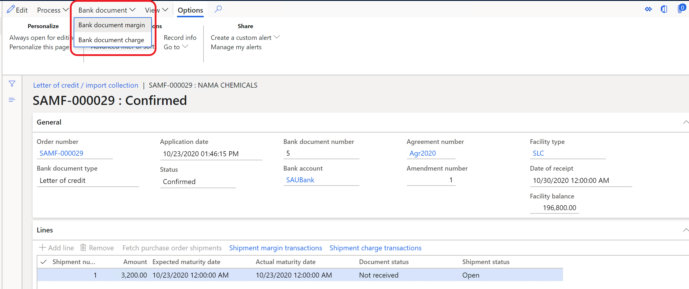
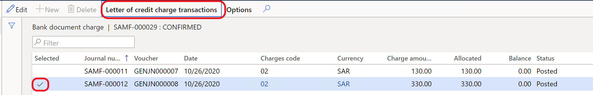

---
# required metadata

title: Allocate bank document charges to shipment
description: This topic explains how you can allocate document bank charges to a shipment on a purchase order.
author: v-oloski
manager: tfehr
ms.date: 11/09/2020
ms.topic: article
ms.prod: 
ms.service: dynamics-ax-applications
ms.technology: 

# optional metadata

ms.search.form: 
audience: Application User
# ms.devlang: 
ms.reviewer: 
ms.search.scope: Core, Operations
# ms.tgt_pltfrm: 
# ms.custom: 
ms.search.region: Saudi Arabia
# ms.search.industry: 
ms.author: v-oloski
ms.search.validFrom: 2019-11-29
ms.dyn365.ops.version: 10.0.8

---
 
# Allocate bank document charges to shipment

[!include [banner](../includes/banner.md)]

You can allocate bank document charges that are posted in the general journal to purchase order lines. The purchase order should have a related **Credit of letter** or **Import collection**.

## Prerequisites

Before you begin to allocate the bank document charges, [set up bank facilities and posting profiles for letter of credit](../cash-bank-management/tasks/set-up-bank-facilities-posting-profiles-letter-credit.md) and create a purchse order with an [Imported letter of credit](https://docs.microsoft.com/en-us/dynamics365/finance/cash-bank-management/tasks/import-letter-credit).

## Set up a charge code for bank document charges

Complete the following steps to set up a charge code for bank document charges.

1. Go to **Accounts payable** \> **Setup** \> **Charges setup** \> **Charges code**. 

   

2. In the **Debit** group, in the **Type** field, select **Item**. When you make this selection, the field, **Bank document charge code** is activated and can be edited. 
3. In the **Bank document charge code** field, select **Yes**. The **Type** field in **Credit** group is filled in automatically and not available to edit.

## Allocate bank document charges

Complete the following steps to allocate bank document charges.

1. Create a purchase order with a letter of credit or import collection. For more information on these tasks, see [Import letter of credit](../cash-bank-management/tasks/import-letter-credit.md). 

 > [!NOTE]
 > The letter of credit or import collection must be confirmed before you can allocate bank document charges.

2. Go to **General ledger** > **Journal entries** > **General journal**, and select **Lines**.
3. On the **Payment** tab, in the **Letter of credit/Import collection** group, enter the necessary field information. 

  > [!NOTE] 
  > The  **Offset account type** and **Offset account** fields are filled in automatically. 
    
4. On the **List** tab, enter information in the **Account** and **Debit** fields.

   

5. On the **Letter of credit/Import collection** page, on the toolbar, select **Bank document** > **Bank document charge**. This will open the letter of credit/import collection that you created in the purchase order. 

   

   You can see bank document charge that posted in the general journal for this letter of credit/import collection.

    

6. Select bank document charge transaction in the **Edit** mode, and then select **Letter of credit/ Import collection** to allocate the selected bank document charge. 

   You can validate allocation by selecting **Shipment charge transactions** on the **Lines** FastTab.

7. To allocate shipment charge transactions to the purchase order lines, on the Action Pane, select **Purchase** \> **Charges** \> **Maintain charges** and then select **Allocate**. The Bank document charge, allocated to lines Letter of credit/ Import collection, should appear in the list.
