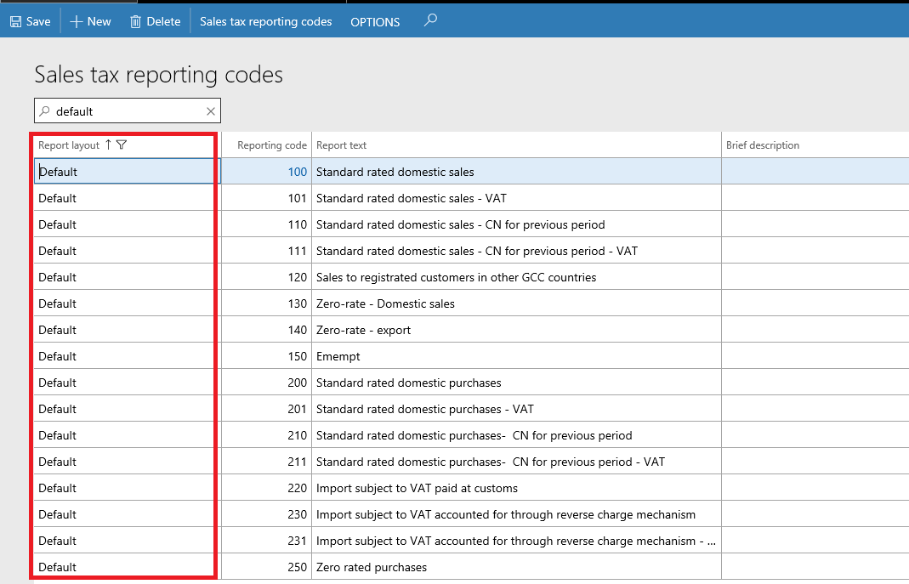
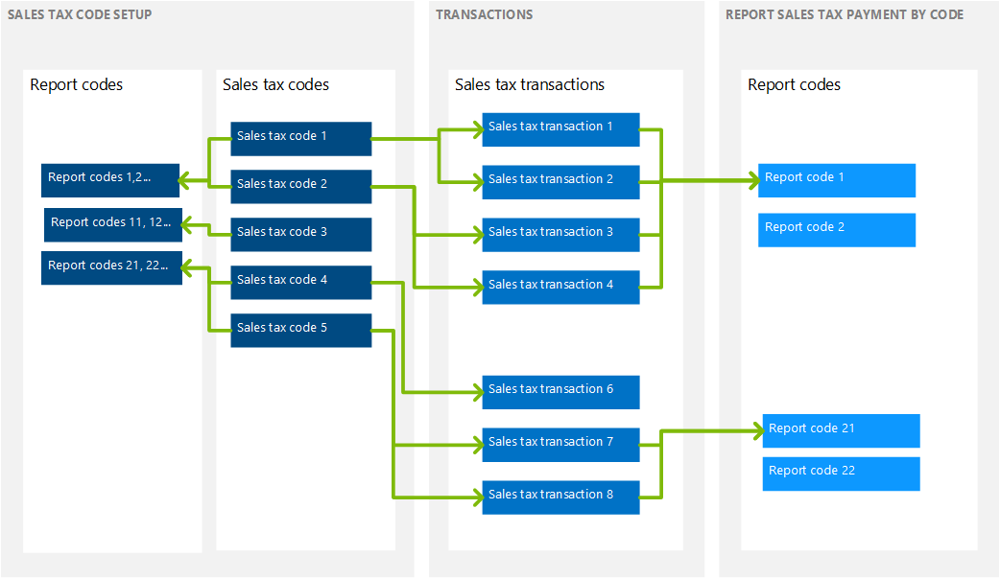
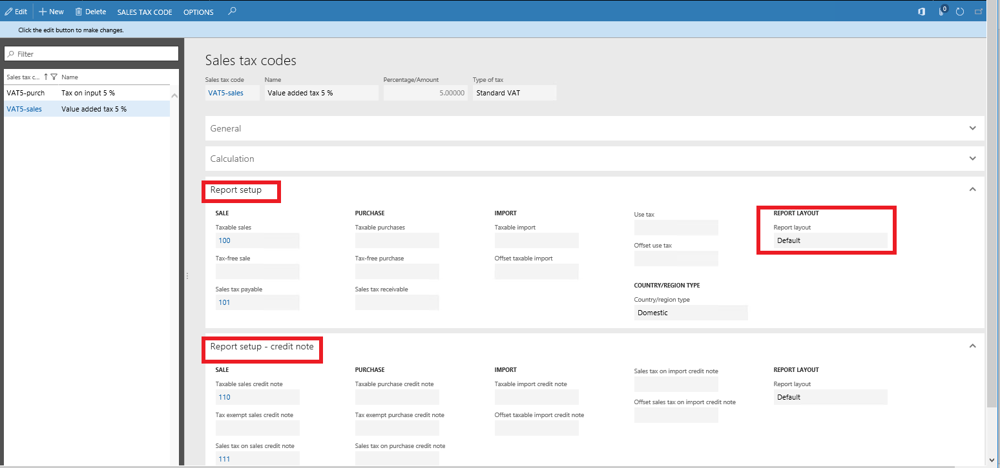

# Sales tax for Saudi Arabia

[!include[banner](../includes/banner.md)]

This article walks you through the process of setting up sales taxes for Saudi Arabia. Before you read this article, you might find it helpful to read [Sales tax overview](../general-ledger/indirect-taxes-overview.md). For information about regulatory requirements for Saudi Arabia, see [VAT for Saudi Arabia (Government website)](https://www.vat.gov.sa/).

## Setting up sales tax for Saudi Arabia

The following table lists the typical tasks that are completed to set up sales tax. It includes information about considerations that pertain specifically to sales tax in Saudi Arabia.

| Setup activity                                                 | Considerations for Saudi Arabia | More information |
|----------------------------------------------------------------|---------------------------------|------------------|
| Create main accounts.                                          | None | [Create a main account](../general-ledger/tasks/create-main-account.md) |
| Set up ledger posting groups for sales tax.                    | None | [Set up Ledger posting groups for sales tax](../general-ledger/tasks/set-up-ledger-posting-groups-sales-tax.md) |
| Set up sales tax authorities.                                  | When you set up sales tax authorities, pay attention to the **Report layout** field. Sales tax codes use the same report layout as the sales tax authority that is associated with the sales tax settlement period that you selected for the sales tax code. | [Set up sales tax authorities](../general-ledger/tasks/set-up-sales-tax-authorities.md) |
| Set up sales tax settlement periods.                           | When you set up sales tax settlement periods, consider the fact that, in Saudi Arabia Taxable, if you make an annual taxable supply above a specific amount, you might have to file monthly value-added tax (VAT) returns instead of quarterly VAT returns. For guidance, consult a tax professional. | [Set up sales tax settlement periods](../general-ledger/tasks/set-up-sales-tax-settlement-periods.md) |
| Set up sales tax reporting codes.                              | See the [Sales tax reporting codes example for Saudi Arabia](#sales-tax-reporting-codes-example-for-saudi-arabia) section of this article. | [Set up sales tax reporting codes](../general-ledger/tasks/set-up-sales-tax-reporting-codes.md) |
| Set up sales tax codes.                                        | See the [Sales tax codes, sales tax groups, and item sales tax groups](#sales-tax-codes-sales-tax-groups-and-item-sales-tax-groups) section of this article. | [Set up sales tax codes](../general-ledger/tasks/set-up-sales-tax-codes.md) |
| Set up sales tax groups and item sales tax groups.             | See the [Sales tax codes, sales tax groups, and item sales tax groups](#sales-tax-codes-sales-tax-groups-and-item-sales-tax-groups) section of this article. | [Set up sales tax groups and item sales tax groups](../general-ledger/tasks/set-up-sales-tax-groups-item-sales-tax-groups.md) |
| Set up sales tax parameters on parameter pages in the program. | On the **General ledger parameters** page, turn on the reverse charge functionality. | [Reverse charge VAT](emea-reverse-charge.md) |

### Sales tax reporting codes example for Saudi Arabia

You can create reporting codes that might be required for analysis (for example, details of legislation return and/or data disclosure). The following illustration shows examples of reporting codes.

### Sales tax codes, sales tax groups, and item sales tax groups

A default sales tax group can be set up on the customer or vendor, and a default item sales tax group can be set up on items. Then, when you create a sales order or purchase order, the system transfers the default sales tax group from the customer or vendor to the header and lines, and the default item sales tax group from the items to the lines. However, you can change groups both in the header and on lines.

The same sales tax code might be included in two groups (a sales tax group and an item sales tax group) on a line. In this case, when the invoice is posted, the system creates a sales tax transaction that uses this sales tax code, and it calculates sales tax. If there is no intersection of sales tax codes in the groups on a line, a sales tax transaction isn't created.

The following illustration shows one way that sales tax groups can be set up. It also shows how sales tax transactions and sales tax calculation are defined when that setup is used.

For each sales tax code, enter the following information:

- Type of tax (**Standard VAT** or **VAT 0%**)
- Settlement period

    > [!NOTE]
    > When you select a settlement period, the system automatically fills in the **Report layout** field.

- Ledger posting codes
- Calculation (The default settings can be used at first.)
- Report setup/Report setup – Credit note

Your company's accounting practices affect how you set up sales tax groups and item sales tax groups so that they include sales tax codes. For example, for an export operation, you select the **Exempt** check box and select **Exempt code**. In this case, the system creates a sales tax transaction where the VAT amount equals 0 (zero), but where the rate equals 5 percent. (This rate is specified in the **Value** field in the sales tax transaction.) These settings might be useful if you must analyze export operations by VAT rate.

For import operations from other countries/regions, where VAT is paid at customs, you might select the **Use tax** check box in the sales tax group. Then, when you post an invoice that uses this setting, the system creates a sales tax transaction that uses the **Use tax** direction, but sales tax isn't included in the vendor liability. Sales transactions that use the **Use tax** direction aren't considered when sales taxes are settled and posted (see Settle and post sales tax). Additionally, depending on ledger posting setting (see Ledger posting groups), the system creates ledger transactions for this sales tax (see the illustration that follows). This setting lets you analyze purchases from other countries/regions by VAT rate.

The following illustration shows an example of sales tax transactions that have different values for the sales tax direction.

## Printing invoices

When you print an invoice, if your language differs from the language that is specified for the current legal entity, two invoices are generated. One invoice is in Arabic, and the other invoice is in the language that you selected on the **User options** page.

## The Sales tax payment by code report

The following illustration shows how data can be collected on the **Sales tax payment by code** report. This report includes only invoices that have tax transactions. The same reporting code can be selected in several sales tax codes, and several reporting codes can be selected in different fields in the same sales tax code.

### Report setup

Consider the following information before you generate the **Sales tax payment by code** report:

- You can create reporting codes in details that are required for analysis (for example, details of legislation return and/or data disclosure).
- To include sales tax transactions on the report, you must select reporting codes in the corresponding fields on the **Report setup** and **Report setup – Credit note** FastTabs of the **Sales tax code** page.

    > [!NOTE]
    > You can enter reporting codes in the sales tax code either before or after tax transactions are posted.

    The following illustration shows an example of the setup of reporting codes for a sales tax code.

    

### Generate the Sales tax payment by code report

To generate the **Sales tax payment by code** report, follow these steps.

1. Go to **Tax** &gt; **Inquiries and reports** &gt; **Sales tax reports** &gt; **Sales tax payment by code**.
2. Select the report parameters. These parameters include the report layout.

The following illustration shows an example of the **Sales tax payment by code** report.

## Additional resources

- [Create a sales tax payment](../general-ledger/tasks/create-sales-tax-payment.md)
- [FAQ: VAT returns (Government website)](https://www.vat.gov.sa/en/e-services/vat-returns)

[!INCLUDE[footer-include](../../includes/footer-banner.md)]
