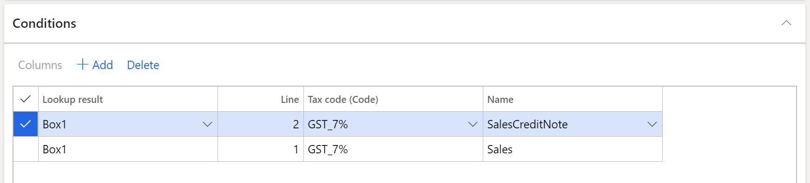

# Generate the Singapore GST-05 report

[!include [banner](../includes/banner.md)]

This article explains the functionality for generating Singapore GST-05 reports. The GST-05 report is used to file a goods and services tax (GST) return.

Singaporean companies must file a GST return (GST-05 report) on a regular basis. The GST-05 report includes a breakdown of details such as standard-rated, zero-rated, and exempt purchases and sales in a regulated format. To accommodate the requirements, you must follow these two steps while you complete the tax settlement process:

- On the **Set up sales tax codes** form, categorize your tax codes into three categories by selecting an appropriate value in the **VAT type** field:

    - Standard
    - Zero
    - Exempt

- On the **Set up sales tax codes** form, specify the dedicated **Singapore report layout** reporting format.

When you settle and post sales tax to process a tax settlement, the GST-05 report will be generated and printed.

## Generate a GST-05 report by using the Electronic reporting tool

You can generate the GST-05 report by using the Electronic reporting (ER) tool. The version of the report that is released will also include the changes that are introduced in 2020. Here are some of those changes:

- **Box 11:** Reverse charge transactions.
- **Box 14:** Amounts of imported services that are subject to GST. The same amount should also be included in the total value of standard-rated supplies that is reported in box 1.
- **Box 15:** Amounts of digital services that are subject to GST. The same amount should also be included in the value of standard-rated supplies that is reported in box 1.

Before you generate the report for the first time, download the following models and formats from the Shared asset library in Microsoft Dynamics Lifecycle Services (LCS):

- Tax declaration model.version.32.xml or later versions
- Tax declaration model mapping.version.32.37.xml or later versions
- GST Report version 32.1 (SG) or a later versions

> [!NOTE]
> For more information about how to download ER format instructions, see [Download Electronic reporting configurations from Lifecycle Services](../../fin-ops-core/dev-itpro/analytics/download-electronic-reporting-configuration-lcs.md).

After you've finished downloading the ER configurations from LCS, follow these steps.

1. In Microsoft Dynamics 365 Finance, select the related 'Singaporean company.
2. Go to **Workspaces** \> **Electronic reporting**, and set the Microsoft provider to **Active**.
3. Select **Configurations** \> **Exchange**, and load the configuration from the XML file to import the tax declaration model and GST report format file.
4. In the **Electronic reporting** workspace, select **Configurations** \> **Setup**.
5. On the **Conditions** tab, select **version 32.1**, and create the configuration that will let you set up the mapping between the sales tax codes that are configured in your company and the related boxes of the GST-05 report:

    1. In the **Lookup result** field, select the related box.
    2. In the **Tax code (Code)** field, select the sales tax code that is used to calculate the related box.
    3. In the **Name** field, select the operation where this tax is used.

6. Set the **Status** parameter to **Completed**.

**Example**

In the GST-05 declaration report, box 1 refers to the value of the supplies that are subject to GST at the standard rate of 7 percent. The value that you enter in this box should not include the GST amount that is charged.

If the sales code that you created supports the standard rate of the **GST\_7%** sales tax code, you must create entries on the **Conditions** tab.

> [!NOTE]
> To avoid issues when the report is generated, create all mappings where the sales tax codes are posted. For example, if the line that has **SalesCreditNote** as the name of the operation is omitted in this configuration, and tax transactions are posted by using sales tax code **GST\_7%**, you will encounter issues when the report is generated. We recommend that you use the **Posted sales tax** inquiry to review all sales tax codes that are posted, but that aren't included in this mapping of the configuration.

### Generate a GST report

Follow these steps to generate the tax declaration report.

1. Go to **Tax** \> **Declarations** \> **Sales tax** \> **GST tax report**.
2. Select the **GST report** format mapping.
3. Select "from" and "to" dates.
4. Select the settlement period and the tax declaration version.

> [!NOTE]
> Remember to run the sales tax settlement process to generate the related tax payment.

[!INCLUDE[footer-include](../../includes/footer-banner.md)]
