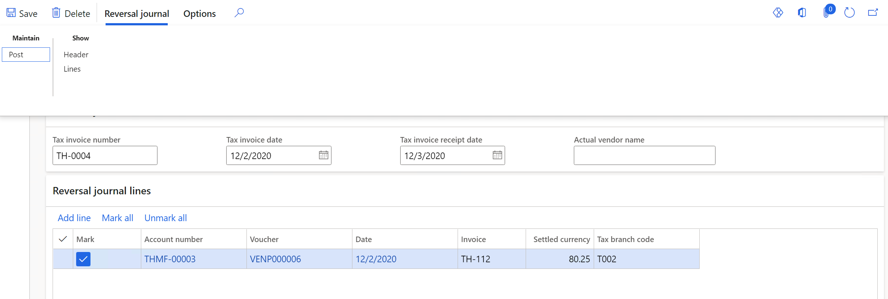

---
# required metadata

title: Thailand unrealized and realized VAT
description: This topic provides information about unrealized and realized value-added tax (VAT) for Thailand. 
author: anasyash
ms.date: 01/25/2021
ms.topic: article
ms.prod: 
ms.technology: 

# optional metadata

ms.search.form: TaxTable, VendParameters, CustParameters
audience: Application User
# ms.devlang: 
ms.reviewer: kfend
ms.search.scope: Core, Operations
# ms.tgt_pltfrm: 
ms.custom: 265924
ms.assetid: 829a101f-e329-48b9-baf8-e36670ff43c8
ms.search.region: Thailand
# ms.search.industry: 
ms.author: anasyash
ms.search.validFrom: 2016-11-30
ms.dyn365.ops.version: Version 1611

---

# Thailand unrealized and realized VAT

[!include [banner](../includes/banner.md)]

This topic provides information about unrealized and realized value-added tax (VAT) for Thailand. It also explains how to settle transactions that have unrealized VAT, how to reverse unrealized VAT, and what reports can be generated.

Currently, four types of VAT can be calculated. They are defined by two categorical attributes: **Purchase/Sales VAT** and **Realized/Unrealized VAT**. The following table provides information about each type of VAT.

<table width="100%">
<tbody>
<tr>
<td width="15%">

<strong>Term</strong>

</td>
<td width="30%">

<strong>Definition</strong>

</td>
<td width="54%">

<strong>When the VAT is calculated</strong>

</td>
</tr>
<tr>
<td width="15%">

Unrealized purchase VAT (also known as deferred input VAT)

</td>
<td width="30%">

The calculated VAT amount that isn&rsquo;t due until the invoice is paid. This amount is posted to an unrealized purchase VAT account and can be claimed only after a tax invoice is received.

</td>
<td width="54%">

You create and post a purchase order that has unrealized purchase VAT for items or services before you receive the tax invoice from the vendor.

</td>
</tr>
<tr>
<td width="15%">

Realized purchase VAT (also known as input VAT)

</td>
<td width="30%">

The tax on a company&rsquo;s purchases or input supplies. This tax is applicable to the purchase price and is also referred to as the purchase VAT.

</td>
<td width="54%">

You reverse the unrealized purchase VAT to post the realized purchase VAT to the purchase VAT account after you receive the tax invoice from the vendor.

You can acknowledge that you&rsquo;ve received the tax invoice from the vendor, and realize the VAT, in the following situations:

<ul>
<li>You post a purchase order or invoice journal after you receive the tax invoice from the vendor. To record the realized purchase VAT directly, you must enter the tax invoice number, tax invoice date, and tax invoice receipt date.</li>
<li>You post the payment journal after you receive the tax invoice from the vendor. To reverse the unrealized VAT directly, you must enter the tax invoice number, tax invoice date, and tax invoice receipt date that are applicable to the payment.</li>
<li>You confirm the reversal journal to reverse the unrealized VAT indirectly. If the tax invoice isn&rsquo;t received at the time of payment, or if the payment is made for multiple tax invoices, you can use the <strong>Reversal journal</strong> page. To reverse the unrealized VAT and post the realized purchase VAT, you must enter the tax invoice number, tax invoice date, and tax invoice receipt date that are applicable for each invoice.</li>
</ul>
</td>
</tr>
<tr>
<td width="15%">

Unrealized sales VAT (also known as deferred output VAT)

</td>
<td width="30%">

The calculated VAT amount that isn&rsquo;t due until the invoice is paid. This amount is posted to an unrealized sales VAT account and can be claimed only after a tax invoice or receipt is printed.

</td>
<td width="54%">

You create and post a sales order or free text invoice that has unrealized sales VAT for items or services by generating only an invoice.

</td>
</tr>
<tr>
<td width="15%">

Realized sales VAT (also known as output VAT)

</td>
<td width="30%">

The tax on a company&rsquo;s sales. This tax is applicable to the sales price and is also referred to as the sales VAT.

</td>
<td width="54%">

You reverse the unrealized sales VAT to post the realized sales VAT to the sales VAT account after you generate the tax invoice or receipt for the customer.

You can generate the tax invoice or receipt, and realize the VAT, in the following situations:

<ul>
<li>You post a sales order or free text invoice, and generate the tax invoice or receipt, after you receive the payment from the customer. You can record the realized sales VAT directly.</li>
<li>You reverse the unrealized sales VAT and post the realized sales VAT after you send the tax invoice or receipt to the customer. You can generate the tax invoice or receipt when you settle the payment with the invoice.</li>
<li>You create and post debit and credit notes from sales orders and free text invoices. When you post the debit or credit notes, only the realized sales VAT is posted.</li>
</ul>
</td>
</tr>
</tbody>
</table>

## Set up unrealized VAT and realized VAT

1. Go to **Tax** > **Parameters** > **Setup** > **General ledger parameters**, and make sure that the **Manage realized and unrealized VAT** option is set to **Yes**, and that the **Calculation method** field is set to **Total**.

2. Go to **Tax** > **Setup** > **Sales tax** > **Ledger posting groups**, and set up ledger posting groups for unrealized VAT and realized VAT. For example, create two ledger posting groups: **UVAT** for unrealized VAT and **VAT** for realized VAT.

    For more information, see [Set up Ledger posting groups for sales tax](../general-ledger/tasks/set-up-ledger-posting-groups-sales-tax.md).

3. Go to **Tax** > **Indirect taxes** > **Sales tax** > **Sales tax codes**, and set up sales tax codes for unrealized VAT and realized VAT. For example, create two sales tax codes: **UVAT** for unrealized VAT and **VAT** for realized VAT.

    > [!NOTE]
    > 
    > For both sales tax codes, the **Tax type** field should beset to **Normal**.

4. For each sales tax code, in the **Ledger posting group** field, select the corresponding ledger posting group that you created in step 2.

5. For the sales tax code for unrealized VAT, in the **Payment sales tax code** field, select the corresponding sales tax code for realized VAT to enable unrealized VAT to be reversed to realized VAT at the time of payment.

    For more information, see [Set up sales tax codes](../general-ledger/tasks/set-up-sales-tax-codes.md).

6. Go to **Tax** > **Indirect taxes** > **Sales tax** > **Sales tax groups**, and set up sales tax groups for unrealized VAT and realized VAT.

7. Go to **Tax** > **Indirect taxes** > **Sales tax** > **Item sales tax groups**, and set up item sales tax groups for unrealized VAT and realized VAT.

8. Assign sales tax codes to sales tax groups and item sales tax groups.

> [!IMPORTANT]
> 
> To prevent both unrealized VAT and realized VAT from being calculated for the same record, be sure to add the sales tax codes only to the sales tax group or item sales tax group that has the same tax type. For example, add the sales tax codes for unrealized VAT only to the sales tax group or item sales tax group for unrealized VAT.

For more information about how to set up sales taxes, see [Sales tax overview](../general-ledger/indirect-taxes-overview.md).

## Working with unrealized and realized sales VAT

### Create and post a sales order or free text invoice that has unrealized VAT

If you didn't receive the payment from the customer, create and post a sales invoice that has unrealized VAT. When you create a sales order or free text invoice, on the **Line details** FastTab, in the **Item sales tax group** and **Sales tax group** fields, select the corresponding sales tax groups that you created earlier for unrealized VAT. Then post the sales order or free text invoice.

When you post the sales order before you receive the payment from the customer, the unrealized sales VAT is posted to the unrealized sales VAT account. For example, if you place a sales order for goods that is worth 100 Thai bahts (THB) and has unrealized VAT, the following transaction is posted.

| **Account name** | **Amount in transaction currency** |
|-------------------------|-------------------------|
| Sales - Raw materials | -100.00 |
| Unrealized VAT payable | -7.00 |
| Trade Receivables - Domestic | 107.00 |

> [!NOTE]
> 
> If you already received the payment for the sale from the customer, select the sales tax group and item sales tax group for realized VAT in the **Sales tax group** and **Item sales tax group** fields.

### Settle a customer transaction to generate a tax invoice or receipt and reverse posted unrealized sales VAT

After you receive the payment from the customer, post the customer payment on the **Customer payment journal** page, and settle it to the sales invoice. After the journal is posted and the payment is settled to the invoice, the unrealized sales VAT is reversed, and a tax invoice number is automatically generated.

After you reverse the unrealized sales VAT, the following tax transactions are generated.

| **Source** | **Sales tax code** | **Amount origin** | **Calculated sales tax amount** | **Tax invoice number** | **Tax invoice date** | **Tax invoice receipt date** |
|-------------------------|-------------------------|-------------------------|-------------------------|-------------------------|-------------------------|-------------------------|
| Sales order | UVAT | 1000.00 | 70.00 |  |  |  |
| Voucher | UVAT | -1000.00 | -70.00 |  |  |  |
| Voucher | VAT | 1000.00 | 70.00 | THMF-000006 | 12/2/2020 | 12/3/2020 |

> [!NOTE]
> 
> You can also settle the payment to the invoice from the **Settle open transactions** page.

You must print a tax invoice before you make the payment and settle the customer transaction.

For more information about how to enter and settle customer payments, see [Customer payment overview](../cash-bank-management/tasks/customer-payment-overview.md).

You can generate the **Sales VAT** report, which includes the realized sales VAT transactions together with the details of the VAT that the legal entity receives for the sales of goods and services. For more information, see [Sales tax reports](apac-tha-sales-vat-report.md).

## Working with unrealized and realized purchase VAT

### Create and post a purchase order that has unrealized VAT

If you didn't receive the tax invoice for the purchase from the vendor, create a purchase order that has unrealized VAT. When you create a purchase order, on the **Line details** FastTab, on the **Setup** tab, in the **Sales tax** section, in the **Item sales tax group** and **Sales tax group** fields, select the corresponding sales tax groups that you created earlier for unrealized VAT.

When you post the purchase order before you receive the tax invoice from the vendor, the unrealized purchase VAT is posted to the unrealized purchase VAT account. For example, if you place a purchase order for goods that is worth 100 THB and has unrealized VAT, the following transaction is posted.

| **Account name** | **Amount in transaction currency** |
|-------------------------|-------------------------|
| Raw Materials Receipts | 100.00 |
| Accounts Payable | -107.00 |
| Unrealized VAT receivable | 7.00 |

> [!NOTE]
> 
> If you already received the tax invoice for the purchase from the vendor, select the sales tax group and item sales tax group for realized VAT in the **Sales tax group** and **Item sales tax group** fields. When you post the vendor invoice, enter the number of the tax invoice that you received from the vendor in the **Tax invoice number** field, enter the date when the vendor generated the tax invoice in the **Tax invoice date** field, and enter the date when you received the tax invoice from the vendor in the **Tax invoice receipt date** field.

### Create and post a vendor invoice journal that has unrealized VAT

If you didn't receive the tax invoice for the service expense transaction from the vendor, create a vendor invoice journal that has unrealized VAT. When you create a line, on the **General** tab, select the sales tax group and item sales tax group for unrealized VAT. The unrealized purchase VAT is posted to the unrealized purchase VAT account.

If you post the service expense transaction after you receive the tax invoice from the vendor, on the **General** tab, select the sales tax group and item sales tax group for the realized VAT. Then, on the **Invoice** tab, in the **Document** section, enter the tax invoice details. The realized purchase VAT is posted to the purchase VAT account.

You can generate the **Purchase Unrealized VAT Remaining** report, which includes the transactions that have unrealized tax. For more information, see [Sales tax reports](apac-tha-sales-vat-report.md).

### Reverse the unrealized purchase VAT

The process for reversing the unrealized purchase VAT varies, depending on when you receive the tax invoice from the vendor.

- If you receive the tax invoice when you post the purchase order, follow these steps:

    1. Create a purchase order. On the **Line details** FastTab, on the **Setup** tab, in the **Sales tax** section, in the **Item sales tax** **group** and **Sales tax group** fields, select the corresponding sales tax group for realized VAT.
    
    2. Generate an invoice for the order. On the **Vendor invoice header** FastTab, set the **Tax invoice number**, **Tax invoice date**, and **Tax invoice receipt date** fields.

- If you receive the tax invoice when you post the Vendor payment journal: On the **Vendor payments** page, on the **Payment** FastTab, set the **Tax invoice number**, **Tax invoice date**, and **Tax invoice receipt date** fields.

- If you receive the tax invoice after you've made the payment and settled the invoice, follow these steps:

    1.  Go to **Accounts payable** > **Payments** > **Reverse unrealized VAT**.

    2.  On the Action Pane, on the **Reversal journal** tab, in the **New** group, select **Reversal journal**.

    3.  Select criteria to include the payment journals that aren't realized, and then select **OK**.

    4.  Select the **Vendor unrealized reversal ID** value of the journal. Alternatively, select the line for the journal, and then, on the Action Pane, on the **Reversal journal** tab, in the **Maintain** group, select **Edit**.

    5.  Use the **Mark** field to select the transactions that the tax invoice was received for, and that the unrealized purchase VAT must be reversed for.

    6.  On the **Reversal journal header** FastTab, set the **Tax invoice number**, **Tax invoice date**, and **Tax invoice receipt date** fields.

    7.  On the Action Pane, on the **Reversal journal** tab, in the **Maintain** group, select **Post** to post the journal.

        

After you reverse the unrealized purchase VAT, the following tax transactions will be present.

| **Source** | **Sales tax code** | **Amount origin** | **Calculated sales tax amount** | **Tax invoice number** | **Tax invoice date** | **Tax invoice receipt date** |
|-------------------------|-------------------------|-------------------------|-------------------------|-------------------------|-------------------------|-------------------------|
| Purchase order | UVAT | 75.00 | 5.25 |  |  |  |
| Voucher | UVAT | -75.00 | -5.25 |  |  |  |
| Voucher | VAT | 75.00 | 5.25 | TH-0004 | 12/2/2020 | 12/3/2020 |

The realized purchase VAT is posted to the purchase VAT account.

You can generate the **Purchase VAT** report, which includes the realized purchase VAT transactions together with the details of the VAT that the legal entity must pay for the purchase of goods and services. For more information, see [Sales tax reports](apac-tha-sales-vat-report.md).

[!INCLUDE[footer-include](../../includes/footer-banner.md)]
