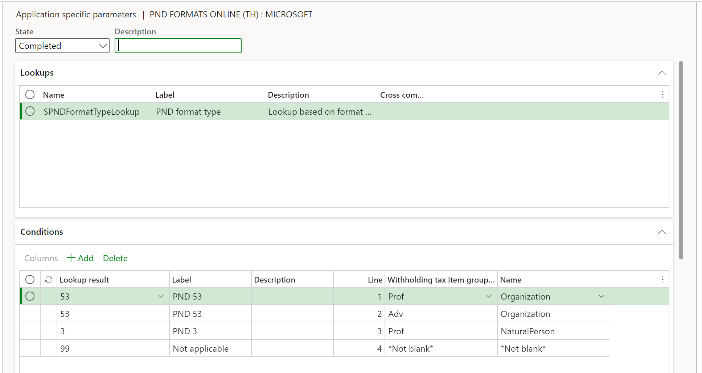

---
# required metadata

title: Withholding tax in Thailand
description: This topic provides information about withholding tax and how to set it up for Thailand. The withholding tax functionality has been enhanced for both vendor and customer transactions, so that withholding tax is calculated and withholding tax reports are generated.
author: ShylaThompson
manager: AnnBe
ms.date: 06/20/2017
ms.topic: article
ms.prod: 
ms.service: dynamics-ax-applications
ms.technology: 

# optional metadata

ms.search.form: TaxWithholdGroup, TaxWithholdTable, TaxWithholdTrans
audience: Application User
# ms.devlang: 
ms.reviewer: kfend
# ms.tgt_pltfrm: 
ms.custom: 265904
ms.search.region: Thailand
# ms.search.industry: 
ms.author: roschlom
ms.search.validFrom: 2016-11-30
ms.dyn365.ops.version: Version 1611

---

# Withholding tax in Thailand

[!include [banner](../includes/banner.md)]

This topic provides information about withholding tax and how to set it up for Thailand. The withholding tax functionality is enhanced for vendor and customer transactions, so that withholding tax is calculated and withholding tax reports are generated.

## Set up Thailand withholding tax

Complete the following tasks before you can calculate withholding tax for transactions for a legal entity in Thailand:

1.  Set up tax registration numbers on the **Legal entities** page.
2.  Set up withholding settlement periods on the **Withholding tax settlement periods** page.
3.  Set up withholding tax authorities on the **Withholding tax authorities** page.
4.  Set up withholding tax codes on the **Withholding tax codes** page.
5.  Set up withholding tax groups on the **Withholding tax groups** page.
6.  Set up withholding tax revenue types on the **Withholding tax revenue** **types** page.
7.  Set up withholding tax groups on the **Item withholding tax groups** page for an item or service.
8.  Select the **Calculate withholding tax** check box on the **Vendors** page.
9.  Select the **Calculate withholding tax** check box on the **Customers** page.
10. Select the **Calculate withholding tax** check box on the **Released products** page.

## Payments that include withholding taxes
Any payment that is made to a vendor is taxable, and the legal entity pays tax on the withholding tax. The tax that the legal entity pays on the withholding tax is also taxable. This additional tax amount is paid by the vendor. You can use either the single iteration method or the perpetual gross-up method to gross up vendor payments. For example, for a purchase order amount of THB 4,000 and a withholding tax (WHT) rate of 15 percent, here is how the tax amount, the tax on the tax amount, and the total payment amount are calculated:

-   **Single iteration method** – In this method, the legal entity pays part of the withholding tax, and the vendor pays the other part.
    -   Tax on tax amount = Tax amount × WHT rate = 600 × 0.15 = THB 90
    -   Total payment amount = Purchase order amount + (Purchase order amount × WHT rate) – (Purchase order amount × WHT rate) – (Purchase order amount × WHT rate) × WHT rate = 4,000 + 600 – 600 – 90 = THB 3,910
    -   Tax amount = Purchase order amount × WHT rate = 4,000 × 0.15 = THB 600
-   **Perpetual gross-up method** – If there is an increase in the number of iterations to calculate the tax on the tax amount, the amount that is grossed up (the purchase order amount) decreases in value. In the perpetual gross-up method, a perpetual gross-up rate percentage is calculated by using the WHT rate. The perpetual gross-up rate percentage is then rounded to two decimal places to calculate the grossed-up amount.
    -   Total payment amount = Purchase order amount × Perpetual gross-up rate percentage = 4,000 × 117.65% = THB 4,706
    -   The withholding tax at 15 percent is deducted from the total payment amount of THB 4,706. In other words, (4,706 – \[4,706 × 0.15\]) = THB 4,000. In this manner, the vendor receives the original payment amount after withholding tax is deducted.
    -   Perpetual gross-up rate percentage = 100 ÷ (1 – WHT rate) = 100 ÷ (1 – 15%) = 100 ÷ 0.85 = 117.65%

### Withholding tax for item or service purchases

Use the **Journal voucher** page to enter and post payments that you make to a vendor for the purchase of items or services. When you post a vendor payment journal, the withholding tax group that is set up for the vendor is used to calculate the withholding tax on the transaction.

### Withholding tax for item or service sales

Use the **Journal voucher** page to enter and post payments that you receive from customers. Post a customer payment journal or general journal for withholding tax transactions that include the tax branch code.

### Making a withholding tax payment on behalf of a vendor

Performance awards that are given to vendors are taxable and can be withheld by a legal entity. You can make withholding tax payments on behalf of the vendor. In this case, the tax that you pay is treated as an expense for the company. This process is referred to as payment gross-up. You can generate the withholding tax reports after you post a payment journal for a vendor.

## Generate withholding tax reports
Generate the **Withholding tax certificate** report after you've settled payments and before you post a vendor payment journal. On the **Withholding tax slip** page, select to generate the **Withholding tax certificate** report. You can also generate the **Withholding tax (Por Ngor Dor 53)**, **Withholding tax (Por Ngor Dor 3)**, **Withholding tax special**, **Withholding tax accounts receivable journal**, and **Withholding tax accounts payable journal** reports after you post a payment journal. You can mark transactions that should be excluded from withholding tax reports.

### Generate the Withholding tax special report

When you submit the **Withholding tax (Por Ngor Dor 53)** or **Withholding tax (Por Ngor Dor 3)** report, and you pay the withheld tax to the Revenue Department of Thailand, the department issues a receipt number. Enter this receipt number in the **Receipt number** field on the **Posted withholding tax** page. Then, at the end of the month, generate the **Withholding tax special** report and submit it to the Revenue Department of Thailand. This report is generated in a format that is specified by the Revenue Department of Thailand.

### Withholding (Por Ngor Dor 53)** and **Withholding tax (Por Ngor Dor 3)** files format

Taxpayers can submit Por Ngor Dor 53 and Por Ngor Dor 3 online via an e-Filing system on the Revenue Department’s website or RD Smart Tax Application. The withholding tax reporting functionality is enhanced and allows users to generate the content in electronic formats to be imported in Rdinet tax application. 

In the **Electronic reporting** workspace, import the following Electronic Reporting formats from the repository:

- PND formats Online (TH)

> [!NOTE]
> The formats above are based on **Tax declaration model** and use **Tax declaration model mapping**. These additional configurations will be automatically imported.

For more information about how to import Electronic Reporting configurations, see [Download Electronic reporting configurations from Lifecycle Services](../../fin-ops-core/dev-itpro/analytics/download-electronic-reporting-configuration-lcs.md).

#### Download Electronic reporting configurations

The implementation of the VAT return form for Bahrain is based on Electronic reporting (ER) configurations. For more information about the capabilities and concepts of configurable reporting, see [Electronic reporting](../../fin-ops-core/dev-itpro/analytics/general-electronic-reporting.md).

For production and user acceptance testing (UAT) environments, follow the instructions [Download Electronic reporting configurations from Lifecycle Services](../../fin-ops-core/dev-itpro/analytics/download-electronic-reporting-configuration-lcs.md).

To generate the Withholding declarations in a Egypt legal entity, you need to upload the following configurations:

- Tax declaration model.version.82.xml or later version
- Tax declaration model mapping.version.82.133.xml or a later version
- PND formats Online (TH).version.82.06  or a later version

After you've finished downloading the ER configurations from Lifecycle Services (LCS) or the global repository, complete the following steps.

1. Go to the **Electronic reporting** workspace. Select the Reporting configurations tile.
1. On the **Configurations** page, on the Action Pane, select **Exchange > Load from XML file**.
1. Upload all the files in the order in which they are listed in the previous bullets. After all the configurations are uploaded, the configuration tree should be present in Finance.

#### Set up application-specific parameters

The Application-specific parameters option let the users to establish the criteria of how the tax transactions will be classified and presented in the different forms .  When the report is generated depending on the configuration of **withholding tax item group ** and type of **vendor account**., the process will generate the format PND 53 or format PND 3. 

This an example of suggested setup

Complete the following steps to setup the different lookups used in the generation of PND files. 

1. In the **Electronic reporting** workspace, select **Configurations > Setup** to set up the rules to identify the tax transaction into the related box of the VAT return form.
1. Select the current version. On the Lookups FastTab, select the lookup name for example **$PNDFormatTypeLookup**. This lookup identifies the list of reports types supported in Thailand localization.
1. On the **Conditions** FastTab, select **Add** and in the new line in the Lookup result column, select the related line .
1. In the **Withholding tax item group** column, select the related code  used to identify the tax item group in the related format type.
	1. In the **Name**  column, select the type of vendor account 
1. Repeat steps 3-5 for all available lookups.
1. Select **Add** again, and then follow these steps to include the final record line:
   1. In the Lookup result column, select **Not applicable**. 
   1. In the remainder columns, select **Not blank**. 

> [!NOTE]
> By adding this last record **Not applicable**, you define the following rule: When the **Withholding tax item group**  and **Name** that is passed as an argument doesn't satisfy any of the previous rules, the transactions will not be included in the Withholding format type. Although this rule is not used when generating the report, the rule does help to avoid errors in report generation when there is a missing rule configuration.

#### Generate a Withholding PND files
Complete the following steps to generate the tax declaration report.

1. Go to **Tax > Declarations** > **Withholding tax** > **Generate PND electronic formats*.
1. Enter the  **Tax branch**. Leave in blank if you want to include all available tax branches.
1. Select the **From date**.
1. Select **To date**.
1. Select the **Settlement period**.
1. Select the PND format type
1. Select **OK** to confirm the above steps. 

[!INCLUDE[footer-include](../../includes/footer-banner.md)]
