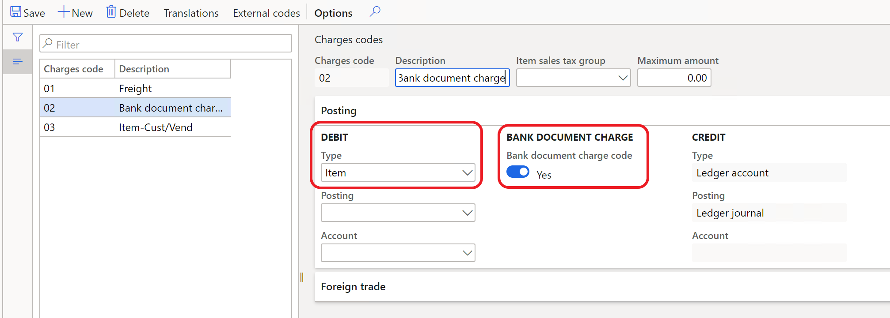
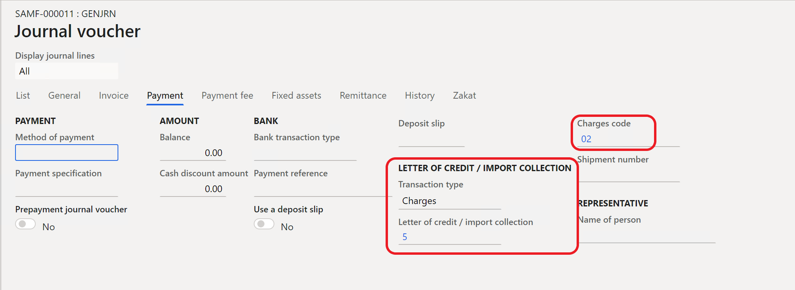
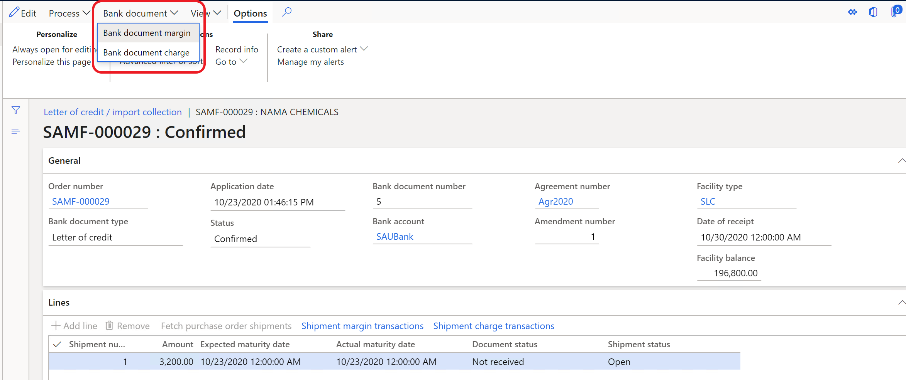
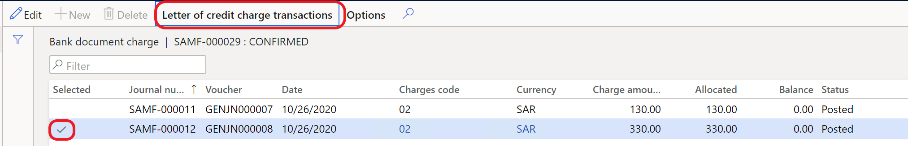

 
# Allocate bank document charges to a shipment

[!include [banner](../../includes/banner.md)]

You can allocate bank document charges that are posted in the general journal to purchase order lines. The purchase order should have a related letter of credit or import collection.

## Prerequisites

Before you start to allocate the bank document charges, [set up bank facilities and posting profiles for letters of credit](../../cash-bank-management/tasks/set-up-bank-facilities-posting-profiles-letter-credit.md), and create a purchase order that has an [imported letter of credit](../../cash-bank-management/tasks/import-letter-credit.md).

## Set up a charge code for bank document charges

Follow these steps to set up a charge code for bank document charges.

1. Go to **Accounts payable** \> **Setup** \> **Charges setup** \> **Charges code**.
2. On the **Posting** FastTab, in the **Debit** section, in the **Type** field, select **Item**. The **Bank document charge code** option in the **Bank document charge** section becomes available.
3. Set the **Bank document charge code** option to **Yes**. The **Type** field in the **Credit** section is automatically set and can't be edited.

## Allocate bank document charges

Follow these steps to allocate bank document charges.

1. Create a purchase order that has a letter of credit or an import collection. For more information, see [Import letter of credit](../../cash-bank-management/tasks/import-letter-credit.md).

    > [!NOTE]
    > The letter of credit or import collection must be confirmed before you can allocate bank document charges.

2. Go to **General ledger** \> **Journal entries** \> **General journals**.
3. On the Action Pane, select **Lines**.
4. On the **Payment** tab, in the **Letter of credit/import collection** section, set the fields as you require.

    > [!NOTE]
    > The **Offset account type** and **Offset account** fields are automatically set.

    

5. On the **List** tab, set the **Account** and **Debit** fields.
6. On the **Letter of credit/import collection** page, on the Action Pane, select **Bank document** \> **Bank document charge**.

    

    The letter of credit or import collection that you created in the purchase order is opened. It should show the bank document charge that was posted in the general journal for this letter of credit or import collection.

    

7. Select the bank document charge transaction in **Edit** mode, and then select **Letter of credit/import collection** to allocate the selected bank document charge.

    > [!TIP]
    > You can validate the allocation by selecting **Shipment charge transactions** on the **Lines** FastTab.

8. To allocate shipment charge transactions to the purchase order lines, on the Action Pane, on the **Purchase** tab, in the **Charges** group, select **Maintain charges**, and then select **Allocate**. The bank document charge that you allocated to letter of credit or import collection lines should appear in the list.

[!INCLUDE[footer-include](../../../includes/footer-banner.md)]
