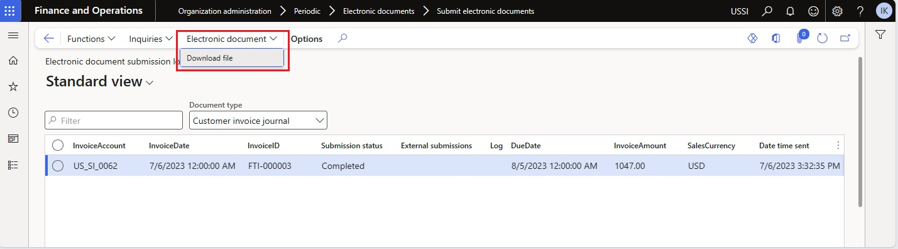

# Get started with Electronic invoicing for Australia and New Zealand

[!INCLUDE[banner](../../includes/banner.md)]
[!INCLUDE[banner](../../includes/rsc-to-gsw-banner.md)]

This article provides information that will help you get started with Electronic invoicing for Australia and New Zealand. It guides you through the configuration steps that are country/region-dependent in Microsoft Dynamics 365 Finance or Dynamics 365 Supply Chain Management. These steps complement the steps that are described in [Set up Electronic invoicing](../global/gs-e-invoicing-set-up-overview.md).

After you configure Electronic invoicing, you can generate XML files of electronic invoices by using the [Pan-European Public Procurement Online (PEPPOL)](https://docs.peppol.eu/poacc/billing/3.0/) format specification with the Australian and New Zealand extension.

> [!NOTE]
> The electronic invoicing approach that this article describes is implemented by using an invoicing service that's applicable only to cloud deployments of Finance or Supply Chain Management. For on-premises deployments, see [Customer electronic invoices in Australia and New Zealand](apac-aus-nzl-e-invoices.md).

## Prerequisites

Before you begin the procedures in this article, the following prerequisites must be met:

- Become familiar with Electronic invoicing as it's described in [Electronic invoicing overview](../global/gs-e-invoicing-service-overview.md).
- Do the common part of Electronic Invoicing service configuration as described in [Set up Electronic invoicing](../global/gs-e-invoicing-set-up-overview.md).

## Country/region-specific configuration for the Electronic invoicing for Australia and New Zealand feature

Some of the parameters from the **Electronic invoicing for Australia and New Zealand** Electronic invoicing feature are published with default values. Before you deploy this feature to the service environment, review the default values, and update them as required, so that they better reflect your business operations.

1. Import the latest version of the **Electronic invoicing for Australia and New Zealand** Globalization feature as described in [Import features from the repository](../global/gs-e-invoicing-import-feature-global-repository.md).
1. Create a copy of the imported Globalization feature, and select your configuration provider for it. For more information, see [Create a Globalization feature](../global/gs-e-invoicing-create-new-globalization-feature.md).

    > [!NOTE]
    > The **Electronic invoicing for Australia and New Zealand** feature is provided by Microsoft. It's ready to use and requires no additional configuration. For information about how to configure invoicing features if you must apply changes, see [Work with feature setups](../global/gs-e-invoicing-feature-setup.md). For example, you can filter specific legal entities so that they're processed in applicability rules. By default, the feature is applicable to all legal entities that have a primary address in Australia or New Zealand.

1. The copy of the feature is always created as a **Draft** version. Regardless of whether you made changes, complete and deploy the feature as described in [Complete and deploy a Globalization feature](../global/gs-e-invoicing-complete-publish-deploy-globalization-feature.md).

## Finance configuration

You must configure some additional parameters directly in Finance.

1. Make sure that the country/region-specific Electronic reporting (ER) configurations for the document context and electronic document model mapping that are required for Australia and New Zealand are imported. For more information, see [Set up Electronic invoicing parameters](../global/gs-e-invoicing-set-up-parameters.md#set-up-electronic-document-parameters).

    > [!NOTE]
    > After you import the **Electronic invoicing for Australia and New Zealand** Electronic invoicing feature, electronic documents are configured by default. Follow the remaining steps of this procedure if you must make changes.

1. Go to **Organization administration** \> **Setup** \> **Electronic document parameters**.
1. On the **Electronic document** tab, add records for the **Customer Invoice journal** and **Project invoice** table names.
1. For each table name, set the **Document context** and **Electronic document model mapping** fields in accordance with step 1.

    

1. Save your changes, and close the page.

## Finance business data configuration

### Prerequisites

The primary address of the legal entity must be in Australia or New Zealand.

### Configure legal entity data

1. Go to **Organization administration** \> **Organizations** \> **Legal entities**, and select a legal entity.
1. On the **Addresses** FastTab, add a valid primary address for the legal entity.
1. On the **Tax registration** FastTab, in the **Tax registration number** field, enter a valid tax registration number for the legal entity.

### Configure customer data

1. Go to **Accounts receivable** \> **Customers** \> **All customers**, and select a customer.
1. On the **Addresses** FastTab, add a valid address for the customer.
1. On the **Invoice and delivery** FastTab, in the **Tax exempt number** field, enter a valid tax registration number for the customer.
1. On the **Sales demographics** FastTab, in the **Primary contact** field, select a person who will be considered the buyer's contact.

    > [!NOTE]
    > All available contact persons must already be defined for this customer.

### Configure units of measure

1. Go to **Organization administration** \> **Setup** \> **Units** \> **Units**.
1. Select a unit ID in the list, and then select **External codes**.
1. On the **External codes** page, in the **Overview** section, in the **Code** field, enter a code that corresponds to the selected unit ID.
1. In the **Value** section, in the **Value** field, enter the external code to use as the [units of measure](https://docs.peppol.eu/poacc/billing/3.0/codelist/UNECERec20/) code for international trade.

    > [!NOTE]
    > When no specific units of measure are assumed, the default value **EA** (each) is used.

### Configure sales tax codes

1. Go to **Tax** \> **Indirect taxes** \> **Sales tax** \> **Sales tax codes**.
1. Select a sales tax code, and then, on the Action Pane, on the **Sales tax code** tab, in the **Sales tax code** group, select **External codes**.
1. In the **Overview** section, create a line for the selected unit. In the **External code** field, enter the sales tax code that you selected in step 2.
1. In the **Value** section, in the **Value** field, enter an external code to use for the selected sales tax code, according to the [required codification](https://docs.peppol.eu/poacc/billing/3.0/codelist/UNCL5305/).

### Customer requisition

When you register free text invoices, invoices that are based on sales orders, or project invoices, you must enter a customer requisition. You can also add an optional customer reference.

#### Free text invoices

1. Go to **Accounts receivable** \> **Invoices** \> **All free text invoices**.
1. Create a new invoice, or select an existing invoice.
1. In the **Header** view, on the **Customer** FastTab, in the **References** section, enter values in the **Customer requisition** and **Customer reference** fields.

#### Sales orders

1. Go to **Accounts receivable** \> **Orders** \> **All sales orders**.
1. Create a new sales order, or select an existing sales order.
1. In the **Header** view, on the **General** FastTab, in the **References** section, enter values in the **Customer requisition** and **Customer reference** fields.

#### Project invoices

1. Go to **Project management and accounting** \> **Projects** \> **Project contracts**.
1. Create a new project contract, or select an existing project contract.
1. On the **Funding sources** FastTab, select or create a funding source of the **Customer** type, and then select **Details**.
1. On the **Funding source details** page, on the **Other** FastTab, in the **References** section, in the **Customer requisition** and **Customer reference** fields, enter default values for the contract.

## Issue electronic invoices

After you complete all the required configuration steps, you can generate electronic invoices for posted invoices. For more information about how to generate electronic invoices, see [Issue electronic invoices in Finance and Supply chain management](../e-invoicing-issuing-electronic-invoices-finance-supply-chain-management.md).

You can inquire about the results of a submission by going to **Organization administration** \> **Periodic** \> **Electronic documents** \> **Electronic document submission log** and selecting the required document type.

To download the XML files of electronic invoices for successfully processed invoices, select **Electronic document** \> **Download file**.

## Additional resources

- [Electronic invoicing overview](../global/gs-e-invoicing-service-overview.md)
- [Customer electronic invoices in Australia and New Zealand](apac-aus-nzl-e-invoices.md)

[!INCLUDE[footer-include](../../../includes/footer-banner.md)]
