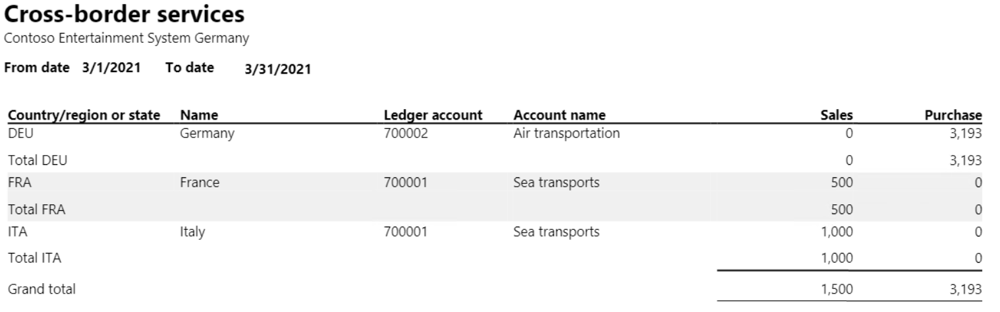
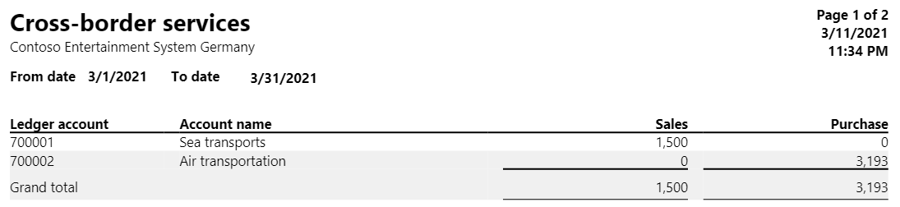

# Cross-border services report

[!include [banner](../../includes/banner.md)]

Austrian companies must periodically report services that are purchased and sold across borders, if those services meet specific thresholds for specific service types in the other countries or regions that are involved.

The **Cross-border services** report shows a summary of incoming and outgoing cross-border services, the countries or regions that are the providers or recipients of the cross-border services, and the net amounts that were paid for the services. This report is typically used by accounting managers, accountants, and sales managers to inquire into the status of sales transactions.

## Setup

1. Go to **General ledger** > **Ledger setup** > **General ledger parameters**, and then, on the **Sales tax** tab, set the **Tax direction requirement** option to **Yes**.
2. Go to **General ledger** > **Chart of accounts** > **Accounts** > **Main accounts**, and create an account for each cross-border service. As part of the setup for each account that you create, follow these steps:

    1. On the **Legal entity overrides** FastTab, select **Add**, and select the legal entity.
    2. On the **Legal entity overrides** FastTab select **Sales tax**, and then, in the **Sales tax direction** field, select either **Purchase** or **Sales**, depending on sales tax direction. For more information about how to create main accounts, see Create a main account.

3. Go to **Tax** > **Indirect taxes** > **Sales tax** > **Sales tax groups**, and create a sales tax group for each country or region that a service is delivered to. As part of the setup for each group that you create, on the **General** FastTab, in the **Sales tax description** section, in the **Country/region or state** field, enter the country/region code. For more information about how to create sales tax groups, see Set up sales tax groups and item sales tax groups.

## Work with the Cross-border services report

When you settle an invoice that has cross-border services, you must select the sales tax group for the country or region in the **Sales tax group** field and the type of cross-border service in the **Main account** field.

- To generate the report, go to **Tax** > **Inquiries and reports** > **Sales tax reports** > **Cross-border services**. You can set the following parameters.

   | Field | Description |
   |-------------------------|-------------------------|
   | From date | Select or enter the start date of the reporting period. |
   | To date | Select or enter the end date of the reporting period. |
   | Group by | Select whether the report should be printed by the type of service or by country or region. |

## Example

The following example shows how you can set up and generate the **Cross-border services** report. This example uses the **DEMF** legal entity.

1. Go to **Organization administration** > **Organization** > **Legal entities**, and select **DEMF**.
2. On the **Address** FastTab, select **Edit**.
3. In the **Country/region** field, select **AUT (Austria)**.
4. Close the page.
5. Go to **General ledger** >**Ledger setup** > **General ledger parameters**, and then, on the **Sales tax** tab, set the **Tax direction requirement** option to **Yes**.
6. Go to **General ledger** > **Chart of accounts** > **Accounts** > **Main accounts**, and create an account. As part of the setup, follow these steps:

    1. On the **General** FastTab, in the **Identification** section, in the **Main account** field, enter **700001**. In the **Name** field, enter **Sea transports**.
    2. On the **Legal entity overrides** FastTab, select **Add**, and select the **DEMF** legal entity.
    3. On the **Legal entity overrides** FastTab, select **Sales tax**, and then, in the **Sales tax direction** field, select **Sales**.

7. Create another account. As part of the setup, follow these steps:

    1. On the **General** FastTab, in the **Identification** section, in the **Main account** field, enter **700002**. In the **Name** field, enter **Air transportation**.
    2. On the **Legal entity overrides** FastTab, select **Add**, and select the **DEMF** legal entity.
    3. On the **Legal entity overrides** FastTab, select **Sales tax**, and then, in the **Sales tax direction** field, select **Purchase**.

8. Go to **Tax** > **Indirect taxes** > **Sales tax** > **Sales tax groups** and create sales tax groups that have the following settings.

    | Sales tax group | Country/region or state (in the Sales tax group description section on the General FastTab) | Sales tax code (on the Setup FastTab) |
    |-------------------------|-------------------------|-------------------------|
    | France | FRA | EU0, EU19, EU7 |
    | Italy | ITA | EU0, EU19, EU7 |
    | Germany | DEU | EU0, EU19, EU7 |

9. Go to **Accounts receivable** > **Invoices** > **All free text invoices**, and create and post free text invoices that have the following settings.

    | Customer account (on the Free text invoice header FastTab, in the Customer section) | Date (on the Free text invoice FastTab, in the Invoice section) | Main account (on the Invoice lines FastTab) | Sales tax group (on the Invoice lines FastTab) | Item sales tax group (on the Invoice lines FastTab) | Quantity (on the Invoice lines FastTab) | Unit price (on the Invoice lines FastTab) |
    |-------------------------|-------------------------|-------------------------|-------------------------|-------------------------|-------------------------|-------------------------|
    | DE-15 | 3/8/2021 | 700001 | Italy | FULL | 1 | 1,000 |
    | DE-12 | 3/17/2021 | 700001 | France | FULL | 1 | 500 |

10. Go to **Accounts payable** > **Invoices** > **Invoice journal**, and create a journal.
11. On the Action Pane, select **Lines**, and then create a record that has the following settings.

    | Date | Account | Invoice date | Invoice | Credit | Offset account type | Offset account | Sales tax group | Item sales tax group |
    |-------------------------|-------------------------|-------------------------|-------------------------|-------------------------|-------------------------|-------------------------|-------------------------|-------------------------|
    | 3/22/2021 | DE_TX_001 | 3/22/2021 | AU_0006 | 3800 | Ledger | 700002 | Germany | FULL |

12. Go to **Tax** > **Inquiries and reports** > **Sales tax reports** > **Cross-border services**, and follow these steps:

    1. In the **From date** field, select **3/1/2021**. In the **To date** field, select **3/31/2021**.
    2. In the **Group by** field, select **Country/region**.
    3. On the **Records to include** FastTab, select **Filter**.
    4. In the **Table**, **Derived table**, and **Field** fields, select **Main account**.     
    5. In the **Criteria** field enter **700001, 700002**. For more information, see [Advanced filtering and query  syntax](../../../fin-ops-core/fin-ops/get-started/advanced-filtering-query-options.md).

    

14. Go to **Tax** > **Inquiries and reports** > **Sales tax reports** > **Cross-border services**, and follow these steps:

    1. In the **From date** field, select **3/1/2021**. In the **To date** field, select **3/31/2021**.
    2. In the **Group by** field, select **Service**.
    3. On the **Records to include** FastTab, select **Filter**.
    4. In the **Table**, **Derived table**, and **Field** fields, select **Main account**.
    5. In the **Criteria** field, enter **700001, 700002**. For more information, see [Advanced filtering and query syntax](../../../fin-ops-core/fin-ops/get-started/advanced-filtering-query-options.md).

15. Select **OK**, and review the report results.

    
