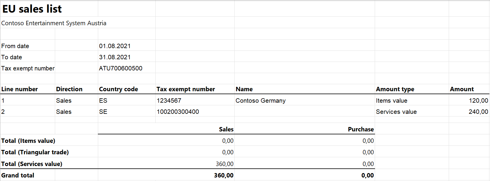

# EU Sales list for Austria

[!include [banner](../../includes/banner.md)]

This article provides information about the European Union (EU) sales list report that is based on form U13. The Austrian EU sales list report contains information about the sale of goods and services for reporting in XML format.

The following fields are included on the Austrian EU sales list report:

- **EU sales list header:**

    - Reporting period
    - Authority ID
    - Company tax registration number
    - Date and time of the report creation

- **EU sales list lines:**

    - Customer VAT ID
    - The total amount of items
    - The total amount of services
    - Total amount of the triangular trade

## Setup

For general setup information, see [EU Sales list reporting](../europe/emea-eu-sales-list.md#prerequisites).

>[!NOTE] 
>The company's tax registration number will be shown in the .xml file for the EU sales list report.

### Set up company information

First create a registration type and assign it to the **VAT ID** registration category for Austria and all the countries or regions that your company does business with. For more information, see [Registration IDs](../europe/emea-registration-ids.md).

Then follow these steps to set up information about your company.

1. Go to **Organization administration** > **Organizations** > **Legal entities**.
2. In the grid, select your company.
3. On the Action Pane, select **Registration IDs**.
4. On the **Registration ID** FastTab, select **Add**.
5. On the **Overview** tab, in the **Registration type** field, select the registration type that you created earlier.
6. Enter your company's value-added tax (VAT) ID.
7. Optional: On the **General** tab, in the **General** section, change the period that the VAT ID is used for.
8. Close the page.

> [!NOTE] 
> If the **VAT exempt number export** field in the **Intrastat** section of the **Foreign trade and logistics** FastTab is set (that is, it isn't blank), the value will be used, instead of the VAT ID that you created in step 6, in the .xlsx file for the EU sales list report.

### Import Electronic reporting configurations

In [Microsoft Dynamics Lifecycle Services (LCS)](https://lcs.dynamics.com/Logon/Index), import the latest versions of the following Electronic reporting (ER) configurations for the EU sales list:

- EU Sales list model
- EU Sales list by columns report
- EU Sales list by rows report
- EU Sales list (AT)

For more information, see [Download Electronic reporting configurations from Lifecycle Services](../../../fin-ops-core/dev-itpro/analytics/download-electronic-reporting-configuration-lcs.md).

### Set up foreign trade parameters

1. In Dynamics 365 Finance, go to **Tax** > **Setup** > **Foreign trade** > **Foreign trade parameters**.
2. On the **EU sales list** tab, set the **Report cash discount** option to **Yes** if a cash discount should be included in the value when a transaction is included on the EU sales list.
3. On the **Electronic reporting** FastTab, in the **File format mapping** field, select **EU Sales list (AT)**.
4. In the **Report format mapping** field, select **EU Sales list by rows report** or **EU Sales list by columns report**.
5. On the **Country/region properties** tab, select **New**, and set the following fields:

    - In the **Country/region** field, select **AUT**.
    - In the **Country/region type** field, select **Domestic**.

6. List all the countries or regions that your company does business with. For each country/region that is part of the EU, in the **Country/region type** field, select **EU** to show trade with those countries/regions on the **EU sales list** page.

### Set up a sales tax authority

1. Go to **Tax** > **Indirect taxes** > **Sales tax** > **Sales tax authorities**.
2. Create a sales tax authority.
3. In the **Authority identification** field, enter a two-digit code in the range from **01** through **98**.

## Work with the EU sales list

For general information about which types of transactions are included on the EU sales list, how to generate the EU sales list report, and how to close the EU sales list reporting period, see [EU Sales list reporting](../europe/emea-eu-sales-list.md#working-with-the-esl).

### Generate the EU sales list report

1. Go to **Tax** > **Declarations** > **Foreign trade** > **EU sales list**.
2. Transfer transactions as required.
3. On the Action Pane, select **Reporting**.
4. In the **EU sales list reporting** dialog box, on the **Parameters** FastTab, set the following fields.

    | Field                | Description                                                                         |
    |----------------------|-------------------------------------------------------------------------------------|
    | From date            | Select the start date for the report.                                               |
    | To date              | Select the end date for the report.                                                 |
    | Generate file        | Set this option to **Yes** to generate an .xml file for your EU sales list report.  |
    | File name            | Enter the name of the .xml file.                                                    |
    | Generate report      | Set this option to **Yes** to generate an .xlsx file for your EU sales list report. |
    | Report file name     | Enter the name of the .xlsx file.                                                   |
    | Customer information | Enter any required information about the customer.                                  |
    | Authority            | Select the sales tax authority.                                                     |

5. Select **OK**, and review the generated reports.

## Example

For information about how to create a general setup, create postings, and transfer transactions by using the **DEMF** legal entity for Austria, see [Example for generic EU Sales list](../europe/emea-eu-sales-list-example.md).

> [IMPORTANT] 
> Contrary to what the following example shows, use **ATU700600500** as the company's VAT ID.

### Set up a sales tax authority

1. Go to **Tax** > **Indirect taxes** > **Sales tax** > **Sales tax authorities**.
2. In the **Sales tax authority** field, select **AT**.
3. In the **Authority identification** field, enter **55**.

### Create an EU sales list report

1. Go to **Tax** > **Declarations** > **Foreign trade** > **EU sales list**.
2. On the Action Pane, select **Reporting**.
3. In the **EU sales list reporting** dialog box, on the **Parameters** FastTab, set the following fields:

    - In the **From date** field, select **8/1/2021** (August 1, 2021).
    - In the **To date** field, select **8/31/2021** (August 31, 2021).
    - Set the **Generate file** option to **Yes**.
    - In the **File name** field, enter **AT-001F**.
    - Set the **Generate report** option to **Yes**.
    - In the **Report file name** field, enter **AT-001R**.
    - In the **Customer information** field, enter **KUNDENINFO**.
    - In the **Authority** field, select **TA**.

4. Select **OK**, and review the report in XML format that is generated. The following tables show the values in the example report.

    **EU sales list header**

    | Field                  | Value           | Comment                                                                        |
    |------------------------|-----------------|--------------------------------------------------------------------------------|
    | IDENTIFIKATIONSBEGRIFF | 55203/118/12345 | The authority's ID and tax registration number.                                |
    | PAKET NR               | 000023          | The smallest value from the **Dispatch** column on the **EU sales list** page. |
    | DATUM ERSTELLUNG       | 2021-11-25      | The date when the report was created.                                          |
    | UHRZEIT ERSTELLUNG     | 16:28:15        | The time when the report was created.                                          |
    | ERKLAERUNG             | U13             | The report form.                                                               |
    | ZRVON                  | 2021-08         | The month and year from the **From date** field.                               |
    | ZRBIS                  | 2021-08         | The month and year from the **To date** field.                                 |
    | FASTNR                 | 55203/118/12345 | The authority's ID and tax registration number.                                |
    | KUNDENINFO             | KUNDENINFO      | The text from the **Customer information** field.                              |

    **EU sales list lines**

    | Field   | Line 1 value | Line 2 value   | Comment                                                                                                                                                                       |
    |---------|--------------|----------------|-------------------------------------------------------------------------------------------------------------------------------------------------------------------------------|
    | UID MS  | ES1234567    | SE100200300400 | The customer's VAT ID.                                                                                                                                                        |
    | SUM BGL | 120.00       | 240.00         | The sum of all invoices by customer.                                                                                                                                          |
    | SOLEI   |              | 1              | The **SOLEI** field is available only for service transactions and has a value of **1**. For triangular transactions, there is a **DREIECK** field that has a value of **1**. |

5. Review the report in Microsoft Excel format that is generated.

    

[!INCLUDE[footer-include](../../../includes/footer-banner.md)]
