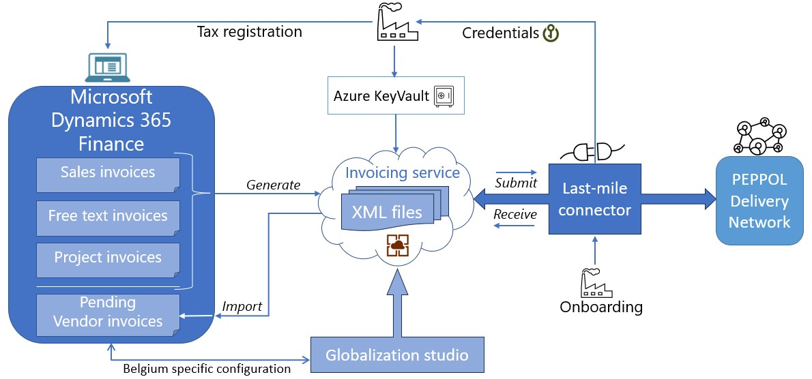
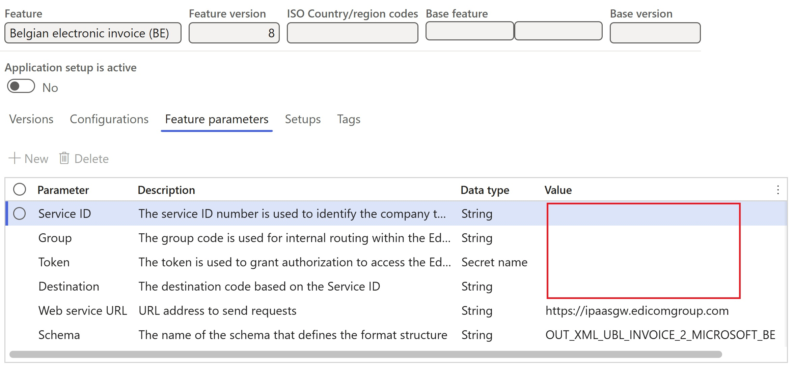
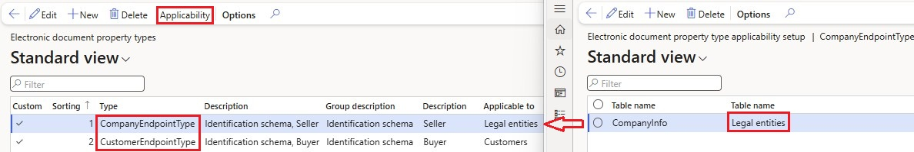

# Electronic invoicing for Belgium

[!include [banner](../../includes/banner.md)]

This article provides information to help you get started with Electronic invoicing for Belgium. It explains how to configure the system so that you can use the last-mile connector to generate, submit, and receive electronic invoices in the [Pan-European Public Procurement Online (PEPPOL)](https://docs.peppol.eu/poacc/billing/3.0/) format in Microsoft Dynamics 365 Finance.

> [!NOTE]
> The electronic invoicing approach that this article describes is implemented by using an invoicing service that is applicable only to cloud deployments of Dynamics 365 Finance.

Watch the following overview of the Belgian electronic invoicing implementation in Finance.

> [!VIDEO d21698ae-599e-4895-9a45-e19226a852ab]

## Prerequisites

Before you begin the procedures in this article, the following prerequisites must be met:

- The company must be a registered taxpayer in Belgium.
- The company must have a signed agreement with the provider of electronic document delivery service that secures electronic document interchange in the **PEPPOL** format.
- Among the registered profile IDs, the company should have the **urn:fdc:peppol.eu:2017:poacc:billing:01:1.0** profile. Finance uses this profile for the interchange of documents in the **PEPPOL** format.
- The company must obtain, from the service provider, the required credentials to enable integration of the Electronic Invoicing service with the [Electronic Invoicing service independent software vendor (ISV) last-mile connector](../global/e-invoicing-isv-connector.md).

    > [!NOTE]
    > The current implementation assumes [Edicom](https://edicomgroup.com/electronic-invoicing) as the Electronic Invoicing ISV last-mile connection service provider. Learn more in [e-Invoicing Integration with Microsoft Dynamics 365](https://edicomgroup.com/edicom-microsoft?365).

- Become familiar with Electronic invoicing as it's described in [Electronic Invoicing service overview](../global/gs-e-invoicing-service-overview.md) and [Electronic invoicing components](../global/gs-e-invoicing-administration-integration-components.md).
- Do the common part of Electronic Invoicing service configuration as described in [Electronic invoicing components](../global/gs-e-invoicing-set-up-overview.md).

## Create the Azure Key Vault configuration

Create an Azure key vault to store the required secrets that are issued for your company. Learn more in [Configure Azure resources for Electronic invoicing](../global/gs-e-invoicing-set-up-azure-resources.md).

In the key vault, add the secret for the token that grants authorization to access the Edicom services. You must obtain this token from Edicom before you begin, as described in the prerequisites.

## Configure electronic invoicing Key Vault parameters

To configure electronic invoicing Key Vault parameters, follow these steps.

1. Go to **Organization administration** \> **Setup** \> **Electronic document parameters**.
1. On the **Electronic invoicing** tab, in the **Key Vault settings** section, in the **Key Vault** field, select the reference to the key vault that you created in the previous section of this article.
1. In the **SAS token secret** field, select the name of the storage account secret URL that must be used to authenticate access to the storage account.
1. Select **Key Vault parameters**.
1. On the **Key Vault parameters** page, in the **Certificates** section, select **Add** to create a **token** element of the **Secret** type for the secret that is described in the previous section.

    > [!NOTE]
    > The value in the **Name** column should match the name of the secret that is described in the previous section.

## Import the electronic invoicing feature

1. Go to **Globalization Studio**, and select the **Electronic invoicing** tile. Then import the latest version (**5** or later) of the **Belgian electronic invoice (BE)** Globalization feature as described in [Import features from the repository](../global/gs-e-invoicing-import-feature-global-repository.md).
1. In the **Electronic reporting** workspace, on the **Reporting configurations** tile, make sure that the following Electronic reporting (ER) configurations were successfully imported when you imported the **Belgian electronic invoice (BE)** Globalization feature:

    - Invoice model
    - Invoice model mapping
    - PEPPOL Sales e-invoice
    - PEPPOL Sales e-credit note
    - PEPPOL Project e-invoice
    - PEPPOL Project e-credit note
    - Customer invoice context model
    - Response message model
    - Edicom Response Processing
    - Error log import Json

    > [!NOTE]
    > If the preceding ER configurations weren't imported for some reason, manually import them as described in [Import Electronic reporting (ER) configurations from Dataverse](../global/workspace/gsw-import-er-config-dataverse.md).

1. On the **Reporting configurations** tile, import the latest versions of the following ER configurations. These configurations are required for the receipt of incoming vendor invoices.

    - Vendor invoice import
    - Vendor invoice Mapping to destination
    - Import invoice context model

## Configure the electronic invoicing feature

Some of the parameters from the **Belgian electronic invoice (BE)** electronic invoicing feature are published with default values. Before you deploy the electronic invoicing feature to the service, review the default values, and update them as required, so that they better reflect your business operations.

To review and update the configuration of the **Belgian electronic invoice (BE)** electronic invoicing feature, follow these steps.

1. Go to **Globalization Studio**, and select the **Electronic invoicing** tile. Then import the **Belgian electronic invoice (BE)** Globalization feature as described in [Import features from the repository](../global/gs-e-invoicing-import-feature-global-repository.md).
1. Create a copy of the imported Globalization feature, and select your configuration provider for it, as described in [Create Globalization features](../global/gs-e-invoicing-create-new-globalization-feature.md).
1. On the **Versions** tab, verify that the **Draft** version is selected.
1. On the **Feature parameters** tab, specify values for the following connection and integration parameters. These parameters are required for interoperation with Edicom services.

    - **Service ID** – Enter the service ID (domain) number that you obtained from Edicom. This value is used for company identification.
    - **Group** – Enter the group code. This value is used for internal routing within the Edicom infrastructure.
    - **Destination** – Enter the destination, which you construct by concatenating the service ID number and the string **_EDIWIN**. For example, if the service ID number is **123456**, enter **123456_EDIWIN**.
    - **Token** – Select the name of the [token](#Tok) that you previously created.

    

1. The copy of the feature is always created as a **Draft** version. Complete and deploy the feature as described in [Complete and deploy a Globalization feature](../global/gs-e-invoicing-complete-publish-deploy-globalization-feature.md).

## Configure electronic document parameters

1. Go to **Organization administration** \> **Setup** \> **Electronic document parameters**.
1. On the **Electronic document** tab, add records for the **Customer Invoice journal** and **Project invoice** table names.
1. For each table name, set the **Document context** and **Electronic document model mapping** fields in accordance with [Set up Electronic document parameters](../global/gs-e-invoicing-set-up-parameters.md#set-up-electronic-document-parameters).

    

    > [!NOTE]
    > If you created derived analogues of the previously mentioned ER configurations, use them instead of the standard ones.

1. On the **Integration channels** tab, in the **Channels** section, select **Add** to create a channel.
1. In the **Channel** field, enter **EdiStatus**. You must enter the value exactly as it appears here. The system will use this channel to submit outgoing electronic invoices.
1. In the **Company** field, select a required legal entity.
1. In the **Document context** field, select the **Data channel context** mapping from the **Customer invoice context model** configuration.
1. In the **Channel type** field, select **Export**.
1. In the **Channels** section, select **Add** to create another channel.
1. In the **Channel** field, enter **EdiImport**. You must enter the value exactly as it appears here. The system will use this channel to import incoming electronic invoices.
1. In the **Company** field, select a required legal entity.
1. In the **Document context** field, select the **Data channel context** mapping from the **Import invoice context model** configuration.
1. In the **Channel type** field, select **Import**.
1. In the **Import sources** section, select **Add** to create an import source.
1. In the **Name** field, enter **ResponseXml**. You must enter the value exactly as it appears here.
1. In the **Data entity name** field, select the **Vendor invoice header** entity.
1. In the **Model mapping** field, select the **Import vendor invoice** mapping from the **Vendor invoice import** configuration.
1. Select **Save**, and close the page.

> [!NOTE]
> If you must user other integration channels besides **EdiStatus** and **EdiImport**, you must do extra configuration of the feature and context.

## Configure the address structure

To configure the structure of the postal address to define all required elements, follow these steps.

1. Go to **Organization administration** \> **Global address book** \> **Addresses** \> **Address setup**.
1. Make sure that at least the following mandatory elements are configured:

    - Country code
    - Postal code
    - City name
    - Street

## Configure legal entity data

### Enter the address

To enter the address, follow these steps.

1. Go to **Organization administration** \> **Organizations** \> **Legal entities**.
1. Select a legal entity.
1. On the **Addresses** FastTab, add a valid primary address for the selected legal entity.

### Verify the seller's identification

To identify a company by its value-added tax (VAT) number, follow these steps.

1. Go to **Organization administration** \> **Organizations** \> **Legal entities**.
1. On the **Foreign trade and statistics** FastTab, in the **INTRASTAT** section, in the **VAT exempt number export** field, make sure that a valid VAT number is entered for the legal entity.

    The VAT number is entered in the **Invoice\\cac:AccountingSupplierParty\\cac:Party\\cbc:EndpointID** element in the electronic invoice XML file that is generated. It's used as the seller's identification during the submission process.

> [!NOTE]
> The contact information for the legal entity is automatically retrieved from the related **Person** record that is associated with the current user in Finance.

## Configure customer data

### Enter the address

To enter the address, follow these steps.

1. Go to **Accounts receivable** \> **Customers** \> **All customers**.
1. Select a customer.
1. On the **Addresses** FastTab, add a valid address for the selected customer.

### Enter the contact person

To enter the contact person, follow these steps.

1. Go to **Accounts receivable** \> **Customers** \> **All customers**.
1. Select a customer.
1. On the **Sales demographics** FastTab, in the **Primary contact** field, select the person who is considered the buyer's contact.

    > [!NOTE]
    > All available contact persons must already be defined for the selected customer. Make sure that the selected contact person has a valid email address and phone number.

### Verify the buyer's identification

The following hierarchy of built-in [Registration numbers](../europe/emea-registration-ids.md) is implemented for the buyer's EndpointID determination.

- If the Global Location Number (GLN), also known as a European article numbering (EAN), is defined for the customer as an active Registration Number with the **EAN** Registration category, then it will be used as the customer's EndpointID and **0088** constant will be used as the EndpointID **schemeID** attribute's value.

- If the described above EAN registration number is not defined then the customer's active Registration Number of the **Enterprise ID** Registration category will be used as the customer's EndpointID and **0208** constant will be used as the EndpointID **schemeID** attribute's value.

- If the both described above registration numbers, EAN and Enterprise ID, are not defined then the customer's active Registration Number of the **VAT ID** Registration category will be used as the customer's EndpointID and **9925** constant will be used as the EndpointID **schemeID** attribute's value.

- If the VAT ID registration number is not defined then the **Tax exempt number** defined in customer's master data, will be used as the customer's EndpointID and **9925** constant will be used as the EndpointID **schemeID** attribute's value.
  
    The resulting Endpoint ID value populates the **Invoice\\cac:AccountingCustomerParty\\cac:Party\\cbc:EndpointID** element in the generated electronic invoice XML file and is used as the buyer's identification during the submission process.

> [!NOTE]
> For both the seller's identification and the buyer's identification, schema **9925** (Belgium VAT number) is used by default, according to the [Electronic Address Scheme (EAS)](https://docs.peppol.eu/poacc/billing/3.0/codelist/eas/). If you must redefine the default schema, follow the configuration steps in the next section. Otherwise, skip ahead to the [Configure units of measure](#configure-units-of-measure) section.

## Configure identification schemas

Follow the configuration steps in this section only if you must redefine the default identification schemas for sellers and/or buyers.

### Configure electronic document properties

To configure electronic document properties, follow these steps.

1. Go to **Accounts receivable** \> **Setup** \> **Electronic document property types**, and select **New**.
1. In the **Type** field, enter **CompanyEndpointType**. You must enter the value exactly as it appears here. It will be used for the Seller identification schema definition.
1. Select **Applicability** to add an applicable table.
1. On the **Electronic document property type applicability setup** page, in the **Table name** field, select the **Legal entities** table name.
1. Save your changes, and return to the **Electronic document property types** page.
1. Select **New** to create another electronic document property type.
1. In the **Type** field, enter **CustomerEndpointType**. You must enter the value exactly as it appears here. It will be used for the Buyer identification schema definition.
1. Select **Applicability** to add an applicable table.
1. On the **Electronic document property type applicability setup** page, in the **Table name** field, select the **Customers** table name.
1. Save your changes, and return to the **Electronic document property types** page.
1. Save your changes, and close the page.

### Enter the Seller schema code

To enter the Seller schema code, follow these steps.

1. Go to **Organization administration** \> **Organizations** \> **Legal entities**.
1. Select a legal entity, and then, on the Action Pane, select **Electronic document properties**.
1. In the **Value** column, enter the required Seller schema code.

### Enter the Buyer schema codes

To enter the Buyer schema codes, follow these steps.

1. Go to **Accounts receivable** \> **Customers** \> **All customers**.
1. Select a specific customer in the list, and then, on the Action Pane, on the **Customer** tab, in the **Properties** group, select **Electronic document properties**.
1. In the **Value** column, enter the required Buyer schema code.

> [!NOTE]
> Schema codes that are defined via electronic document property types have a higher priority than the default **9925** schema code.

## Configure units of measure

To configure units of measure, follow these steps.

1. Go to **Organization administration** \> **Setup** \> **Units** \> **Units**.
1. Select a unit ID, and then select **External codes**.
1. On the **External codes** page, in the **Overview** section, in the **Code** column, enter a code that is equal to the selected unit ID.
1. In the **Standard code** column, select the checkbox.
1. In the **Value** section, in the **Value** field, enter the external code according to [the required codification](https://docs.peppol.eu/poacc/billing/3.0/codelist/UNECERec20/).

    > [!NOTE]
    > For scenarios where no specific units of measure are assumed, the default value **EA** is used.

## Configure sales tax codes

1. Go to **Tax** \> **Indirect taxes** \> **Sales tax** \> **Sales tax codes**.
1. Select a sales tax code, and then, on the Action Pane, on the **Sales tax code** tab, in the **Sales tax code** group, select **External codes**.
1. In the **Overview** section, create a line for the selected unit. In the **External code** field, enter the sales tax code you selected in step 2.
1. In the **Value** section, in the **Value** field, enter an external code to use for the selected sales tax code, according to [Duty or tax or fee category code (Subset of UNCL5305)](https://docs.peppol.eu/poacc/billing/3.0/codelist/UNCL5305/).

## Buyer reference

According to PEPPOL requirements, when you register free text invoices, invoices that are based on sales orders, or project invoices, you must enter either a customer reference or a customer requisition.

### Free text invoices

1. Go to **Accounts receivable** \> **Invoices** \> **All free text invoices**.
1. Create a new invoice, or select an existing invoice.
1. In the **Header** view, on the **Customer** FastTab, in the **References** section, enter values in the **Customer requisition** and/or **Customer reference** fields.

### Sales orders

1. Go to **Accounts receivable** \> **Orders** \> **All sales orders**.
1. Create a new sales order, or select an existing sales order.
1. In the **Header** view, on the **General** FastTab, in the **References** section, enter values in the **Customer requisition** and/or **Customer reference** fields.

### Project invoices

1. Go to **Project management and accounting** \> **Projects** \> **Project contracts**.
1. Create a new project contract, or select an existing project contract.
1. On the **Funding sources** FastTab, select or create a funding source of the **Customer** type, and then select **Details**.
1. On the **Funding source details** page, on the **Other** FastTab, in the **References** section, in the **Customer requisition** and/or **Customer reference** fields, enter default values for the contract. Alternatively, you can enter project-specific values in the corresponding fields on the **E-invoice** FastTab.
1. To enter customer requisition and/or reference values directly on the project invoice proposal, follow these steps:

    1. Go to **Project management and accounting** \> **Projects invoices** \> **Project invoice proposals**.
    1. Create a new invoice proposal, or select an existing invoice proposal.
    1. On the **Invoice proposal header** FastTab, in the **e-Invoice** section, enter values in the **Customer requisition** and **Customer reference** fields.

## Issue electronic invoices

After you complete all the required configuration steps, you can generate and submit electronic invoices for posted invoices by going to **Organization administration** \> **Periodic** \> **Electronic documents** \> **Submit electronic documents**. Learn more about how to generate electronic invoices in [Submit electronic documents](../global/e-invoicing-submit-electronic-documents.md).

> [!IMPORTANT]
> In current implementations, the standard submission procedure that was described earlier only generates electronic invoices and stores them on the service side. The invoices aren't submitted. Submission of electronic invoices requires that you complete the following additional steps.

To submit the generated electronic invoices, follow these steps.

1. Go to **Organization administration** \> **Periodic** \> **Electronic documents** \> **Run submission process in export channels**.
1. In the **Channel** field, select the export channel that you [previously created](#ExChannel). Then select **OK**.

You can inquire about the results of the submission by going to **Organization administration** \> **Periodic** \> **Electronic documents** \> **Electronic document submission log**. Learn more in [Work with Electronic document submission log](../global/e-invoicing-submission-log.md).

> [!NOTE]
> Submitted electronic invoices will be also available in the Outbound folder and its subfolders in your [Ediwin](https://ediwin.edicomgroup.com/) portal. There, you can monitor further processing of the documents.

## Receive incoming electronic invoices

Before you can import incoming invoices, you must configure some other parameters directly in Finance.

You must configure the following types of master data to provide a match for incoming electronic invoices:

- Vendors
- Products
- Units

Follow the configuration steps in [Import vendor electronic invoices](../europe/emea-peppol-import.md). Start from the [Configure vendor data](../europe/emea-peppol-import.md#configure-vendor-data) section.

### Receive electronic invoices

After you complete all the required configuration steps, you can receive incoming electronic invoices in the **PEPPOL** format.

> [!NOTE]
> You can review incoming electronic invoices in the Inbound folder and its subfolders in your [Ediwin](https://ediwin.edicomgroup.com/) portal.

To receive electronic invoices, follow these steps.

1. Go to **Organization administration** \> **Periodic** \> **Electronic documents** \> **Receive electronic documents**.
1. Select **OK**, and then close the page.

To view the receipt logs for processed electronic invoices, go to **Organization administration** \> **Periodic** \> **Electronic documents** \> **Electronic document receipt log**.

To view successfully received invoices, go to **Accounts payable** \> **Invoices** \> **Pending vendor invoices**.

## Additional resources

- [Electronic invoicing coverage for supported and planned countries and regions](../global/e-invoicing-coverage.md)

[!INCLUDE[footer-include](../../../includes/footer-banner.md)]
