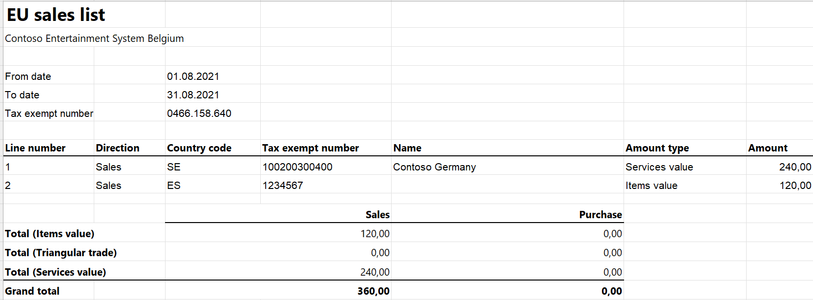

# EU sales list for Belgium

[!include [banner](../../includes/banner.md)]

This article provides information about the European Union (EU) sales list report for Belgium. The Belgian EU sales list report contains information about the sale of goods and services for reporting in XML format.

The following fields are included in the Belgian EU sales list report:

- **EU sales list header:**
    - Company's enterprise ID
    - Company name and primary address
    - Company's primary email and telephone number
    - Reporting period
- **EU sales list lines:**
    - Customer VAT ID
    - The total amount of items
    - The total amount of services
    - Total amount of the triangular trade
    - Correcting period

## Setup

For general setup information, see [EU Sales list reporting](../europe/emea-eu-sales-list.md#prerequisites).

### Set up information about the company

Create a registration type, and assign it to the **VAT ID** registration category for every country or region that your company does business with. Create another registration type, and assign it to the **Enterprise ID (COID)** registration category for the company. For more information, see [Registration IDs](../europe/emea-registration-ids.md).

1. In Microsoft Dynamics 365 Finance, go to **Organization administration** > **Organizations** > **Legal entities**.
2. In the grid, select your company.
3. On the **Addresses** FastTab, set the city, ZIP/postal code, and street for the primary address.
4. On the **Contact information** FastTab, create a primary email address and telephone number.

   > [!NOTE] 
   > The company name, city, ZIP/postal code, and street for the primary address, the primary email address, and primary telephone number will be shown on the EU sales list report.

5. On the Action Pane, select **Registration IDs**.
6. On the **Registration ID** FastTab, select **Add**.
7. On the **Overview** tab, in the **Registration type** field, select the registration type that is assigned to **VAT ID** registration category.
8. Enter your company's VAT ID and select **Add**.
9. On the **Overview** tab, in the **Registration type** field, select the registration type that is assigned to **Enterprise ID (COID)** registration category.
10. Enter your company's enterprise number.
11. Optional: On the **General** tab, in the **General** section, you can change the period that the registration IDs are used for.

    > [!NOTE] 
    > On the **Tax registration** FastTab, the **Tax registration number** field is set to the company's enterprise number without a prefix. The company's enterprise number without a prefix is used in the .xml and .xlsx files for the EU sales list report.

### Import Electronic reporting configurations

- In [Microsoft Dynamics Lifecycle Services (LCS)](https://lcs.dynamics.com/Logon/Index), import the latest versions of the following Electronic reporting (ER) configurations for the EU sales list:
    - EU Sales list model
    - EU Sales list by columns report
    - EU Sales list by rows report
    - EU Sales list (BE)

For more information, see [Download Electronic reporting configurations from Lifecycle Services](../../../fin-ops-core/dev-itpro/analytics/download-electronic-reporting-configuration-lcs.md).

### Set up posting journals

1. In Finance, go to **General ledger** > **Journal setup** > **Posting journals**.
2. On the Action Pane, select **Create**.

### Set up foreign trade parameters

1. Go to **Tax** > **Setup** > **Foreign trade** > **Foreign trade parameters**.
2. On the **EU sales list** tab, set the **Report cash discount** option to **Yes** if a cash discount should be included in the value when a transaction is included in the EU sales list.
3. On the **Electronic reporting** FastTab, in the **File format mapping** field, select **EU Sales list (BE)**.
4. In the **Report format mapping** field, select **EU Sales list by rows report** or **EU Sales list by columns report**.
5. On the **Country/region properties** tab, select **New**, and specify the following information:
    - In the **Country/region** column, select **BEL**.
    - In the **Country/region type** column, select **Domestic**.
6. List all the countries or regions that your company does business with. For each country/region that is part of the EU, in the **Country/region type** field, select **EU** to show trade with those countries on the **EU sales list** page.
7. On the **Number sequences** FastTab, for **EU sales list ID** reference, verify that the **Number sequence code** field is set (that is, it isn't blank).

## Work with the EU sales list

For general information about the types of transactions that are included in the EU sales list, how to generate the EU sales list report, and how to close the EU sales list reporting period, see [EU Sales list reporting](../europe/emea-eu-sales-list.md#working-with-the-esl).

### Generate an EU sales list report

1. Go to **Tax** > **Declarations** > **Foreign trade** > **EU sales list**.
2. Transfer transactions.
3. Optional: Create files that include corrective lines. For each corrective line, switch to **Correction** view, set the **Corrected** option to **Yes**. Then, in the **Declaration type** field, select **Month** or **Quarter** as the correction period.

   > [!NOTE] 
   > For each corrective line in the **Correcting period** section of the report, the information about the corrective period will be taken from the **Invoice date** field.

4. On the Action Pane, select **Reporting**.
5. In the **EU sales list reporting** dialog box, on the **Parameters** FastTab, set the following fields.

    | Field                              | Description                                                                                                                                                                                                                                                    |
    |------------------------------------|----------------------------------------------------------------------------------------------------------------------------------------------------------------------------------------------------------------------------------------------------------------|
    | Reporting period                   | Select **Monthly** or **Quarterly**.                                                                                                                                                                                                                           |
    | From date                          | Select the start date for the report.                                                                                                                                                                                                                          |
    | Generate file                      | Set this option to **Yes** to generate an .xml file for your EU sales list report.                                                                                                                                                                             |
    | File name                          | Enter the name of the .xml file.                                                                                                                                                                                                                               |
    | Generate report                    | Set this option to **Yes** to generate an .xlsx file for your EU sales list report.                                                                                                                                                                            |
    | Report file name                   | Enter the name of the .xlsx file.                                                                                                                                                                                                                              |
    | Official declaration               | Set this option to **Yes** to create an official declaration.                                                                                                                                                                                                  |
    | Correction                         | Set this option to **Yes** to include corrective lines on reports.                                                                                                                                                                                             |
    | Replaced EU sales list declaration | Enter the reference ID of the previous EU sales list declaration that is being replaced. If this field is set when the .xml file for the report is created, the reference ID that you enter will appear in the **Replaced intra listing** field on the report. |

6. Select **OK**, and review the generated reports.

## Example

### Set up information about the company

1. Go to **Organization administration** > **Organizations** > **Legal entities**.
2. In the grid, select **DEMF**.
3. In the **Name** field, enter **Contoso Entertainment System Belgium**.
4. On the **Addresses** FastTab, select **Edit**.
5. In the **Edit address** dialog box, set the following fields.

    | Field               | Value           |
    |---------------------|-----------------|
    | Name or description | Primary address |
    | Purpose             | Business        |
    | Country/region      | BEL             |
    | ZIP/postal code     | 1840            |
    | Street              | Ulitca 12       |
    | City                | Gorod           |
    | Primary             | Yes             |

6. Select **OK**.
7. On the **Contact information** FastTab, select **Add**.
8. Create the email address contoso@contoso.com and the telephone number **+49 123 456 789**, and mark them as primary.

### Set up enterprise IDs

#### Create a registration type for the company code

1. Go to **Organization administration** > **Global address book** > **Registration types** > **Registration types**.
2. On the Action Pane, select **New** to create a registration type for the enterprise number.
3. In the **Enter registration type details** dialog box, in the **Name** field, enter **Enterprise ID**.
4. In the **Country/region** field, select **BEL**.
5. Select **Create**.

#### Match the registration type with a registration category

1. Go to **Organization administration** > **Global address book** > **Registration types** > **Registration categories**.
2. On the Action Pane, select **New** to create a link between a registration type and a registration category.
3. For the **Enterprise ID** registration type, select the **Enterprise ID (COID)** registration category.

#### Set up an enterprise ID for your company

1. Go to **Organization administration** > **Organizations** > **Legal entities**.
2. In the grid, select **DEMF**.
3. On the Action Pane, select **Registration IDs**.
4. In the **Registration type** field, select **Enterprise ID**.
5. In the **Registration number** field, enter **BTW BE 0466.158.640**.
6. On the **General** tab, in the **General** section, in the **Effective** field, select **8/1/2021** (August 1, 2021).
7. On the Action Pane, select **Save**
8. Close the page.

    > [!NOTE] 
    > On the **Tax registration** FastTab, the **Tax registration number** field will be set to **0466.158.640**.

### Set up posting journals

1. Go to **General ledger** > **Journal setup** > **Posting journals**.
2. On the Action Pane, select **Create**.

### Set up foreign trade parameters

1. Go to **Tax** > **Setup** > **Foreign trade** > **Foreign trade parameters**.
2. On the **Number sequences** FastTab, for the **EU sales list ID** reference, select **Fore_2** in the **Number sequence code** field.

### Generate an EU sales list report

For general information about how to create a setup, postings, and transfer transactions by using the **DEMF** legal entity for Belgium, see [Example for generic European Union (EU) sales list](../europe/emea-eu-sales-list-example.md).

1. Go to **Tax** > **Declarations** > **Foreign trade** > **EU sales list**.
2. Verify that the grid on the **EU sales list** page includes one service line and one item line.

    

3. Select a service line.
4. In the **Invoice date** field, enter **5/2/2021** (May 2, 2021).
5. Switch to **Correction** view, and set the **Corrected** option to **Yes**. Then, in the **Declaration type** field, select **Quarter**.
6. On the Action Pane, select **Reporting**.
7. In the **EU sales list reporting** dialog box, on the **Parameters** FastTab, set the following fields:
    - In the **Reporting period** field, select **Monthly**.
    - In the **From date** field, select **8/1/2021** (August 1, 2021).
    - Set the **Generate file** option to **Yes**.
    - In the **File name** field, enter **BE-001F**.
    - Set the **Generate report** option to **Yes**.
    - In the **Report file name** field, enter **BE-001R**.
    - Set the **Official declaration** option to **Yes**.
    - Set the **Correction** option to **Yes**.
    - In the **Replaced EU sales list declaration** field, enter **003**.
8. Select **OK,** and review the report in XML format that is generated. The following tables show the values in the example report.

    **EU sales list header**

    | Field name                                                                  | Field value                          | Comment                                                                         |
    |-----------------------------------------------------------------------------|--------------------------------------|---------------------------------------------------------------------------------|
    | Sequence number                                                             | 1                                    |                                                                                 |
    | Clients nbr                                                                 | 2                                    | The number of lines.                                                            |
    | Declarant reference                                                         | 04661586400067                       | The company's enterprise ID without a prefix and declaration number (**0067**). |
    | Amount sum                                                                  | 360                                  | The total amount of the lines.                                                  |
    | Replaced Intra Listing                                                      | 0003                                 |                                                                                 |
    | VAT Number                                                                  | 0466158640                           | The company's enterprise ID without a prefix.                                   |
    | Name                                                                        | Contoso Entertainment System Belgium | The company's name.                                                             |
    | ZIP/postal code                                                             | 1840                                 |                                                                                 |
    | Street                                                                      | Ulitca 12                            |                                                                                 |
    | City                                                                        | Gorod                                |                                                                                 |
    | Country code                                                                | BE                                   |                                                                                 |
    | Email Address                                                               | contoso@contoso.com                  |                                                                                 |
    | Phone                                                                       | +49 123 456 789                      |                                                                                 |
    | Month **Note:** This field might be named **Quarter** instead of **Month**. | 08                                   |                                                                                 |
    | Year                                                                        | 2021                                 |                                                                                 |

    **EU sales list lines**

    | Field name                                                                                                             | Line 1    | Line 2         | Comment                                                                                                     |
    |------------------------------------------------------------------------------------------------------------------------|-----------|----------------|-------------------------------------------------------------------------------------------------------------|
    | Intra client sequence number                                                                                           | 1         | 2              | The line number.                                                                                            |
    | Company VAT number issued by                                                                                           | ES1234567 | SE100200300400 | The customer's VAT ID.                                                                                      |
    | Code                                                                                                                   | L         | S              | The value is **S** for a service record, **L** for an item record, and **T** for a triangular trade record. |
    | Amount                                                                                                                 | 120.00    | 240.00         | The sum of all invoices by customer.                                                                        |
    | Correcting period                                                                                                      |           |                |                                                                                                             |
    | Quarter **Note:** Depending on the corrective period type, this field might be named **Month** instead of **Quarter**. |           | 2              | The corrective quarter or month.                                                                            |
    | Year                                                                                                                   |           | 2021           | The corrective year.                                                                                        |

9. Review the report in Excel format that is generated.

    

