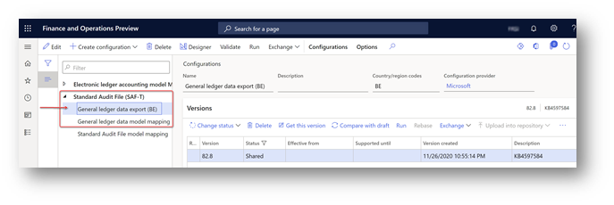
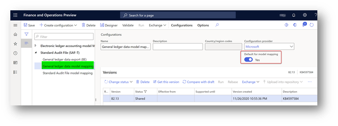
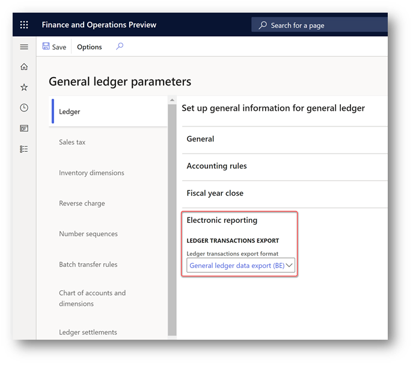
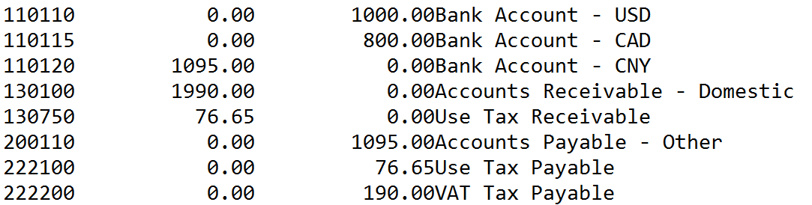

# Export ledger transactions

[!include [banner](../../includes/banner.md)]

The feature described in this article is used to export the total balance of each ledger account for a specific period to a plain text (ASCII) file in CED format. You can then import the generated file into third-party software to create an accounting report according to country/region-specific requirements.

This functionality is available for legal entities that have their primary address in Belgium.

## Prerequisites

### Create posting journals

1. Go to **General ledger** \> **Journal setup** \> **Posting journals**.
2. On the **Journal setup** page, select **Create**. Posting journals and corresponding number sequences are automatically created.

## Export ledger transactions to a plain text file in CED format

### Setup

1. From the [Microsoft global repository](../../../fin-ops-core/dev-itpro/analytics/er-download-configurations-global-repo.md), import the latest versions of the Electronic reporting (ER) configurations for the following report format.

    | **Dynamics 365 Finance version**          | **Configuration name**                                                                                           |
    |-------------------------------------------|------------------------------------------------------------------------------------------------------------------|
    | Before 10.0.16                            | **Ledger transaction export format (BE)** under **Ledger accounting reports** > **Ledger transaction export (BE)** model. |
    | Starting from 10.0.16                     | **General ledger data export (BE)** under **Standard Audit File (SAF-T)** model.                                  |

    > 

2. After import, you must have the following or later versions of ER configurations.

    | **ER configuration name**         | **Type**           | **Version** | **Description**                                                                                                             |
    |-----------------------------------|--------------------|-------------|-----------------------------------------------------------------------------------------------------------------------------|
    | Standard Audit File (SAF-T)       | Model              | 82          | The common ER model for Standard Audit Files.                                                                               |
    | General ledger data model mapping | Model mapping      | 82.13       | The model mapping that defines data sources for General ledger data.                                                        |
    | General ledger data export (BE)   | Format (exporting) | 82.8        | The text format representing General ledger data that can be imported into third-party software. |

    > [!NOTE]
    > After all the ER configurations from the preceding table are imported, set the **Default for model mapping** option to **Yes** for the **General ledger data model mapping** configuration on the **Configurations** page.

    > 

3. Starting in version 10.0.16, to use the **General ledger data export (BE)** format, define the ER configuration name in a new General ledger parameter. Go to **General ledger** > **Ledger setup** > **General ledger parameters**. 
4. Expand the **Electronic reporting** FastTab and then select the **Ledger** tab. 
5. In the **Ledger transactions export** group, in the **Ledger transactions export** field, select the format **General ledger data export (BE)**, and then save the new setting.

    

### Generate the Export ledger transactions report

1. In Finance, go to **General ledger** \> **Periodic tasks** \> **Export ledger transactions**.
2. If your Finance version is lower than 10.0.16, in the **Export ledger transactions to an ASCII file in CED format** dialog box, in the **Format mapping** field, select the **Ledger transaction export format (BE)** format that you downloaded, and then select **OK**. Starting in version 10.0.16, specify the ER format in the General ledger parameters. When the ER format is defined in the General ledger parameters, the system uses it to generate reports.
3. Specify the reporting period in the **From date** and **To date** fields in the **Electronic report parameters** dialog box.
4. If the accounting currency of your legal entity isn't EURO, and you want to generate the report in EURO, select **Recalculate to Euro** in the dialog box. 
When the accounting currency isn't EURO but the reporting currency is, and you select **Recalculate to Euro**, a report is generated with the amounts stored in the general ledger in the reporting currency. 
When neither the accounting or reporting currencies are EURO, and you select **Recalculate to Euro**, the report automatically recalculates the amounts in the accounting currency to EURO by using the exchange rate stored in the system on the date of each transaction in general ledger. Generating the report may take longer than a report that is generated without any recalculation.
5. When you generate the **Export ledger transactions** report for a longer period, run it in batch. To run the report in batch, expand the **Run in the background** FastTab in the dialog box, mark the **Batch processing** parameter, and specify other parameters of the batch as needed. Follow up the report generation on the **Electronic reporting jobs** page.
6. Select **OK** to generate and download the .txt file.

    For example, you post the following ledger transactions in the DEMF company.

| **Date**        | **Transaction type** | **Main account**          | **Offset account**        | **Amount net** | **VAT amount** | **Sales tax code** |
|-----------------|----------------------|---------------------------|---------------------------|----------------|----------------|--------------------|
| January 1, 2020 | Customer invoice     | 110110 – Bank account USD |                           | 1,000          | 190            | VAT19              |
| January 1, 2020 | Vendor invoice       |                           | 110120 – Bank account CNY | 1,095          | 76.65          | EU7                |
| January 1, 2020 | Customer invoice     | 110115 – Bank account CAD |                           | 800            | 0              | EUS                |

In this case, the file that is generated contains the following data.

Here is an explanation of the columns in this file:

- The first column shows the ledger account code.
- The second column shows the debit balance on the ledger account.
- The third column shows the credit balance on the ledger account.
- The fourth column shows the name of the ledger account.

> [!NOTE]
> To post ledger transactions for customer invoices, go to **Accounts receivable** \> **Invoices** \> **All free text invoices**. For vendor invoices, go to **Accounts payable** \> **Invoices** \> **Invoice journal**.

[!INCLUDE[footer-include](../../../includes/footer-banner.md)]
