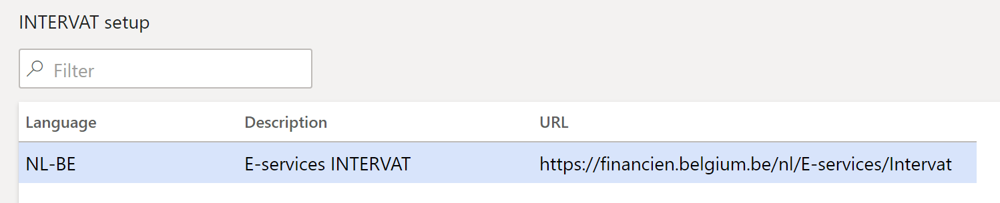
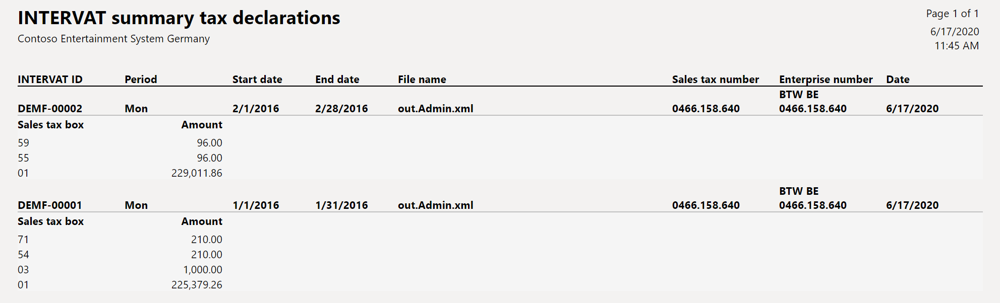
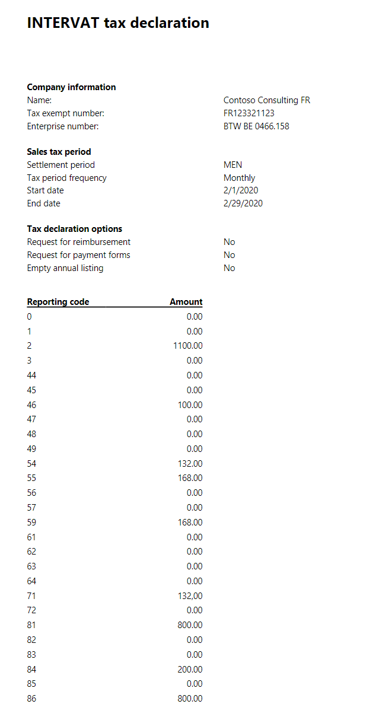
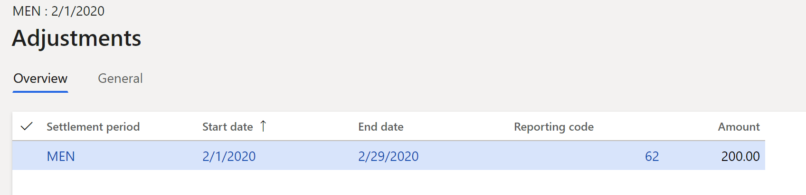
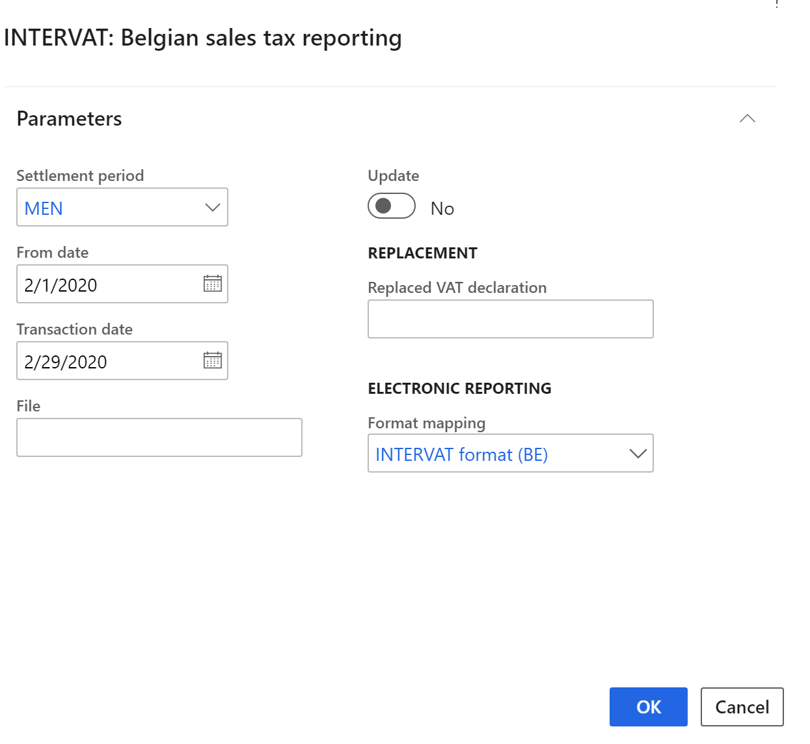
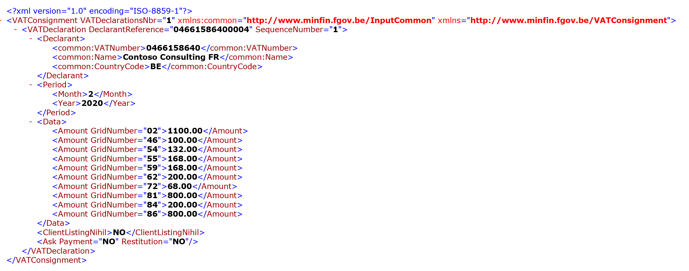
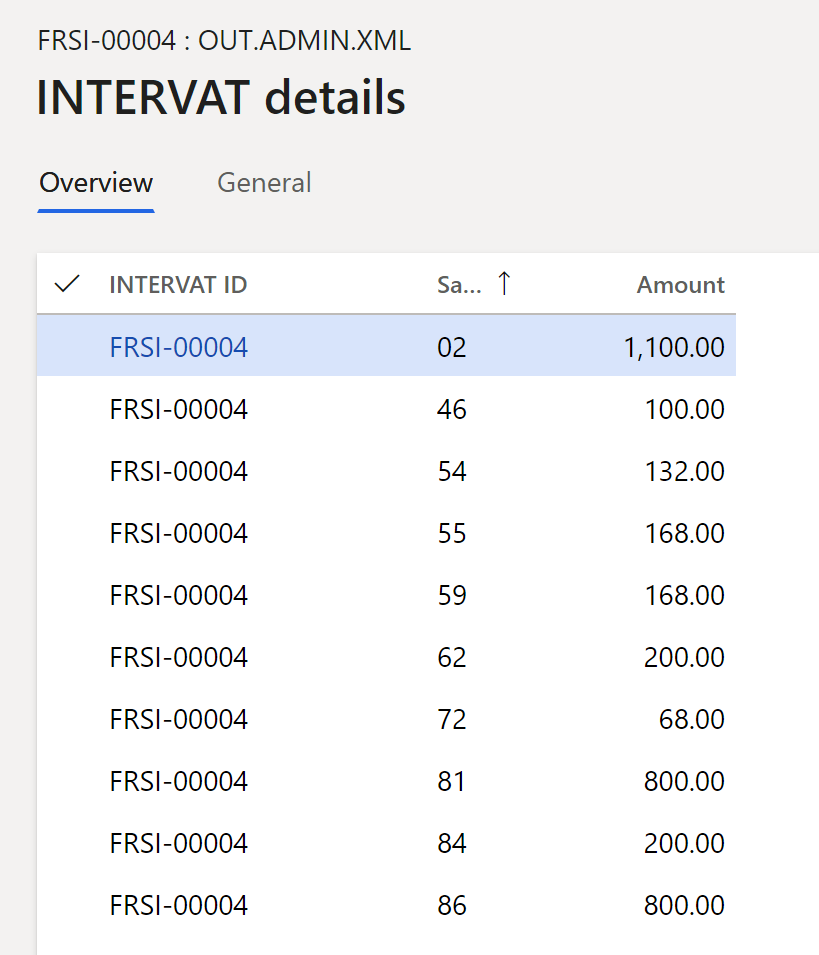

# INTERVAT tax declaration

[!include [banner](../../includes/banner.md)]
> [!NOTE]
> This feature has been replaced with the VAT declaration functionality. For more information, see [VAT declaration (Belgium)](emea-bel-vat-declaration-belgium.md).

## Overview

This article provides country/region-specific information about how to set up and create the INTERVAT tax declaration for legal entities in Belgium.

You can create the INTERVAT tax declaration as an XML file. You can also preview the amounts of the value-added tax (VAT) declaration in a printable format.

The INTERVAT declaration that you create includes tax transactions from the current period. It can also include corrections from the previous period, if a transaction was posted in the previous period after that period was closed.

You can enter additional information for the declaration and manually correct data on the **Additional sales tax report boxes** page. Manual correction might be required if, for example, you can't print the amount of the reporting code in the INTERVAT declaration because the amount is negative. Negative amounts must be deducted from the next VAT declaration, and this task must be completed manually by using corrections. Before you can indicate the corrected amount, you must indicate which sales tax reporting codes allow for corrections.

## Prerequisites
The following prerequisites must be set up before you begin to work with the INTERVAT tax declaration:

-   Legal entity
-   Registration number
-   Contact information
-   Number sequences
-   Posting journal
-   Sales tax authorities
-   Sales tax reporting codes
-   Sales tax codes
-   Tax exempt number

### Legal entity

1.  Go to **Organization administration** \> **Organizations** \> **Legal entities**, and select your legal entity.
2.  On the **Addresses** FastTab, create an address.
3.  In the **Country/region** field, select **Belgium**.
4.  Fill in other address components, and mark the address as **Primary**.
5.  On the **Tax registration** FastTab, in the **Tax registration number** field, specify the tax registration number for your company.

### Registration number

1.  Go to **Organization administration** \> **Organizations** \> **Legal entities**.
2.  Select **Registration IDs**, and then, on the **Registration ID** tab, select **Add**.
3.  In the **Registration type** field, select a value.
4.  In the **Registration number** field, enter a value.
5.  On the **General** tab, enter an effective date. For more information, see [Registration number](../europe/emea-registration-ids.md).

### Contact information

1.  Go to **Organization administration** \> **Organizations** \> **Legal entities**.
2.  On the **Contact information** tab, add lines for the phone number and email address, and set them to **Primary**.

### Number sequences

1.  Go to **General ledger** \> **Ledger setup** \> **General ledger parameters**.
2.  On the **Number sequences** tab, set up number sequences for the **Annual sales list ID** and **INTERVAT ID** references.

### Posting journal

1.  Go to **General ledger** \> **Journal setup** \> **Posting journals**.
2.  On the **Journal setup** page, select **Create**. The voucher series is automatically created.

### Sales tax authorities

1.  Go to **Tax** \> **Indirect taxes** \> **Sales tax authorities**.
2.  Verify that the **Report layout** field is set to **Belgium report layout**.

### Sales tax reporting codes

-   Go to **Tax** \> **Setup** \> **Sales tax** \> **Sales tax reporting codes**, and create new sales tax reporting codes.

If the **Sales tax correction** check box is selected for a sales tax reporting code, that code is available for selection on the **Additional sales tax report boxes** page.

Examples of sales tax reporting code are provided in the [Set up sales tax reporting codes](#set-up-sales-tax-reporting-codes) section later in this article.

### Sales tax codes

1.  Go to **Tax** \> **Indirect taxes** \> **Sales tax codes**.
2.  Add or select information in the fields on the **Report** and **Report – credit note** tabs.
3.  Select the required values in the **Sales tax reporting codes** grid.

### Tax exempt number

1.  Go to **Tax** \> **Setup** \> **Sales tax** \> **Tax exempt numbers**.
2.  For each tax-exempt number, create a record that includes the following information:

    -   In the **Country/region** field, select the tax registration of the counterparty.
    -   In the **Tax exempt number** field, enter the tax-exempt number of the counterparty.
    -   In the **Company name** field, enter the name of the counterparty.

For more information about how to set up the VAT statement, see [VAT reporting for Europe](../europe/emea-vat-reporting.md).

## Settings

### Set up INTERVAT

Create lines on the **INTERVAT setup** page (**Tax \> Setup \> Sales tax \> INTERVAT setup**). The information that you enter on this page is used when you select **Open Web site** on the **INTERVAT tax declaration** page. Create an element for each language. Set the following fields: **Language**, **Description**, and **URL**.

### Set up sales tax reporting codes

For information about how to set up sales tax reporting codes, see [Set up sales tax reporting codes](../../general-ledger/tasks/set-up-sales-tax-reporting-codes.md).

If users are allowed to manually correct a reporting code, select the **Tax corrections** check box. The following table provides an example of sales tax reporting codes for Belgium.

<table width="100%">
<thead>
<tr>
<td width="17%">

<strong>Code and corresponding box in the VAT declaration</strong>

</td>
<td width="71%">

<strong>Description</strong>

</td>
<td width="10%">

<strong>Base/tax</strong>

</td>
</tr>
</thead>
<tbody>
<tr>
<td colspan="3" width="100%">

<strong>Section II. Outputs</strong>

</td>
</tr>
<tr>
<td width="17%">

100 (Box 00)

</td>
<td width="71%">

Sales that are subject to a special regulation.

</td>
<td width="10%">

Base

</td>
</tr>
<tr>
<td width="17%">

01

</td>
<td width="71%">

Taxable supplies and services at a sales tax rate of 6 percent.

The delivery of a product or service transactions at a sales tax rate of 6 percent.

</td>
<td width="10%">

Base

</td>
</tr>
<tr>
<td width="17%">

02

</td>
<td width="71%">

Taxable supplies and services at a sales tax rate of 12 percent.

The delivery of a product or service transactions at a sales tax rate of 12 percent.

</td>
<td width="10%">

Base

</td>
</tr>
<tr>
<td width="17%">

03

</td>
<td width="71%">

Taxable supplies and services at a sales tax rate of 21 percent.

The delivery of a product or service transactions at a sales tax rate of 21 percent.

</td>
<td width="10%">

Base

</td>
</tr>
<tr>
<td width="17%">

44

</td>
<td width="71%">

Services that the contractual partner owes foreign VAT for.

</td>
<td width="10%">

Base

</td>
</tr>
<tr>
<td width="17%">

45

</td>
<td width="71%">

Turnover that the contractual partner owes VAT for.

</td>
<td width="10%">

Base

</td>
</tr>
<tr>
<td width="17%">

46

</td>
<td width="71%">

Intra-community supply of goods and similar transactions (shipments).

</td>
<td width="10%">

Base

</td>
</tr>
<tr>
<td width="17%">

47

</td>
<td width="71%">

Other tax-free sales and other sales that are generated abroad.

</td>
<td width="10%">

Base

</td>
</tr>
<tr>
<td width="17%">

48

</td>
<td width="71%">

Amount of the issued credit notes, and negative corrections that are related to sales from boxes 44 and 46.

</td>
<td width="10%">

Base

</td>
</tr>
<tr>
<td width="17%">

49

</td>
<td width="71%">

Amount of issued credits, and negative adjustments that are related to other boxes from section II, "Outputs."

</td>
<td width="10%">

Base

</td>
</tr>
<tr>
<td colspan="3" width="100%">

<strong>Section III. Inputs</strong>

</td>
</tr>
<tr>
<td width="17%">

81

</td>
<td width="71%">

Amount of all purchases of goods, raw materials, and consumables, and related acquisition costs, excluding VAT deductible.

</td>
<td width="10%">

Base

</td>
</tr>
<tr>
<td width="17%">

82

</td>
<td width="71%">

Amount of miscellaneous goods and services, regardless of whether they are subject to VAT, excluding VAT deductible.

</td>
<td width="10%">

Base

</td>
</tr>
<tr>
<td width="17%">

83

</td>
<td width="71%">

Amount of purchases of capital goods, regardless of whether they are subject to VAT, excluding VAT deductible.

</td>
<td width="10%">

Base

</td>
</tr>
<tr>
<td width="17%">

84

</td>
<td width="71%">

Amount of credits received, and negative adjustments that are related to sales from boxes 86 and 88.

</td>
<td width="10%">

Base

</td>
</tr>
<tr>
<td width="17%">

8684

</td>
<td width="71%">

Technical reporting code for showing credit note amounts in boxes 86 and 84.

</td>
<td width="10%">

Base

</td>
</tr>
<tr>
<td width="17%">

8884

</td>
<td width="71%">

Technical reporting code for showing credit note amounts in boxes 88 and 84.

</td>
<td width="10%">

Base

</td>
</tr>
<tr>
<td width="17%">

85

</td>
<td width="71%">

Amount of credits received, and negative adjustments that are related to other boxes from section III, "Inputs.", excluding VAT amount (deductible and not deductible)

</td>
<td width="10%">

Base

</td>
</tr>
<tr>
<td width="17%">

8185

</td>
<td width="71%">

Technical reporting code for showing credit note amounts in boxes 81 and 85.

</td>
<td width="10%">

Base

</td>
</tr>
<tr>
<td width="17%">

8285

</td>
<td width="71%">

Technical reporting code for showing credit note amounts in boxes 82 and 85.

</td>
<td width="10%">

Base

</td>
</tr>
<tr>
<td width="17%">

8385

</td>
<td width="71%">

Technical reporting code for showing credit note amounts in boxes 83 and 85.

</td>
<td width="10%">

Base

</td>
</tr>
<tr>
<td width="17%">

8785

</td>
<td width="71%">

Technical reporting code for showing credit note amounts in boxes 87 and 85.

</td>
<td width="10%">

Base

</td>
</tr>
<tr>
<td width="17%">

86

</td>
<td width="71%">

Intra-community acquisitions and similar transactions.

</td>
<td width="10%">

Base

</td>
</tr>
<tr>
<td width="17%">

87

</td>
<td width="71%">

Other receipts that the person who is liable to register owes VAT for.

</td>
<td width="10%">

Base

</td>
</tr>
<tr>
<td width="17%">

88

</td>
<td width="71%">

Intra-community services with transfer of the survey.

</td>
<td width="10%">

Base

</td>
</tr>
<tr>
<td colspan="3" width="100%">

<strong>Section IV. Taxes payable</strong>

</td>
</tr>
<tr>
<td width="17%">

54

</td>
<td width="71%">

VAT that is payable on the turnover that is included in codes <strong>01</strong>, <strong>02</strong>, and <strong>03</strong>.

</td>
<td width="10%">

Tax

</td>
</tr>
<tr>
<td width="17%">

55

</td>
<td width="71%">

VAT that is payable on the turnover that is included in codes <strong>86</strong> and <strong>88</strong>.

</td>
<td width="10%">

Tax

</td>
</tr>
<tr>
<td width="17%">

56

</td>
<td width="71%">

VAT on sales that are declared in box 87, excluding imports that involve relocation of the survey.

</td>
<td width="10%">

Tax

</td>
</tr>
<tr>
<td width="17%">

57

</td>
<td width="71%">

VAT on imports that involve transfer of the survey.

</td>
<td width="10%">

Tax

</td>
</tr>
<tr>
<td width="17%">

61

</td>
<td width="71%">

Various VAT adjustments in favor of the state.

</td>
<td width="10%">

Tax

</td>
</tr>
<tr>
<td width="17%">

63

</td>
<td width="71%">

VAT that must be returned, as shown on the credits that are received.

</td>
<td width="10%">

Tax

</td>
</tr>
<tr>
<td colspan="3" width="100%">

<strong>Section V. Taxes deductible</strong>

</td>
</tr>
<tr>
<td width="17%">

59

</td>
<td width="71%">

Amount of deductible VAT.

</td>
<td width="10%">

Tax

</td>
</tr>
<tr>
<td width="17%">

62

</td>
<td width="71%">

Various VAT corrections in favor of the declarant.

</td>
<td width="10%">

Tax

</td>
</tr>
<tr>
<td width="17%">

64

</td>
<td width="71%">

VAT that must be recovered because of credits that are granted.

</td>
<td width="10%">

Tax

</td>
</tr>
<tr>
<td colspan="3" width="100%">

<strong>Section VI. Balance</strong>

</td>
</tr>
<tr>
<td width="17%">

71

</td>
<td width="71%">

Tax that must be paid. On the INTERVAT report, the value in this box is automatically calculated as the sum of reporting codes <strong>54</strong>, <strong>55</strong>, <strong>56</strong>, <strong>57</strong>, <strong>61</strong>, and <strong>63</strong>, minus reporting codes <strong>59</strong>, <strong>62</strong>, and <strong>64</strong>.

</td>
<td width="10%">

Tax

</td>
</tr>
<tr>
<td width="17%">

72

</td>
<td width="71%">

Tax that must be recovered. On the INTERVAT report, the value in this box is automatically calculated as the sum of reporting codes <strong>59</strong>, <strong>62</strong>, and <strong>64</strong>, minus reporting codes <strong>54</strong>, <strong>55</strong>, <strong>56</strong>, <strong>57</strong>, <strong>61</strong>, and <strong>63</strong>.

</td>
<td width="10%">

Tax

</td>
</tr>
<tr>
<td colspan="3" width="100%">

<strong>Section VII. Deposit</strong>

</td>
</tr>
<tr>
<td width="17%">

91

</td>
<td width="71%">

VAT that is actually owed for the period from December 1 through December 20. This code applies to the monthly declaration for December.

</td>
<td width="10%">

Tax

</td>
</tr>
</tbody>
</table>

> [!NOTE]
> You don't have to enter codes **71**, **72**, and **91**, because they will be generated automatically.

To set up an assignment of sales tax reporting codes to sales tax codes, go to **Sales tax codes \> Report setup/Report setup - Credit note**. Consider the following relations between sales tax reporting codes:

-   If there is an amount in code **01**, **02**, or **03**, there should also be an amount in code **54**.
-   If there is an amount in code **54**, there should also be an amount in code **01**, **02**, or **03**.
-   If there is an amount in code **86**, there should also be an amount in code **55**.
-   If there is an amount in code **87**, there should also be an amount in code **56** or **57**.
-   The difference between the amount in code **54** and the sum of codes **01**, **02**, and **03** multiplied by the corresponding VAT rates can't be more than 61.97 EUR.
-   The difference between the amount in code **55** and the sum of codes **84** and **86** multiplied by the corresponding VAT rates can't be more than 610.97 EUR.
-   The difference between the sum of the amounts in codes **56** and **57** and the sum of codes **85** and **87** multiplied by the corresponding VAT rates can't be more than 61.97 EUR.
-   The amount in code **59** should be more than the sum of codes **81**, **82**, **83**, **84**, and **85**.
-   The amount in code **63** and code **85** multiplied by the corresponding VAT rates can't be more than 61.97 EUR.
-   The amount in code **64** and code **49** multiplied by the corresponding VAT rates can't be more than 61.97 EUR.

### Download the format for the report

In [Microsoft Dynamics Lifecycle Services (LCS)](https://lcs.dynamics.com/V2), in the Shared asset library, download the latest versions of the Electronic reporting (ER) configurations for the following VAT declaration format:

-   INTERVAT format (BE)

For more information, see [Download Electronic reporting configurations from Lifecycle Services](../../../fin-ops-core/dev-itpro/analytics/download-electronic-reporting-configuration-lcs.md).

## Additional sales tax report boxes

1.  Go to **Tax** \> **Declarations** \> **Sales tax** \> **Additional sales tax report boxes**.
2.  Select **New** to create lines that have additional information about reporting codes, including manual corrections of the INTERVAT tax declaration. Before you close a settlement period, you should create the line for it, either by posting the sales tax payment or by creating an INTERVAT declaration that is marked as **Update**. The following table describes the fields that you must set for a new line.

| **Field**         | **Description**                                                                                                                                                                           |
|-------------------|-------------------------------------------------------------------------------------------------------------------------------------------------------------------------------------------|
| Settlement period | Select the applicable reporting period.                                                                                                                                                   |
| From date         | Enter the first day of the sales tax settlement period to calculate sales tax for. This value corresponds to the date in the **From** field on the **Sales tax settlement periods** page. |
| To date           | Enter the last date of the sales tax settlement period.                                                                                                                                   |

3.  On **General** tab, you can set the following fields:

-   **Orders** section

| **Field**                                 | **Description**                                                                                                                                                                                                                                              |
|-------------------------------------------|--------------------------------------------------------------------------------------------------------------------------------------------------------------------------------------------------------------------------------------------------------------|
| Requests repayment of sales tax reclaimed | Select this option to request the repayment of any reclaimed sales tax.                                                                                                                                                                                      |
| Disbursement                              | Enter the amount of disbursement. A disbursement can be paid only for the month of December (monthly declaration). The disbursement corresponds to box 91 in the Belgian VAT declaration. You can set this field only if the month equals December (**12**). |
| Order deposit form                        | Select this option to order deposit pages for tax reporting purposes.                                                                                                                                                                                        |
| Nil annual listing                        | Select this option to indicate that there are no transactions to report, and that the company has no obligation to the Belgian government to declare the annual sales from the previous year.                                                                |

-   **Pro-rata percentages** section

| **Field**           | **Description**                                                                                                                                                                                                                 |
|---------------------|---------------------------------------------------------------------------------------------------------------------------------------------------------------------------------------------------------------------------------|
| Pro-rata percentage | Enter the value of the pro-rata percentage that will be exported in the **\<AdjustedValue\>** tag in the XML file.                                                                                                              |
| B1, B2, B3, B4, B5  | Enter amounts for the values of B1, B2, B3, B4, and B5, which will be exported in the **\<SpecialProRataPercentage\>** tag in the XML file, where **\<SpecialProRataGridNumber\>**=**"1"**, **"2"**, **"3"**, **"4"**, **"5"**. |

### Tax corrections

Follow these steps to enter manual correction amounts.

1.  Go to **Tax** \> **Declarations** \> **Sales tax** \> **Additional sales tax report boxes**.
2.  Select **Tax corrections** \> **Adjustments** and set the following fields.

| **Field**         | **Description**                                                                                                                                                                           |
|-------------------|-------------------------------------------------------------------------------------------------------------------------------------------------------------------------------------------|
| Settlement period | Select the applicable reporting period.                                                                                                                                                   |
| From date         | Enter the first day of the sales tax settlement period to calculate sales tax for. This value corresponds to the date in the **From** field on the **Sales tax settlement periods** page. |
| To date           | Enter the last day of the sales tax settlement period.                                                                                                                                    |
| Reporting code    | Select the reporting code. Only the reporting codes that the **Tax corrections** check box is selected for will be available during tax correction entry.                                 |
| Amount            | Enter the correction amount.                                                                                                                                                              |

> [!NOTE]
> Composed reporting codes that are used for credit notes. such as code **8185**, aren't available for selection. Nor are codes **71**, **72**, and **91**. Codes **71** and **72** are calculated automatically when Belgian sales tax reporting is run. Code **91** is entered in another way (see description of **Disbursement** field above).
>
> If a tax period is updated, a voucher number and a date will be shown. (For more information, see the description of the **Update** check box in the [Generate an INTERVAT tax declaration](#generate-an-intervat-tax-declaration) section later in this article.) The period that has a voucher number and a date is a closed VAT period for Belgium. Therefore, all values on the **General** tab of the **Tax corrections** page are read-only. When new transactions that have taxes are entered for the closed VAT period, the taxes will be forwarded to the next available open tax period.

## Generate an INTERVAT tax declaration
1.  Go to **Tax** \>**Declarations \> Sales tax \> INTERVAT tax declaration**.
2.  Select **New declaration** to generate an INTERVAT tax declaration.
3.  In the **INTERVAT: Belgian sales tax reporting** dialog box, set the following fields.

| **Field**                | **Description**                                                                                                                                                                                                                                                                                                                                                                                                            |
|--------------------------|----------------------------------------------------------------------------------------------------------------------------------------------------------------------------------------------------------------------------------------------------------------------------------------------------------------------------------------------------------------------------------------------------------------------------|
| Settlement period        | Select the applicable reporting period.                                                                                                                                                                                                                                                                                                                                                                                    |
| From date                | Enter the first day of the sales tax settlement period to calculate sales tax for. This value corresponds to the date in the **From** field on the **Sales tax settlement periods** page.                                                                                                                                                                                                                                  |
| Transaction date         | Enter the date when the sales tax report is calculated. The default value is the current date. The sales tax payment is calculated for all transactions that were posted during the settlement period.                                                                                                                                                                                                                     |
| Update                   | A selected check box closes the period and creates a sales tax payment, if it wasn't already created. Therefore, all VAT transactions that are entered in this period after the update will be forwarded to the next available open period. A selected check box also creates the line on the **Additional sales tax report boxes** page, if it wasn't already created. None of the values on this new line can be edited. |
| Replaced VAT declaration | Enter the identification number of the declaration to replace.                                                                                                                                                                                                                                                                                                                                                             |
| File                     | Enter the file name that the INTERVAT tax declaration will be exported to.                                                                                                                                                                                                                                                                                                                                                 |
| Format mapping           | Select the **INTERVAT format (BE)** ER format that you downloaded earlier.                                                                                                                                                                                                                                                                                                                                                 |

You can also close the tax period by generating a sales tax payment (**Tax \> Declarations \> Sales tax \> Settle and post sales tax**).

4.  Select **OK**. The system generates the INTERVAT tax declaration line and an INTERVAT XML file.
5.  Review the information in the declaration.

6.  On the **General** tab, review the following fields: **INTERVAT ID**, **Date**, **Period**, **Start date**, **End date**, **Period frequency**, **Status**, and **File name**.
7.  On the **Frame I: General information** tab, review the following fields. You can edit these fields, even if the period was closed. The exceptions are the fields in the **Pro-rata percentages** section. Those fields are read-only.

| **Field**                        | **Description**                                                                                                                                                                                                                                                                           |
|----------------------------------|-------------------------------------------------------------------------------------------------------------------------------------------------------------------------------------------------------------------------------------------------------------------------------------------|
| Company name                     | The company name.                                                                                                                                                                                                                                                                         |
| Sales tax number                 | The tax registration number that is transferred from the setting that you defined in the [Prerequisites](#prerequisites) section earlier in this article.                                                                                                                                   |
| Enterprise number                | The enterprise number that is transferred from the setting that you defined in the [Prerequisites](#prerequisites) section.                                                                                                                                                               |
| Telephone, Email                 | Contact information that is transferred from the setting that you defined in the [Prerequisites](#prerequisites) section.                                                                                                                                                                 |
| Request for reimbursement        | Select this check box to request a reimbursement of tax.                                                                                                                                                                                                                                  |
| Request for payment forms        | Select this check box to request payment pages for the INTERVAT tax declarations.                                                                                                                                                                                                         |
| Nil annual listing               | A selected check box indicates that this declaration is an empty declaration. The value is transferred from the **Additional sales tax report boxes** page that is described in the [Additional sales tax report boxes](#additional-sales-tax-report-boxes) section earlier in this article |
| Replaced VAT declaration         | The identification number of the declaration, to replace what you defined in the **INTERVAT: Belgian sales tax reporting** dialog box that is described earlier in this section.                                                                                                          |
| **Pro-rata percentages** section | Review the amounts in the **Pro-rata percentage**, **B1**, **B2**, **B3**, **B4**, and **B5** fields that you defined on the **Additional sales tax report boxes** page that is described in the [Additional sales tax report boxes](#additional-sales-tax-report-boxes) section.         |

On the **INTERVAT tax declaration** page, you can perform the following actions by using the buttons on the Action Pane.

| **Button**     | **Description**                                                                                                                                                                                                                                                   |
|----------------|-------------------------------------------------------------------------------------------------------------------------------------------------------------------------------------------------------------------------------------------------------------------|
| Setup          | Open the **Additional sales tax report boxes** page that is described in the [Additional sales tax report boxes](#additional-sales-tax-report-boxes) section.                                                                                                     |
| Re-create file | Recreate the INTERVAT file if the period wasn't closed.                                                                                                                                                                                                           |
| Open file      | Open the generated XML file.                                                                                                                                                                                                                                      |
| Open Web site  | Open the website (URL) that you defined on the **INTERVAT setup** page.                                                                                                                                                                                           |
| Change status  | Change the status to **Sent**. When a declaration is created, it has a status of **Created**. After you manually import the generated file that contains the INTERVAT declaration on the INTERVAT site, you can use this button to change the status to **Sent**. |
| Details        | Open the **INTERVAT details** page, where you can review the amounts in the corresponding reporting codes.                                                                                                                                                        |

## Generate an INTERVAT summary tax declaration
To print an INTERVAT tax declaration for several tax periods, follow these steps.

1.  Go to **Tax** \> **Inquiries and reports** \> **Sales tax reports** \> **INTERVAT summary tax declaration**.
2.  Use the filters to specify criteria for selecting data, and then review the information on the report.

## Example
The following example shows how you can set up sales tax codes and sales tax reporting codes, post transactions, and generate the INTERVAT tax declaration.

1.  Go to **Organization administration \> Organizations \> Legal entities**.
2.  On the **Tax registration** FastTab, in the **Tax registration number** field, enter **0466.158.640**.
3.  Select **Registration IDs**, add a line, and set the following values:

-   **Registration type:** ENTNUM
-   **Registration number:** BTW BE 0466.158.640

4.  Go to **Tax \> Indirect taxes \> Sales tax \> Sales tax codes**, and set up the following sales tax codes.

| **Sales tax code** | **Percentage** | **Description**                                                                      |
|--------------------|----------------|--------------------------------------------------------------------------------------|
| BE21               | 21             | Domestic sales and purchases at a rate of 21 percent.                                |
| BE12               | 12             | Domestic sales and purchases at a rate of 12 percent.                                |
| BE6                | 6              | Domestic sales and purchases at a rate of 6 percent.                                 |
| BEEU21             | 21             | EU purchases at a rate of 21 percent where the **Use tax** option is set to **Yes**. |
| BEEU12             | 12             | EU purchases at a rate of 12 percent where the **Use tax** option is set to **Yes**. |
| BEEU6              | 6              | EU purchases at a rate of 6 percent where the **Use tax** option is set to **Yes**.  |
| BEEUS              | 21             | EU sales where the **Exempt** option is set to **Yes**.                              |

5.  On the **Sales tax codes** page, on the **Report setup** FastTab, assign reporting codes to sales tax codes.

The following table shows how to assign the sales tax reporting codes to sales tax codes.

| **Sales tax code** | **Taxable sales** | **Tax-free sale** | **Sales tax payable** | **Taxable purchases** | **Sales tax receivable** | **Taxable import** | **Use tax** | **Offset use tax** |
|--------------------|-------------------|-------------------|-----------------------|-----------------------|--------------------------|--------------------|-------------|--------------------|
| BE21               | 03                |                   | 54                    |                       |                          |                    |             |                    |
| BE12               | 02                |                   | 54                    |                       |                          |                    |             |                    |
| BE6                | 01                |                   | 54                    |                       |                          |                    |             |                    |
| BEEU21             |                   |                   |                       |                       | 81                       | 86                 | 59          | 55                 |
| BEEU12             |                   |                   |                       |                       | 81                       | 86                 | 59          | 55                 |
| BEEU6              |                   |                   |                       |                       | 81                       | 86                 | 59          | 55                 |
| BEEUS              |                   | 46                |                       |                       |                          |                    |             |                    |

6.  On the **Sales tax codes** page, on the **Report setup – credit note** FastTab, assign reporting codes to sales tax codes.

The following table shows how to assign the sales tax reporting codes to sales tax codes.

| **Sales tax code** | **Taxable sales CN** | **Tax-free sale CN** | **Sales tax payable CN** | **Taxable purchases CN** | **Sales tax receivable CN** | **Taxable import CN** | **Use tax CN** | **Offset use tax CN** |
|--------------------|----------------------|----------------------|--------------------------|--------------------------|-----------------------------|-----------------------|----------------|-----------------------|
| BEEU21             |                      |                      |                          |                          | 8184                        | 86                    | 59             | 55                    |
| BEEU12             |                      |                      |                          |                          | 8184                        | 86                    | 59             | 55                    |
| BEEU6              |                      |                      |                          |                          | 8184                        | 86                    | 59             | 55                    |

Instead of codes **55** and **59**, you can use corrective codes **63** and **64**.

> [!NOTE]
> The preceding configuration is just an example and depends on the structure of the sales tax codes that are used. If you want values to be calculated and transferred to the sales tax report, for each tax code that is used in the sales tax payment process, you must set a relevant sales tax reporting code in one or more fields on the **Report setup** tab.

7.  Post the following transactions. For example, for customer invoices, go to **Accounts receivable** \> **Invoices** \> **All free text invoices**. For vendor invoices, go to **Accounts payable** \> **Invoices** \> **Invoice journal**.

| **Date**         | **Transaction type**  | **Amount net** | **VAT amount** | **Sales tax code** | **Expected tax base – reporting code**                 | **Expected tax amount – reporting code** |
|------------------|-----------------------|----------------|----------------|--------------------|--------------------------------------------------------|------------------------------------------|
| February 1, 2020 | Customer invoice      | 1,100          | 132            | BE12               | 02                                                     | 54                                       |
| February 1, 2020 | Vendor invoice (EU)   | 1,000          | 210            | BEEU21             | 86 – Base payable 81 – Base deduction                  | 55 – Tax payable 59 – Tax deduction      |
| February 2, 2020 | Vendor invoice (EU)   | \-200          | \-42           | BEEU21             | 86 – Base payable 81 – Base deduction 84 – Credit base | 55 – Tax payable 59 – Tax deduction      |
| February 1, 2020 | Customer invoice (EU) | 100            | 0              | BEEUS              | 46                                                     | Not applicable                           |

8.  Go to **Tax \> Declarations \> Sales tax \> Report sales tax for settlement period**.
9.  In the **Report sales tax for settlement period** dialog box, in the **Sales tax payment version** field, select **Original**.
10.  Select **OK**, and review the data.

Notice that the amount of the credit note is shown in code **84**.

11.  Go to **Tax \> Declarations \> Sales tax \> Additional sales tax report boxes**.
12.  Select **New** to create a line for February 2020.
13.  Select **Tax corrections \> Adjustments**, and create a line.

14.  Go to **Tax** \> **Declarations** \> **Sales tax** \> **Settle and post sales tax**.
15.  In the **Settle and post sales tax** dialog box, in the **Sales tax payment version** field, select **Original**.
16.  Go to **Tax** \> **Declarations** \> **Sales tax** \> **INTERVAT tax declaration**.
17.  Select **New declaration**, set the following values:

   -   **Settlement period:** MEN
   -   **From date:** 2/1/2020 (February 1, 2020)
   -   **Transaction date:** 2/29/2020 (February 29, 2020)
   -   **Update:** No
   -   **Format mapping:** INTERVAT format (BE)

18.  Select **OK**, open the file, and review the report.

19.  Select **Details**, and review the data.

Notice that the amount in **62** code equals **200**.
    
## Reconciliation reports for Belgium

For information about reconciliation reports for Belgium, see [Reconciliation reports for Belgium](emea-bel-reconciliation-reports.md).

[!INCLUDE[footer-include](../../../includes/footer-banner.md)]
