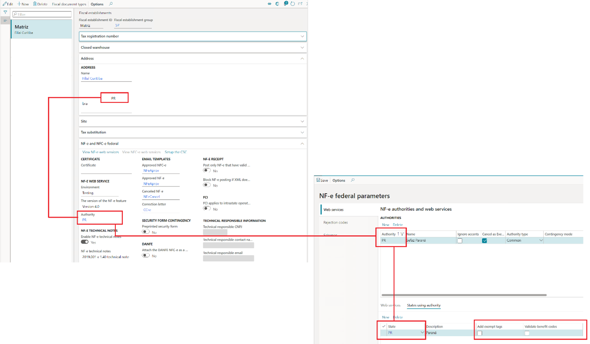
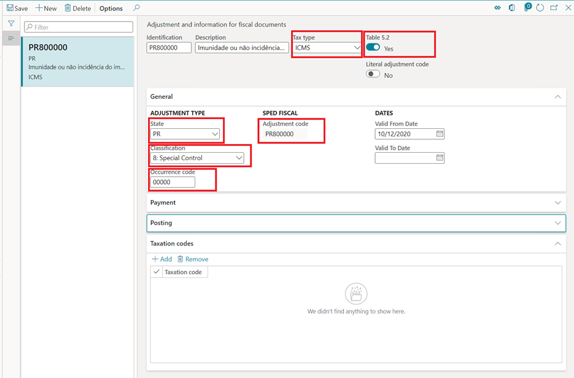

# Tax benefits and exemptions rules for NF-e/NFC-e from NT2019.001 

The introduction of the NF-e technical note NT2019.001 created requirements to
enforce the description of ICMS tax benefits and exemptions more accurately
during the issuing of fiscal document models 55 (NF-e) and 65 (NFC-e).

That means that specific validation rules have been introduced in the NF-e/NFC-e
web services reception services to check the compatibility between the usage of
benefit codes, associated to the ICMS tax benefit or exemption, and the informed
Taxation code (CST) in the XML, during the process of requesting the NF-e/NFC-e
authorization.

However, the technical note specifications left it up at discretion of the state
legislation the adoption of such validation rules, as well determine its own
compatibility rules between the benefit code and the CST. It also was left at
discretion of the state, determine the exception rules, when the compatibility
check between the benefit code and the CST must be skipped by the web service
reception service.

For more information about the compatibility rules and exceptions, please check
the latest version of technical note NT2019.001, available in the [NF-e portal](http://www.nfe.fazenda.gov.br/portal/principal.aspx),
and for details about the validation rules, check the rules N12-85, N12-86,
N12-90, N12-94, N12-97 and N12-98 from the same technical note. Also check the
additional documentation “TABELA_cBenef_X_CST” (the cBenef x CST table),
published in the [NF-e portal](http://www.nfe.fazenda.gov.br/portal/principal.aspx), which describes the valid relationship between
benefit code and CST, per state.

Details about the adoption of the rules by each state legislation can also be
found in the technical note NT2019.001.

Note: The concept, set up and usage of tax benefits and exemptions under the
context of the Brazilian localization is not within the scope of this article.
For further references, consult the [Brazil tax
overview](https://docs.microsoft.com/en-us/dynamics365/finance/localizations/latam-bra-calculate-taxes).

# Feature overview

Through this feature, the user will:

-   Adding the tags \<vICMSDeson\> and \<motDesICMS\> to the XML generated from
    the NF-e/NFC-e issuing scenarios.

-   Configuring the benefit code for ICMS tax benefit and exemptions in
    accordance with the cBenef x CST table.

-   Populating the tag \<cBenef\> with the benefit code in accordance with the
    cBenef x CST table.

-   Validating the compatibility between the Benefit code and CST, in accordance
    with the validation rules from the technical note NT2019.001 and the cBenef
    x CST table.

# Enabling the technical note feature

Only for Finance or Supply Chain Management:

1.  Go to **Organization administration \> Organizations \> Fiscal
    establishments \> Fiscal establishments.**

2.  Select the Fiscal establishment.

3.  Expand fast tab **NF-e and NFC-e federal.**

4.  Click **Edit.**

5.  On **NF-E TECHNICAL NOTES** field group, enable parameter **Enable NF-e
    technical notes.**

6.  On the combo box field **NF-e technical notes**, select at least **2019.001
    v1.40 technical note**.

7.  Click **Save.**

Important: after the version **2019.001 v1.10 technical note**, from the field
**NF-e technical notes**, the **Tax \> Setup \> Sales tax \> Types of benefit
codes** form became obsolete and is no longer used.

# Add exempt tags and Validate benefit codes setup

New parameters have been introduced:

-   **Add exempt tags:** when it is enabled, the tags \<vICMSDeson\> and
    \<motDesICMS\> are added to the XML during issuance of NF-e/NFC-e.

-   **Validate benefit code:** when it is enabled, the posting of fiscal
    documents validates the compatibility between the CST and the ICMS tax
    benefit or exemptions codes.

Important: when the **Validate benefit code** is enabled, the following question
is thrown: “**Do you want to copy taxation codes from benefit code types to
adjustment code for ‘XX’ state?**”. That happens because in case of version of
the feature **NT2019.001 v1.10 technical note** has been used before, and type
of benefits have been entered through **Type of benefits** form, it can be
possible to convert the type of benefits into adjustment codes. By answering
“Yes”, it will convert any existing data from the obsolete form **Types of
benefit codes** into **Adjustment and information for fiscal documents.**

Those parameters must be setup for the same Authority configured in the Fiscal
establishment, which must be referred to the state from the fiscal establishment
address.

1.  Go to **Organization administration \> Organizations \> Electronic fiscal
    documents \> NF-e federal parameters.**

2.  Click on tab **Web services**, select the same Authority configured in the
    Fiscal establishment, on the field **Authority.**

3.  Click on tab **States using authority.**

4.  Enable/disable **Add exempt tags** according to the state legislation.

5.  Enable/disable **Validate benefit codes** according to the state
    legislation.

# Benefit codes setup

The Benefit codes, given by the cBenef x CST table, must be entered as special
Adjustment codes in Fiscal books module.

1.  Go to **Fiscal books \> Setup \> Tax adjustment codes \> Adjustment and
    information for fiscal documents.**

2.  Click **New** to add new Adjustment codes. The adjustment codes must have
    the following attributes:

-   Tax type = ICMS.

-   Table 5.2 = Yes.

-   State = the state from the Authority from NF-e federal parameter form

-   Classification = 8: Special.

-   Occurrence code = Enter the numeric figures from the benefit code given by
    the “cBenef x CST” table.

-   Adjustment code = will be formed by state + occurrence code. This should
    match to the benefit code given by the cBenef x CST table.

Special controls for Adjustment codes:

-   Literal adjustment code = Yes

    Use only on scenarios of issuing electronic fiscal documents model 55/65,
    with regular taxations without benefits or exemptions, when the cBenef x CST
    table requires or allows the usage of adjustment code as a fixed value or a
    literal word, such as “NULO” or “SEM BENEF” filled in the tag \<cBenef\>.

-   Suppress code = Yes

    Use only on scenarios of issuing electronic fiscal documents model 55/65,
    with regular taxations without benefits or exemptions, when the cBenef x CST
    table requires or allows the usage of empty tag \<cBenef\>.

# Benefit codes by CST setup

The CST by Benefit code, given by the cBenef x CST table, must be entered as
Adjustment codes in Fiscal books module.

1.  Go to **Fiscal books \> Setup \> Tax adjustment codes \> Adjustment and
    information for fiscal documents.**

2.  Click **Add** for entering CST for the Benefit code.

# Benefit code by Item/State setup

To setup the rules to validate benefit codes by CST, for a given state, as
described in the cBenef x CST table:

1.  Go to **Tax \> Setup \> Sales tax \> Benefit code per Item/State.**

2.  Click **New**

3.  Select **State** from the Authority from NF-e federal parameter form.

4.  Click **Add** to enter a new relation.

# Validations during posting of fiscal documents 

When the parameter **Validate benefit code** is enabled in the **NF-e federal
parameters,** the posting of fiscal documents model 55/65 are validated towards
the rules configured in the **Benefit code per Item/State**.

The validation occurs for the rules configured in the **Benefit code per
Item/State** for all directions of fiscal documents (inbound or outbound) and
for all type of issuers (Fiscal establishments or third party).

When the fiscal document direction is outbound, it requires the configuration of
the rules for the state of the **Authority** defined in the Fiscal establishment
parameters.

When the fiscal document direction is inbound and fiscal document issuer is the
Fiscal establishment, it requires the configuration of the rules for the state
of the **Authority** defined in the Fiscal establishment parameters too.

When the fiscal document direction is inbound and fiscal document issuer is a
third party, it requires the configuration of the rules at the state of the
issuer of the fiscal document.

Important (only for Finance or Supply Chain Management): after KB 4582589, the validation when the fiscal document direction is
inbound and fiscal document issuer is a third party became obsolete.

# Validation exceptions

The technical note NT2019.001 specifies exceptions rules adopted at discretion
of each state legislation. For more details, consult the validation rules
N12-85, N12-86, N12-90, N12-94, N12-97 and N12-98 from the same technical note.

