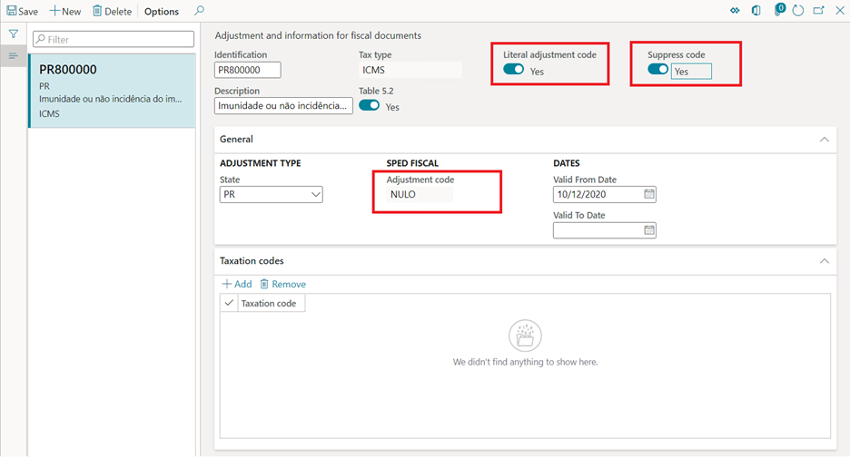
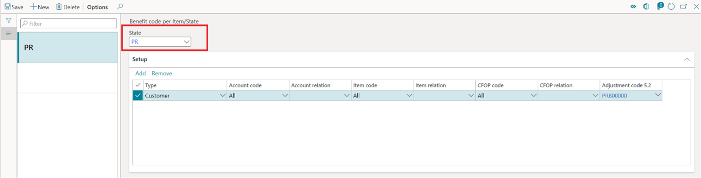

---
# required metadata

title: Tax benefits and exemption rules for NF-e/NFC-e from NT2019.001
description: This topic provides information about the ICMS tax benefits and exemptions in fiscal documents for Brazil. 
author: gionoder
manager: AnnBe
ms.date: 11/12/2020
ms.topic: article
ms.prod: 
ms.service: dynamics-ax-applications
ms.technology: 

# optional metadata

# ms.search.form: 
audience: Application User
# ms.devlang: 
ms.reviewer: kfend
ms.search.scope: Operations
# ms.tgt_pltfrm: 
ms.custom: 
ms.search.region: Brazil
# ms.search.industry: 
ms.author: roschlom
ms.search.validFrom: 
ms.dyn365.ops.version: 

---

# NT2019.001 - Tax benefits and exemptions rules for NF-e/NFC-e

[!include [banner](../includes/banner.md)]

The introduction of the NF-e technical note NT2019.001 created requirements to enforce the description of ICMS tax benefits and exemptions more accurately when fiscal document models 55 (NF-e) and 65 (NFC-e) are issued.

Specific validation rules have been introduced in the NF-e/NFC-e web services reception services. These rules verify the compatibility between the usage of benefit codes that associated to the ICMS tax benefit or exemption, and the informed Taxation code (CST) in the XML. Verification is complete when the NF-e/NFC-e authorization is requested.

However, the technical note specifications left the adoption of such validation rules, and the determination of their own compatibility rules between the benefit code and the CST, to the discretion of the state legislation. The state also determines the exception rules for when the compatibility check between the benefit code and the CST must be skipped by the web service reception service.

For more information about the compatibility rules and exceptions, see the latest version of technical note NT2019.001, available in the [NF-e portal](http://www.nfe.fazenda.gov.br/portal/principal.aspx). For more details about the validation rules, check the rules N12-85, N12-86, N12-90, N12-94, N12-97 and N12-98 from the same technical note. Also, you can view the additional documentation “TABELA_cBenef_X_CST” (the cBenef x CST table), published in the [NF-e portal](http://www.nfe.fazenda.gov.br/portal/principal.aspx), which describes the valid relationship between the benefit code and the CST, per state.

Details about the adoption of the rules by each state legislation can be found in the technical note NT2019.001.

> [!NOTE]
> The concept, set up and use tax benefits and exemptions under the context of the Brazilian localization, isn't within the scope of this topic. For further references, see [Brazil tax overview](latam-bra-calculate-taxes.md).

## Feature overview

Through this feature, the user will:

- Add the tags \<vICMSDeson\> and \<motDesICMS\> to the XML generated from the NF-e/NFC-e issuing scenarios.
- Configure the benefit code for ICMS tax benefit and exemptions in accordance with the cBenef x CST table.
- Populate the tag \<cBenef\> with the benefit code in accordance with the cBenef x CST table.
- Validate the compatibility between the Benefit code and CST, in accordance with the validation rules from the technical note NT2019.001 and the cBenef x CST table.

## Enable the technical note feature

Only for Dynamics 365 Finance or Dynamics 365 Supply chain management:

1. Go to **Organization administration** \> **Organizations** \> **Fiscal establishments** \> **Fiscal establishments**.
2. Select the fiscal establishment, and then expand the **NF-e and NFC-e federal** FastTab.
3. Select **Edit**.
4. In the **NF-E TECHNICAL NOTES** field group, enable parameter **Enable NF-e technical note.**.
5. In the **NF-e technical notes** field, select **2019.001 v1.40 technical note**, and then select **Save**.

> [!IMPORTANT]
> After version **2019.001 v1.10 technical note**, from the field **NF-e technical notes**, the **Tax \> Setup \> Sales tax \> Types of benefit codes** form became obsolete and is no longer used.

## Add exempt tags and Validate benefit codes setup

The following new parameters have been introduced:

- **Add exempt tags**:When this parameter is enabled, the tags \<vICMSDeson\> and \<motDesICMS\> are added to the XML when the NF-e/NFC-e is issued.
- **Validate benefit code**: With this parameter enabled, when fiscal documents are posted, the compatibility between the CST and the ICMS tax benefit or exemptions codes is validated.

> [!IMPORTANT]
> When the **Validate benefit code** parameter is enabled, the following message opens, **Do you want to copy taxation codes from benefit code types to adjustment code for ‘XX’ state?**. This message occurs because a version of the feature **NT2019.001 v1.10 technical note** has been used before, and the type of benefits have already been entered on the **Type of benefits** page. It is possible however, to convert the type of benefits into adjustment codes. By answering **Yes**, any existing data from the obsolete form **Types of benefit codes** will be convered into **Adjustment and information for fiscal documents**.

Those parameters must be set up for the same Authority as what is configured in the Fiscal establishment, which must be referred to the state from the fiscal establishment address.

1. Go to **Organization administration \> Organizations \> Electronic fiscal documents \> NF-e federal parameters**.
2. On the **Web services** tab, in the **Authority** field, select the same Authority that is configured in the Fiscal establishment.
3. On the **States using authority**, select or clear the **Add exempt tags** and **Validate benefit codes** fields according to the state legislation.

## Benefit codes setup

The Benefit codes, given by the cBenef x CST table, must be entered as special adjustment codes in **Fiscal books** module.

1. Go to **Fiscal books \> Setup \> Tax adjustment codes \> Adjustment and information for fiscal documents**.
2. Select **New** to add a new adjustment codes. The adjustment code must have the following attributes:

- **Tax type** = **ICMS**
- **Table 5.2** = **Yes**
- **State** = the state from the Authority from NF-e federal parameter form
- **Classification** = **8: Special**
- **Occurrence code** = Enter the numeric figures from the benefit code given by the **cBenef x CST** table
- **Adjustment code** = Formed by state and the occurrence code. This should match to the benefit code given by the **cBenef x CST** table

Special controls for adjustment codes:

- **Literal adjustment code** = **Yes**

    Use only on scenarios of issuing electronic fiscal documents model 55/65, with regular taxations that have no benefits or exemptions, when the **cBenef x CST** table requires or allows using the adjustment code as a fixed value or a literal word, such as “NULO” or “SEM BENEF” filled in the tag \<cBenef\>.

- **Suppress code** = **Yes**

    Use only on scenarios of issuing electronic fiscal documents model 55/65, with regular taxations that have no benefits or exemptions, when the **cBenef x CST** table requires or allows using the empty tag \<cBenef\>.

## Benefit codes by CST setup

The CST by Benefit code, given by the **cBenef x CST** table, must be entered as adjustment codes in **Fiscal books** module.

1. Go to **Fiscal books \> Setup \> Tax adjustment codes \> Adjustment and information for fiscal documents.**
2. Select **Add** to enter CST for the **Benefit code**.

## Benefit code by Item/State setup

Complete the following steps to set up rules to validate benefit codes by CST for a given state, as described in the **cBenef x CST** table.

1. Go to **Tax** \> **Setup** \> **Sales tax** \> **Benefit code per Item/State**.
2. Select **New**.
3. On the **NF-e federal parameter** page, select **State**.
4. Select **Add** to enter a new relation.

## Validations during posting of fiscal documents 

When the parameter **Validate benefit code** is enabled in the **NF-e federal parameters,** the posting of fiscal documents model 55/65 is validated per the rules configured in the **Benefit code per Item/State**.

The validation occurs for the rules configured in the **Benefit code per Item/State** for all directions of fiscal documents (inbound or outbound) and for all type of issuers (fiscal establishments or third party).

When the fiscal document direction is outbound, the configuration of the rules for the state of the **Authority** must be defined in the Fiscal establishment parameters.

When the fiscal document direction is inbound and fiscal document issuer is the Fiscal establishment, the configuration of the rules for the state of the **Authority** must also be defined in the Fiscal establishment parameters.

When the fiscal document direction is inbound and fiscal document issuer is a third party, the configuration of the rules must be made at the state of the issuer of the fiscal document.

> [!IMPORTANT]
> For Finance or Supply Chain Managment, after KB 4582589, the validation of incoming fiscal documents durign posting became obsolete and is no longer completed by default when the fiscal document direction is inbound and the fiscal document issuer is a third party. However, if it is necessary to keep this behavior and perform the validation, the feature flighting  **FiscalDocumentNotSkipBenefitValidationIncomingThirdPartyFlight** must be enabled. 

## Validation exceptions

The technical note NT2019.001 specifies exception rules adopted at the discretion of each state legislation. For more details, consult the validation rules N12-85, N12-86, N12-90, N12-94, N12-97 and N12-98 from the same technical note.

