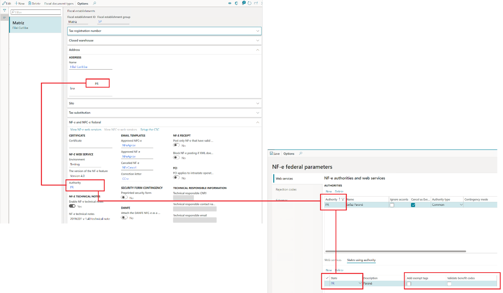
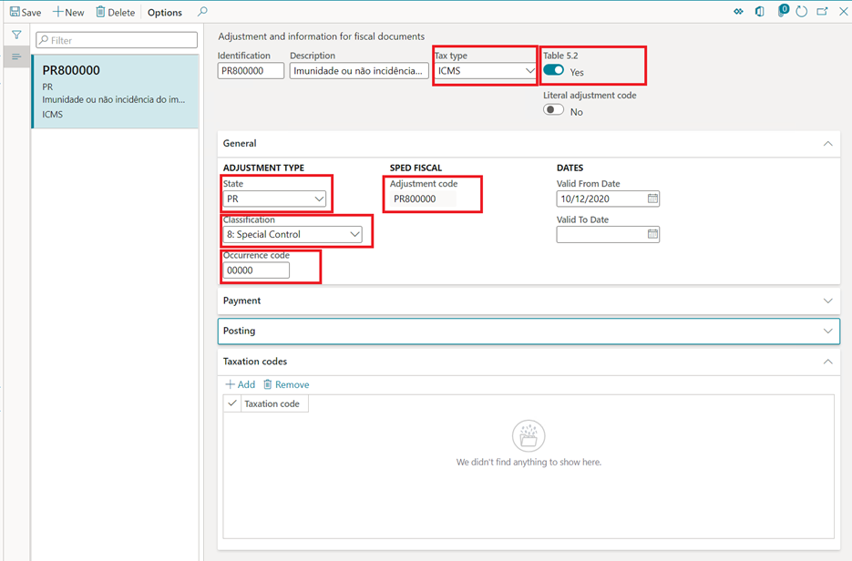
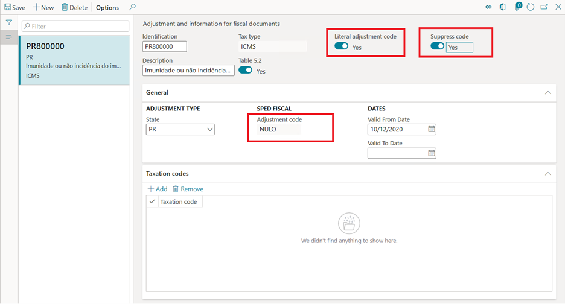
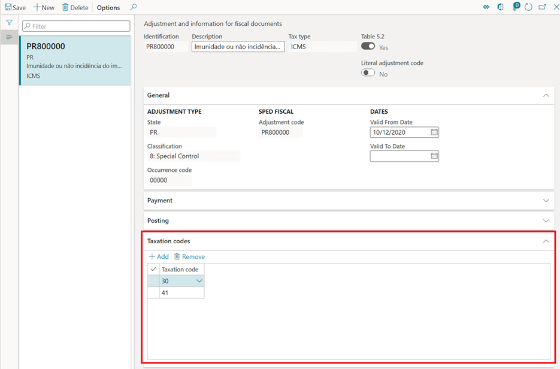
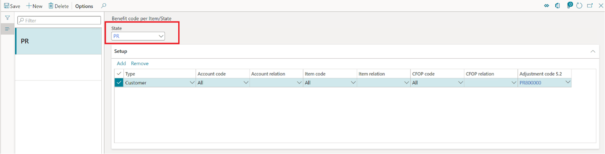

# NT2019.001 - Tax benefits and exemptions rules for NF-e/NFC-e

[!include [banner](../../includes/banner.md)]

NF-e technical note NT2019.001 requires that the description of ICMS tax benefits and exemptions be more accurately enforced when fiscal document models 55 (NF-e) and 65 (NFC-e) are issued.

Specific validation rules have been introduced in the reception services of the NF-e/NFC-e web services. These rules verify the compatibility between the use of benefit codes that are associated with the ICMS tax benefit or exemption, and the taxation code (CST) that is entered in the XML. Verification is completed when the NF-e/NFC-e authorization is requested.

However, the specifications of the technical note leave it to the discretion of the state to adopt the validation rules, and to determine the own compatibility rules between the benefit code and the CST. The state also determines the exception rules when the compatibility check between the benefit code and the CST must be skipped by the reception services of the web services.

For more information about the compatibility rules and exceptions, see the latest version of technical note NT2019.001 in the [NF-e portal](http://www.nfe.fazenda.gov.br/portal/principal.aspx). For more information about the validation rules, see rules N12-85, N12-86, N12-90, N12-94, N12-97, and N12-98 in the same technical note. In the [NF-e portal](http://www.nfe.fazenda.gov.br/portal/principal.aspx), you can also view the additional documentation "TABELA\_cBenef\_X\_CST" (the **cBenef x CST** table), which describes the valid relationship between the benefit code and the CST for each state.

Technical note NT2019.001 also includes detailed information about the adoption of the rules by each state.

> [!NOTE]
> The concept, setup, and use of tax benefits and exemptions in the context of the Brazilian localization aren't in the scope of this article. For more information, see [Brazil tax overview](latam-bra-calculate-taxes.md).

## Feature overview

Through this feature, users will perform the following tasks:

- Add the **\<vICMSDeson\>** and **\<motDesICMS\>** tags to the XML that is generated from scenarios where NF-e/NFC-e are issued.
- Configure the benefit code for ICMS tax benefits and exemptions in accordance with the **cBenef x CST** table.
- Enter the benefit code in the **\<cBenef\>** tag, in accordance with the **cBenef x CST** table.
- Validate the compatibility between the benefit code and the CST, in accordance with the validation rules from technical note NT2019.001 and the **cBenef x CST** table.

## Turn on the technical note feature

> [!NOTE]
> This information applies only to Microsoft Dynamics 365 Finance and Dynamics 365 Supply Chain Management.

1. Go to **Organization administration \> Organizations \> Fiscal establishments \> Fiscal establishments**.
2. Select the fiscal establishment.
3. On the **NF-e and NFC-e federal** FastTab, select **Edit**.
4. In the **NF-e technical notes** section, set the **Enable NF-e technical note** option to **Yes**.
5. In the **NF-e technical notes** field, select **2019.001 v1.40 technical note**.
6. Select **Save**.

> [!IMPORTANT]
> After you select a version that is later than **2019.001 v1.10 technical note** in the **NF-e technical notes** field, the **Types of benefit codes** page (**Tax \> Setup \> Sales tax \> Types of benefit codes**) becomes obsolete and is no longer used.

## Add exempt tags and Validate benefit codes parameters

The following new parameters have been introduced:

- **Add exempt tags** – When this parameter is turned on, the **\<vICMSDeson\>** and **\<motDesICMS\>** tags are added to the XML when the NF-e/NFC-e is issued.
- **Validate benefit code** – When this parameter is turned on, the compatibility between the CST and the ICMS tax benefit or exemption code is validated when fiscal documents are posted.

> [!IMPORTANT]
> When you turn on the **Validate benefit code** parameter, you receive the following message: "Do you want to copy taxation codes from benefit code types to adjustment code for 'XX' state?" This message is shown because a version of the **NT2019.001 v1.10 technical note** feature has been used before, and the types of benefits have already been entered on the **Type of benefits** page. However, you can convert the types of benefits to adjustment codes. If you select **Yes** in the message box, any existing data from the obsolete **Types of benefit codes** page will be converted to records on the **Adjustment and information for fiscal documents** page.

The **Add exempt tags** and **Validate benefit codes** parameters must be set up for the same authority that is configured in the fiscal establishment, and the authority must be from the same state from the fiscal establishment address.

1. Go to **Organization administration \> Organizations \> Electronic fiscal documents \> NF-e federal parameters**.
2. On the **Web services** tab, in the **Authority** field, select the same authority that is configured in the fiscal establishment.
3. On the **States using authority** tab, select or clear the **Add exempt tags** and **Validate benefit codes** check boxes according to the state legislation.

## Set up benefit codes

The benefit codes that are provided by the **cBenef x CST** table must be entered as special adjustment codes in the **Fiscal books** module.

1. Go to **Fiscal books \> Setup \> Tax adjustment codes \> Adjustment and information for fiscal documents**.
2. Select **New** to add an adjustment code, and set the following values:

    - **Tax type:** Select **ICMS**.
    - **Table 5.2:** Set this option to **Yes**.
    - **State:** Select the state of the authority from the **NF-e federal parameters** page.
    - **Classification:** Select **8: Special Control**.
    - **Occurrence code:** Enter the numeric part of the benefit code that is given by the **cBenef x CST** table.
    - **Adjustment code:** This code is formed from the state and the occurrence code. This code should match the benefit code that is given by the **cBenef x CST** table.

Note the following special properties for adjustment codes:

- **Literal adjustment code** – Set this option to **Yes** only in scenarios where you issue electronic fiscal documents models 55 and 65 that have regular taxation that has no benefits or exemptions, when the **cBenef x CST** table requires or allows the adjustment code to be used as a fixed value or a literal word, such as "NULO" or "SEM BENEF," in the **\<cBenef\>** tag.
- **Suppress code** – Set this option to **Yes** only in scenarios where you issue electronic fiscal documents models 55 and 65 that have regular taxation that has no benefits or exemptions, when the **cBenef x CST** table requires or allows the empty **\<cBenef\>** tag to be used.

## Set up Taxation code by benefit code

The Taxation code by benefit code that is given by the **cBenef x CST** table must be entered as an adjustment code in the **Fiscal books** module.

1. Go to **Fiscal books \> Setup \> Tax adjustment codes \> Adjustment and information for fiscal documents**.
2. Select **Add** to enter **Taxation code** for the adjustment code.

## Set up benefit codes by item/state

Follow these steps to set up rules to validate benefit codes by CST for a given state, as described in the **cBenef x CST** table.

1. Go to **Tax \> Setup \> Sales tax \> Benefit code per Item/State**.
2. Select **New**.
3. On the **NF-e federal parameters** page, in the **State** field, select a value.
4. Select **Add** to enter a new relation.

## Validations that are done when fiscal documents are posted

When the **Validate benefit code** parameter is enabled on the **NF-e federal parameters** page, the posting of fiscal documents models 55 and 65 is validated according to the rules that are configured on the **Benefit code per Item/State** page.

The validation occurs for the rules that are configured on the **Benefit code per Item/State** page, for both directions of fiscal documents (inbound and outbound) and both types of issuers (fiscal establishments and third parties).

- When the fiscal document direction is outbound, the configuration of the rules for the state of the authority must be defined on the **Fiscal establishment parameters** page.
- When the fiscal document direction is inbound, and the fiscal document issuer is the fiscal establishment, the configuration of the rules for the state of the authority must also be defined on the **Fiscal establishment parameters** page.
- When the fiscal document direction is inbound, and the fiscal document issuer is a third party, the configuration of the rules must be made at the level of the state of the issuer of the fiscal document.

> [!IMPORTANT]
> For Finance or Supply Chain Management, after KB 4582589, the validation of incoming fiscal documents during posting became obsolete and is no longer completed by default when the fiscal document direction is inbound and the fiscal document issuer is a third party. However, if you must continue to do the validation, the **FiscalDocumentNotSkipBenefitValidationIncomingThirdPartyFlight** feature flighting must be turned on.

## Validation exceptions

Technical note NT2019.001 specifies exception rules that are adopted at the discretion of each state. For more information, see validation rules N12-85, N12-86, N12-90, N12-94, N12-97 and N12-98 in the technical note.

[!INCLUDE[footer-include](../../../includes/footer-banner.md)]
