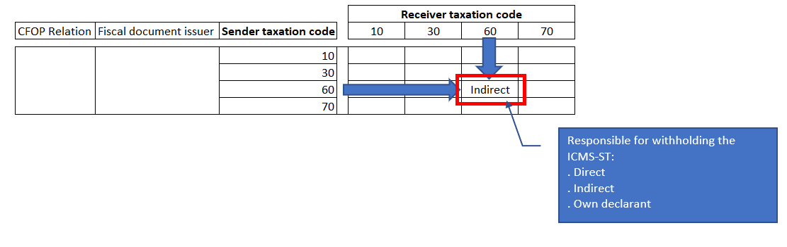
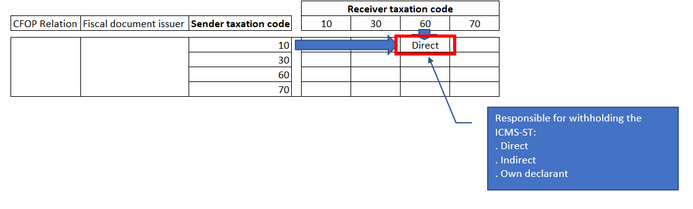

# SPED fiscal 2020 - Complementary information of the ICMS-ST for Sped fiscal 2020 layout 014

[!include [banner](../../includes/banner.md)]

When a company wants to utilize the complement and compensation of the ICMS-ST for the 2020 calendar year, they need to start registering the additional ICMS-ST information during the receipt of electronic fiscal documents model 55 starting January 1, 2020.

For Dynamics 365 Finance only, this feature must be enabled using Feature Management. Complete the following steps to enable this feature.

1. In Finance, on the **Home** dashboard, select **Feature Management**.
3. Search for and select *Complementary information of ICMS-ST*.
4. Select **Enable now**.

When the vendor fiscal document or transfer fiscal document includes a product that is subject to ICMS-ST taxation on the UF (state) of the destination address, and if the receiving fiscal establishment utilizes the complement and compensation of the ICMS-ST, the following attributes of the fiscal document must be entered.

- The party responsible for withholding the ICMS-ST:
		
	- **Direct** - When a third-party or fiscal establishment issuer of the fiscal document is directly responsible for withholding the ICMS-ST for the product that is present in the fiscal document.
	- **Indirect** - When a third-party or fiscal establishment issuer of the fiscal document has already received the product and the ICMS-ST has been withheld from its supply chain.
	- **Own declarant** - When the receiving fiscal establishment is responsible for withholding the ICMS-ST that should have been withheld by the third-party issuer, but was not.
	
- The ICMS-ST collection payment mode:
		
	- **State document of collection** - When the ICMS-ST is withheld through the regular ICMS-ST tax assessment and payment occurs after the end of the transaction period.
	- **GNRE** - When the receiving fiscal document is accompanied by a GNRE that shows the due ICMS-ST was already withheld and paid by the fiscal document issuer when the document was generated.
	
- The ICMS-ST collection payment number: 
	- The number of GNRE used to settle the ICMS-ST payment amount by the fiscal document issuer.

When a fiscal document line that includes a product that is subject to ICMS-ST on the receiving destination, the withholding of the ICMS-ST will be determined by reviewing the taxation code of the ICMS-ST in the receiving fiscal document. This is compared with the equivalent ICMS-ST line in the NF-e XML issued by the sender of the fiscal document.

A default value for the **Responsible for withholding the ICMS-ST** field can be set up by completing the following steps.

1. Go to **Tax** > **Set up** > **Sales tax** > **Responsible for withholding the ICMS-ST**.
2. In the **CFOP Code** field, select **Table**, **Group**, or **All**.
3. In the **CFOP Relation** field, enter the relation defined by the CFOP Code.
4. In the **Fiscal document issuer** field, select **Fiscal establishment** or **Third party** to define the origin of the fiscal document.
5. In the **Receiver taxation code** field, enter the taxation code of the ICMS-ST configured for the receiving fiscal document line where the product is subject to ICMS tax substitution.
6. In the **Sender taxation code** field, enter the taxation code of the ICMS-ST present in the issuer's fiscal document line, where the product is subject to ICMS tax substitution.
7. For a CFOP relation and Fiscal document issuer, and based on the relation between the **Receiver taxation code** and the **Sender taxation code**, in the **Responsible for withholding the ICMS-ST** field, select **Direct**, **Indirect** or **Own declarant**.

The new fields, **Responsible for withholding the ICMS-ST**, **ICMS-ST collection payment mode**, and **ICMS-ST collection payment number** are included on the following pages:

- **Vendor invoices** page on the **Fiscal information** tab.
- **Transfer order** page on the **Fiscal information of receiving** tab.
- **Customer invoice** page on the **Fiscal information** tab. This is only for customer returns.

> [!NOTE]
> During the receipt of a fiscal document, when the ICMS-ST is taxable by using taxation code 10, even though it is entered in the **Responsible for withholding ICMS-ST** field, the financial and costing information is not included in the scope of localization.

[!INCLUDE[footer-include](../../../includes/footer-banner.md)]
