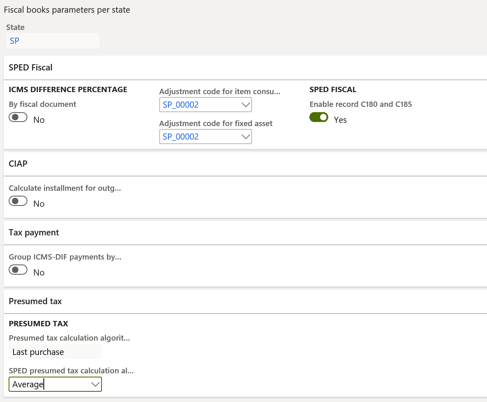
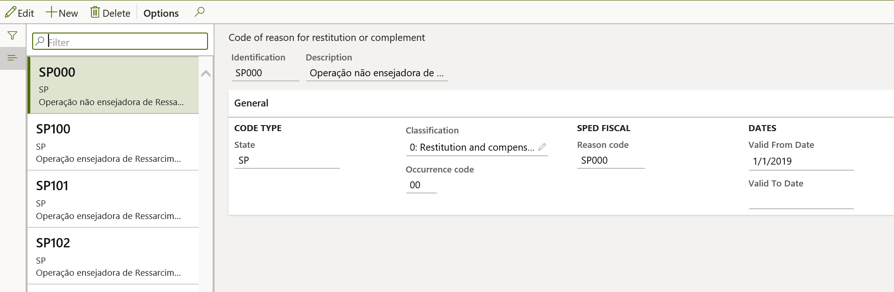
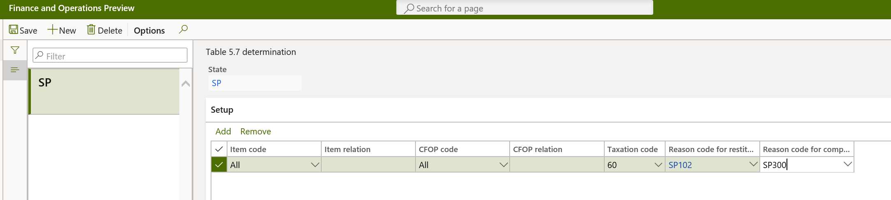

# SPED fiscal ICMS-IPI layout 014 

[!include [banner](../../includes/banner.md)]

This article explains how to set up and generate the SPED fiscal statement layout 014. This layout is applicable as of January 2020 under the practical guide, **EFD-ICMS/IPI – version 3.0.3**.

To view the new layout, go to **Fiscal books** \> **Setup** \> **Tax statements parameters** \> **Sped fiscal** \> **Sped fiscal parameters** \> **Layout version**.

## Record 0002: Classification of fiscal establishment

Record 0002 is generated when the **IND\_ATIV** field of record 0000 is set to **0** (zero), and the classification of the fiscal establishment is configured and assigned. To configure the classification and assign it to the fiscal establishment, go to **Fiscal books** \> **Setup** \> **Tax statements parameters** \> **Sped fiscal** \> **Sped fiscal parameters** \> **Classification**.

If more than one type of classification applies to the fiscal establishment, select the most relevant classification.

## Record C500: Incoming fiscal documents

Record C500 is generated for incoming fiscal document models 6, 66, 29, and 28. The following new fields are included as part of the new layout.

| Number | Field          | Description |
|--------|----------------|-------------|
| 28     | CHV\_DOCe      | If the fiscal document model is 66, the access key of the fiscal document. Otherwise, this field is blank. |
| 29     | FIN\_DOCe      | If the fiscal document model is 66, the fixed value **1**. Otherwise, this field is blank. |
| 30     | CHV\_DOCe\_REF | If the fiscal document model is 66, the access key of the referenced fiscal document, if a referenced fiscal document exists. Otherwise, this field is blank. |
| 31     | IND\_DEST      | The fixed value **1**, because the fiscal establishment is the ICMS taxpayer. |
| 32     | COD\_MUN\_DEST | The IBGE code of the fiscal establishment. |
| 33     | COD\_CTA       | The expense or asset main account posted for the fiscal document |

## Complement and compensation of ICMS-ST tax

The tax authority has introduced records C180, C185, 1010, and 1250 to record details of the operations that are subject to ICMS-ST tax when the company applies the complement and compensation of ICMS-ST tax. Each state will address the generation of these records.

### Prerequisites

Before you enable the generation of records C180, C185, 1010, and 1250, you must enable the calculation of presumed tax. Go to **Organization administration** \> **Setup** \> **Brazilian parameters** \> **Fiscal document**, and turn on the following parameters:
	
- ICMS-ST presumed tax
- ICMS-ST presumed tax in fiscal books

Next, follow these steps to set up the rule that will enable the generation of the records. The rule must be set up for each state.

1. Go to **Fiscal books** \> **Setup** \> **Fiscal books parameters per state**.
2. Select the related state. For example, for São Paulo state, select **SP**.
3. Set the **Enable record C180 and C185** option to **Yes** to generate the related records. In addition to this, instances of record H030 with the **MOT\_INV** field is set to **06**, H005, 1010, 1250, and 1255 will also be generated.
4. In the **SPED presumed tax calculation algorithm** field, select the method of calculation. The amounts that are calculated in the presumed tax process will be reported in record C185.
	
	

### Table 5.7 – Reason code table for complement and restitution

Table 5.7 represents the classification for the complement and restitution (compensation) of ICMS-ST amounts. This table is implemented by each state. To configure it, go to **Fiscal books** \> **Setup** \> **Reason code for complement and restitution**.

After you've finished configuring the reason code table (table 5.7), you must go to **Fiscal books** \> **Setup** \> **Table 5.7 determination** and set up the determination for it by using the following criteria:

- Item code
- CFOP code
- Taxation code

### Record C180

Record C180 is a new record. It introduces complementary information for incoming fiscal document models 01, 1B, 04, and 55 for transactions that include the ICMS-ST tax type. This record is generated based on the following criteria:

- On the **Fiscal books parameters per state** page, the **Enable record C180 and C185** option is set to **Yes**.
- Fiscal document tax transactions have taxation code 10, 30, 60, or 70.

The following fields are included.

| Number | Field                        | Description |
|--------|------------------------------|-------------|
| 1      | REG                          | The fixed value **C180**. |
| 2      | COD\_RESP\_RET               | A code that indicates the person who is responsible for withholding ICMS-ST: **1-Direct sender**, **2-Indirect sender**, or **3-Own declarant**. This classification is available on the fiscal document line. |
| 3      | QUANT\_CONV                  | The quantity of the incoming fiscal document. |
| 4      | UNID                         | The unit of measure of the **QUANT\_CONV** field. |
| 5      | VL\_UNIT\_CONV               | The line amount per unit, based on the unit of measure that is used for the **QUANT\_CONV** field of the incoming fiscal document. |
| 6      | VL\_UNIT\_ICMS\_OP\_CONV     | The ICMS amount per unit of the own operation that the fiscal establishment is entitled to recover (credit), based on the unit of measure that is used for the **QUANT\_CONV** field. The ICMS tax transaction must be defined by using the internal tax rate. |
| 7      | VL\_UNIT\_BC\_ICMS\_ST\_CONV | The base amount of the ICMS-ST per unit, based on the unit of measure that is used for the **QUANT\_CONV** field. |
| 8      | VL\_UNIT\_ICMS\_ST\_CONV     | The ICMS-ST or ICMS-ST presumed tax, including FCP, based on the unit of measure that is used for the **QUANT\_CONV** field. |
| 9      | VL\_UNIT\_FCP\_ST\_CONV      | The ICMS-ST or ICMS-ST presumed FCP amount per unit. |
| 10     | COD\_DA                      | The type of collection document: **0-State document of collection** or **1-GNRE**. This classification is available on the fiscal document line. |
| 11     | NUM\_DA                      | The number of the state collection document. This classification is available on the fiscal document line. |

### Record C185

Record C185 is a new record. It introduces complementary information for outgoing fiscal document models 01, 1B, 04, and 55 for transactions that include ICMS-ST tax type. This record is generated based on the following criteria:

- On the **Fiscal books parameters per state** page, the **Enable record C180 and C185** option is set to **Yes**.
- Fiscal document tax transactions have taxation code 10, 30, 60, or 70.

The following fields are included.

| Number | Field                                  | Description |
|--------|----------------------------------------|-------------|
| 1      | REG                                    | The fixed value **C185**. |
| 2      | NUM\_ITEM                              | The sequence number of the fiscal document item line. |
| 3      | COD\_ITEM                              | The item code of the fiscal document line. |
| 4      | CST\_ICMS                              | The ICMS taxation code. |
| 5      | CFOP                                   | The CFOP code. |
| 6      | COD\_MOT\_REST\_COMPL                  | The reason code for restitution or complement, per table 5.7. |
| 7      | QUANT\_CONV                            | The item quantity. |
| 8      | UNID                                   | The unit of measure. |
| 9      | VL\_UNIT\_CONV                         | The amount of goods per unit. |
| 10     | VL\_UNIT\_ICMS\_NA\_OPERACAO\_CONV     | The ICMS amount per unit. |
| 11     | VL\_UNIT\_ICMS\_OP\_CONV               | The ICMS-ST presumed amount per unit from the incoming fiscal document. |
| 12     | VL\_UNIT\_ICMS\_OP\_ESTOQUE\_CONV      | The average ICMS tax amount per unit in inventory, based on the unit of measure that is used for the **QUANT\_CONV** field. |
| 13     | VL\_UNIT\_ICMS\_ST\_ESTOQUE\_CONV      | The average ICMS-ST tax amount, including FCP ST, of the goods in stock, based on the unit of measure that is used for the **QUANT\_CONV** field. |
| 14     | VL\_UNIT\_FCP\_ICMS\_ST\_ESTOQUE\_CONV | The average of the ICMS-ST FCP per unit of the goods in stock, based on the unit of measure that is used for the **QUANT\_CONV** field. |
| 15     | VL\_UNIT\_ICMS\_ST\_CONV\_REST         | The ICMS-ST amount, including FCP ST, that will be refunded or reimbursed. |
| 16     | VL\_UNIT\_FCP\_ST\_CONV\_REST          | The ICMS-ST FCP amount that makes up the **VL\_UNIT\_ICMS\_ST\_CONV\_REST** field, based on the unit of measure that is used for the **QUANT\_CONV** field. |
| 17     | VL\_UNIT\_ICMS\_ST\_CONV\_COMPL        | The ICMS amount complement, including FCP ST, based on the unit of measure that is used for the **QUANT\_CONV** field. |
| 18     | VL\_UNIT\_FCP\_ST\_CONV\_COMPL         | The ICMS-ST FCP amount that makes up the **VL\_UNIT\_ICMS\_ST\_CONV\_COMPL** field, based on the unit of measure that is used for the **QUANT\_CONV** field. |

> [!NOTE]
> The amounts from fields 10 through 18 are recovered from the ICMS-ST presumed tax calculation in the ICMS-ST tax assessment.

### Record 1010

The following new field is included as part of the new layout.

| Number | Field                           | Description |
|--------|---------------------------------|-------------|
| 14     | IND\_REST\_RESSARC\_COMPL\_ICMS | The fixed value **S** if the generated records, C180 and C185, are enabled on the **Fiscal books parameters per state** page. Otherwise this field is set to **N**. |

### Record 1250

Record 1250 is generated to consolidate information about the balance of the complement or restitution of the ICMS and the ICMS-ST. The following fields are included.

<table>
<tr>
<th>Number</th>
<th>Field</th>
<th>Description</th>
</tr>
<tr>
<td>1</td>
<td>REG</td>
<td>The fixed text <strong>1250</strong>.</td>
</tr>
<tr>
<td>2</td>
<td>VL_CREDITO_ICMS_OP</td>
<td>The sum of instances of record 1255 in the <strong>VL_CREDITO_ICMS_OP_MOT</strong> field.</td>
</tr>
<tr>
<td>3</td>
<td>VL_ICMS_ST_REST</td>
<td>The sum of instances of record 1255 in the <strong>VL_ICMS_ST_REST_MOT</strong> field.</td>
</tr>
<tr>
<td>4</td>
<td>VL_FCP_ST_REST</td>
<td>The sum of instances of record 1255 in the <strong>VL_ICMS_FCP_REST_MOT</strong> field.</td>
</tr>
<tr>
<td>5</td>
<td>VL_ICMS_ST_COMPL</td>
<td>The sum of instances of record 1255 in the <strong>VL_ICMS_ST_COMPL_MOT</strong> field.</td>
</tr>
<tr>
<td>6</td>
<td>VL_FCP_ST_COMPL</td>
<td>The sum of instances of record 1255 in the <strong>VL_FCP_ST_COMPL_MOT</strong> field.</td>
</tr>	
</table>

### Record 1255

Record 1255 is generated to consolidate information about the balance of the complement or restitution of ICMS by reason code (table 5.7). The following fields are included.

| Number | Field                      | Description |
|--------|----------------------------|-------------|
| 1      | REG                        | The fixed text **1255**. |
| 2      | COD\_MOT\_REST\_COMPL      | The reason code for the complement or restitution, per table 5.7. |
| 3      | VL\_CREDITO\_ICMS\_OP\_MOT | The sum of record C185 in the **VL\_UNIT\_ICMS\_OP\_CONV** field × the quantity in the **QUANT\_CONV** field. |
| 4      | VL\_ICMS\_ST\_REST\_MOT    | The sum of record C185 in the **VL\_UNIT\_ICMS\_ST\_CONV\_REST** field × the quantity in the **QUANT\_CONV** field. |
| 5      | VL\_FCP\_ST\_REST\_MOT     | The sum of record C185 in the **VL\_UNIT\_FCP\_ST\_CONV\_REST** field × the quantity in the **QUANT\_CONV** field. |
| 6      | VL\_ICMS\_ST\_COMPL\_MOT   | The sum of record C185 in the **VL\_UNIT\_ICMS\_ST\_CONV\_COMPL** field × the quantity in the **QUANT\_CONV** field. |
| 7      | VL\_FCP\_ST\_COMPL\_MOT    | The sum of record C185 in the **VL\_UNIT\_FCP\_ST\_CONV\_COMPL** field × the quantity in the **QUANT\_CONV** field. |

### Record H030

Record H030 is generated together with records H005 and H010 if control of the complement or restitution of ICMS-ST tax was enabled by setting the **Enable record C180 and C185** option to **Yes** on the **Fiscal books parameters per state** page.

When record H005 is generated, the **MOT\_INV** field is set **6**. Record H010 is generated in the same way if the **MOT\_INV** field isn't set to **6**. 

| Number | Field            | Description |
|--------|------------------|-------------|
| 1      | REG              | The fixed text **H030**. |
| 2      | VL\_ICMS\_OP     | The average amount per unit of the ICMS operations. |
| 3      | VL\_BC\_ICMS\_ST | The average amount per unit of the ICMS-ST base. |
| 4      | VL\_ICMS\_ST     | The average amount per unit of the ICMS-ST tax, including the FCP. |
| 5      | VL\_FCP          | The average amount PER UNIT of the FCP of the ICMS-ST tax. |

## Record G130

Record G130 is generated to identify the fiscal document of CIAP operations. The following new field is included as part of the new layout.

| Number | Field   | Description |
|--------|---------|-------------|
| 9      | NUM\_DA | The number of the state collection document. This classification is available on the fiscal document line. |

## Record G140

Record G140 is generated to identify the fiscal document of CIAP operations. The following new fields are included as part of the new layout.

| Number | Field                   | Description |
|--------|-------------------------|-------------|
| 4      | QTDE                    | The quantity that was applied to the item. This quantity is expressed in the same unit as the incoming fiscal document. |
| 5      | UNID                    | The unit of measure of the incoming fiscal document. |
| 6      | VL\_ICMS\_OP\_APLICADO  | The ICMS amount of the incoming fiscal document. This amount comes from the **ICMS** column of the CIAP assessment. |
| 7      | VL\_ICMS\_ST\_APLICADO  | The ICMS-ST amount of the incoming fiscal document. This amount comes from the **ICMS-ST** column of the CIAP assessment. |
| 8      | VL\_ICMS\_FRT\_APLICADO | The ICMS amount of the incoming fiscal document. This amount comes from the **ICMS on the freight** column of the CIAP assessment. |
| 9      | VL\_ICMS\_DIF\_APLICADO | The ICMS-DIF amount of the incoming fiscal document. This amount comes from the **ICMS-DIF** column of the CIAP assessment. |

[!INCLUDE[footer-include](../../../includes/footer-banner.md)]
