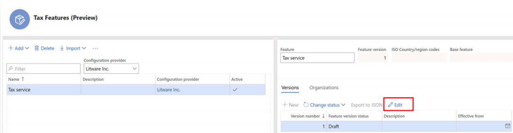
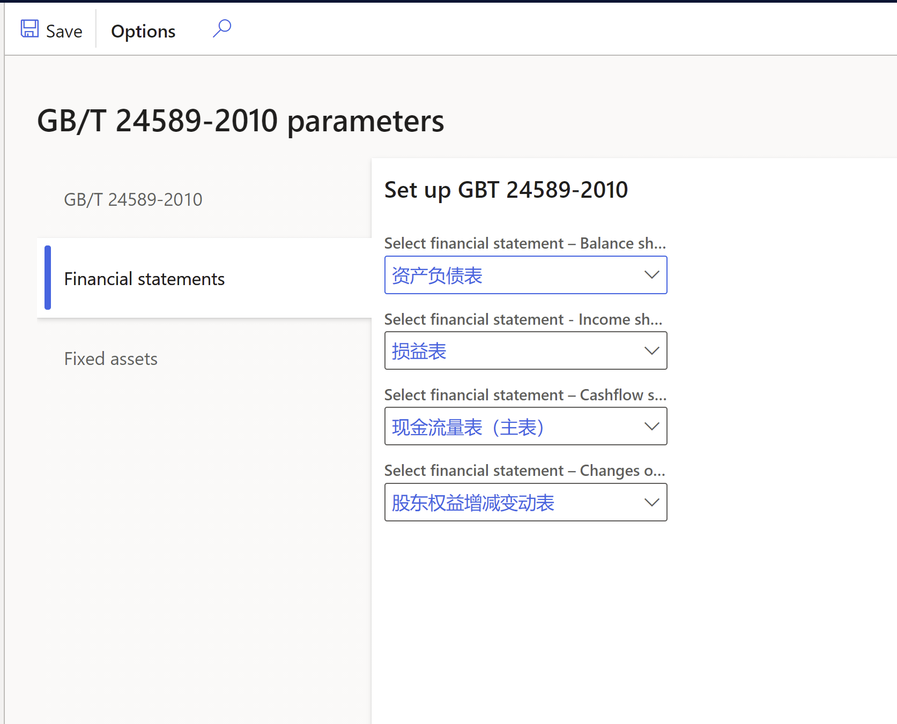
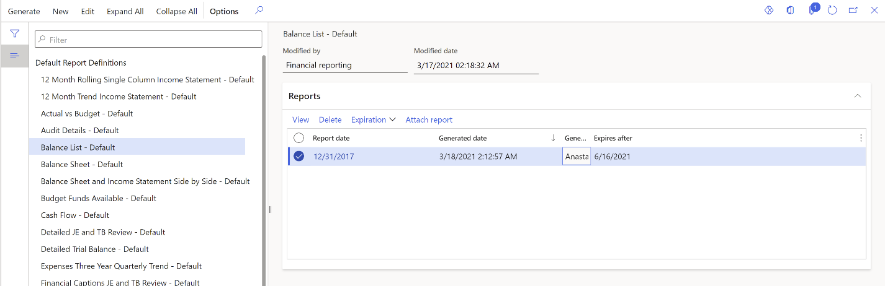
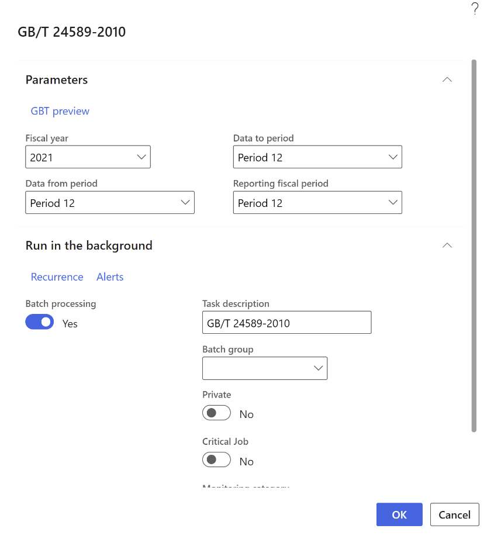

# GB/T 24589-2010 export

[!include [banner](../../includes/banner.md)]

You can use the GB/T 24589-2010 export feature to export accounting data, including master data and transaction data, to several XML files for a specific period. Authorities or auditors can then import the XML files into their system to audit or verify a company's financial results.

Accounting data is exported into the following files:

   - Common master data.xml, which includes 12 data tables.
   - General ledger.xml, which includes 9 data tables.
   - Fixed assets.xml, which includes 11 data tables.

The following table provides more details about the content of each file.

   | **Common.xml** | **General ledger.xml** | **Fixed assets.xml** |
   |-------------------------|-------------------------|-------------------------|
   | 01 E-ledger book | 01 Parameters of chart of accounts | 01 Fixed asset posting profile |
   | 02 Fiscal period | 02 Chart of accounts | 02 Fixed asset group |
   | 03 Voucher types (Chinese vouchers) | 03 Account structures | 03 Fixed asset change types (change history) |
   | 04 Exchange rate | 04 Cash flow | 04 Depreciation methods |
   | 05 Currency | 05 Account balances and net amount; calculated | 05 Fixed asset status |
   | 06 Payment methods | 06 Ledger voucher | 06 Fixed asset cards with financial information |
   | 07 Departments | 07 Cashflow related vouchers (transactions of monetary ledger account) | 07 Fixed asset cards with physical information |
   | 08 Employees | 08 Financial reports: Balance sheet, Profit and loss statement, Cash flow statement, Changes of owner's equity | 08 Fixed asset usage |
   | 09 Vendors | 19 Financial reports contents | 09 Fixed asset disposal - financial information |
   | 10 Customers | N/A  | 10 Fixed asset disposal - physical information |
   | 11, 12 Financial dimensions | N/A  | 11 Fixed asset changes (change history) |

## Enable the feature for batch processing

In the **Feature management** workspace, enable the feature, **(China) GB/T 24589 running in batch.**

## Import electronic reporting configurations

In the **Electronic reporting** workspace, download the **GBT24589-2010 model** and the configurations that are located under the model:

   - **General ledger format (CN)**
   - **Fixed assets format (CN)**
   - **Common master format (CN)**

For more information, see [Download ER configurations from the Global repository of Configuration service](../../../fin-ops-core/dev-itpro/analytics/er-download-configurations-global-repo.md)

## Set up financial reports

To set up financial reports, follow the guidance in [Financial reporting overview](../../general-ledger/financial-reporting-getting-started.md).

You can also complete the following steps to import example reports from the **LCS Shared asset library**.

1. In [LCS](https://lcs.dynamics.com/v2), select the **Shared asset** library, and then select the **Localized financial report** asset type.
2. Download the **China Financial Statements.tdbx** file.
3. Upload the downloaded file in the **Report Designer** following the guidelines in [Import a building block group](../../../fin-ops-core/fin-ops/analytics/financial-report-components.md#import-a-building-block-group).

    The following example reports will be imported.

    | **Report name** | **English translation** |
    |-------------------------|-------------------------|
    | 资产负债表 | Balance sheet |
    | 损益表 | Income statement |
    | 股东权益增减变动表 | Statement of Changes in Shareholders' Equity |
    | 现金流量表 | Cash flow statement |

## Set up GB/T 24589-2010 parameters

To set up GB/T 24589-2010 parameters, complete the following steps.

1. Go to **Organization administration** > **Setup** > **GB/T 24589-2010** to open the **GB/T 24589-2010 parameters** page.
2. On the **GB/T 24589-2010** tab, on the **Model mapping** FastTab, in the **Name** field, select **GBT24589-2010**.

    

3. On the **Financial statements** tab, select the appropriate financial statements in the following fields:

    - **Select financial statement – Balance sheet**
    - **Select financial statement - Income sheet**
    - **Select financial statement – Cashflow sheet**
    - **Select financial statement – Changes of owner's equity**

    

## Generate GB/T 24589-2010

To generate GB/T 24589-2010 parameters, complete the following steps.

### Generate a financial report

1. Go to **General ledger** > **Inquiries and reports** > **Financial reports**.
2. Select one of the financial statements that you selected in the previous procedure and then select **Generate**.

    

3. Select **Clip** to open the attachments. Verify that the system XML file is attached to the report.
4. For any financial statements that you selected on the **GB/T 24589-2010 parameters** page, you can select a line on the **Reports** FastTab, and then select **Attach report** to attach the system XML file to the report if the original file is lost or deleted.

> [!NOTE]
> You don't need to take any actions with the created system XML file. This file is used by the **GB/T 24589-2010** export function as a data source file that contains the result of financial statement calculation.

### Generate GB/T 24589-2010

1. Go to **General ledger** > **Periodic tasks** > **GBT-24589 export**.
2. In the **GB/T 24589-2010** dialog box, select **Fiscal year, Data from period, Data to period,** and **Reporting fiscal period**.

    > [!NOTE]
    > The **GB/T 24589-2010 export** procedure selects the financial statement report line according to the value in **Reporting fiscal period** field. The system XML file content is added into the **GB/T 24589-2010 General ledger.xml** report.

3. On the **Run in the background** FastTab, set **Batch processing** to **Yes** to run the report in batch.
4. Select **OK**.

    

5. Go to **Organization administration &gt; Electronic reporting &gt; Electronic reporting jobs**
6. Select the line and when the job status is marked as **Finished**, select **Show files** to review the generated files.
