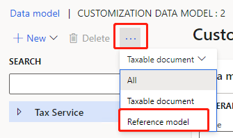
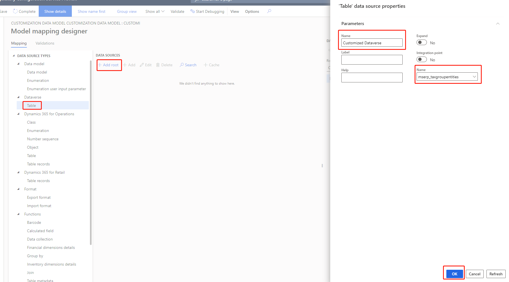

---
# required metadata

title: Customize tax configurations for master data lookup
description: This topic explains how to customize tax configurations to extend master data lookup functionality.
author: kai-cloud
ms.date: 05/20/2021
ms.topic: article
ms.prod: 
ms.technology: 

# optional metadata

ms.search.form:
audience: Application user
# ms.devlang: 
ms.reviewer: kfend
ms.search.scope: Core, Operations
# ms.tgt_pltfrm: 
ms.custom: 
ms.search.region: Global
# ms.search.industry: 
ms.author: pashao
ms.search.validFrom: 2021-04-01
ms.dyn365.ops.version: 10.0.18
---

# Customize tax configurations for master data lookup

[!include [banner](../includes/banner.md)]

Complete the steps in this topic to customize tax configurations to extend master data lookup functionality.

1. In Dynamics 365 Regulatory Configuration Service (RCS), import a tax configuration provided by Microsoft.

   1. Go to Electronic reporting. 
   2. Choose Configuration provider **Microsoft**. 
   3. Click **repositories**. 
   4. Choose **Global** and click **Open**. 
   5. Choose a tax configuration (for example, Tax Calculation Configuration), choose a version in **Versions** tab. 
   6. Click **import**. 

   

   > [!Note]
   >
   > The Dataverse Model Mapping will be imported by default. If you saw warning messages in the configuration import process, you should [Enable Dataverse virtual entities](https://docs.microsoft.com/en-us/dynamics365/fin-ops-core/dev-itpro/power-platform/enable-virtual-entities).

   

2. Create customized data model configuration

   1. Go to **Electronic reporting**. 
   2. Choose data model configuration you want to extend (for example, **Tax Calculation Data Model**). 
   3. Click **Create configuration**. 
   4. Choose **Taxable document model derived from Name: Tax Calculation Data Model, Microsoft**. 
   5. In **Name** field, type in **Customization data model**. 
   6. Click **Create configuration.** 

3. Create customized reference models

   1. Select **Customization data model**.

   2. Click **Designer**.

   3. Click button **...** and select the **Reference model** view.

      

   4. Create the customized reference model. Customized model is root model. Customized entity is Record list. Customized field is string field you want to use in lookup. You can add more on demand.

   5. Click button **...** and select the **Taxable document** view.

   6. Choose the attribute you want to bind the customized reference model. Take **Customized attribute** as an example,

      1. Click **Select reference model**.

      2. Select **Customized model**, click **OK**. The reference model name will be updated to the **Natural key** field.

         

      3. **Save** the configuration and click **Complete**.

4. Create customized model mapping configuration

   1. Go to **Electronic reporting**. 

   2. Choose model mapping configuration named **Dataverse model mapping**. Set **Default for model mapping** as **No**. 

   3. Click **Create configuration**. 

   4. Choose Taxable document model mapping derived from Name: Dataverse Model Mapping, Microsoft. 

   5. In **Name** field, type in **Customization model mapping**. 

   6. In **Target model** field, select the data model **Customization data model**. 

   7. Click **Create configuration**.

      

   8. Select the **Customization model mapping** and set **Connected application** as the one you created above.

   9. Set **Default for model mapping** as **Yes**.

5. Create customized model mappings

   1. Select **Customization model mapping**. 
   2. Click **Designer**.
   3. Select **Customization Model**.

6. Map model mapping to Dataverse entity

   1. In **Model mapping designer**, select **Customization Model** and click **Designer**.

   2. In **data source types**, choose Dataverse Table.

   3. In **data sources**, click **+Add root**.

   4. In **Name** field, type in Customized Dataverse.

   5. In **Name** field, choose an entity.

   6. Click **OK**.

      

   7. Select **Customized Dataverse** and **Customized entity**, click **Bind**.

      

   8. Select a field under **Customized Dataverse** and **Customized field**, click **Bind**.

      

   9. Click **save** and complete **Customization model mapping**

7. Create customized tax configuration

   1. Go to **Electronic reporting**.

   2. Select **Tax Configuration - Europe** and click **Create configuration**.

   3. Select **Tax service configuration derived from Name: Tax Calculation Configuration, Microsoft**.

   4. In **Name** field, type in Customization configuration.

   5. Click **Create configuration**.

   6. Select the **Customization configuration** and click **Designer**.

   7. In **Data model** field, choose **Customization data model**.

   8. In **Data model version** field, choose the corresponding one.

      

   9. Click **Complete**.

[!INCLUDE[footer-include](../../includes/footer-banner.md)]
