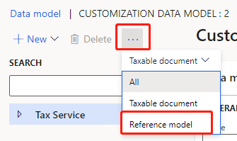
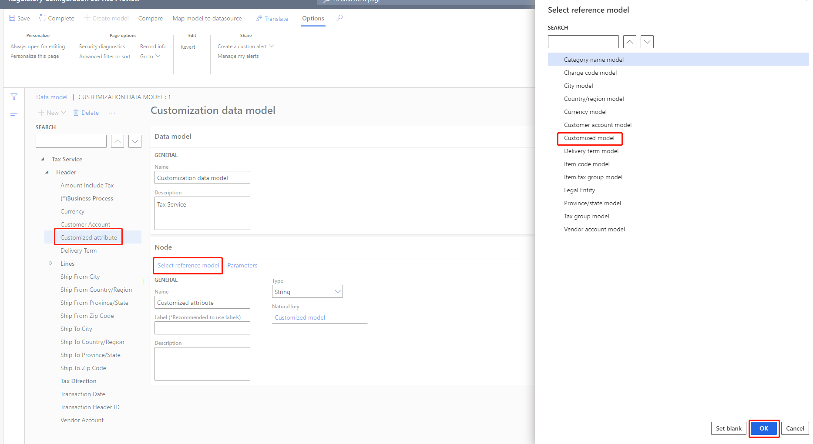
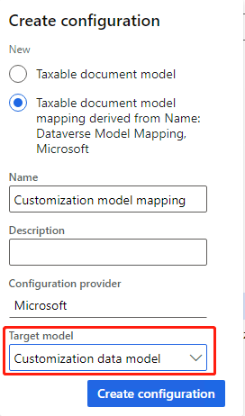
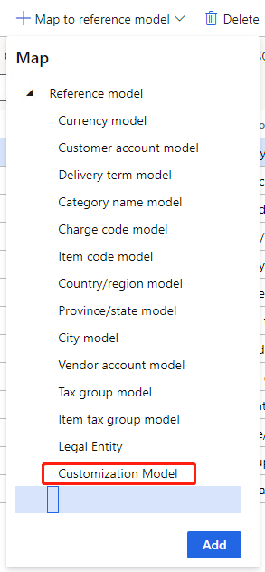
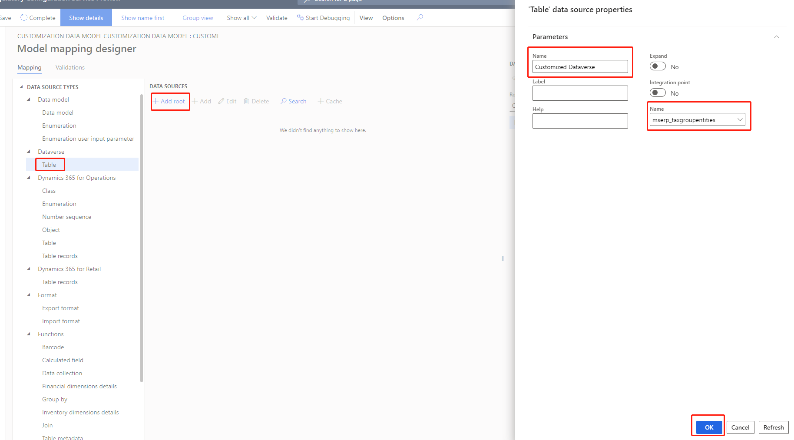
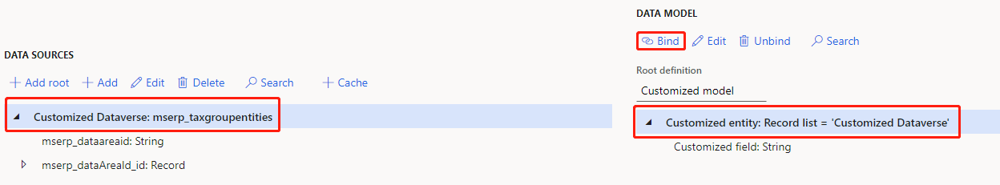
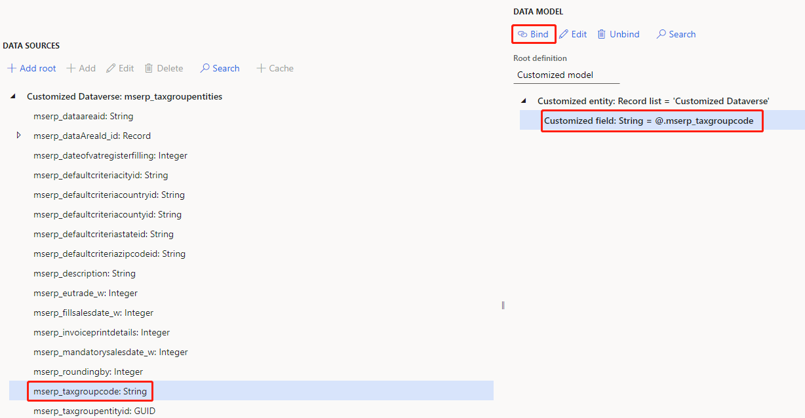
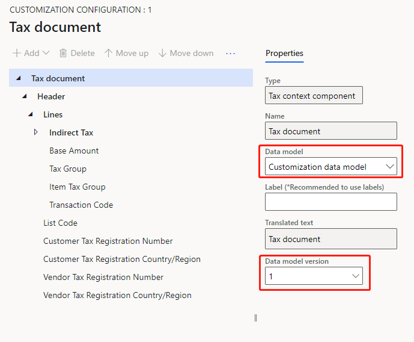

---
# required metadata

title: Customize tax configurations for master data lookup
description: This topic explains how to customize tax configurations to extend master data lookup functionality.
author: kai-cloud
ms.date: 10/28/2021
ms.topic: article
ms.prod: 
ms.technology: 

# optional metadata

ms.search.form:
audience: Application user
# ms.devlang: 
ms.reviewer: kfend
ms.search.scope: Core, Operations
# ms.tgt_pltfrm: 
ms.custom: 
ms.search.region: Global
# ms.search.industry: 
ms.author: pashao
ms.search.validFrom: 2021-04-01
ms.dyn365.ops.version: 10.0.18
---

# Customize tax configurations for master data lookup

[!include [banner](../includes/banner.md)]

Follow the steps in this topic to customize tax configurations to extend master data lookup functionality.

## Import a tax configuration provided by Microsoft

1. In Regulatory Configuration Service (RCS), in the **Electronic reporting** workspace, select the **Microsoft** configuration provider.
2. Select **Repositories**.
3. Select **Global**, and then select **Open**.
4. Select a tax configuration, such as **Tax Calculation Configuration**, and then, on the **Versions** tab, select a version.
5. Select **Import**.

> [!NOTE]
> By default, the Dataverse model mapping is imported. If you receive warning messages during the configuration import process, enable the virtual entities in Dataverse. For more information, see [Enable Dataverse virtual entities](../../fin-ops-core/dev-itpro/power-platform/enable-virtual-entities.md).

## Create a customized data model configuration

1. In the **Electronic reporting** workspace, select **Tax configurations**, and then select the data model configuration to extend. For example, select **Tax Calculation Data Model**.
2. Select **Create configuration**.
3. Select **Taxable document model derived from Name: Tax Calculation Data Model, Microsoft**.
4. In the **Name** field, enter **Customization data model**.
5. Select **Create configuration**.

## Create customized reference models

1. On the **Tax configurations** page, select **Customization data model**, and then select **Designer**.
2. Select the ellipsis button (**...**), and then select the **Reference model** view.

    

3. Create the customized reference model. The customized model is a root model. The customized entity is a record list. The customized field is a string field that you want to use in the lookup. You can add more fields as you require.
4. Select the ellipsis button (**...**), and then select the **Taxable document** view.
5. Select the attribute to bind to the customized reference model. For example, select **Customized attribute**, and then follow these steps:

    1. Select **Select reference model**.
    2. Select **Customized model**, and then select **OK**. The reference model name is updated to the value of the **Natural key** field.

        

    3. Select **Save**, and then select **Complete**.

## Create a customized model mapping configuration

1. In the **Electronic reporting** workspace, select **Tax configurations**, and then select the **Dataverse model mapping** configuration.
2. In the **Default for model mapping** field, select **No**.
3. Select **Create configuration**.
4. Select **Taxable document model mapping derived from Name: Dataverse Model Mapping, Microsoft**.
5. In the **Name** field, enter **Customization model mapping**.
6. In the **Target model** field, select the **Customization data model** data model.
7. Select **Create configuration**.

    

8. Select **Customization model mapping**, and set the **Connected application** field to the connection that was created in step 8 in [Set up an environment for master data lookup](tax-service-set-up-environment-master-data-lookup.md).
9. Set the **Default for model mapping** field to **Yes**.

## Create customized model mappings

1. On the **Tax configurations** page, select **Customization model mapping**.
2. Select **Designer**, and then select **Customization Model**.

    

## Map a model mapping to a Dataverse entity

1. On the **Model mapping designer** page, select **Customization Model**, and then select **Designer**.
2. In the **Data source types** tree, select **Dataverse Table**.
3. On the **Data sources** tab, select **Add root**.
4. In the **Name** field, enter **Customized Dataverse**.
5. In the second **Name** field, select an entity.
6. Select **OK**.

    

7. Select **Customized Dataverse** and **Customized entity**, and then select **Bind**.

    

8. Under **Customized Dataverse** and **Customized field**, select a field, and then select **Bind**.

    

9. Select **Save**, and then select **Complete**.

## Create a customized tax configuration

1. In the **Electronic reporting** workspace, select **Tax configurations**, and then select **Tax Calculation Configuration**.
2. Select **Create configuration**.
3. Select **Tax service configuration derived from Name: Tax Calculation Configuration, Microsoft**.
4. In the **Name** field, enter **Customization configuration**.
5. Select **Create configuration**.
6. Select **Customization configuration**, and then select **Designer**.
7. In the **Data model** field, select **Customization data model**.
8. In the **Data model version** field, select the corresponding data model version.

    

9. Select **Complete**.

[!INCLUDE[footer-include](../../includes/footer-banner.md)]
