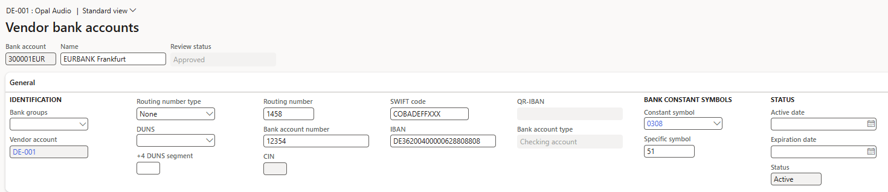
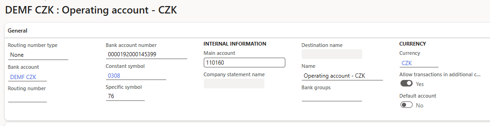
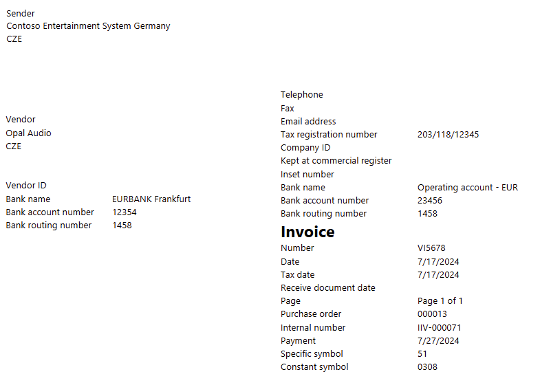

# Bank symbols for bank accounts

[!include [banner](../../includes/banner.md)]

Constant symbols are set up for bank accounts, and then used on sales orders, purchase orders, customer and vendor invoices, and free text invoices.

To set up a list of constant symbols for bank accounts, use the **Bank constant symbols** page (**Cash and bank management** \> **Setup** \> **Constant symbols**). 

 

The constant symbol that you set up for a bank account is copied to sales orders, customer and vendor invoices, and free text invoices.

> [!NOTE]
> When you also set up or add a **specific** symbol for a bank account, both the **constant symbol** and **specific symbol** are shown on the Vendor invoice printout.

[!INCLUDE[footer-include](../../../includes/footer-banner.md)]
