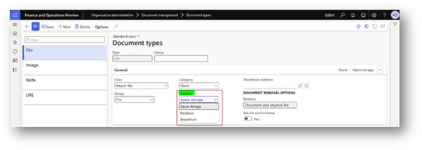
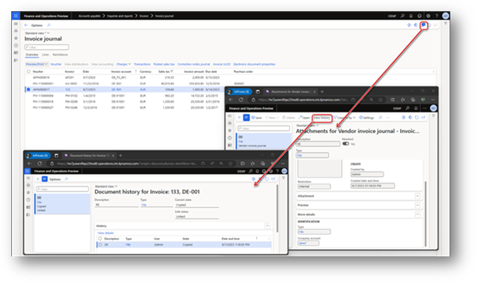

# Dynamics 365 Finance - a digital standard bookkeeping system registered in Denmark

In May 2022, Denmark updated its bookkeeping law, replacing the 1999 act. This new law, known as the [Danish Bookkeeping Act, no. 700 of 24 May 2022](https://go.microsoft.com/fwlink/?linkid=2259403) (the "Act"), and any issued Executive Orders, govern the bookkeeping responsibilities for commercial enterprises in Denmark, including foreign companies operating there and digital bookkeeping system providers. The law's primary purpose is to prevent tax fraud and promote digital accounting. 

Dynamics 365 Finance, a cloud-based business management solution, is approved by the Danish Business Authority (Erhvervsstyrelsen) ("DBA") as a registered digital standard bookkeeping system in Denmark. It was registered under section 4 of [Executive Order no. 98 of January 26, 2023](https://go.microsoft.com/fwlink/?linkid=2259402), with registration number **fob314877**. The Danish Business Authority publishes a list of all registered digital standard bookkeeping systems on their website. For more information, see [List of registered accounting systems](https://go.microsoft.com/fwlink/?linkid=2259706).

> [!IMPORTANT]
> Customizing your cloud-based Dynamics 365 Finance may affect its classification as a digital standard bookkeeping system in Denmark. Such changes are not covered by its registration.

> [!NOTE]
> This document explains how Dynamics 365 Finance supports the DBA's certification requirements. However, it is not the official certificate for Dynamics 365 Finance.

> [!IMPORTANT]
> To use Dynamics 365 Finance as a digital standard bookkeeping system in Denmark, you must **connect to Dataverse** by setting up Power Platform integration for the environment in Microsoft Dynamics Lifecycle Services.
> For set up instructions, see [Connect finance and operations apps with a new Microsoft Dataverse instance](../../../fin-ops-core/dev-itpro/power-platform/environment-lifecycle-connect-finops-new-dv.md).

## How Dynamics 365 Finance supports digital bookkeeping requirements

This section describes the requirements for digital standard bookkeeping systems under the Act and how Dynamics 365 Finance supports these requirements. 

Per section 15 of Chapter 5 of the Act, a digital bookkeeping system must: 

1.	Support ongoing recording of the company's transactions with an indication of receipts for each record and secure storage of records and receipts for 5 years. 
2.	Meet recognized standards for IT security, including user and access management, and ensure automatic backup of records and receipts.
3.	Support the automation of administrative processes, including automatic distribution and receipt of e-invoices and the option of accounting in accordance with a public standard chart of accounts in registered bookkeeping systems. 

### 1. Support ongoing recording of the company's transactions with an indication of receipts for each record and secure storage of records and receipts for 5 years. 

These requirements are described in sections 1–4 of Annex 1 to [Executive Order 97 26/01/2023](https://go.microsoft.com/fwlink/?linkid=2257947). 

#### Information when bookkeeping the company's transactions (Annex 1, 1, a–e)

##### Requirement 

The standard digital bookkeeping system must contain fields for the company to provide information on the following matters when recording each individual transaction: 

<ul>
  a.	Transaction date (e.g., payment date, purchase date, etc.),  
  b.	Amount, 
  c.	Receipt number, 
  d.	Transaction text, and 
  e.	Exchange rate on the day of the transaction or other conversion factor if registration is made in a currency other than DKK. 
</ul>

##### Supported scope 

Transactions entered in Dynamics 365 Finance contain a transaction date, amount, receipt number/voucher number/document number, transaction text/description, and exchange rates. 

For more information, see [View journal entries and transactions](../../../finance/general-ledger/view-journal-entries-transactions.md). 

#### Ensuring audit trails for the company's recorded transactions (Annex 1, 2, a–e) 

##### Requirement 

The digital standard bookkeeping system must ensure that: 

<ul>
  a.	the system assigns a registration date for each recorded transaction,  
  b.	the system assigns a consecutive transaction number or ID for each recorded transaction,  
  c.	the system assigns initials or similar to the person who has recorded a transaction,  
  d.	the system saves changes to the recording, for example, in that incorrect entries must be corrected with new entries, and  
  e.	recorded transactions cannot be changed, backdated, or deleted. 
</ul>

##### Supported scope 

An audit trail record is created for every transaction upon posting that registers the Created Date and Created by user ID. For each audit trail record, you can also view the Created ID, which is a system-assigned ENUM. The voucher for each record is also available through the **Voucher transactions** button. The voucher number is set up through the number sequence framework, which allows each number sequence to be defined as consecutive. 

During the posting process, a journal number is assigned to each accounting entry. This is not the same as the voucher number. Validation was added to the journal number, for any legal entity that has Denmark as its country context, to ensure the number sequence assigned to the journal number is sequential. This validation is done when assigning the number sequence in general ledger parameters, and during the posting process. 

When a transaction is posted, it cannot be edited or deleted after posting. Corrections to the transaction must be made through a reversing entry and then a new entry to register the changes. For the accounting entry that corresponds to each transaction, only internal data can be edited. The accounting description and tags values assigned to the accounting entries are the only internal data that can be modified after posting. Usage of this feature can be allowed or prevented through security. If editing of internal data is allowed, a full audit trail of each change is maintained. The audit trail tracks the original value and new value, the person who made the change, and when the change was made. 

For more information, see: 

+ [General journal processing](../../../finance/general-ledger/general-journal-processing.md),
+ [Allow edits to internal data on general ledger vouchers](../../../finance/general-ledger/allow-edits-internal-data-gl-vouchers.md).

#### Storage of receipts covered by section 3 (Annex 1, 3, a–b) 

The digital standard bookkeeping system must support the storage of receipts covered by section 3, which documents the company's recorded purchase and sale transactions so that: 

##### Requirement 

<ul>
  a.	receipts relating to purchase transactions can be stored digitally in the system, and  
  b.	receipts relating to sales transactions are either automatically generated in the system and stored digitally or can be stored digitally in the system, for example, as an image or a scanned file. 
</ul>

##### Supported scope 

Dynamics 365 Finance supports the storage of files as attachments to purchase and sales invoices, as well as any other record of a table that is accessible by users of Dynamics 365 Finance via the user interface. The document management functionality in Dynamics 365 Finance supports the requirements of Annex 1, 3, a–b. 

Dynamics 365 Finance users with the system administrator role can define the location where attachments will be stored: Azure storage, database, SharePoint. By default, attachments are stored in Azure Blob storage. 

Document management appears to users as the **Attach** button at the top of most pages that contain data. When the admin selects the **Attach** button (or uses the keyboard shortcut `Ctrl+Shift+A`), the **Attachments** page opens, reflecting the data source of the currently selected control on the page. This page displays all attachments linked to the relevant data source. 

When an invoice is posted, its attachment cannot be deleted from the user interface. 

For more information about the document management functionality and document attachment history, see [Configure document management](../../../fin-ops-core/dev-itpro/organization-administration/configure-document-management.md). 

#### Storage of the company's recorded transactions and receipts covered by section 3 for 5 years (Annex 1, 4, a–d) 

##### Requirement 

The digital standard bookkeeping system must support the storage of the company's recorded transactions and receipts covered by section 3 for 5 years from the end of the financial year the material concerns. 

The digital standard bookkeeping system must support that: 

<ul>
  a.	recorded transactions are preserved so that they cannot be changed, backdated, or deleted by the company,  
  b.	all recorded transactions are stored in a structured and machine-readable format for 5 years from the end of the financial year the recorded transaction relates to, regardless of any termination of customer relations with the company or the company's bankruptcy or forced dissolution,  
  c.	all receipts covered by section 3 are kept for 5 years from the end of the financial year that the receipt concerns, regardless of any termination of customer relations with the company or the company's bankruptcy or forced dissolution, and  
  d.	encrypted bookkeeping data can be decrypted into a structured and machine-readable format and that encrypted receipts covered by section 3 can be decrypted into a readable format. 
</ul>

The storage obligation according to letters b and c applies if the company, in connection with switching to a new digital standard bookkeeping system from another provider, has transferred all recorded transactions and receipts to this. 

##### Supported scope 

Dynamics 365 Finance supports storage of the company's recorded transactions. Transactional records cannot be deleted or modified via the user interface of Dynamics 365 Finance. Dynamics 365 Finance also prevents backdating recorded transactions, meaning the posted transaction date cannot be changed. Dynamics 365 Finance allows users to post transactions from previous periods (day, week, month). It also records the date and time when these transactions are posted. Dynamics 365 Finance users can attach files to records in the system. 

By using Dynamics 365 Finance, the company agrees that Microsoft can store its recorded transactions and receipts for 5 years from the end of the financial year concerning such material. This applies even if the company changes their bookkeeping system, goes bankrupt, or is liquidated. The data will be stored in a Microsoft-managed storage, either in the same location as the primary computer equipment or in the European Union. In addition, Microsoft will disclose the company's recorded transactions and receipts to Danish authorities as required by the Act. Microsoft will delete this data after the 5-year retention period required by the Act. 

For more information, see the [Microsoft Dynamics 365 Service Specific Terms in the Microsoft Product Terms](https://www.microsoft.com/licensing/terms/productoffering/MicrosoftDynamics365Services/EAEAS).

> [!NOTE]
> Customers may enable [Customer-managed key](/azure/azure-monitor/logs/customer-managed-keys?tabs=portal) (CMK) and/or [Customer Lockbox](../../../fin-ops-core/dev-itpro/sysadmin/customer-lockbox.md) on their Dynamics 365 Finance environment. However, this does not prevent Microsoft from copying, storing, and retaining their recorded transactions and receipts as required by the Act. 

### 2. Meet recognized standards for IT security, including user and access management, and ensure automatic backup of records and receipts.

##### Requirement 

These requirements are described in section 8 of [Executive Order 97 26/01/2023](https://go.microsoft.com/fwlink/?linkid=2257947). 

##### Supported scope 

Dynamics 365 Finance meets these IT security requirements as it is covered by ISO/IEC 27001. For more information, see [ISO/IEC 27001 Information Security Management Standards](/compliance/regulatory/offering-iso-27001). 

### 3. Support the automation of administrative processes, including automatic distribution and receipt of e-invoices and the option of accounting in accordance with a public standard chart of accounts in registered bookkeeping systems.

These requirements are described in sections 1–9 of Annex 2 to [Executive order 97 26/01/2023](https://go.microsoft.com/fwlink/?linkid=2257947). 

#### Support the automatic sending and receiving of e-invoices in OIOUBL and Peppol BIS formats (Annex 2, 1, a–e and Annex 2, 2, f–k) 

##### Requirement 

The digital standard bookkeeping system supports the automatic sending and receiving of e-invoices via NemHandel in OIOUBL format in the following way:

<ul>
  a.	the customer can send electronic invoices in OIOUBL format,  
  b.	the customer can receive electronic invoices in OIOUBL format,  
  c.	the customer can send electronic credit notes in OIOUBL format,  
  d.	the customer can receive electronic credit notes in OIOUBL format, and  
  e.	the customer can send an application response upon receipt of an electronic invoice. 
</ul>

The digital standard bookkeeping system supports the automatic sending and receiving of e-invoices in Peppol BIS format in the following way: 

<ul>
  f.	the customer can send electronic invoices in Peppol BIS format,  
  g.	the customer can receive electronic invoices in Peppol BIS format,  
  h.	the customer can send electronic credit notes in Peppol BIS format,  
  i.	the customer can receive electronic credit notes in Peppol BIS format,  
  j.	the customer can send a message-level response upon receipt of an electronic invoice, and  
  k.	the customer can send an invoice response upon receipt of an electronic invoice. 
</ul>

##### Supported scope 

Dynamics 365 Finance allows customers to generate and send electronic versions of business documents, such as invoices or credit notes, in either OIOUBL or PEPPOL format. These can be delivered through the Danish NemHandel system or the PEPPOL Delivery Network using API communication with a service provider. 

In addition, Dynamics 365 Finance can automatically import incoming electronic documents, like vendor invoices or vendor credit notes, received in either OIOUBL or PEPPOL format. 

Furthermore, for documents received in the OIOUBL format, Dynamics 365 Finance can send application responses. For those received in the PEPPOL format, it can send message-level responses about the reception acknowledgement and invoice-level responses about the acceptance decision. 

For more information, see [Get started with Electronic invoicing for Denmark](../../../finance/localizations/denmark/e-invoicing-dk-get-started.md). 

#### Support the possibility of reconciling the company's bookkeeping with the company's bank account (Annex 2, 3, a–c and d–e) 

##### Requirement (Annex 2, 3, a–c) 

The digital standard bookkeeping system supports the possibility of reconciling the company's bookkeeping with the company's bank account in at least one of the following ways: 

<ul>
  a.	the company importing a CSV file with bank entries into the bookkeeping system.  
  b.	the bookkeeping system automatically retrieving bank entries via integration to the company's bank.  
  c.	the bookkeeping system automatically retrieving bank entries via PSD2 services.
</ul>

##### Supported scope (Annex 2, 3, a–c) 

Dynamics 365 Finance supports requirement Annex 2, 3, a by providing a comprehensive solution for digital standard bookkeeping. It allows companies to reconcile its book with its bank account. 

Dynamics 365 Finance also supports advanced bank reconciliation, allowing companies to import electronic bank statements in different formats and automatically reconcile them with the bank transactions in the system. 

For more information, please see: 

+	[Advanced bank reconciliation overview](../../../finance/cash-bank-management/advanced-bank-reconciliation-overview.md), 
+	[Set up advanced bank reconciliation import by using Electronic reporting](../../../finance/accounts-payable/import-bai2-er.md). 

##### Requirement (Annex 2, 3, d–e)

The bookkeeping system supports, apart from letter a, b, or c, the possibility of reconciling the company's bookkeeping with the company's bank account by: 

<ul>
  d.	the bookkeeping system ensuring that the bank account is represented in the chart of accounts and that it can be reconciled with the loaded bank entries, and  
  e.	a clear difference being shown in the bookkeeping system if items entered from the bank are not reconciled. 
</ul>

##### Supported scope (Annex 2, 3, d–e)

In Dynamics 365 Finance, users can set up company bank accounts to monitor their banking transactions. Each bank account is linked to a main account in the chart of accounts. When a company bank account is used in a payment transaction, entries are automatically created in both the banking transaction and the linked main account. 

Dynamics 365 Finance provides advanced bank reconciliation to ensure that the bank transactions in the bookkeeping system match the external account at the bank. This feature compares and matches entries in the user-configured bank accounts in Dynamics 365 Finance with the transactions at their bank. Bank reconciliation is a practical way to identify and resolve missing payments and bookkeeping errors. 

The advanced bank reconciliation feature pages for "Unmatched transactions" and "Matched transactions" clearly display reconciled and unreconciled entries. Any items from the bank that are not reconciled will appear on the "Unmatched transactions" page. 

Read more about advanced bank reconciliation in Dynamics 365 Finance:

+	[Advanced bank reconciliation overview](../../../finance/cash-bank-management/advanced-bank-reconciliation-overview.md) 
+	[Advanced bank reconciliation setup process](../../../finance/cash-bank-management/configure-advanced-bank-reconciliation.md) 
+	[Reconcile bank statements by using advanced bank reconciliation](../../../finance/cash-bank-management/reconcile-bank-statements-advanced-bank-reconciliation.md)

#### Support the possibility of using a public standard chart of accounts (Annex 2, 4, a–d) 

##### Requirement

The digital standard bookkeeping system supports the possibility of using a public standard chart of accounts by: 

<ul>
  a.	the company using the public standard chart of accounts directly in the bookkeeping system,  
  b.	mapping the bookkeeping system's standard chart of accounts to the public standard chart of accounts, or  
  c.	the bookkeeping system providing a tool that enables the customer to map their own chart of accounts to the common public standard chart of accounts in a simple way. 
</ul>

The bookkeeping system supports, in addition to point a, b, or c above, the possibility of using a public standard chart of accounts by: 

<ul>
  d.	the bookkeeping system providing a tool that enables the customer to map to standard VAT codes in a simple way.
</ul>

##### Supported scope

In Dynamics 365 Finance, the company can create and share multiple charts of accounts. A shared chart of accounts can be used by multiple legal entities, but each entity can only be assigned one chart of accounts. The chart of accounts for a legal entity is set up on the Ledger page. 

If a company's chart of accounts does not use the Danish public standard chart of accounts, it can use the [consolidation account groups and additional consolidation accounts](../../../finance/budgeting/consolidation-account-groups-consolidation-accounts.md) features to establish this connection. 

Dynamics 365 Finance provides a user interface to map VAT codes from tax transactions to standard VAT codes. This simplifies the reporting process for Standard Audit File for Tax (SAF-T). 

For more information, see: 

+	[Plan your local chart of accounts](../../../finance/general-ledger/plan-local-chart-of-accounts.md),
+	[Plan your chart of accounts](../../../finance/general-ledger/plan-chart-of-accounts.md). 

#### Support correct bookkeeping through the bookkeeping guide or accounting guide (Annex 2, 5, a–c) 

##### Requirement

The digital standard bookkeeping system supports correct bookkeeping through the bookkeeping guide or accounting guide via: 

<ul>
  a.	a bookkeeping wizard/assistant having been incorporated into the bookkeeping system to help the company record,  
  b.	the bookkeeping system containing accounting instructions and/or linking/referring to accounting instructions/guides from third parties, or  
  c.	the bookkeeping system having to support the function that users can enter an accounting guide for the individual account. 
</ul>

##### Supported scope

**Task recorder** for Dynamics 365 Finance is a utility that lets companies record actions taken in the product user interface (UI). It captures all server-executed events, including adding values, changing settings, and removing data. These recorded steps are collectively called a task recording. Task recordings can be used in several ways: 

+	They can be played as task guides, which are part of the Help experience. A task guide is a step-by-step, interactive guide through a business process. Users are guided through each step with a pop-up prompt, or "bubble," that points to the UI element to interact with and provides instructions on how to do so, such as "Click here" or "In this field, enter a value." A task guide uses the user's current data set, and any data entered is saved in the user's environment. 
+	Task recordings can be saved as Word documents, making it easy to create printable training guides. 

Users have the option to create their own task recordings, use task recordings provided by Microsoft, or modify Microsoft's task recordings to reflect your configurations.

For more information, see [Task recorder resources](../../../fin-ops-core/dev-itpro/user-interface/task-recorder.md?context=%2Fdynamics365%2Fcontext%2Ffinance). 

#### Support the sharing of the company's bookkeeping data (Annex 2, 6, a–c)

##### Requirement

The digital standard bookkeeping system supports the sharing of the company's bookkeeping data by the bookkeeping system: 

<ul>
  a.	making it possible to generate a standard file, as defined by the authorities on the DBA's website located at [www.erst.dk](https://erhvervsstyrelsen.dk/),  
  b.	exporting a standard file, as defined by the authorities, to another provider of bookkeeping systems, and  
  c.	loading the information included in a standard file defined by the authorities so that it is available to the customer. 
</ul>

##### Supported scope

Dynamics 365 Finance supports generation of the Standard Audit File for Tax (SAF-T) in XML format. This was introduced by the Act and follows the schema defined by "Danish SAF-T Financial data, version 1.0," published by Erhvervsstyrelsen in November 2022. 

The Dynamics 365 Finance solution for SAF-T includes data source mapping for the following data: 

| **SAF-T section** | **SAF-T elements** |
|-------------------|----------------------|
| MasterFiles | •	GeneralLedgerAccounts – General ledger.  •		Customers – Purchasers and other debtors.  •	Suppliers – Suppliers and other creditors.  •	TaxTable – Tax type tables that are used in the legal entity's accounting system. Examples include value-added tax (VAT), corporate income tax, and excise taxes.  •	UOMTable – Table for units of measurement.  •	AnalysisTypeTable – Data tables for analytical accounting. This data is used to provide details of transaction data. Examples include unit costs, additional costs, a cost center, or a project.  •	MovementTypeTable – Stock movement types.  •	Products – Products and services.  •	PhysicalStock – Data about the stock that is contained in the file. |
| GeneralLedgerEntries | •	GeneralLedgerEntries – General ledger entries. |
| SourceDocuments | •	Sales invoices – Initial sales documents.  •	PurchaseInvoices – Accounting documents for purchases and acquisitions.  •	Payments – Payments.  •	MovementOfGoods – Information about the movement of goods. For example, movement occurs when goods are recorded, when goods are written off after they are sold or used in production, and when finished products, determined loss, and defective goods are recorded.  •	AssetTransactions – Economic transactions or events for tangible or intangible economic assets, and for financial assets. |

For more information, see [Standard Audit File for Tax (SAF-T) for Denmark](../../../finance/localizations/denmark/emea-dnk-saf-t.md). 

#### Support the reporting of annual accounts and VAT (Annex 2, 7, a–b) 

##### Requirement (Annex 2, 7, a) 

The bookkeeping system creating a CSV file with the companies' bookkeeping data to Regnskab Basis. 

##### Supported scope (Annex 2, 7, a) 

Dynamics 365 Finance users can generate a CSV file of the company's bookkeeping data according to "Vejledning til upload af regnskabsfil i Regnskab Basis." 

For more information, see [Accounting basis (Regnskab Basis) electronic report for Denmark](../../../finance/localizations/denmark/emea-dnk-accounting-basis.md). 

##### Requirement (Annex 2, 7, b) 

The bookkeeping system can support the reporting of VAT via the Danish Tax Agency's VAT API. 

##### Supported scope (Annex 2, 7, b) 

Dynamics 365 Finance supports VAT return reporting through the Danish Tax Agency's VAT API.

For more information, see [Submit a VAT return in XML format to the Danish Tax Agency](../../../finance/localizations/denmark/emea-dnk-vat-declaration-submission.md).

#### Support for NemHandelsregisteret (Annex 2, 8–9) 

##### Requirement 

8.	The digital standard bookkeeping system must issue a message to the system's existing customers after the system is registered with the Danish Business Authority and when new customers are registered in the system, alerting them to the possibility to be registered in the NemHandelsregisteret. 
9.	When setting up the system or by direct message to the system's existing customers, the digital standard bookkeeping system must be able to display information about and registration functionality for the NemHandelsregisteret. Customers must be able to indicate that they wish to be registered in NemHandelsregisteret and consent to this and thus be registered therein. The approved bookkeeping system must then handle the registration of the system's customers in NemHandelsregisteret based on the standard functions and requirements in NemHandel in force at any time. 

##### Supported scope

Dynamics 365 Finance users that create a new legal entity in Denmark will receive a notification to register in the NemHandelsregisteret. They can register directly from this notification by clicking on the links to NemHandel. 

Existing users will see a feature callout notification when they open the default dashboard in a Danish legal entity. This notification will continue appearing until it's acknowledged.

To complete registration, users must enter a valid Central Business Register (CVR) number and European Article Number (EAN) in the registration IDs for the legal entity. Once all the necessary information is entered, the notification will no longer appear. 

For more information, see [Notification and registration for the NemHandelsregisteret in Denmark](../../../finance/localizations/denmark/nhr-notification-registration.md). 
