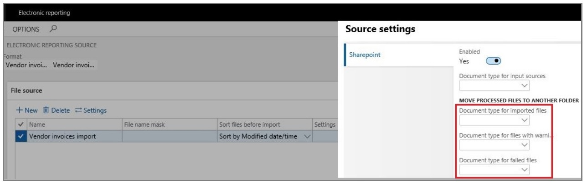

# Vendor electronic invoice import in Denmark

[!include [banner](../../includes/banner.md)]

This article explains how to configure and use vendor electronic invoice import for Denmark from the country-specific **OIOUBL** format in Microsoft Dynamics 365 Finance.

## Prerequisites

Before you complete the tasks in this article, the following prerequisites must be met:

- The primary address of the legal entity must be in Denmark.
- The latest version of the Electronic reporting (ER) format configuration that's named **Vendor Invoice Import (DK)** must be imported. For more information, see [Import Electronic reporting (ER) configurations from Dataverse](../global/workspace/gsw-import-er-config-dataverse.md).

> [!NOTE]
> The ER format is based on the **Invoice model** configuration and uses the **Vendor Invoice Mapping to Destination** configuration. All required additional configurations are automatically imported.

## Configure parameters

### Reference the imported ER format configurations

1. Go to **Accounts payable** \> **Setup** \> **Accounts payable parameters**.
2. On the **Electronic documents** tab, on the **Electronic reporting** FastTab, in the **Vendor invoice** field, select the imported **Vendor Invoice Import (DK)** format.

### Configure the sources to import files in a batch mode

You can configure a SharePoint folder as a source location for incoming vendor invoice files.

1. Go to **Organization administration** \> **Document management** \> **Document types**.
2. Create a new document type, or configure an existing one.
3. On the **General** FastTab, in the **Location** field, select **SharePoint**.
4. In the **SharePoint Address** field, select the folder where import files will be located.
5. Go to **Organization administration** \> **Electronic reporting** \> **Electronic reporting source**.
6. Create a new ER source.
7. In the **Format** field, select the **Vendor Invoice Import (DK)** format configuration.
8. On the **File source** FastTab, in the **Name** field, assign a source name. Then select **Settings**.
9. On the **Source settings** page, enable the **Sharepoint** option.
10. In the **Document type for input sources** field, select the document type that you created in step 2.
11. Optional: Set up three more document types, and use them to define different *post-process* locations:

    - **Document type for imported files** – Move the files that were successfully imported.
    - **Document type for files with warnings** – Move the files that were imported with warnings.
    - **Document type for failed files** – Move the files that failed with errors.

    

> [!NOTE]
> If no source is defined for import in batch mode, the system requests to define an individual import file before the start of the import process.

### Configure vendor data

During the import process, vendors are identified by their tax exempt number. To enable correct vendor identification, follow these steps.

1. Go to **Accounts payable** \> **Vendors** \> **All vendors**, and select a vendor.
2. On the **Invoice and delivery** FastTab, in the **Tax exempt number** field, enter a valid tax registration number for the vendor. This number is used to identify the vendor during import, by matching it to the value of the **Invoice\\cac:AccountingSupplierParty\\cac:Party\\cac:PartyLegalEntity\\cbc:CompanyID** element in the import XML file.

### Configure products

During the import process, products are identified by their external descriptions. These descriptions are usually vendor-specific. To enable correct product identification, follow these steps.

1. Go to **Product information management** \> **Products** \> **Released products**.
2. Select a product, and then, on the **Purchase** menu, in the **Related information** section, select **External item description**.
3. Create a new external description for the selected product.
4. In the **Account code** column, select **Table** to define an external product description for a specific vendor.
5. In the **Vendor relation** column, select a vendor.
6. In the **External item number** column, enter an external product code. This code is used to identify the product during import, by matching the code to the value of the **Invoice\\cac:InvoiceLine\\cac:Item\\cbc:Name** element in the import XML file.

### Configure units of measure (optional)

You can optionally configure external codes for units of measure, if specific units are explicitly defined in the incoming import files.

1. Go to **Organization administration** \> **Setup** \> **Units** \> **Units**.
2. Select a unit ID, and then select **External codes**.
3. On the **External codes** page, in the **Overview** section, in the **Code** field, enter a code that corresponds to the selected unit ID.
4. In **Value** section, in **Value** field, enter the external unit code that's expected in import files.

## Import vendor electronic invoices

To run the import vendor electronic invoices, follow these steps.

1. Go to **Accounts payable** \> **Periodic tasks** \> **Import vendor invoices**.
2. On the **Electronic report parameters** page, on the **File source** FastTab, in the **Source settings** field, select the source location for batch mode import. If no source for batch import is defined, the system prompts you to select a single file for import.
3. Select **OK** to immediately start the import process or to schedule the import to run in the background.

### Import process description

Here's an overview of the steps in the import process and the order that they occur in.

1. Vendors are identified by using the tax exempt number that's defined in the vendor record. If no vendor matches the data that's being searched, the import process fails, and a related error message is shown.
2. Products that are used on invoice lines are identified by using an external item number, which might be vendor-specific. If no product matches the external description, the import process fails, and a related error message is shown.
3. If units of measure are used on invoices lines, they're identified by using external codes values. If no unit that has a matching external code value is found in the system, the import process fails, and a related error message is shown.
4. If an incoming import file contains the information about purchase orders and its lines in the **Invoice\\cac:OrderReference\\cbc:ID** and **Invoice\\cac:InvoiceLine\\cac:OrderLineReference\\cbc:LineID** elements, the numbers are used for invoice matching with purchase orders and lines that are entered in the system.
5. If no order or line references are defined in an incoming file, the system tries to automatically match incoming vendor invoices with existing purchase orders.
6. If no purchase order is found, the system raises a warning but continues the import. It now considers products on invoice lines **Non-stock** items. The system expects that these products belong to an item model group where the **Stocked product** checkbox is cleared on the **Inventory policy** page.
7. If no related **Non-stock** products exist, the system tries to import invoice lines by referring to a default item. The default item must be configured in the system as a released product where the code is defined exactly as **DEFAULT\_ITEM**, and the product must belong to an item model group where the **Stocked product** checkbox is cleared on the **Inventory policy** page. If no default item is configured in the system, the import process fails, and a related error message is shown.
8. Taxes are calculated in the system, based on the imported data and tax settings. Taxes aren't imported as fixed amounts from the incoming XML file. The results of the calculation can be manually adjusted as required.

Successfully imported vendor electronic invoices are shown in the system as pending invoices. To review imported invoices, go to **Accounts payable** \> **Invoices** \> **Pending vendor invoices**. 

> [!NOTE]
> There are some limitations to this import process:
>
> - The import of miscellaneous charges isn't supported.
> - Only the import of line-level discounts is supported.

## Learn more

- [Customer electronic invoices in Denmark](../norway/emea-dnk-e-invoices.md)

[!INCLUDE[footer-include](../../../includes/footer-banner.md)]
