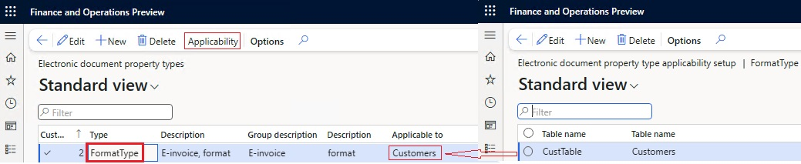
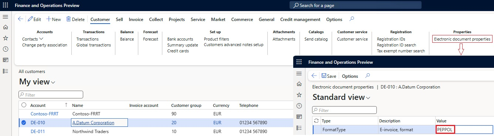
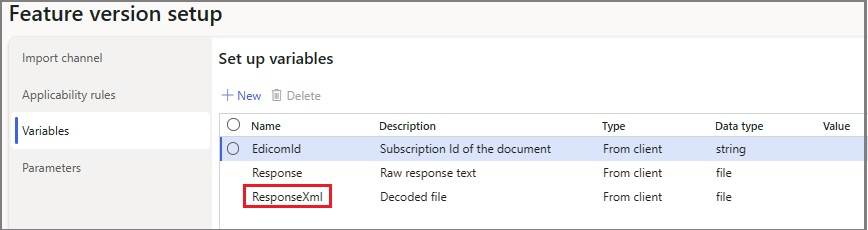
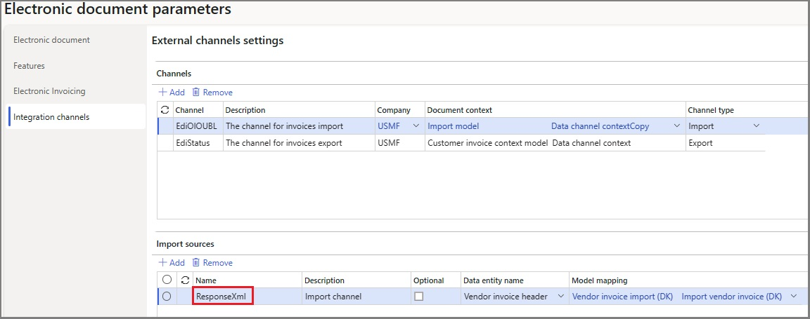
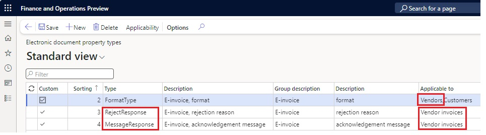

# Use electronic invoicing for Denmark

[!include [banner](../../includes/banner.md)]

This article provides information to help you get started with Electronic invoicing for Denmark. It includes information about how to configure the system so that you can generate, submit, and receive electronic invoices in the Denmark-specific [OIOUBL](http://www.oioubl.info/Classes/da/Invoice.html) format and, if necessary, in [Pan-European Public Procurement Online (PEPPOL)](https://docs.peppol.eu/poacc/billing/3.0/) format.

## Prerequisites

Before you begin the procedures in this article, the following prerequisites must be met:

- The company must be registered in the [Danish Central Business Register (CVR)](https://datacvr.virk.dk/) and in the Danish electronic invoicing infrastructure, [NemHandel](https://nemhandel.dk/).
- The company must have a signed agreement with the provider of electronic document delivery service that secures electronic document interchange in OIOUBL and PEPPOL formats.
- Among the registered profile IDs, the company should have the following profiles that Microsoft Dynamics 365 Finance uses for electronic document interchange:

    - **Procurement-BilSim-1.0** – This profile is used to interchange documents in OIOUBL format.
    - **urn:fdc:peppol.eu:2017:poacc:billing:01:1.0** – This profile is used to interchange documents in PEPPOL format.

- The company must obtain, from the service provider, the required credentials to enable integration of the Electronic Invoicing service with the [Electronic Invoicing service independent software vendor (ISV) last-mile connector](../global/e-invoicing-isv-connector.md).
- Become familiar with Electronic invoicing as it's described in [Electronic Invoicing service overview](../global/gs-e-invoicing-service-overview.md) and [Electronic invoicing components](../global/gs-e-invoicing-administration-integration-components.md).
- Do the common part of Electronic Invoicing service configuration as described in [Electronic invoicing configuration](../global/gs-e-invoicing-set-up-overview.md).
- In the key vault, create a secret for the token that grants authorization to access the infrastructure of the provider of electronic document delivery service, and set up Azure Key Vault as described in [Configure Azure resources for Electronic invoicing](../global/gs-e-invoicing-set-up-azure-resources.md).

## Use the country-specific configuration for the Danish electronic invoice (DK) feature

Some parameters for the **Danish electronic invoice (DK)** electronic invoicing feature have default values. Before you deploy the feature to the service environment, review the default values, and update them as required, so that they better reflect your business operations.

To review and update the parameters for the **Danish electronic invoice (DK)** electronic invoicing feature, follow these steps.

1. Import the latest version of the **Danish electronic invoice (DK)** Globalization feature, **version 4** or later. Learn more in [Import features from the repository](../global/gs-e-invoicing-import-feature-global-repository.md).
1. Create a copy of the imported Globalization feature, and select your configuration provider for it. Learn more in [Create Globalization features](../global/gs-e-invoicing-create-new-globalization-feature.md).
1. On the **Versions** tab, verify that **Draft** is selected.
1. On the **Setups** tab, in the grid, select the **Sales invoice OIOUBL** feature setup, and then select **Edit**.
1. On the **Processing pipeline** tab, in the **Processing pipeline** section, select **Integrate with Edicom**.
1. In the **Parameters** section, select **Domain**, and then enter the service ID number that you obtained.
1. Select **Application**, and then enter the same service ID number.
1. Select **Destination**, and then enter the service ID number concatenated with the string "\_EDIWIN." For example, if the service ID number is **123456**, enter **123456\_EDIWIN**.
1. Select **Group**, and then enter the group code that you obtained.
1. Select **Auth token**, and then select the name of the secret that you created for the token.
1. Select **Save**, and close the page.
1. Repeat steps 4 through 11 for each of the following feature setups if your business process assumes the involvement of the related types of documents:

    - Sales credit note OIOUBL
    - Project invoice OIOUBL
    - Project credit note OIOUBL
    - Sales invoice PEPPOL
    - Sales credit note PEPPOL
    - Project invoice PEPPOL
    - Project credit PEPPOL

1. On the **Setups** tab, in the grid, select the **Get status** feature setup, and then select **Edit**.
1. On the **Export channel** tab, in the **Parameters** section, select **Auth token**, and then select the name of the secret that you created for the token.
1. Select **Domain**, and then enter the service ID number that you obtained.
1. Select **Application**, and then enter the same service ID number.
1. Select **Group**, and then enter the group code that you obtained.
1. Select **Data channel**, and then enter the name of the [integration channel](#ExChannel) that is configured on the **Electronic document parameters** page in Finance.
1. Select **Save**, and close the page.

## Finance configuration

Some additional parameters must be configured directly in Finance.

To configure the additional parameters directly in Finance, follow these steps.

1. In the **Feature management** workspace, make sure that the **Export channels for electronic invoicing integration** feature is enabled. Learn more in [Feature management overview](../../../fin-ops-core/fin-ops/get-started/feature-management/feature-management-overview.md).
1. Make sure that the country/region-specific **Document context** and **Electronic document model mapping** Electronic reporting (ER) configurations that are required for Denmark are imported. Learn more in [Set up Electronic document parameters](../global/gs-e-invoicing-set-up-parameters.md#set-up-electronic-document-parameters).
1. Go to **Organization administration** \> **Setup** \> **Electronic document parameters**.
1. In the **Electronic document** section, add records for the **Customer Invoice journal** and **Project invoice** table names.
1. For each table name, set the **Document context** and **Electronic document model mapping** fields in accordance with step 1.
1. In the **Integration channels** section, add a record for the channel that is used for electronic invoice submission in batch mode.
1. In the **Channel** column, enter **EdiStatus**. This channel name is used by default, but you can use a different channel name as you require. In this case, you must enter the same name in the value of the **$Context\_Channel** variable in the **DataChannel** definition in the **Customer invoice context model** ER configuration. You must also enter it in the parameters and applicability rules of the related feature setup.
1. In the **Company** column, select a required legal entity code.
1. In the **Document context** column, refer to the **Customer invoice context model** configuration by using the **Data channel context** definition.
1. In the **Channel type** column, select **Export**.
1. Save your changes, and close the page.

## Finance business data configuration

Follow the configuration steps in [Customer electronic invoices in Denmark](../norway/emea-dnk-e-invoices.md). Start from the [Configure parameters](../norway/emea-dnk-e-invoices.md#configure-parameters) section.

### Seller identification

Companies that submit electronic invoices can be identified by their CVR number or their [Global Location Number (GLN)](https://en.gs1.dk/services/gln). The GLN is also known as a European article numbering (EAN) location number.

To identify a company by its CVR number, follow these steps.

1. Go to **Organization administration** \> **Organizations** \> **Legal entities**.
1. On the **Bank account information** FastTab, in the **Codes** section, in the **Routing number** field, make sure that a valid CVR number is entered for the legal entity.

    The CVR number is entered in the **Invoice\\cac:AccountingSupplierParty\\cac:Party\\cbc:EndpointID** element in the electronic invoice XML file that is generated. It's used as the seller's identification during the submission process.

To identify a company by its GLN, follow these steps.

1. Go to **Organization administration** \> **Global address book** \> **Registration types** \> **Registration types**.
1. Define a new registration type for Denmark that has the name **EAN**. You must enter the name exactly as it appears here.
1. Go to **Organization administration** \> **Organizations** \> **Legal entities**, and select **Registration IDs** on the Action Pane.
1. On the **Registration ID** FastTab, add the **EAN** registration type that you created.
1. In the **Registration number** field, enter a valid GLN.

    The GLN is entered in the **Invoice\\cac:AccountingSupplierParty\\cac:Party\\cbc:EndpointID** element in the electronic invoice XML file that is generated. It's used as the seller's identification during the submission process.

    > [!NOTE]
    > The GLN has higher priority than the CVR number. If both numbers are configured at the same time, the GLN is used.

### Buyer identification

1. Go to **Accounts receivable** \> **Customers** \> **All customers**, and select a customer.
1. On the **Invoice and delivery** FastTab, in the **EAN** field, make sure that a valid GLN is entered for the customer.

    The GLN is entered in the **Invoice\\cac:AccountingCustomerParty\\cac:Party\\cbc:EndpointID** element in the electronic invoice XML file that is generated. It's used as the buyer's identification during the submission process.

    > [!NOTE]
    > If no GLN is defined, the customer's tax exempt number is used.

### Configure the output format type

By default, all outgoing electronic invoices are generated in OIOUBL format for all customers. However, by using configurable electronic document property types, you can configure electronic invoices so that they are generated in PEPPOL format for specific customers.

> [!NOTE]
> Follow the configuration steps in this section only if you must also generate electronic invoices in PEPPOL format. If you generate them only in OIOUBL format, you can skip these steps.

#### Configure electronic document properties

To configure electronic document properties, follow these steps.

1. Go to **Accounts receivable** \> **Setup** \> **Electronic document property types**, and select **New**.
1. In the **Type** field, enter **FormatType**. You must enter the value exactly as it appears here.
1. Select **Applicability** to add an applicable table.
1. On the **Electronic document property type applicability setup** page, in the **Table name** field, select the **Customers** table name.
1. Save your changes, and return to the **Electronic document property types** page.

    

#### Enter the type of format

To enter the type of format for specific customers, follow these steps.

1. Go to **Accounts receivable** \> **Customers** \> **All customers**.
1. Select a specific customer in the list, and then, on the Action Pane, on the **Customer** tab, in the **Properties** group, select **Electronic document properties**.
1. In the **Value** column, enter **PEPPOL**. You must enter the value exactly as it appears here.

    > [!NOTE]
    > The system generates electronic invoices in PEPPOL format only if you enter the value **PEPPOL** here. If you enter a different value, or no value, electronic invoices are generated in the default OIOUBL format.

    

## Issue electronic invoices

After you complete all the required configuration steps, you can generate and submit electronic invoices for posted invoices by going to **Organization administration** \> **Periodic** \> **Electronic documents** \> **Submit electronic documents**. Learn more about how to generate electronic invoices in [Submit electronic documents](../global/e-invoicing-submit-electronic-documents.md).

> [!IMPORTANT]
> In current implementations, the standard submission procedure that was described earlier only generates electronic invoices and stores them on the service side. The invoices aren't submitted. Submission of Danish electronic invoices requires that you complete the following additional steps.

To submit the generated electronic invoices in batch mode, follow these steps.

1. Go to **Organization administration** \> **Periodic** \> **Electronic documents** \> **Run submission process in export channels**.
1. In the **Channel** field, select the export channel that you [previously created](#ExChannel), and then select **OK**.

You can inquire about the results of the submission by going to **Organization administration** \> **Periodic** \> **Electronic documents** \> **Electronic document submission log**. Learn more in [Work with Electronic document submission log](../global/e-invoicing-submission-log.md).

## Receive incoming electronic invoices

To import incoming invoices in OIOUBL and PEPPOL formats, follow these additional configuration steps for the same version of the **Danish electronic invoice (DK)** electronic invoicing feature that is used for outgoing invoice submission.

1. Import the latest version of the **Danish electronic invoice (DK)** Globalization feature. Learn more in [Import features from the repository](../global/gs-e-invoicing-import-feature-global-repository.md).
1. Create a copy of the imported Globalization feature, and select your configuration provider for it. Learn more in [Create Globalization features](../global/gs-e-invoicing-create-new-globalization-feature.md).
1. On the **Versions** tab, verify that **Draft** is selected.
1. On the **Setups** tab, in the grid, select **Incoming OIOUBL**, and then select **Edit**.
1. On the **Import channel** tab, in the **Parameters** section, select the **Data channel** parameter. Then, in the **Value** field, define the name of the data channel. Alternatively, leave the default value unchanged. For the OIOUBL format, the default channel name is **EdiOIOUBL**. For the PEPPOL format, it's **EdiPEPPOL**. In both cases, make a note of the value, because you must use it in later configuration steps.
1. Select the **Service ID** parameter, and then select the name of the secret that contains the service ID number.
1. Select the **Group** parameter, and then select the name of the secret that contains the group code.
1. Select the **Token** parameter, and then select the name of the secret that you created for the token.
1. On the **Applicability rules** tab, in the **Channel** field, make sure that the **Value** column contains the same [import channel](#ImportChannel) name that you defined earlier.
1. On the **Variables** tab, make a note of the **OutputFile** name, because you must use it in later configuration steps.
1. Select **Save**, and close the page.
1. If an import in PEPPOL format is also required, repeat steps 4 through 11 for the **Incoming PEPPOL** feature setup.
1. Complete and deploy the configured version of the **Danish electronic invoice (DK)** electronic invoicing feature.

### Finance configuration

Some additional parameters must be configured directly in Finance.

To configure the additional parameters directly in Finance, follow these steps.

1. Make sure that the latest version of the **Vendor invoice import (DK)** ER configuration is imported.

    > [!NOTE]
    > The **Vendor invoice import (DK)** format configuration is used for import invoices in OIOUBL format. It's based on the parent **Vendor invoice import** format configuration that implements invoice import in PEPPOL format. The formats use the **Invoice model** and **Vendor invoice Mapping to destination** configurations. All additional configurations that are required are automatically imported.

1. In the **Electronic reporting** workspace, on the **Reporting configurations** tile, select **Customer invoice context model**.
1. Select **Create configuration**, and then, in the dropdown dialog box, select **Derive from Name: Customer invoice context model, Microsoft** to create a derived configuration.

    > [!NOTE]
    > The derived configuration must differ from the configuration that is used for the invoice *submission* setup.

1. Open the derived configuration to edit it in the designer, and then select **Map model to datasource**.
1. Open the **DataChannel** definition to edit it in the designer.
1. In the **Data sources** tree, expand the **$Context\_Channel** container.
1. In the **Value** field, select **Edit**, and then enter the [import channel](#ImportChannel) name.
1. Save your changes, and complete the derived configuration.
1. Go to **Organization administration** \> **Setup** \> **Electronic document parameters**.
1. On the **Integration channels** tab, in the **Channels** section, in the **Channel** field, enter the [import channel](#ImportChannel) name that you created earlier.
1. In the **Channels** section, in the **Company** field, select a required legal entity.
1. In the **Document context** field, select the **Customer invoice context model** configuration.
1. In the **Import sources** section, in the **Name** field, enter the same **ResponseXml** name that is used in the variable for **Decoded file** in the import feature setup.

    

1. In the **Data entity name** field, select **Vendor invoice header**.
1. In the **Model mapping** field, reference the **Vendor invoice import (DK)** configuration.

    

1. If import in PEPPOL format is also required, create another import channel, and repeat steps 3 through 15 for it. In step 15, reference the **Vendor invoice import** configuration.
1. Select **Save**, and close the page.

### Configure Finance business data

You must configure the following types of master data to provide a match for incoming electronic invoices:

- Vendors
- Products
- Units

Follow the configuration steps in [Vendor electronic invoice import in Denmark](../denmark/emea-dnk-vend-e-invoice.md). Start from the [Configure vendor data](../denmark/emea-dnk-vend-e-invoice.md#configure-vendor-data) section.

### Receive electronic invoices

To receive electronic invoices, follow these steps.

1. Go to **Organization administration** \> **Periodic** \> **Electronic documents** \> **Receive electronic documents**.
1. Select **OK**, and then close the page.

To view the receipt logs for electronic invoices, go to **Organization administration** \> **Periodic** \> **Electronic documents** \> **Electronic document receipt log**.

To view successfully received invoices, go to **Accounts payable** \> **Invoices** \> **Pending vendor invoices**.

## Send responses for received electronic invoices

After incoming vendor invoices are successfully received, you can respond to invoice issuers about the decision to accept or reject the received invoices. Rejection responses can be sent for both incoming invoice formats, OIOUBL and PEPPOL. Acceptance responses aren't assumed. If no rejection response is sent during an agreed-on time, the invoices are considered automatically accepted.

For the PEPPOL format, a receipt acknowledgement message can also be sent. This message is a technical confirmation of invoice receipt. The invoices can still be rejected later from a business perspective.

### Configure responses

Responses can be configured by using electronic document property types in the same manner as [format types](#FormatType).

#### Configure electronic document properties

To configure electronic document properties, follow these steps.

1. Go to **Accounts receivable** \> **Setup** \> **Electronic document property types**, and select **New**.
1. In the **Type** field, enter **RejectResponse**. You must enter the value exactly as it appears here.
1. Select **Applicability** to add an applicable table.
1. On the **Electronic document property type applicability setup** page, in the **Table name** field, select the **VendInvoiceInfoTable** table name.
1. Save your changes, and return to the **Electronic document property types** page.
1. Select **New** to create another electronic document property type.
1. In the **Type** field, enter **MessageResponse**. You must enter the value exactly as it appears here.
1. Select **Applicability** to add an applicable table.
1. On the **Electronic document property type applicability setup** page, in the **Table name** field, select the **VendInvoiceInfoTable** table name.
1. Save your changes, and return to the **Electronic document property types** page.
1. Select the existing [FormatType](#FormatType) electronic document property type.
1. Select **Applicability** to add an applicable table.
1. On the **Electronic document property type applicability setup** page, in the **Table name** field, select the **Vendors** table name.

    > [!NOTE]
    > The same electronic document property type is used to determine which response type is generated for a specific vendor: **OIOUBL application response** or **PEPPOL invoice level response**.

1. Save your changes, and return to the **Electronic document property types** page.

    

#### Define responses formats

To identify which response format type is used for a specific vendor, follow these steps.

1. Go to **Accounts payable** \> **Vendors** \> **All vendors**.
1. Select a specific vendor in the list, and then, on the Action Pane, on the **Vendor** tab, in the **Properties** group, select **Electronic document properties**.
1. In the **Value** column, enter **PEPPOL**. You must enter the value exactly as it appears here.

    > [!NOTE]
    > The system generates invoice-level responses in PEPPOL format only if you enter the value **PEPPOL** here. If you enter a different value, or no value, application responses are generated in the default OIOUBL format.

#### Enter responses

To enter responses for specific pending vendor invoices, follow these steps.

1. Go to **Accounts payable** \> **Invoices** \> **Pending vendor invoices**.
1. Select a specific pending vendor invoice in the list, and then, on the Action Pane, on the **Vendor invoice** tab, in the **Properties** group, select **Electronic document properties**.
1. Select the **RejectResponse** type.
1. In the **Value** column, enter the rejection reason. This text is sent back to the invoice issuer as justification for the rejection. **OIOUBL application response** or **PEPPOL invoice level response** messages are generated and sent only if you enter a non-empty value. 
1. Select the **MessageResponse** type.
1. In the **Value** column, enter any text that should be used as an acknowledgement message. This text is sent back to the invoice issuer as confirmation of invoice receipt. **PEPPOL message level response** messages are generated and sent only if you enter a non-empty value.

### Configure electronic invoicing feature setups

Some parameters for the **Danish electronic invoice (DK)** electronic invoicing feature have default values. Before you deploy the feature to the service environment, review the default values, and update the authorization credentials that are required for response submission via the ISV last-mile connector.

To review and update the authorization credentials, follow these steps.

1. Import the latest version of the **Danish electronic invoice (DK)** Globalization feature, **version 5** or later. Learn more in [Import features from the repository](../global/gs-e-invoicing-import-feature-global-repository.md).
1. Create a copy of the imported Globalization feature, and select your configuration provider for it. Learn more in [Create a feature based on an existing feature](../global/gs-e-invoicing-create-new-globalization-feature.md#create-a-feature-based-on-an-existing-feature).
1. On the **Versions** tab, verify that **Draft** is selected.
1. On the **Setups** tab, in the grid, select the **Application Response OIOUBL** feature setup, and then select **Edit**.
1. On the **Processing pipeline** tab, in the **Processing pipeline** section, select **Integrate with Edicom**.
1. In the **Parameters** section, select **Domain**, and then enter the service ID number that you obtained.
1. Select **Application**, and then enter the same service ID number.
1. Select **Destination**, and then enter the service ID number concatenated with the string "\_EDIWIN." For example, if the service ID number is **123456**, enter **123456\_EDIWIN**.
1. Select **Group**, and then enter the group code that you obtained.
1. Select **Auth token**, and then select the name of the secret that you created for the token.
1. Select **Save**, and close the page.
1. Repeat steps 4 through 11 for each of the following feature setups if your business process assumes that responses are sent in PEPPOL format:

    - Invoice Response PEPPOL
    - Message Response PEPPOL

### Configure electronic document parameters

To configure electronic document parameters, follow these steps.

1. Make sure that the latest country/region-specific **Document context** and **Electronic document model mapping** ER configurations that are required for Denmark are imported. Learn more in [Set up Electronic document parameters](../global/gs-e-invoicing-set-up-parameters.md#set-up-electronic-document-parameters).
1. Go to **Organization administration** \> **Setup** \> **Electronic document parameters**.
1. In the **Electronic document** section, add a record for the **VendInvoiceInfoTable** table name.
1. Set the **Document context** and **Electronic document model mapping** fields in accordance with step 1.
1. In the **Company** column, you can select a legal entity code to limit the applicability of this electronic document type. If you don't select a value, electronic documents of this type are processed in all legal entities.
1. Save your changes, and close the page.

### Send responses

To generate and submit responses, follow these steps.

1. Go to **Organization administration** \> **Periodic** \> **Electronic documents** \> **Submit electronic documents**. Learn more in [Submit electronic documents](../global/e-invoicing-submit-electronic-documents.md).
1. Go to **Organization administration** \> **Periodic** \> **Electronic documents** \> **Run submission process in export channels**.
1. In the **Channel** field, select the export channel that you [previously created](#ExChannel), and then select **OK**.

You can inquire about the results of the submission by going to **Organization administration** \> **Periodic** \> **Electronic documents** \> **Electronic document submission log**. In the **Document type** field, select **Vendor invoices** to filter only responses submissions. Learn more in [Work with Electronic document submission log](../global/e-invoicing-submission-log.md).

## Additional resources

- [Customer electronic invoices in Denmark](../norway/emea-dnk-e-invoices.md)
- [Vendor electronic invoice import in Denmark](../denmark/emea-dnk-vend-e-invoice.md)

[!INCLUDE[footer-include](../../../includes/footer-banner.md)]
