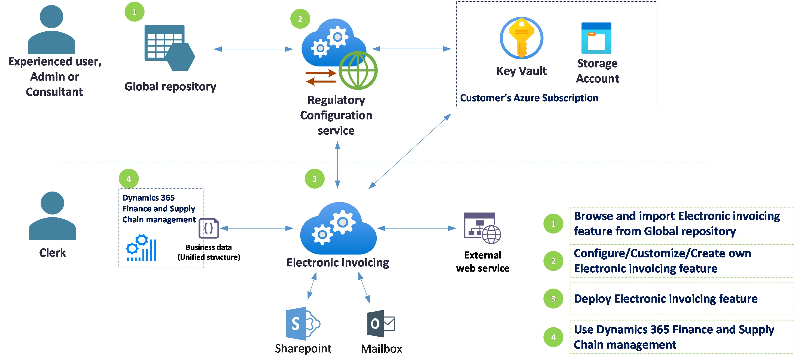

---
# required metadata

title: Electronic invoicing administration and integration components
description: This topic provides an overview of the Electronic invoicing administration and integration components.
author: dkalyuzh
ms.date: 01/20/2022
ms.topic: article
ms.prod: 
ms.technology: 

# optional metadata

# ms.search.form: 
audience: Application User
# ms.devlang: 
ms.reviewer: kfend
ms.search.scope: Core, Operations
# ms.tgt_pltfrm: 
# ms.custom: 
ms.search.region: 
# ms.search.industry: 
ms.author: kfend
ms.search.validFrom: 
ms.dyn365.ops.version: 

---

# Electronic invoicing administration and integration components

[!include [banner](../includes/banner.md)]

This topic provides information about the components that are related to the administration of Electronic invoicing, and their roles in the setup and operation of Electronic invoicing.

## Microsoft Azure

You use Microsoft Azure to set up a storage account and create secrets for an Azure key vault. These resources must be set up in your Azure subscription. They are fully owned and managed by you.

A storage account is a mandatory component of the Electronic invoicing service. It's used to store all electronic files that are processed or generated by Electronic invoicing. Here are some examples of these files:

- Business data from Dynamics 365 Finance and Dynamics 365 Supply Chain Management, or from other connected applications in a unified structure (JavaScript Object Notation \[JSON\] format)
- Files that are generated during file generation and transformation
- Incoming external data, such as responses from external Web services
- Inbound electronic invoices
 
A key vault is another mandatory component for working with Electronic invoicing. It's used to store the following items:

- The storage access signature (SAS) token of your storage account. Microsoft supports a high level of security and data privacy. Therefore, you must store your SAS token in Azure Key Vault as a secret instead of using it directly.
- Secrets, accounts, and passwords that you will use in different scenarios.
- Certificates that have secrets for digital signing and establishing a trusted connection with external web services.

## Microsoft Dynamics Lifecycle Services

You use Microsoft Dynamics Lifecycle Services (LCS) to enable the Electronic invoicing add-in for your LCS deployment project.

> [!NOTE]
> Installation of add-ins in LCS requires at least a Tier 2 environment. For more information about environment planning, see [Environment planning](../../fin-ops-core/fin-ops/imp-lifecycle/environment-planning.md).

## Regulatory Configuration Service

Regulatory Configuration Service (RCS) is the interface that is used to configure Electronic invoicing. Resources such as environments and Electronic invoicing features are created, maintained, and hosted in RCS. When the resources are ready, they are published to the Electronic invoicing service and stored in the Global repository.

## Finance and Supply Chain Management

Currently, Microsoft supports out-of-box integration with Finance and Supply Chain Management as the main billing system that works with the Electronic invoicing service to generate and submit electronic invoices (*outbound electronic documents*), and to receive electronic invoices from vendors (*inbound electronic documents*).

Finance and Supply Chain Management generate business data in a unified structure and then submit it, together with additional metadata (*context*), to Electronic invoicing. Finance or Supply Chain Management then requests the status of the documents that are being processed by Electronic invoicing.

The detailed results are received as a log that is linked to the generated electronic files or other data that is related to the submitted documents. Depending on the scenario, the system updates Finance and Supply Chain Management data. For example, it updates invoice status or externally provided universally unique identifiers (UUIDs) of invoices that are registered with the tax authority.

For more information about Electronic invoicing components and how to set them up, see [Set up Electronic invoicing](e-invoicing-set-up-overview.md) and [Set up and use connected applications](e-invoicing-connected-applications.md).
