---
# required metadata

title: Get started with the Electronic invoicing add-on for Brazil
description: This topic provides information that will help you get started with the Electronic invoicing add-on for Brazil in Microsoft Dynamics 365 Finance and Dynamics 365 Supply Chain Management.
author: gionoder
manager: AnnBe
ms.date: 09/04/2020
ms.topic: article
ms.prod: 
ms.service: dynamics-ax-platform
ms.technology: 

# optional metadata

ms.search.form: 
# ROBOTS: 
audience: Application User
# ms.devlang: 
ms.reviewer: kfend
# ms.search.scope: Core, Operations
# ms.tgt_pltfrm: 
ms.custom: 97423
ms.assetid: 
ms.search.region: Global
# ms.search.industry: 
ms.author: janeaug
ms.search.validFrom: 2020-07-08
ms.dyn365.ops.version: AX 10.0.12

---

# Get started with the Electronic invoicing add-on for Brazil 

[!include [banner](../includes/banner.md)]

> [!IMPORTANT]
> The Electronic invoicing add-on for Brazil doesn't currently support all the functions that are available in the fiscal document integration that is built into Microsoft Dynamics 365 Finance and Dynamics 365 Supply Chain Management.

This topic provides information that will help you get started with the Electronic invoicing add-on for Brazil. It guides you through the configuration steps that are country-dependent in Regulatory Configuration Services (RCS) and in Finance and Supply Chain Management. It also guides you through the process of submitting an NF-e fiscal document (Electronic fiscal document model 55) through the service, and it explains how review the processing results and the status of the fiscal documents.

## Prerequisites

Before you complete the steps in this topic, you must complete the steps in [Get started with the Electronic invoicing add-on](e-invoicing-get-started.md).

## RCS setup

During the RCS setup, you will complete these tasks:

1. Import the e-Invoicing feature for NF-e fiscal documents.
2. Review the file formats that are required to submit NF-e fiscal documents for authorization.
3. Review the file formats that are required to request the cancellation of an approved NF-e.
4. Configure the event that is required to submit NF-e fiscal documents for authorization.
5. Configure the event that is required to request the cancellation of an approved NF-e.
6. Assign the e-Invoicing feature to an Electronic invoicing add-on environment.
7. Publish the e-Invoicing feature.

> [!NOTE]
> "The e-Invoicing feature" is the generic name for the resource that is configured and published to consume the Electronic invoicing add-on server. The setup of the e-Invoicing feature combines, among other things, the use of Electronic reporting (ER) configuration formats to create configurable export and import files, and the use of actions and actions flows to enable the creation of configurable rules to send requests, import responses, and parse the response contents.

## Import the e-Invoicing feature

1. Sign in to your RCS account
2. In the **Globalization features** workspace, in the **Features** section, select the **e-Invoicing** tile.
3. On the **e-Invoicing Features** page, select **Import** to import a NF-e fiscal document e-Invoicing feature from the Global repository.

    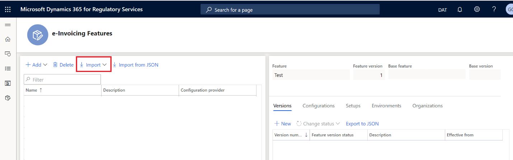

4. Select the NF-e fiscal document feature, and then select **Import**.

    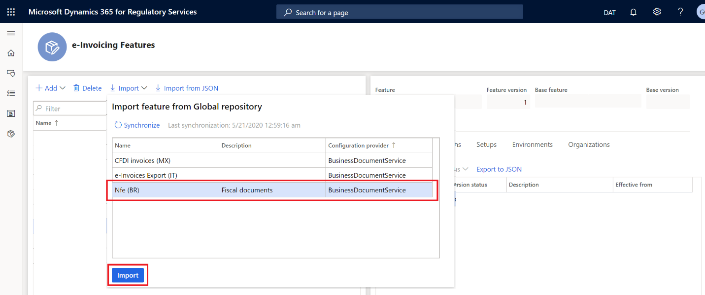

### Create a new version of the NF-e fiscal document feature

- On the **e-Invoicing Features** page, on the **Versions** tab, select **New**.

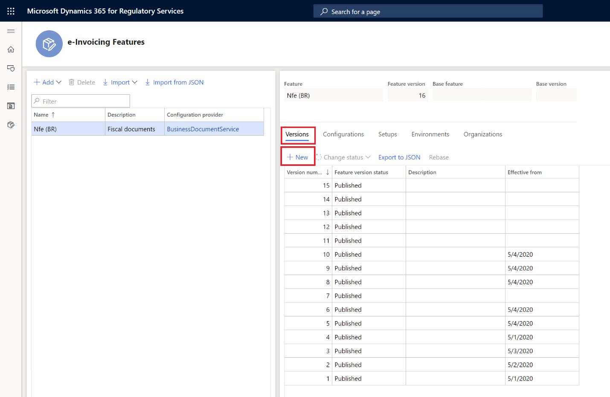

### Update the configuration version

1. On the **e-Invoicing Features** page, on the **Configurations** tab, select **Add** or **Delete** to manage the configuration versions (ER file format configurations).

    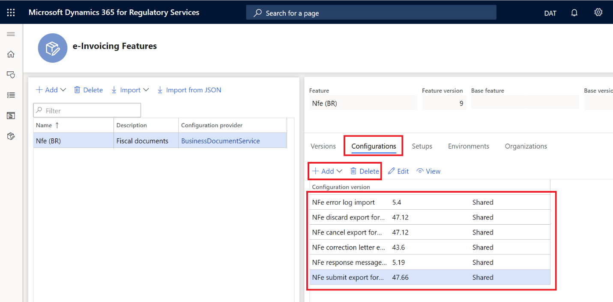

    - When you create a new version of the NF-e fiscal document feature, all configuration version (ER file formats) are inherited from the latest version.
    - To submit the NF-e fiscal document for authorization, the following configuration versions are required:

        - NFe submit export format
        - NFe response message import
        - NFe error log import

    - To submit the NF-e cancellation, the following configuration version is required:

        - NFe cancel export format

2. In the list, select a configuration version, and then select **Edit** or **View** to open the **Format designer** page, where you can edit or view the configuration.

    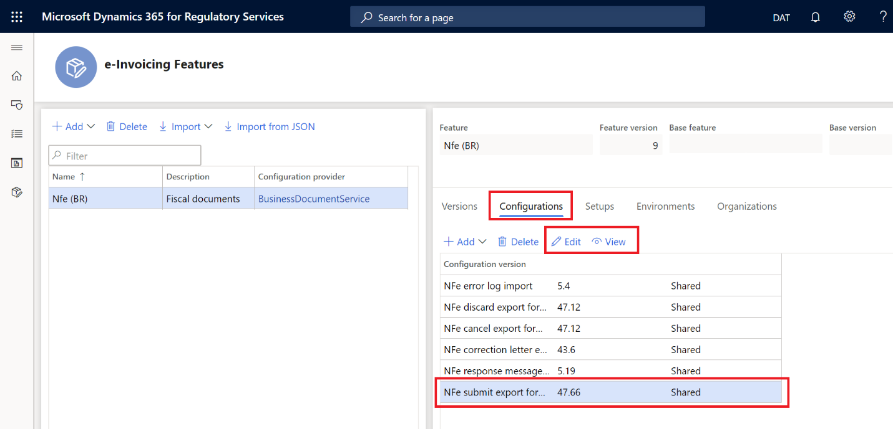

3. Use the **Format designer** page to edit or view the ER format file configurations. For more information, see [Create electronic document configurations](https://docs.microsoft.com/dynamics365/fin-ops-core/dev-itpro/analytics/electronic-reporting-configuration).

    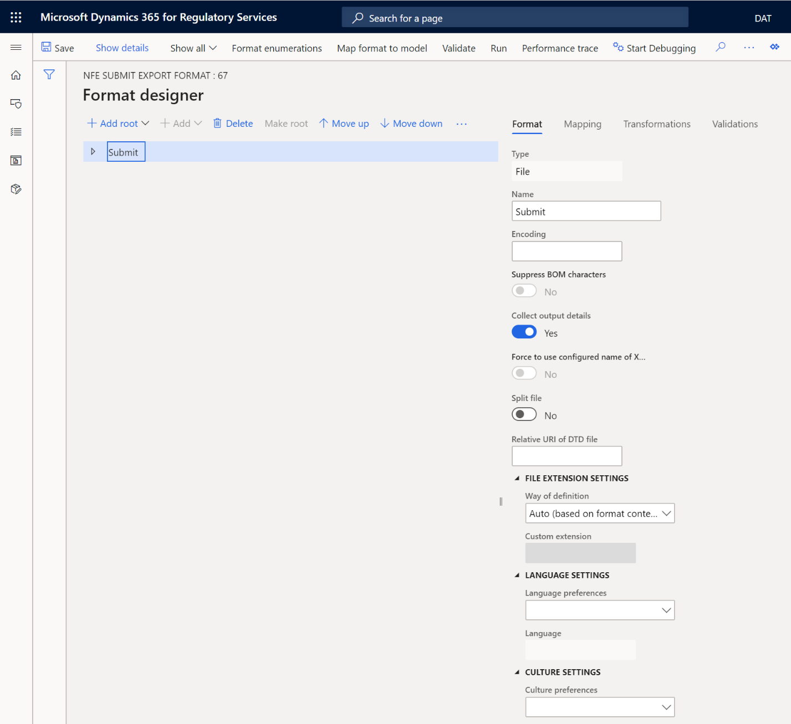

### Manage the e-Invoicing feature setups

- On the **e-Invoicing Features** page, on the **Setups** tab, select **Add** or **Delete** to manage the e-Invoicing feature setups (that is, NF-e events).

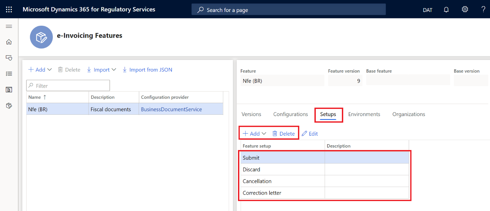

When you create a new version of the NF-e fiscal document feature that is derived from another e-Invoicing feature, all feature setups (NF-e events) are inherited from the latest version.

To submit NF-e fiscal documents for authorization, the **Submit** feature setup is required.

To submit NF-e cancellation, the **Cancellation** feature setup is required.

#### Configure the Submit feature setup

1. On the **e-Invoicing Features** page, on the **Setups** tab, in the **Feature setup** column, select **Submit**.
2. Select **Edit**.

    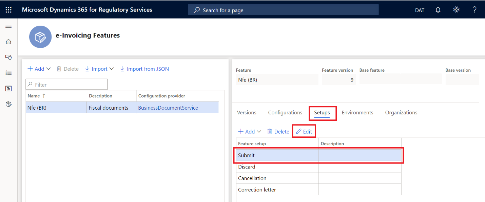

3. On the **Feature version setup** page, select the **Actions** tab to manage the list of actions.

    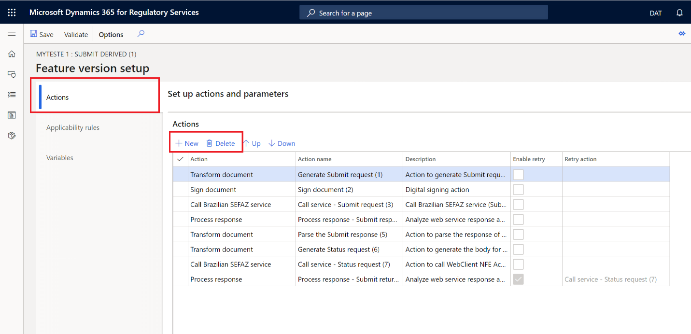

4. Review the actions that are required to submit an NF-e for authorization.

    | Action ID | Action name                  | Action description                                                |
    |-----------|------------------------------|-------------------------------------------------------------------|
    | 1         | Transform document           | Create the NF-e XML file for submission.                          |
    | 2         | Sign document                | Apply the digital certificate to the XML file.                    |
    | 3         | Call Brazilian SEFAZ service | Submit the signed XML file to the web services for authorization. |
    | 4         | Process response             | Get the web service response.                                     |
    | 5         | Transform document           | Parse the content of the file that is received as a response.     |
    | 6         | Transform document           | Create the XML file to inquire about status of the submission.    |
    | 7         | Call Brazilian SEFAZ service | Submit the XML file that requests the submission status.          |
    | 8         | Process response             | Get the web service response.                                     |

#### Set up the URL for SEFAZ web services 

1. On the **Feature version setup** page, on the **Actions** tab, on the **Actions** FastTab, select **Call Brazilian SEFAZ service** (action ID **3**).
2. On the **Parameters** FastTab, in the **URL address parameter** field, enter the URL of the SEFAZ web service for NF-e submission.
3. On the **Actions** FastTab, select **Call Brazilian SEFAZ service** (action ID **7**).
4. On the **Parameters** FastTab, in the **URL address parameter** field, enter the URL of the SEFAZ web service for NF-e submission.

#### Configure the Cancellation feature setup

1. On the **e-Invoicing Features** page, on the **Setups** tab, in the **Feature setup** column, select **Cancellation**.
2. Select **Edit**.
3. On the **Feature version setup** page, select the **Actions** tab to manage the list of actions.
4. Review the actions that are required to request the cancellation of an approved NF-e.

    | Action ID | Action name                  | Action description                                               |
    |-----------|------------------------------|------------------------------------------------------------------|
    | 1         | Transform document           | Create the NF-e cancellation XML file for submission.            |
    | 2         | Sign document                | Apply the digital certificate to the XML file.                   |
    | 3         | Call Brazilian SEFAZ service | Submit the signed XML file to the web services for cancellation. |
    | 4         | Process response             | Get the web service response.                                    |

#### Set up the URL for SEFAZ web services

1. On the **Feature version setup** page, on the **Actions** tab, on the **Actions** FastTab, select **Call Brazilian SEFAZ service** (action ID **3**).
2. On the **Parameters** FastTab, in the **URL address parameter** field, enter the URL of the SEFAZ web service for cancellation of an approved NF-e.

### Make an e-Invoicing environment available and assign a Draft version

1. On the **e-Invoicing Features** page, on the **Environments** tab, select **Enable**.
2. In the **Environment** field, select the environment.
3. In the **Effective from** field, select the date when the environment should become effective.
4. Select **Enable**.

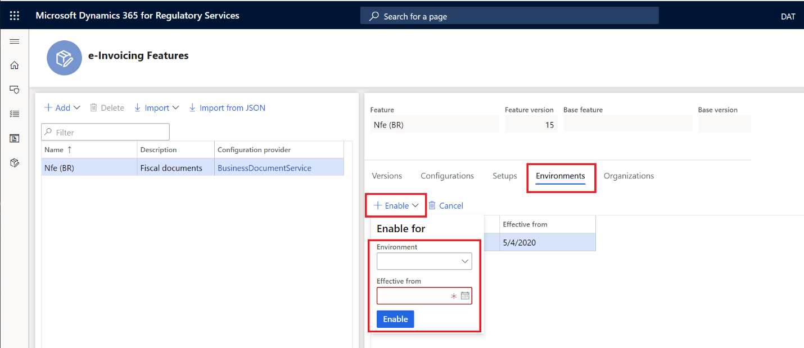

### Change the status to Completed

1. On the **e-Invoicing Features** page, on the **Versions** tab, select the version of the e-Invoicing feature that has a status of **Draft**.
2. Select **Change status \> Complete**.

### Change the status to Publish

1. On the **e-Invoicing Features** page, on the **Versions** tab, select the version of the e-Invoicing feature that has a status of **Completed**.
2. Select **Change status \> Publish**.

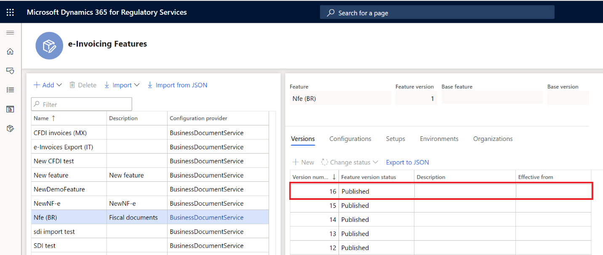

## Set up Electronic invoicing add-on integration in Finance or Supply Chain Management

During setup, you will complete these tasks:

1. Turn on the NF-e Federal feature for Brazil.
2. Import the specific ER data model, the data model mapping, and the formats that are required for NF-e fiscal documents.
3. Import the ER configuration, and set up the response types that are required to update the status of the fiscal document after the submission process is returned.

### Turn on the NF-e Federal feature for Brazil

1. Go to **Organization administration \> Setup \> Electronic document parameters**.
2. On the **Features** tab, select the **Enable** check box in the row for feature reference **BR00053**.

### Import the ER data model mapping required for NF-e fiscal documents

1. Sign in to Finance.
2. In the **Electronic reporting** workspace, in the **Configuration providers** section, select the **Microsoft** tile. Make sure that this configuration provider is set to **Active**. For information about how to set a provider to **Active**, see [Create configuration providers and mark them as active](https://docs.microsoft.com/dynamics365/fin-ops-core/dev-itpro/analytics/tasks/er-configuration-provider-mark-it-active-2016-11).
3. Select **Repositories**.
4. Select **Global resource \> Open**.
5. Import **Fiscal documents mapping** configurations.

### Import ER configurations and set up the response types for fiscal documents

1. In the **Electronic reporting** workspace, in the **Configuration providers** section, select the **Microsoft** tile.
2. Select **Repositories**.
3. Select **Global resource \> Open**.
4. Import **NF-e error log import (BR)**, **NF-e response data import format (BR)**, and **NF-e response message import (BR)**.
5. Go to **Organization administration \> Setup \> Electronic document parameters**.
6. On the **Electronic document** tab, select **Add**.
6. In the **Table name** field, enter **Fiscal document header**.
7. In the **Document context** field, select **Customer invoice context model – Fiscal document context**.
8. Select **Response types**.
9. Select **New**, and then, in the **Response type** field, select **Response**.
10. In the **Submission status** field, select **Pending**.
11. In the **Model mapping** field, select **Response message import format – Model mapping from response message**.
12. Select **Save**.
13. Select **New**, and then, in the **Response type** field, enter **ResponseData**.
14. In the **Submission status** field, select **Pending**.
15. In the **Model mapping** field, select **NFe response data import format – Response data import**.
16. Select **Save**.

## Electronic invoice processing

During processing in Finance, you will complete these tasks:

1. Submit a fiscal document through the Electronic invoicing add-on.
2. View the submission execution logs and review the results of processing.
3. Submit the cancellation of a fiscal document through the Electronic invoicing add-on.

### Submit NF-e fiscal documents for SEFAZ authorization 

After you turn on the **Configurable Electronic invoicing add-on integration** feature, the old process for submitting NF-e fiscal documents for authorization (**Export/Import NF-e process**) can no longer be used. It's replaced by a new process that is named **Submit electronic documents**.

> [!NOTE]
> Before you continue, make sure that you have one or more customer fiscal documents model 55 that were issued by the customer's fiscal establishment. The direction for these fiscal documents must be set to **Outgoing**, and the status must be **Created**. For more information, see [Issue customer fiscal document (Brazil)](https://docs.microsoft.com/dynamics365/finance/localizations/tasks/br-00038-issuing-customer-fiscal-document).

1. Go to **Organization administration \> Periodic \> Electronic documents \> Submit electronic documents**.
2. For the first submission of any document, always set the **Resubmit documents** option to **No**. If you must resubmit a document through the service, set this option to **Yes**.
3. On the **Records to include** FastTab, select **Filter** to open the **Inquiry** dialog box, where you can build a query to select documents for submission.
4. On the **Range** tab, select **Add**.
5. In the **Table** field, select **Fiscal document header**.
6. In the **Derived table** field, select **Fiscal document header**.
6. In the **Field** field, select **Number**.
7. In the **Criteria** field, enter the number of the fiscal document that should be submitted.
8. Select **OK** to close the **Inquiry** dialog box.
8. Select **OK** to submit the selected documents.

> [!NOTE]
> During your first attempt to submit a document through the service, you will be prompted to confirm the connection with the Electronic invoicing add-on. Select **Click here to connect to Electronic Document Submission Service**.

### View all submission logs

After you turn on the **Configurable Electronic invoicing add-on integration** feature, a new page is available that lets you follow up on the document submission process. You can use this page to view the submission logs for all submitted documents.

1. Go to **Organization administration \> Periodic \> Electronic documents \> Electronic document submission log**.
2. In the **Document type** field, select **Fiscal document header** to filter for fiscal documents only.
3. On the Action Pane, select **Inquiries \> Submission details** to view the details of the submission execution logs.

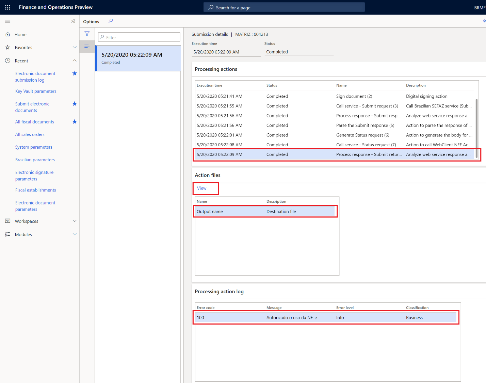

> [!NOTE] 
> For NF-e fiscal documents, the **Error code** column shows the return code that was returned by SEFAZ web services.

### View submission logs through the fiscal document page

After you turn on the **Configurable Electronic invoicing add-on integration** feature, you can also view the submission logs through the fiscal document page.

1. Go to **General ledger \> Inquiries and reports \> Fiscal documents \> All fiscal documents**.
2. Select a fiscal document that was previously submitted through the Electronic invoicing add-on.
3. On the Action Pane, on the **NF-e federal** tab, select **Electronic document log**.

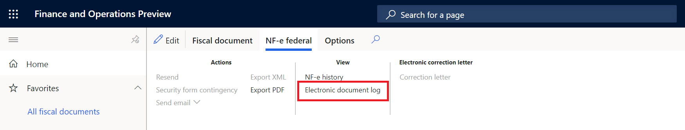

### Submit approved NF-e fiscal documents for SEFAZ cancellation

After you turn on the **Configurable Electronic invoicing add-on integration** feature, the old process for canceling NF-e fiscal documents can no longer be used. It's replaced by a new cancellation process that is embedded on the **Electronic document submission log** page.

> [!NOTE]
> Make sure that you've run the cancellation of the customer fiscal document for an approved NF-e fiscal document. For more information see, [Cancel customer fiscal document (Brazil)](https://docs.microsoft.com/dynamics365/finance/localizations/latam-bra-cancel-customer-fiscal-documents).

1. Go to **Organization administration \> Periodic \> Electronic documents \> Electronic document submission log**.
2. Select the fiscal document, and then select **Functions \> Send related submissions**.
3. Enter a description for the related submission, and then select **OK**.

### View cancellation submission logs

1. Go to **Organization administration \> Periodic \> Electronic documents \> Electronic document submission log**.
2. In the **Document type** field, select **Fiscal document header** to filter for fiscal documents only.
3. Select the fiscal document, and then, on the Action Pane, select **Inquiries \> Related submission**.

    Related submissions are submissions that are related to a main submission that was made first. For example, the submission that authorizes a specific NF-e is the main submission. The submission that requests the cancellation of the same NF-e in SEFAZ is a related submission. It exists only because it's requesting the cancellation of the job that was done through another submission.

    The **Related submissions** page shows all related submissions, and their submission status, for a given fiscal document. In the following illustration, the first line represents the submission that requested approval of the fiscal document. The second line represents the submission that canceled that fiscal document.

    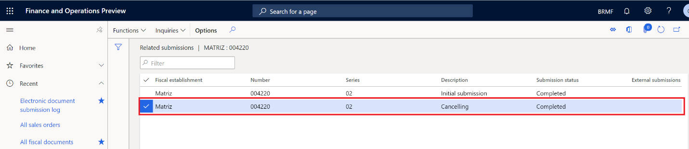

4. On the Action Pane, select **Inquiries \> Submission details** to view the details of the submission execution logs.

    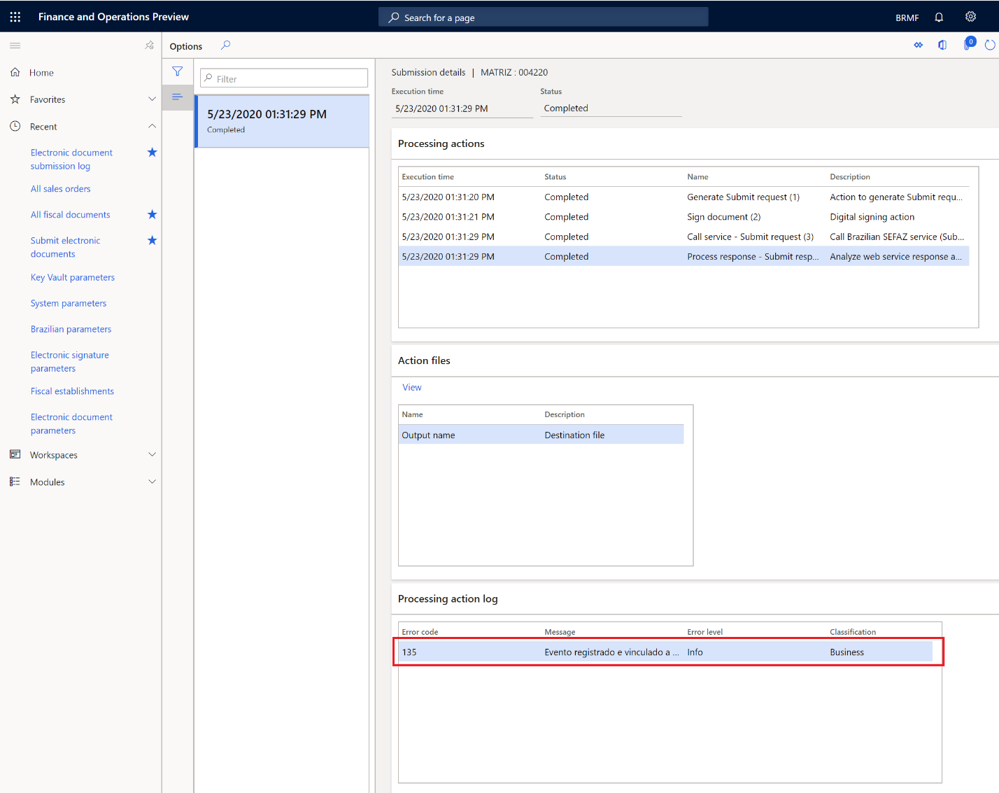

## Privacy notice
Enabling the BR-00053 (NF-e Federal) feature may require sending limited data, which includes the organization tax registration ID. This will be transmitted to third-party agencies authorized by the tax authority for purposes of sending electronic invoices to this tax authority in the predefined format required for integration with the government’s web service. An administrator can enable and disable the BR-00053 (NF-e Federal) feature by navigating to **Organization administration \> Setup \> Electronic document parameters**. Select the **Features** tab, select the row containing the BR-00053 feature, and then make the appropriate selection. Data imported from these external systems into this Dynamics 365 online service are subject to our [privacy statement](https://go.microsoft.com/fwlink/?LinkId=512132). Please consult the Privacy notice sections in country-specific feature documentation for more information.

## Additional resources

- [Electronic invoicing add-on overview](e-invoicing-service-overview.md)
- [Get started with the Electronic invoicing add-on](e-invoicing-get-started.md)
- [Set up the Electronic invoicing add-on](e-invoicing-setup.md)
