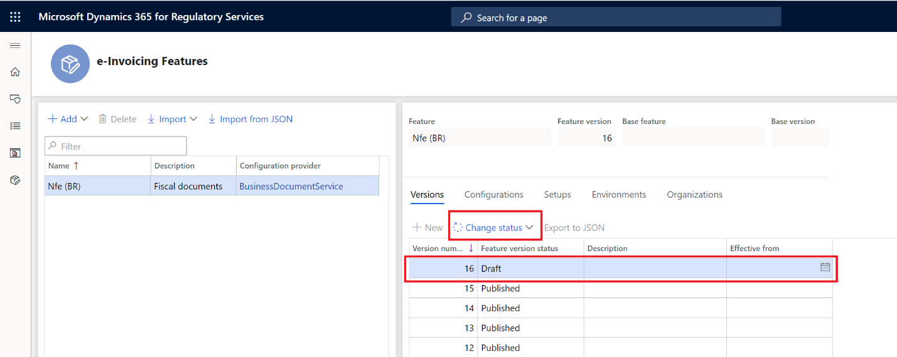

---
# required metadata

title: Get started with e-Invoicing services for Brazil
description: This topic provides information about how to get started with the e-Invoicing service for Brazil in Dynamics 365 Finance and Dynamics 365 Supply chain management.
author: gionoder
manager: AnnBe
ms.date: 06/24/2020
ms.topic: article
ms.prod: 
ms.service: dynamics-ax-platform
ms.technology: 

# optional metadata

ms.search.form: 
# ROBOTS: 
audience: Application User
# ms.devlang: 
ms.reviewer: kfend
ms.search.scope: Core, Operations
# ms.tgt_pltfrm: 
ms.custom: 97423
ms.assetid: 
ms.search.region: Global
# ms.search.industry: 
ms.author: janeaug
ms.search.validFrom: 2020-07-08
ms.dyn365.ops.version: AX 10.0.12

---

# Get started with e-Invoicing services for Brazil 

[!include [banner](../includes/banner.md)]
[!include [banner](../includes/preview-banner.md)]

> [!IMPORTANT]
> The e-Invoicing service for Brazil does not currently support all the functions that are available in the fiscal document integration that is built into Dynamics 365 Finance and Dynamics 365 Supply chain management.

This topic provides information about how to enable e-invoicing services for Brazil. This includes the configuration steps which are country-dependent in RCS
(Regulatory Configuration Services) and in Finance and Supply chain management. This topic also guides you through the process of submitting an NF-e fiscal document
(Electronic fiscal document model 55) through the service, and how review the results of processing over the status of the fiscal documents.

## Prerequisites

To complete these steps, you must first do or verify the following:

- Complete the steps in the topic, [Get started with e-invoicing service](e-invoicing-get-started.md).

## RCS setup

During the RCS setup you will:

- Import an e-invoicing feature for NF-e fiscal document
- Review the file formats required to submit NF-e for authorization
- Review the file formats required to request the cancellation of an approved NF-e
- Configure the event required to submit NF-e for authorization
- Configure the event required to request the cancellation of an approved NF-e
- Assign the e-invoicing feature to an e-invoicing service environment
- Publish the e-invoicing feature

The e-Invoicing feature is the generic name of the resource that is configured and published for consumption of e-invoicing service server. The e-Invoicing feature setup combines, among others, the usage of Electronic Report (ER) configuration formats to create configurable export and import files, and Actions and Actions flows, which allows the creation of configurable rules to send request, import response and parsing of the response contents.

## Import e-invoicing features

1. Sign into your RCS account
2. Go to **Globalization features workspace**, and then select **Features \> e-invoicing** tile.
3. Select **Import** to import a NF-e fiscal document e-invoicing feature from the Global repository.

4. Select the NF-e fiscal document feature, and then select **Import**.

### Create new version of NF-e fiscal document feature

1. On the **e-Invoicing Features** page, select the **Versions** tab.
2. Select **New**.

### Update the configuration version

1. On the **e-Invoicing Features** page, on the **Configurations** tab, select **Add** or **Delete** to manage the configuration version (ER file format configurations).

**Notes:**

- When you create a new version of the NF-e fiscal document feature, all configuration version (ER file formats) are inherited from the latest version.
- When you submit the NF-e fiscal document for authorization, the following configuration versions are required:

    - NFe submit export format
    - NFe response message import
    - NFe error log import

- To submit the NF-e cancellation, the following configuration version is required:

    - NFe cancel export format

2. Select a **Configuration version**, and then select **Edit** or **View** to access ER format designer to edit or view configuration.

> [!NOTE]
> Use the **Format designer** to edit or view the ER format file configurations. For more details, see [Create electronic document configurations](https://docs.microsoft.com/en-us/dynamics365/fin-ops-core/dev-itpro/analytics/electronic-reporting-configuration).

### Feature setup

1. On the **e-Invoicing Features** page, select the **Setups** tab.
2. Select **Add** or **Delete** to manage the Feature setup (NF-e events).

**Notes:**

- When you create a new version of the NF-e fiscal document feature that is derived from another e-invoicing feature, all Feature setups (NF-e events) are inherited from the latest version.
- To submit NF-e fiscal document for authorization, the Feature setup, **Submit** is required.
- For submitting NF-e cancellation the Feature setup, **Cancellation** is required.

### NF-e Submit event Feature setup

1. On the **e-Invoicing Features** page, on the **Setups** tab, in the **Feature setup** column, select **Submit**.
2. Select **Edit** button to open the **Feature version setup** page.

3. Select the **Actions** tab to manage the Actions list.

Review the actions required to submit an NF-e for authorization.

| Action ID | Action name                  | Action description                                                |
|-----------|------------------------------|-------------------------------------------------------------------|
| 1         | Transform document           | Create the NF-e XML file for submission.                          |
| 2         | Sign document                | Apply the digital certificate over the XML file.                  |
| 3         | Call Brazilian SEFAZ service | Submit the signed XML file to the web services for authorization. |
| 4         | Process response             | Acquire the web service response.                                 |
| 5         | Transform document           | Parse the content of the file received from as response.          |
| 6         | Transform document           | Create the XML file to inquire status of the submission status.   |
| 7         | Call Brazilian SEFAZ service | Submit the XML file requesting the submission status.             |
| 8         | Process response             | Acquire the web service response.                                 |

### Set up the URL for SEFAZ web services 

1. On the **Feature version setup** page, in the **Actions** section, select **Call Brazilian SEFAZ service** (Action ID = 3).
2. In the **Parameters** section, in the **URL address parameter** field, enter the URL of SEFAZ web service for NF-e submission.
3. In the **Actions** section, select **Call Brazilian SEFAZ service** (Action ID = 7).
4. In the **Parameters** section, in the **URL address parameter** field, enter the URL of SEFAZ web service for NF-e submission.

## **NF-e** cancellation event feature setup

1. On the **e-Invoicing Features** page, on the **Setups** tab, in the **Feature setup** column, select **Cancellation**.
2. Select **Edit** to open the **Feature version setup** page.
3. Select the **Actions** tab to manage the Actions list.

Review the actions required to request the cancellation of an approved NF-e.

| Action ID | Action name                  | Action description                                               |
|-----------|------------------------------|------------------------------------------------------------------|
| 1         | Transform document           | Create the NF-e cancellation XML file for submission.            |
| 2         | Sign document                | Apply the digital certificate over the XML file.                 |
| 3         | Call Brazilian SEFAZ service | Submit the signed XML file to the web services for cancellation. |
| 4         | Process response             | Acquire the web service response.                                |

### Set up the URL for SEFAZ web services

1. On the **Feature version setup** page, in the **Actions** section, select **Call Brazilian SEFAZ service** (Action ID = 3).
2. In the **Parameters** section, in the **URL address parameter** field, enter the URL of SEFAZ web service for cancellation of the approved NF-e.

### Enable an e-invoicing environment and assign a draft version

1. On the **e-Invoicing Features** page, on the **Environments** tab, select **Enable**.
2. Select the **Environment**, and then select the start date for when the environment is enabled**.**
3. Select **Enable**.

### Change the status to Complete 

1. On the **e-Invoicing Features** page, on the **Versions** tab, select the **Draft** version of the e-invoicing feature.
2. Select **Change status** \> **Complete**.

### Change the status to Publish

1. On the **e-Invoicing Features** page, on the **Versions** tab, select the **Complete** version of the e-invoicing feature.
2. Select **Change status** \> **Publish**.

## Set up e-Invoicing service integration in Finance or Supply chain management

During set up, you will:

- Import the specific ER data model, data model mapping, and formats required for NF-e fiscal document.
- Import the ER configuration, and set up the response types required to update the status of the Fiscal document after the return of the submission process.

## Import the ER data model, data model mapping, and formats required for NF-e fiscal documents

1. Sign into Finance and go to the **Electronic reporting** workspace.
2. In the **Configuration providers** group, select the **Microsoft** tile. Make sure this configuration provider is set to **Active**. For details about how to set a provider to **Active**, see [Create configuration providers and mark them as active](https://docs.microsoft.com/en-us/dynamics365/fin-ops-core/dev-itpro/analytics/tasks/er-configuration-provider-mark-it-active-2016-11).
3. Select **Repositories**.
4. Select **Global resource \>Open**.
5. Import the **Fiscal documents**, **Fiscal documents mapping, NF-e submit export format (BR), NF-e submit import format (BR), NF-e status request export format (BR), NF-e cancel export format (BR), NF-e discard export format (BR),** and **NF-e correction letter export format (BR).**

## Enable the Feature NF-e Federal for Brazil

1. Go to **Organization administration \> Setup \> Electronic document parameters**.
2. On the **Features** tab, enable **Feature reference = BR00053.**

## Import ER configuration and setup the response type for Fiscal documents

1. Go to the **Electronic reporting** workspace, and in the **Configuration providers** group, select the **Microsoft** tile.
2. Select **Repositories**.
3. Select **Global resource \> Open**.
4. Import the **NF-e error log import (BR)**, **NF-e response data import format (BR),** and **NF-e response message import (BR).**
5. Go to **Organization administration \> Setup \> Electronic document parameters** and on the Electronic document tab, select **Add**.
6. In the **Table name** field, enter **Fiscal document header.**
7. In the **Document context** field, select **Customer invoice context model – Fiscal document context.**
8. Select **Response types**.
9. Select **New**, and in the **Response type** field, select **Response**.
10. In the **Submission status** field, select **Pending.**
11. In the **Model mapping** field, select **Response message import format – Model mapping from response message**.
12. Select **Save**.
13. Select **New**, and in the **Response type** field, enter **ResponseData**.
14. In the **Submission status** field, select **Pending**.
15. In the **Model mapping** field, select **NFe response data import format – Response data import**, and then select **Save**.

## Electronic invoice processing

During processing in Finance, you will:

- Submit a created fiscal document through the e-invoicing services
- View the submission execution logs and acknowledge the results of processing
- Submit the cancellation of a fiscal document through the e-invoicing services

## Submit NF-e fiscal documents for SEFAZ authorization 

After you enable the **Configurable e-Invoicing Service integration** feature, the legacy process for submitting NF-e for authorization (**Export/Import NF-e process**) can no longer be used and is replaced by the new process called **Submit electronic documents.**

Make sure you have one or more customer fiscal document model 55s, issued by the customer’s fiscal establishment, with the direction set to **Outgoing** and with a fiscal document status of **Created.** For more information, see [Issue customer fiscal document (Brazil)](https://docs.microsoft.com/en-us/dynamics365/finance/localizations/tasks/br-00038-issuing-customer-fiscal-document).

1. Go to **Organization administration \> Periodic \> Electronic documents \> Submit electronic documents**.
2. Set the **Resubmit documents** field to **No** for the first submission of any document. Or, if you need to resubmit a document through the service, set the **Resubmit documents** field to **Yes**.
3. Expand the **Records to include** FastTab and then select **Filter** to build the query to select the documents for submission.
4. On the **Range** tab, select **Add**.
5. In the **Table** field, select **Fiscal document header** and in the **Derived table** field, select **Fiscal document header.**
6. In the **Field** field, select **Number**.
7. In the **Criteria** field, enter the number of the fiscal document to be submitted, and then select **OK** to close the **Filter query** dialog page.
8. Select **OK** to submit the selected documents for submission.

> [!NOTE]
> During your first attempt to submit a document through the services, you will be asked to confirm the connection with the e-Invoicing service. Select **Click here to connect to Electronic Document Submission Service**.

## View all submission logs

After you enable the **Configurable e-Invoicing Service integration** feature, a new page is available to follow up on the document submission process. You can use this page to see the submission logs for all submitted documents.

1. Go to **Organization administration \> Periodic \> Electronic documents \> Electronic document submission log**.
2. In the **Document type** field, select **Fiscal document header** to filter only fiscal documents
3. Select **Inquires** \> **Submission details**. The page will show you the details of submission execution logs.

> [!NOTE] 
> For the NF-e fiscal document, the **Error code** column contains the return code returned by SEFAZ web services.

## View the submission logs through the fiscal document form

After you enable the **Configurable e-Invoicing Service integration** feature, you can also see the submission logs through the fiscal document.

1. Go to **General ledger \> Inquires and reports \> Fiscal documents \> All fiscal documents**.
2. Select a fiscal document that was previously submitted through the e-Invoicing service.
3. On **NF-e federal** tab, select **Electronic document log**.

## Submit Approved NF-e fiscal documents for SEFAZ cancellation

After you enable the **Configurable e-Invoicing Service integration** feature, the legacy process for cancelling NF-e fiscal documents can’t be used anymore and is replaced by a new cancellation process that is embedded on **Electronic document submission log.**

Make sure you have executed the cancellation of the customer fiscal document for an approved NF-e fiscal document. For more information see, [Cancel customer fiscal document (Brazil)](https://docs.microsoft.com/en-us/dynamics365/finance/localizations/latam-bra-cancel-customer-fiscal-documents).

1. Go to **Organization administration \> Periodic \> Electronic documents \> Electronic document submission log** and select the fiscal document.
2. Select **Functions** \> **Send related submissions**.
3. Enter a **Description** for the related submission, and then select **OK**.

## View cancellation submission logs

1. Go to **Organization administration \> Periodic \> Electronic documents \> Electronic document submission log**.
2. In the **Document type** field, select **Fiscal document header** to filter only fiscal documents.
3. Select the fiscal document and then select **Inquires** \> **Related submission**.

Related submissions are submissions that are related to a main submission which was taken first. For example, a submission that authorized a certain NF-e is the main submission. The submission that requested the cancellation of this same NF-e in SEFAZ is called a related submission because it exists only because it is requesting the cancellation of the job done under another submission.

The page shows all related submissions, and their submission status, for a given fiscal document. In the following graphic, the first line represents the submission that requested the approval of the fiscal document. The second line represents the submission that cancelled that fiscal document.

4. Select **Inquire** \> **Submission details**. The page will show you the details of the submission execution logs.

# Related articles

- [e-Invoicing service overview](e-invoicing-service-overview.md)
- [Get started with e-Invoicing services](e-invoicing-get-started.md)
- [Set up e-Invoicing](e-invoicing-setup.md)

