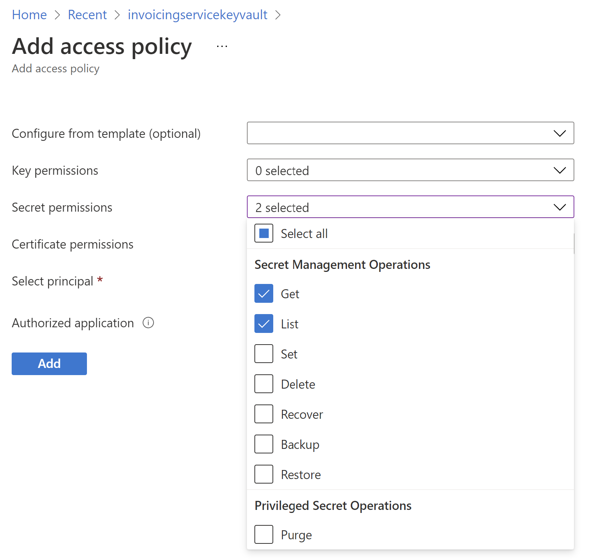

---
# required metadata

title: Create an Azure key vault in the Azure portal
description: This topic explains how to create a Microsoft Azure key vault for Electronic invoicing.
author: dkalyuzh
ms.date: 02/14/2021
ms.topic: article
ms.prod: 
ms.technology: 

# optional metadata

ms.search.form: 
audience: 
# ms.devlang: 
ms.reviewer: kfend
# ms.tgt_pltfrm: 
ms.custom: 
ms.assetid: 
ms.search.region: 
# ms.search.industry: 
ms.author: kfend
ms.search.validFrom: 
ms.dyn365.ops.version: 

---

# Create an Azure key vault in the Azure portal

[!include [banner](../includes/banner.md)]

All the secrets and certificates that are used in the Electronic invoicing service must be stored in a Microsoft Azure key vault. This approach helps ensure that you don't work directly with the secrets, and that the secrets are securely stored. When you must use digital signing or secure a connection to external web services, set the reference to the Key Vault secrets and certificates instead of using the secrets and certificates directly.

1. Create a key vault in the tenant where Regulatory Configuration Service (RCS) is installed. For more information, see [Create a key vault using the Azure portal](/azure/key-vault/general/quick-create-portal).

   Next, you must set up the access policy to grant the Electronic invoicing service the correct level of secure access to the secret that you created.

2. Go to **Settings** \> **Access policies**, and select **Add Access Policy**.
3. In the **Secret permissions** field, select the **Get** and **List** operations.

    

4. In the **Certificate permissions** field, select the **Get** and **List** operations.
5. In the **Select principal** field, select **None selected**.
6. In the **Principal** dialog box, select the principal by adding **e-Invoicing Service**.

    > [!NOTE]
    > If **e-Invoicing Service** isn't in the list of principals in your tenant, run the following command in the Azure portal.
    >
    > `New-AzureADServicePrincipal -AppId "ecd93392-c922-4f48-9ddf-10741e4a9b65"`

7. Select **Add**, and then select **Save**.
8. On the **Overview** page, copy the value of the Domain Name System (DNS) name for the key vault. This value will be used during the setup of the service in RCS and will be referred as the **Key Vault URI** value. For more information about how to set up RCS, see [Set up Regulatory Configuration Services (RCS)](e-invoicing-set-up-rcs.md).
