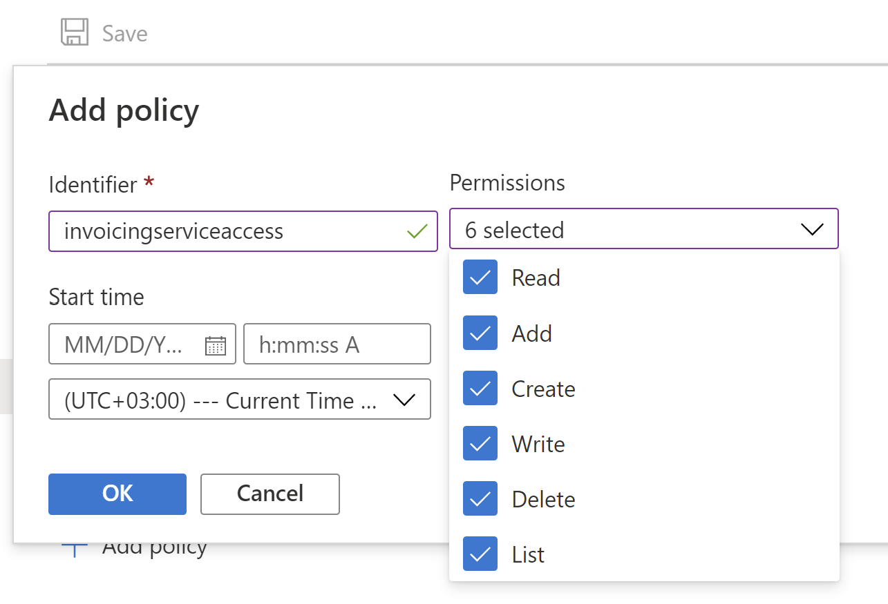

---
# required metadata

title: Create Azure Storage account in Azure portal
description: This topic provides description of the process of creation Azure storage account for Electronic invoicing.
author: dkalyuzh
ms.date: 01/26/2022
ms.topic: article
ms.prod: 
ms.technology: 

# optional metadata

ms.search.form: 
# ROBOTS: 
audience: Application User
# ms.devlang: 
ms.reviewer: kfend
# ms.tgt_pltfrm: 
ms.custom: 
ms.assetid: 
ms.search.region: Global
# ms.search.industry: 
ms.custom: 
ms.author: dkalyuzh
ms.search.validFrom: 
ms.dyn365.ops.version: 

---

# Create an Azure Storage account in Azure portal

[!include [banner](../includes/banner.md)]

All electronic files that are generated by the Electronic invoicing service, or come to the Electronic invoicing service during processing, are stored in your Azure storage account containers. To make sure Electronic invoicing can access the storage, provide a Shared access signature (SAS) token of the Azure storage account to the Electronic invoicing service. To store the token securely, don't provide the SAS tokendirectly. Instead, store it in the Azure Key Vault, and provide a Key Vault secret instead.

1. Open the storage account that you plan to use with the Electronic invoicing service.
2. Make sure that the configuration parameter **Allow Blob public access** is set to **Enabled** for the storage account.
3. Go to **Data storage** > **Containers**, and create a new container.
4. Enter a name for the container, and set the **Public access level** field to **Private (no anonymous access)**.
5. Open the container, and go to **Settings** > **Access policy**.
6. Select **Add policy** to add a stored access policy.
7. Set the **Identifier** and **Permissions** fields as appropriate. In the **Permissions** field, select all permissions.
   
   

8. Enter the start and end dates. The end date should be in future.
9. Select **OK** to save the policy, and then save your changes to the container.
10. Go to **Settings** > **Shared access tokens**, and set the field values.
11. Enter the start and end dates. The end date should be in future.
12. In the **Permissions** field, select the following permissions: 

    - **Read**
    - **Add**
    - **Create**
    - **Write**
    - **Delete**
    - **List**
    
14. Select **Generate SAS token and URL**.
15. Copy and store the value in the **Blob SAS URL** field. This value is referred to as the *shared access signature URI*.
16. Open the key vault that you intend to use with Electronic invoicing and go to **Settings** > **Secrets**, and select **Generate/Import** to create a new secret.
17. On the **Create a secret** page, in the **Upload options** field, select **Manual**.
18. Enter the name of the secret. This name will be used during setup of the service in Regulatory Configuration Service (RCS) and will be referred to as the *key vault secret name*.
19. In the **Value** field, enter the *shared access signature URI* that you copied earlier, and then select **Create**.
