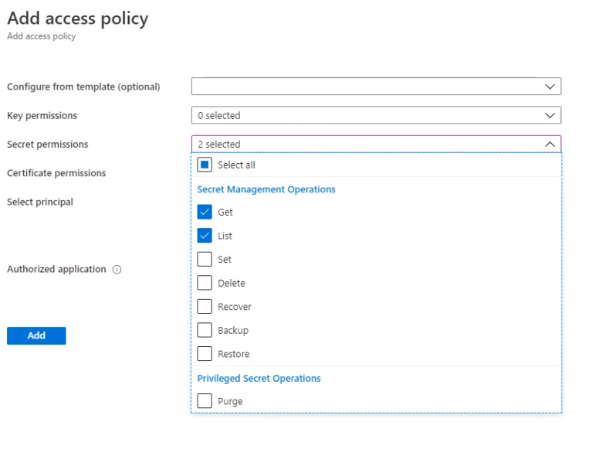
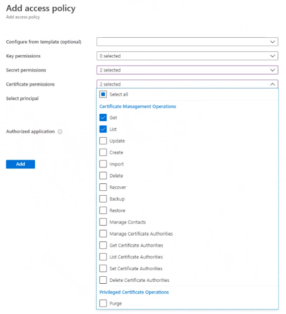

---
# required metadata

title: Create an Azure storage account and a key vault
description: This topic explains how to create an Azure storage account and key vault. 
author: gionoder
ms.date: 08/17/2021
ms.topic: article
ms.prod: 
ms.technology: 

# optional metadata

ms.search.form: 
# ROBOTS: 
audience: Application User
# ms.devlang: 
ms.reviewer: kfend
# ms.tgt_pltfrm: 
ms.custom: 97423
ms.assetid: 
ms.search.region: Global
# ms.search.industry: 
ms.author: janeaug
ms.search.validFrom: 2020-07-08
ms.dyn365.ops.version: AX 10.0.12

---

# Create an Azure storage account and a key vault

[!include [banner](../includes/banner.md)]

## Prerequisites

Before you can complete the steps in this topic, you must make sure that the following tasks have been completed:

- Create a key vault resource in Azure. For more information, see [About Azure Key Vault](/azure/key-vault/general/overview).
- Create an Azure storage account (Blob storage). For more information, see [Maintaining Azure Storage Account](/azure/storage/blobs/).

## Overview

In this topic, you will complete two main steps:

- Set up the Azure storage account to get the storage account URI.
- Set up the key vault to store the storage account URI.

## Set up the Azure storage account to get the storage account URI

1. Open the storage account that you plan to use with Electronic invoicing.
2. Go to **Data storage** > **Containers**, and create a new container.
3. Enter a name for the container, and set the **Public access level** field to **Private (no anonymous access)**.
4. Open the container, and go to **Settings** > **Access policy**.
5. Select **Add policy** to add a stored access policy.
6. Set the **Identifier** and **Permissions** fields as appropriate. In the **Permissions** field, you should select all permissions.

    

7. Enter the start and expiry dates. The expiry date should be in future.
8. Select **OK** to save the policy, and then save your changes to the container.
9. Go to **Settings** > **Shared access tokens**, and set the field values. 
10. Enter the start and end dates. The end date should be in future.
11. In the **Permissions** field, select the following permissions: **Read**, **Add**, **Create**, **Write**, **Delete**, and **List**. 
12. Select **Generate SAS token and URL**.
13. Copy and store the value in the **Blob SAS URL** field. This value will be used in the next procedure and will be referred to as the *shared access signature URI*.

## Set up the key vault to store the storage account URI

1. Open the key vault that you intend to use with Electronic invoicing.
2. Go to **Settings** \> **Secrets**, and then select **Generate/Import** to create a new secret.
3. On the **Create a secret** page, in the **Upload options** field, select **Manual**.
4. Enter the name of the secret. This name will be used during setup of the service in Regulatory Configuration Service (RCS) and will be referred to as the *key vault secret name*.
5. In the **Value** field, enter the shared access signature URI that you copied in the previous procedure, and then select **Create**.
6. Set up the access policy to grant Electronic invoicing the correct level of secure access to the secret you created. Go to **Settings \> Access policy**, and select **Add Access Policy**.
7. Set the secret permissions for the **Get** and **List** operations.

    

8. Set the certificate permissions for **Get** and **List** operations.

    

9. In the **Select principal** field, select **None selected**.
10. In the **Principal** dialog box, select the principal by adding **e-Invoicing Service**.
11. Select **Add**, and then select **Save**.
12. On the **Overview** page, copy the **DNS name** value for the key vault. This value will be used during setup of the service in RCS and will be referred as the *key vault URI*.

> [!NOTE]
> For additional security on the storage account, configure the Azure Defender for Storage.
> 
> For more information, see [Introduction to Azure Defender for Storage](/azure/security-center/defender-for-storage-introduction).

[!INCLUDE[footer-include](../../includes/footer-banner.md)]
