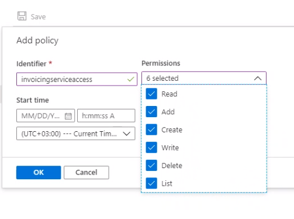

---
# required metadata

title: Create an Azure storage account and a key vault
description: This topic explains how to create an Azure storage account and key vault. 
author: gionoder
manager: AnnBe
ms.date: 09/22/2020
ms.topic: article
ms.prod: 
ms.service: dynamics-ax-platform
ms.technology: 

# optional metadata

ms.search.form: 
# ROBOTS: 
audience: Application User
# ms.devlang: 
ms.reviewer: kfend
ms.search.scope: Core, Operations
# ms.tgt_pltfrm: 
ms.custom: 97423
ms.assetid: 
ms.search.region: Global
# ms.search.industry: 
ms.author: janeaug
ms.search.validFrom: 2020-07-08
ms.dyn365.ops.version: AX 10.0.12

---

# Create an Azure storage account and a key vault

[!include [banner](../includes/banner.md)]

The Electronic invoicing add-on service takes responsibility for storing all your business data in the Microsoft Azure resources that are owned by your company. To ensure that the service works correctly, and that all the business data that is needed for and generated by the Electronic invoicing add-on is accessed only by the add-on, you must create two main Azure resources:

- An Azure storage account (Blob storage) to store electronic invoices
- An Azure key vault to store certificates and the Uniform Resource Identifier (URI) of the storage account

> [!NOTE]
> A dedicated key vault resource and customer Blob storage must be allocated specifically for use with the Electronic invoicing add-on.

## Prerequisites

Before you can complete the steps in this topic, you must make sure that the following tasks have been completed:

- Create a key vault resource in Azure. For more information, see [About Azure Key Vault](https://docs.microsoft.com/azure/key-vault/general/overview).
- Create an Azure storage account (Blob storage). For more information, see [Maintaining Azure Storage Account](https://docs.microsoft.com/azure/storage/blobs/).

## Overview

In this topic, you will complete two main steps:

- Set up the Azure storage account to get the storage account URI.
- Set up the key vault to store the storage account URI.

## Set up the Azure storage account to get the storage account URI

1. Open the storage account that you plan to use with the Electronic invoicing add-on.
2. Go to **Blob service** \> **Containers**, and create a new container.
3. Enter a name for the container, and set the **Public access level** field to **Private (no anonymous access)**.
4. Open the container, and go to **Settings \> Access policy**.
5. Select **Add policy** to add a stored access policy.
6. Set the **Identifier** and **Permissions** fields as appropriate. In the **Permissions** field, you should select all permissions.

    

7. Enter the start and expiry dates. The expiry date should be in future.
8. Select **OK** to save the policy, and then save your changes to the container.
9. Return to the storage account, and open **Storage Explorer (preview)**.
10. Right-click the container, and then select **Get Shared Access Signature**.
11. In the **Shared Access Signature** dialog box, copy and store the value in the **URI** field. This value will be used in the next procedure and will be referred to as the *shared access signature URI*.

    

## Set up the key vault to store the storage account URI

1. Open the key vault that you intend to use with the Electronic invoicing add-on.
2. Go to **Settings** \> **Secrets**, and then select **Generate/Import** to create a new secret.
3. On the **Create a secret** page, in the **Upload options** field, select **Manual**.
4. Enter the name of the secret. This name will be used during setup of the service in Regulatory Configuration Service (RCS) and will be referred to as the *key vault secret name*.
5. In the **Value** field, select **Shared Access Signature URI**, and then select **Create**.
6. Set up the access policy to grant the Electronic invoicing add-on the correct level of secure access to the secret you created. Go to **Settings \> Access policy**, and select **Add Access Policy**.
7. Set the secret permissions for the **Get** and **List** operations.

    

8. Set the certificate permissions for **Get** and **List** operations.

    

9. In the **Principal** dialog box, select the principal by adding **Electronic invoicing add-on**.
10. Select **Add**, and then select **Save Key Vault changes**.
11. On the **Overview** page, copy the **DNS name** value for the key vault. This value will be used during setup of the service in RCS and will be referred as the *key vault URI*.
