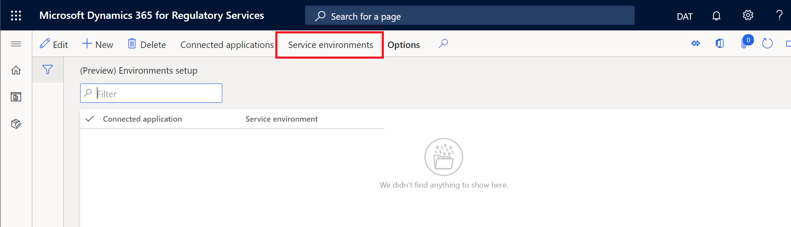
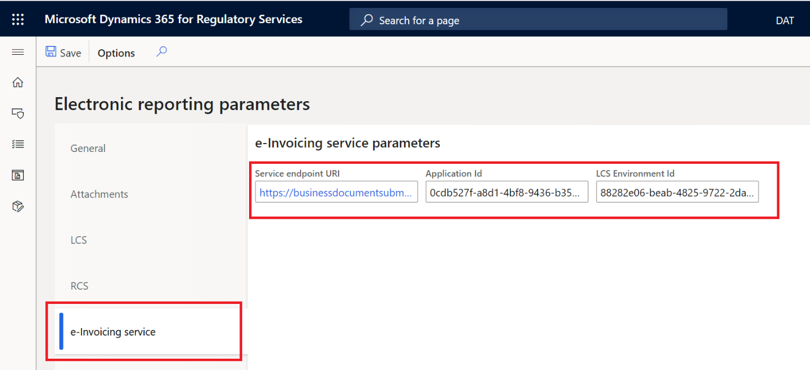
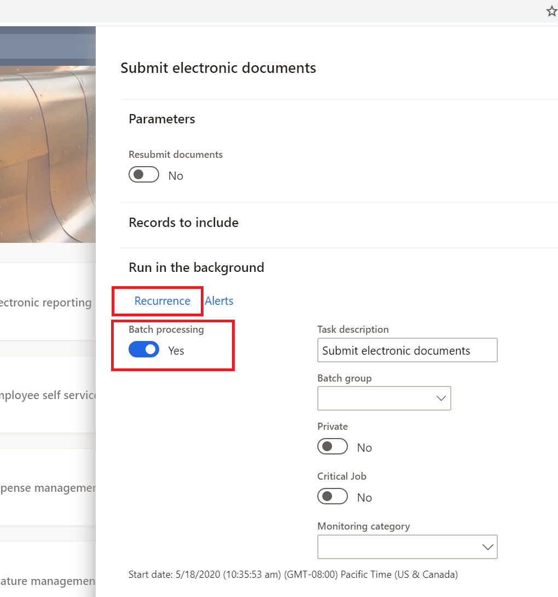

---
# required metadata

title: Get started with the Electronic invoicing add-on
description: This topic provides information that will help you get started with the Electronic invoicing add-on in Microsoft Dynamics 365 Finance and Dynamics 365 Supply Chain Management.
author: gionoder
manager: AnnBe
ms.date: 10/08/2020
ms.topic: article
ms.prod: 
ms.service: dynamics-ax-platform
ms.technology: 

# optional metadata

ms.search.form: 
# ROBOTS: 
audience: Application User
# ms.devlang: 
ms.reviewer: kfend
ms.search.scope: Core, Operations
# ms.tgt_pltfrm: 
ms.custom: 97423
ms.assetid: 
ms.search.region: Global
# ms.search.industry: 
ms.author: janeaug
ms.search.validFrom: 2020-07-08
ms.dyn365.ops.version: AX 10.0.12

---

# Get started with the Electronic invoicing add-on

[!include [banner](../includes/banner.md)]

This topic provides information that will help you get started with the Electronic invoicing add-on. First, it guides you through the configuration steps in Microsoft Dynamics Lifecycle Services (LCS), Regulatory Configuration Services (RCS), and Dynamics 365 Finance. Next, it describes the process for submitting documents through the service by using Dynamics 365 Finance or Dynamics 365 Supply Chain Management. You will also learn how to interpret the submission logs.

## Availability

The Electronic invoicing add-on is initially available for several countries. The add-in supports creating electronic invoices and submitting the following business documents:

| Country/Region  | Business document                          |
|-----------------|--------------------------------------------|
| Austria         | Sales and Project invoices                 |
| Belgium         | Sales and Project invoices                 |
| Brazil          | Electronic fiscal document model 55 (NF-e) |
| Denmark         | Sales and Project invoices                 |
| Estonia         | Sales and Project invoices                 |
| Finland         | Sales and Project invoices                 |
| France          | Sales and Project invoices                 |
| Germany         | Sales and Project invoices                 |
| Italy           | Sales and Project invoices                 |
| Mexico          | CFDI invoice                               |
| Netherlands     | Sales and Project invoices                 |
| Norway          | Sales and Project invoices                 |
| Spain           | Sales and Project invoices                 |
| Europe          | PEPPOL Sales and Project invoices          |
    
## Licensing

You can use the Electronic invoicing add-on with your current license. No additional licenses are required to use the service.

## Prerequisites

Before you complete the steps in this topic, you must have the following prerequisites in place:

- Access to your LCS account.
- An LCS deployment project that includes Finance or Supply Chain Management version 10.0.13 or later.
- Access to your RCS account.
- Turn on the Globalization feature for your RCS account through the **Feature management** module. For more information, see [Regulatory Configuration Services (RCS) - Globalization features](rcs-globalization-feature.md)
- Create a key vault resource and a storage account in Azure. For more information, see [Create Azure Storage Account and Key Vault](e-invoicing-create-azure-storage-account-key-vault.md).

## Overview

The following illustration shows the five main steps that you will complete in this topic.

1. **Azure resources setup:** Configure Azure storage and the upload of digital certificates in Azure Key Vault.
2. **LCS setup:** Install the add-in for microservices.
3. **RCS setup:** Set up the environment, user access, and e-Invoicing features.
4. **Client setup:** Set up the connection between the client and the Electronic invoicing add-on, and turn off the old features for submitting and receiving responses for electronic documents.
5. **Submit invoices:** Submit electronic documents through the Electronic invoicing add-on, and receive responses.

> [!NOTE]
> Some configuration steps in this topic are common and country/region-agnostic. The steps and setup procedures that are country/region-specific are described in country/region-specific topics.

## LCS setup

1. Sign in to your LCS account.
2. Select the **Preview feature management** tile, and in the **Public Preview features** field group, select **BusinessDocumentSubmission**.
3. Mark the **Preview feature enabled** field.
4. Select the LCS deployment project. Before you can select the project, it must be up and running.
5. On the **Environment add-ins** FastTab, select **Install a new add-in**.
6. Select **Business Document Submission**.
7. In the **Setup add-in** dialog box, in the **AAD application ID** field, enter **091c98b0-a1c9-4b02-b62c-7753395ccabe**. This value is a fixed value.
8. In the **AAD tenant ID** field, enter the ID of your Azure subscription account.

    

9. Select the check box to accept the terms and conditions.
10. Select **Install**.

## RCS setup

During the RCS setup, you will complete these tasks:

1. Set up the key vault in RCS.
2. Set up the RCS integration with the Electronic invoicing add-on server.
3. Create an Electronic invoicing add-on environment for your organization.

### Set up the key vault in RCS

1. Sign in to your RCS account.
2. In the **Globalization features** workspace, in the **Environments** section, select the **e-Invoicing** tile.
3. Select **Service environments**.

    

> [!NOTE]
> The option **Connected applications** grants access for the automatic configuration of the Electronic invoicing add-on in Finance or Supply Management through the RCS. However currently, this feature is still under development.

4. On the Action Pane, select **Key Vault parameters**.

    

5. On the Action Pane, select **New** to add a key vault.
6. In the **Key Vault URI** field, enter the **DNS name** attribute value of the key vault resource that you configured in Azure. For information about where to find the **DNS name** value, see [Create Azure Storage Account and Key Vault](e-invoicing-create-azure-storage-account-key-vault.md).

    

7. On the **Certificates** FastTab, select **Add** to enter all digital certificate names and key vault secrets that are needed to establish trustable connections. In the  **Type** column, you can specify if it is a Certificate or a Secret. Both sets of values are configured on the key vault resource in Azure.

    

8. If your country/region-specific invoice requires a chain of certificates to apply a digital signature, select **Chain of certificates** on the Action Pane, and then enter the sequence of certificates or key vault secrets that make up the chain.

### Set up the RCS integration with the Electronic invoicing add-on server

1. In the **Globalization features** workspace, in the **Related settings** section, select the **Electronic reporting parameters** link.
2. Select **Click here to connect to Lifecycle Service**. If you don't want to connect to LCS, select **Cancel**.
3. On the **e-Invoicing services** tab, in the **Service endpoint URI** field, enter the value according to the available geographies: `https://businessdocumentsubmission.us.operations365.dynamics.com/` or `https://businessdocumentsubmission.eu.operations365.dynamics.com/`.
4. In the **Application ID** field, verify that it shows the ID **0cdb527f-a8d1-4bf8-9436-b352c68682b2**. This value is a fixed value.
5. In the **LCS Environment ID** field, enter the ID of your LCS subscription account.

### Add an Electronic invoicing add-on environment

You can create different environments for the Electronic invoicing add-on, such as Dev, Test, or Production environments.

1. In the **Globalization features** workspace, in the **Environments** section, select the **e-Invoicing** tile.
2. Select **New** to create an environment.
3. In the **Storage SAS token account** field, enter the name of the key vault secret that you configured in the key vault in RCS.

    

4. On the **Users** FastTab, select **New** to grant access to users for this environment.

    

5. On the Action Pane, select **Publish** to publish the environment to the Electronic invoicing add-on server.

    

### e-Invoicing feature setup

"The e-Invoicing feature" is the generic name for the resource that is configured and published to consume the Electronic invoicing add-on server. The setup of the e-Invoicing feature combines, among other things, the use of Electronic reporting (ER) configuration formats to create configurable export and import files, and the use of actions and action flows to enable the creation of configurable rules to send requests, import responses, and parse the response contents.

Because of variations in invoice formats and action flows, the e-Invoicing feature setup is country/region-dependent.

## Set up Electronic invoicing add-on integration in Finance or Supply Chain Management 

During this setup, you will complete the following tasks:

1. Open flighted feature
2. Turn on the Electronic invoicing add-on integration feature to enable integration with Finance.
3. Set up the URL of the Electronic invoicing add-on endpoint.
4. Import the ER configurations that are related to the country/region-specific e-Invoicing feature.
5. Turn on the applicable country/region-specific e-Invoicing feature.
6. Import the ER configurations and set up the response types that are required to update your country/region-specific invoice document as a result of the submission process.

### Open flighted feature
The Electronic invoice integration feature is enabled via flighting. Flighting is a concept that allows a feature to be ON or OFF by default. The following steps enable a flight in a non-production environment. 

1. Execute the following SQL command:

    INSERT INTO SYSFLIGHTING (FLIGHTNAME, ENABLED) VALUES ('BusinessDocumentSubmissionServiceEnabled', 1)
    
    INSERT INTO SYSFLIGHTING (FLIGHTNAME, ENABLED) VALUES ('ElectronicInvoicingServiceIntegrationFeature', 1)
    
2. After making the above change, perform an IISReset on all AOS's

### Turn on the Electronic invoicing add-on integration feature

1. Sign in to Finance or Supply Chain Management.
2. In the **Feature management** workspace, search for the new feature, **Configurable Electronic invoicing add-on integration**. If the feature is still not shown in Feature management page, run **Check for updates** function
3. Select the feature, and then select **Enable now**.

### Set up the service endpoint URL

1. Go to **Organization administration \> Setup \> Electronic document parameters**.
2. On the **Submission service** tab, in the **Service endpoint URL** field, enter `https://businessdocumentsubmission.us.operations365.dynamics.com/`.
3. In the **Environment** field, enter the name of the Electronic invoicing add-on environment that you created during RCS setup.

### Import the ER configurations

To enable business data to be collected and sent to the Electronic invoicing add-on, you must import the ER data model and ER data model configuration
that are related to the country/region-specific e-Invoicing feature that you want to use.

1. In the **Electronic reporting** workspace, in the **Configuration providers** section, select the **Microsoft** tile. Make sure that this configuration provider is set to **Active**. For information about how to set a provider to **Active**, see [Create configuration providers and mark them as active](https://docs.microsoft.com/dynamics365/fin-ops-core/dev-itpro/analytics/tasks/er-configuration-provider-mark-it-active-2016-11).
3. Select **Repositories**.
4. Select **Global resource**, and then select **Open**.
5. In the **Connect to Lifecycle Services** dialog box, select **Click here to connect to Lifecycle Service**.
6. Depending on the country or region where you want to use the e-Invoicing feature, you must import the applicable data model, data model mapping, and formats. For information about the ER configurations that you should import, see the country/region-specific "Get started with the Electronic invoicing add-on" topic.
7. Import **Customer invoice context model**. This model contains additional parameters that describe, among other things, the environment in Finance that is used for the Electronic invoicing add-on during the submission of business data.

### Turn on country/region-specific e-Invoicing features

To turn on country/region-specific e-Invoicing features so that they work with the Electronic invoicing add-on, you must turn on the feature in each legal entity where you want to use it. Afterward, the old electronic invoicing integration can no longer be used, and the integration with the new Electronic invoicing add-on is turned on.

1. Go to **Organization administration \> Setup \> Electronic document parameters**.
2. On the **Features** tab, in the row for the feature that is related to your country/region-specific e-Invoicing feature, select the check box in the **Enabled** column. For information about which feature you should turn on, see the country/region-specific "Get started with the Electronic invoicing add-on" topic.

> [!NOTE]
> If you have multiple legal entities that are configured for different countries or regions, you can turn on the country/region-specific e-Invoicing feature for each legal entity.

### Import ER configurations and set up the response types to update your country/region-specific invoice document

If the submitted invoice document requires an update after the response of the submission to the government authorization services, you must import a special ER data model and configurations to enable the status of the invoice document or any other additional field to be updated.

1. In the **Electronic reporting** workspace, in the **Configuration providers** section, select the **Microsoft** tile.
2. Select **Repositories**.
3. Select **Global resource**, and then select **Open**.
4. Import **Response message model**, **Response message import format**, **Response message model mapping to destination**, and **File contents import format**.
5. Go to **Organization administration \> Setup \> Electronic document parameters**.
6. On the **Electronic document** tab, select **Add** to enter the name of the table that is related to your country/region-specific invoice document. For information about which table names you should select, see the country/region-specific "Get started with the Electronic invoicing add-on" topic.
7. Select **Response types** to configure the response types. For information about which table names you should select, see the country/region-specific "Get started with the Electronic invoicing add-on" topic.

## e-Invoicing feature names by country 
The following table describes other e-Invoicing features available to download from the Electronic reporting Global repository to generate electronic invoices.
In RCS, you can download the e-Invoicing features listed in this table, the ER configurations, and the available e-Invoicing feature setups.
In Finance, you can enable the related feature references on the **Electronic document parameters** page to issue electronic invoices for these countries. For more information, see the section, [Turn on country/region-specific e-Invoicing features](#region-specific) earlier in this topic.

| Feature name                      | Description                                 | ER configurations                                                                                                  | Setups                                                                                                                                                         | Country/Region  | Feature reference      |
|-----------------------------------|---------------------------------------------|--------------------------------------------------------------------------------------------------------------------|----------------------------------------------------------------------------------------------------------------------------------------------------------------|-----------------|------------------------|
| Austrian electronic invoices (AT) | Sales and Project invoices for Austria      | - OIOUBL Sales invoice  - OIOUBL Project invoice  - OIOUBL Sales credit note  - OIOUBL Project credit note | - Sales invoice generation (AT)  - Project invoice generation (AT)  - Sales credit note generation (AT)  - Project credit note generation (AT)         | Austria         | EUR-00023              |
| Belgian electronic invoice (BE)   | Sales and Project invoices for Belgium      | - UBL Sales invoice BE  - UBL Project invoice BE  - UBL Project credit note BE  - UBL Sales credit note BE | - Sales invoice generation (BE) - Project invoice generation (BE)  - Sales credit note generation (BE)  - Project credit note generation (BE)         | Belgium         | EUR-00023              |
| Danish electronic invoice (DK)    | Sales and Project invoices for Denmark      | - OIOUBL Sales invoice  - OIOUBL Project invoice  - OIOUBL Sales credit note  - OIOUBL   Project credit note | - Sales invoice generation (DK)  - Project invoice generation (DK)  - Sales credit note generation (DK) - Project credit note generation (DK)         | Denmark         | EUR-00023  DK-00001 |
| Dutch electronic invoice (NL)     | Sales and Project invoices for Netherlands  | - UBL Sales invoice NL  - UBL Project invoice NL  - UBL Sales credit note NL  - UBL   Project credit note NL | - Sale invoice generation (NL)   - Project invoice generation (NL)   - Sales credit note generation (NL)  - Project credit note generation (NL)          | The Netherlands | EUR-00023              |
| Estonian electronic invoice (EE)  | Sales and Project invoices for Estonia      | - Sales invoice (EE)   - Project invoice (EE)                                                                     | - Sales invoice generation (EE)  - Project invoice generation (EE)                                                                                           | Estonia         | EUR-00023              |
| Finnish electronic invoice (FI)   | Sales and Project invoices for Finland      | - Sales invoice (FI)  - Project invoice generation (FI)                                                          | - Sales invoice generation (FI)  - Project invoice generation (FI)                                                                                           | Finland         | EUR-00023              |
| French electronic invoice (FR)    | Sales and Project invoices for France    | - UBL Sales invoice FR   - UBL Project invoice FR   - UBL Sales credit note FR  - UBL   Project credit note FR | - Sales invoice generation (FR)   - Project invoice generation (FR)  - Sales credit note generation (FR)  - Project credit note generation (FR)         | France          | EUR-00023              |
| German electronic invoice (DE)    | Sales and Project invoices for Germany      |- Sales invoice (DE)   - Project invoice <DE>                                                                     | - Sales invoice generation (DE)  - Project invoice generation (DE)                                                                                           | Germany         | EUR-00023              |
| Norwegian electronic invoice (NO) | Sales and Project invoices for Norway       | - OIOUBL Sales invoice  - OIOUBL Project invoice  - OIOUBL Sales credit note  - OIOUBL Project credit note | - Sales invoice generation (NO)  - Project invoice generation (NO)  - Sales credit note generation (NO)  - Project credit note generation (NO)          | Norway          | EUR-00023  NO-00010 |
| Spanish electronic invoice (ES)   | Sales and Project invoices for Spain        | - Sales invoice (ES)  - Project invoice (ES)                                                                     | - Sales invoice generation (ES)  - Project invoice generation (ES)                                                                                           | Spain           | EUR-00023  ES-00025 |
| Italian electronic invoice (IT)   | Sales and Project invoices for Italy        | - (Preview) Sales invoice (IT)   - Project invoice (IT)                                                           | - Sales invoice   - Project   invoice                                                                                                                           | Italy           | EUR-00023  IT-00036 |
| PEPPOL electronic invoice         | PEPPOL Sales and Project invoice generation | - PEPPOL Sales invoice  - PEPPOL Project invoice  - PEPPOL Sales credit note   - PEPPOL   Project credit note | - PEPPOL Sales invoice generation  - PEPPOL Project invoice generation  - PEPPOL Sales credit note generation  - PEPPOL Project credit note generation |                 | EUR-00023              |

## Electronic invoice processing in Finance and Supply Chain Management

During processing, you will complete these tasks:

1. Submit a business document (invoice) through the Electronic invoicing add-on.
2. View the submission execution logs.

### Submit business documents

During the regular submission process, communication between the client and the Electronic invoicing add-on is bidirectional. The purpose is to accomplish two main tasks during submission of electronic documents:

1. Send all electronic documents that are pending submission from Finance, and that have the correct status for submission and meet the selection criteria.
2. Import, into Finance, the response that the Electronic invoicing add-on returns for previously submitted electronic documents. After import, the responses are parsed, and the status of the business documents is updated accordingly.

You can submit business documents either manually or based on your schedule requirements.

1. Go to **Organization administration \> Periodic \> Electronic documents \> Submit electronic documents**.
2. For the first submission of any document, always set the **Resubmit documents** option to **No**. If you must resubmit a document through the service, set this option to **Yes**.
3. On the **Records to include** FastTab, select **Filter** to open the **Inquiry** dialog box, where you can build a query to select documents for submission.

### Filter query

1. In the **Inquiry** dialog box, on the **Range** tab, enter filter criteria by using the **Table**, **Derived table**, **Field**, and **Criteria** fields.
2. Select **Add** to add as many additional criteria as you require to select the business documents.

    

3. Select **OK** to close the **Inquiry** dialog box.
4. Select **OK** to submit the selected business documents to the Electronic invoicing add-on.

    > [!NOTE]
    > During your first attempt to submit a document through the service, you will be prompted to confirm the connection with the Electronic invoicing add-on. Select **Click here to connect to Electronic Document Submission Service**.
    >
    > 
    >
    > If the connection is successful, you receive a confirmation message.
    >
    > 

5. Close the dialog box.

> [!NOTE]
> After each submission, the Action center shows the number of submitted documents.
>
> 

### Submission by batch

Instead of manually submitting documents, you can automate the submission process and run it in background, based on a configured frequency of batch execution.

1. In the **Submit electronic documents** dialog box, on the **Run in the background** FastTab, set the **Batch processing** option to **Yes**.
2. On the **Recurrence** tab, configure the batch processing frequency.

### View all submission logs

1. Go to **Organization administration \> Periodic \> Electronic documents \> Electronic document submission log**.
2. In the **Document type** field, select the document type to filter by.

    

    > [!IMPORTANT]
    > The value that is shown in the **Submission status** column represents the status that is related to the completion of the submission process itself. It indicates whether the flow of actions that is configured in RCS was run until the end, regardless of whether the electronic document was approved or rejected. The value in the **Submission status** column doesn't represent the status of the submitted document. You can view the status of the submitted document (that is, whether the document was approved or rejected) on the **Processing action log** FastTab in the submission log details, as described next.

3. On the Action Pane, select **Inquiries \> Submission details**.
4. View the submission log details.

    

The results that are shown in the submission log depend on how the e-Invoicing feature was set up in RCS. However, regardless of the setup, the submission log always has three FastTabs:

- **Processing actions** – This FastTab shows the execution log for the actions that are configured in the feature version that was set up in RCS. The **Status** column shows whether the action was successfully run.
- **Action files** – This FastTab shows the intermediate files that were generated during execution of the actions. You can select **View** to download the file and view its contents.
- **Processing action log** – This FastTab shows the results of the communication between the Electronic invoicing add-on and the target web service. It also shows what was returned by the web service processing.

## Related topics

- [Electronic invoicing add-on overview](e-invoicing-service-overview.md)
- [Get started with the Electronic invoicing add-on for Brazil](e-invoicing-bra-get-started.md)
- [Get started with the Electronic invoicing add-on for Mexico](e-invoicing-mex-get-started.md)
- [Get started with the Electronic invoicing add-on for Italy](e-invoicing-ita-get-started.md)
- [Set up the Electronic invoicing add-on](e-invoicing-setup.md)
