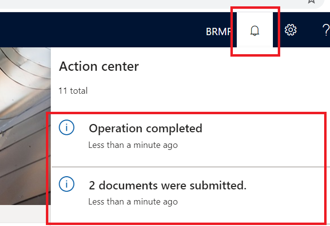

---
# required metadata

title: Get started with the e-Invoicing service 
description: This topic provides information about getting started with the e-Invoicing service in Dynamics 365 Finance and Dynamics 365 Supply chain management.
author: gionoder
manager: AnnBe
ms.date: 06/24/2020
ms.topic: article
ms.prod: 
ms.service: dynamics-ax-platform
ms.technology: 

# optional metadata

ms.search.form: 
# ROBOTS: 
audience: Application User
# ms.devlang: 
ms.reviewer: kfend
ms.search.scope: Core, Operations
# ms.tgt_pltfrm: 
ms.custom: 97423
ms.assetid: 
ms.search.region: Global
# ms.search.industry: 
ms.author: janeaug
ms.search.validFrom: 2020-07-08
ms.dyn365.ops.version: AX 10.0.12

---

# Get started with the e-Invoicing service 
[!include [banner](../includes/banner.md)]
[!include [banner](../includes/preview-banner.md)]

This topic provides information about how to get started using e-invoicing services. First, the topic will walk you through the configuration steps in Life Cycle Services (LCS), Regulatory Configuration Services (RCS), and in Microsoft Dynamics 365 Finance. Next, you will review the common process for submitting documents through the service using Dynamics 365 Finance or Dynamics 365 Supply chain management, and learn how to recognize the submission logs.

## Availability

The e-invoicing service is initially available for Brazil, Italy, and Mexico. The service supports creating the electronic invoice and submitting the following business documents:

- Brazil: Electronic fiscal document model 55 (NF-e) through integration with SEFAZ
- Mexico: CFDI invoice through integration with PAC Interfactura
- Italy: FatturaPA

## Licensing

You can use the e-Invoicing service with your current license. No additional licenses are required to use the service.

## Pre-requisites

To complete these steps, you must first do or verify the following:

- Access to your LCS account
- An LCS deployment project with Finance or Supply chain management version 10.0.12 or higher
- Access to your RCS account
- Enable the Globalization feature for your RCS account through the **Feature management** module. For more details, see [Regulatory Configuration Services (RCS) - Globalization features](rcs-globalization-feature.md)
- Create a Key vault resource and create a Storage Account in Azure. For more details, see [Create Azure Storage Account and Key Vault](e-invoicing-create-azure-storage-account-key-vault.md).

## Overview

The diagram below describes the five main steps to complete in this topic:

1. Azure resources setup: Configure Azure storage and uploading of digital certificates in Azure Key Vault.
2. LCS setup: Install the add-in for microservices.
3. RCS setup: Set up environment, user access, and e-Invoicing features.
4. Client setup: Set up the connection between the client and the e-Invoicing services, and switch off the legacy features for submitting and receiving responses for electronic documents.
5. Processing: Submit electronic documents through e-Invoicing services and receive responses.

> [!NOTE]
> There are configuration steps in this topic that are common and country agnostic. The steps and setup procedures that are country-specific are described in country-specific articles.

## LCS setup

1. Sign in to your LCS account.
2. Select the LCS deployment project. To select the project, it must be up and running.
3. On the **Environment add-ins** FastTab, select **Install a new add-in**.
4. Select the **e-invoicing service** add-in.
5. In the **AAD application ID** field, enter 091c98b0-a1c9-4b02-b62c-7753395ccabe. This is a fixed value.
6. In the **AAD tenant ID** field, enter the tenant ID of your Azure subscription account.

7. Mark the check box to accept the terms and conditions.
8. Select **Install**.

## RCS setup

During RCS setup, you will:

- Set up the Key vault in RCS
- Set up the RCS integration with the e-Invoicing service server
- Create an e-Invoicing service environment for your organization

### Set up Key vault in RCS

1. Sign into your RCS account.
2. Go to the **Globalization features** workspace and select **Environments** \> **e-invoicing** tile.
3. Select **Key Vault Parameters**.

4. Select **New** to add new key vault.
5. In the **Key Vault URI** field, enter the **DNS name** attribute of the Key Vault resource configured in Azure. For details about where to pick up the **DNS name,** see [Create Azure Storage Account and Key Vault](https://microsoft-my.sharepoint.com/:w:/p/gionoder/EboUH2wQu9BKouw2czCSXKEBSfGSVoduwzw9zHWhSkgKzQ?e=0SUp3G).

6. In the **Certificates** pane, select **Add** to enter the digital certificate names and the key vault secrets. Both of these are configured on the Key Vault resource in Azure.

7. In case your country invoice requires a chain of certificates for applying a digital signature, select **Chain of certificates**.
8. Enter the sequence of certificates or Key vault secrets that compose the chain.

### Set up the RCS integration with e-Invoicing service server

1. In the **Globalization features workspace**, select **Electronic reporting parameters** link under **Related links**.
2. Select **Click here to connect to Lifecycle Service**. You can skip connecting to LCS by selecting **Cancel**.
3. On **e-Invoicing service** tab, in the **Service endpoint URI** field, enter <https://businessdocumentsubmission.aksn2nc.westus2.dev-operations365.dynamics.com/>.
4. In the **Application ID** field, enter 2b66cba7-e0cc-4d1b-9cf8-cd173a0de201. This is a fixed value.
5. In the **LCS Environment ID** field, enter the tenant ID of your LCS subscription account.

### Add e-Invoicing service environment**

You can create different environments for e-Invoicing services, such as Dev, Test. or Production.

1. Go to **Globalization features workspace** and select **Environments** \> **e-invoicing** tile.
2. Select **New** to create a new environment.
3. Enter the value in the **Storage SAS token account** field as the name of the Key Vault secret configured in the Key Vault in RCS.

4. In **Users** field group, select **New** to grant access to users for this environment.

5. Select **Publish** to publish the environment to the e-Invoicing service server.

### e-Invoicing feature setup

The e-Invoicing feature is the generic name of the resource that is configured and published for consumption of e-invoicing service server. The e-Invoicing feature setup combines, among others, the usage of Electronic Report (ER) configuration formats to create configurable export and import files, and Actions and Actions flows, which allows the creation of configurable rules to send request, import response and parsing of the response contents.

Because of variation of invoice formats and action flows, the e-Invoicing feature setup is country dependent.

## E-invoicing service integration setup in Finance or Supply chain management 

During setup, you will:

1. Enable the e-invoicing service integration feature, which allows the integration of Finance with e-Invoicing services.
2. Set up the e-invoicing service endpoint URL.
3. Import the ER configurations related to the country invoicing feature.
4. Enable the applicable country invoicing feature.
5. Import the ER configuration and set up the Response types required to update your country invoice document as result of the submission process.

### Enable the e-Invoicing service integration feature

1. Sign in to Finance or Supply chain management and go to the **Feature management** workspace.
2. Search for the new feature, **Configurable e-Invoicing Service integration**.
3. Select the feature and then select **Enable now**.

### Set up the service endpoint URL

1. Go to **Organization administration** \> **Setup** \> **Electronic document parameters**.
2. On the **Submission service** tab, in the **Service endpoint URL** field, enter <https://businessdocumentsubmission.aksn2nc.westus2.dev-operations365.dynamics.com/>.
3. In the **Environment** field, enter the name of the e-invoicing service environment created during the RCS setup.

### Import the ER configurations

To allow for the collection of business data and to send it to the e-Invoicing service, you need to import the ER data model and ER data model configuration
that is related to the country invoicing feature you want to use.

1. Go to the **Electronic reporting** workspace.
2. In the **Configuration providers** section, select the **Microsoft** tile. Make sure this configuration provider is marked as **Active**. For details about how to set a provider to **Active**, see [Create configuration providers and mark them as active](https://docs.microsoft.com/en-us/dynamics365/fin-ops-core/dev-itpro/analytics/tasks/er-configuration-provider-mark-it-active-2016-11).
3. Select **Repositories**
4. Select **Global resource** and then select **Open**.
5. On the **Connect to Lifecycle Services** dialog page, select **Click here to connect to Lifecycle Service.**
6. Depending on the country where you want to use the invoicing feature, you need to import the applicable **Data model**, **Data model mapping,** and **Formats**. For details about which ER configurations to import, see the country specific documentation for getting started with e-Invoicing.
7. Import the **Customer invoice context model,** which contains additional parameters which, among other things, describes the environment in Finance for e-Invoicing services during the submission of business data.

### Enable the country invoicing features

To allow the country invoicing features o work with the e-Invoicing services, you need to enable the feature in each legal entity where you want to use it. When you do that, the legacy electronic invoicing integration can no longer be used and the integration with the new e-Invoicing services is turned on.

1. Go to **Organization administration \> Setup \> Electronic document parameters**.
2. On the **Features** tab, in the **Features** list, enable the feature related to your country invoicing feature. For details about which feature to enable, see the Get started with e-Invoicing services country specific documentation.

> [!NOTE]
> If you have multiple legal entities that are configured for different countries, you can enable the country invoicing feature individually by legal entity.

### Import ER configuration and set up the Response types to update your country invoice document

When the submitted invoice document requires an update in response of the submission process to the government authorization services, you need to import the following special ER data model and configurations, which allows updating the status of the invoice document or any other additional field.

1. Go to the **Electronic reporting** workspace, and in the **Configuration providers** section, select the **Microsoft** tile.
2. Select **Repositories**.
3. Select **Global resource** and then select **Open.**
4. Import the **Response message model, Response message import format, Response message model mapping to destination,** and **File contents import format**,
5. Go to **Organization administration \> Setup \> Electronic document parameters**.
6. On the **Electronic document** tab, select **Add** to enter the name of the table related to your country invoice document. For details about which table names to select, see the Get started with e-Invoicing services country specific documentation.
7. Select **Response types** to configure the response types. For details about which table names to select, see the Get started with e-Invoicing services country specific documentation.

## Electronic invoice processing in Finance and Supply chain management

During processing, you will:

- Submit a business document (invoice) through the e-Invoicing services
- View the submission execution logs

### Submit business documents

During the regular submission process, the communication between the client and the e-Invoicing services is bi-directional and aims to accomplish two main tasks during submission of electronic documents:

- Send all electronic documents which are pending submission from Finance, with the proper status for sending and within the selection criteria.
- Import into Finance, the response given by the e-Invoicing services for previously submitted electronic documents. After import, the responses are parsed, and the status of the business documents is updated accordingly.

You can submit business documents manually or based upon your schedule needs.

1. Go to **Organization administration \> Periodic \> Electronic documents \> Submit electronic documents**.
2. Set the **Resubmit documents** toggle to **No** always for the first submission of any document. When you need to resubmit a document through the service, set the **Resubmit documents** toggle to **Yes**.
3. On the **Records to include** FastTab, select **Filter** to build the query to select documents for submission.

### Filter query

1. Select the **Range** tab, and then enter your filter criteria using the **Table, Derived table, Field and Criteria** fields.
2. Select **Add** to add as many criteria as needed to select the business documents.

3. Select **OK** to close the **Filter query** dialog page.
4. Select **OK** to submit the selected business documents to the e-Invoicing services.

> [!NOTE]
> During your first attempt to submit a document through the services, you will be asked to confirm the connection with the e-Invoicing service. Select **Click here to connect to Electronic Document Submission Service**.

You will get confirmation about the connection success.

5. Close the dialog box.

>[!NOTE]
> After each submission, the **Action center** shows the number of submitted documents

### Submission by batch

Alternatively, you can automate the submission process and run it in background based on a configured frequency of batch execution.

1. On the **Submit electronic documents** page, expand the **Run in the background** FastTab.
2. Set the **Batch processing** toggle to **Yes**, and then select the **Recurrence** tab to configure the batch processing frequency.

### View all submission logs

1. Go to **Organization administration** \> **Periodic** \> **Electronic documents** \> **Electronic document submission log**.
2. In the **Document type** field, select the document type to filter by.

> [!IMPORTANT]
> The status displayed in the **Submission status** column represents the status which is related to the completion of the submission process itself, showing if the flow of Actions configured in RCS was executed until its end, regardless in the electronic document was approved or rejected. Be aware that the **Submission status** does not represent the status of the submitted document. The status of the submitted document, whether it was approved or rejected can be viewed through the field group **Processing action log,** as described in next.

3. On the top menu, select **Inquires** \> **Submission details**.
4. View the submission log details.

> [!NOTE]
> The results of submission log depend on how the e-Invoicing feature was set up in RCS. The submission log shows three information groups which are common regardless of the configuration:
>
> - **Processing actions**: Shows the log of execution of the Actions as configured in the Feature version that was set up in RCS. The **Status** column shows if the Action was successfully executed.
> - **Action files**: Shows the intermediate files generated with the execution of Actions. You can select **View** to download the file and view its content.
> - **Processing action log**: Shows the results of the communication between the e-Invoicing service with the target web service, and what was returned of the web service processing.

## Related articles

- [e-Invoicing service overview](e-invoicing-service-overview.md)
- [Get started with e-Invoicing service in Brazil](e-invoicing-bra-get-started.md)
- [Get started with e-Invoicing service in Mexico](e-invoicing-mex-get-started.md)
- [Get started with e-Invoicing service in Italy](e-invoicing-ita-get-started.md)
- [Configuration feature set for e-Invoicing](e-invoicing-setup.md)

