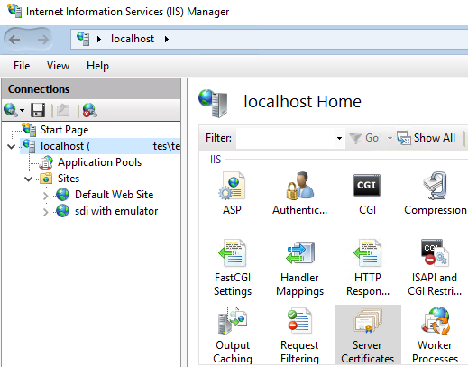
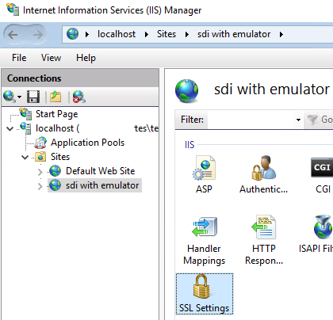

---
# required metadata

title: Get started with Electronic invoicing for Italy
description: This topic provides information that will help you get started with Electronic invoicing for Italy.
author: abaryshnikov
ms.date: 11/24/2021
ms.topic: article
audience: Application User, Developer
ms.reviewer: rhaertle
ms.custom: <remove if blank>
ms.search.region: Global
ms.author: abaryshnikov
ms.search.validFrom: 2021-10-18
ms.dyn365.ops.version: AX 10.0.20
---

# Get started with Electronic invoicing for Italy

[!include [banner](../includes/banner.md)]


    > [!IMPORTANT]
    > Electronic invoicing for Italy might not currently support all the functions that are available for electronic invoices in Microsoft Dynamics 365 Finance and Dynamics 365 Supply Chain Management. 

This topic provides information that will help you to get started with Electronic invoicing for Italy in Microsoft Dynamics 365 Finance and Dynamics 365 Supply Chain Management. It guides you through the configuration steps that are country/region-dependent in Regulatory Configuration Services (RCS). These steps complement the steps that are described in [Get started with Electronic invoicing](e-invoicing-get-started.md).

## Prerequisites

Before you complete the steps in this topic, the following prerequisites must be met:

-   Complete the steps in [Get started with Electronic invoicing](e-invoicing-get-started.md).

-   Import the **Italian FatturaPA (IT)** electronic invoicing feature into RCS from the Global repository. For more information, see the [Import an Electronic invoicing feature from the Microsoft configuration provider](e-invoicing-get-started.md#import-an-electronic-invoicing-feature-from-the-microsoft-configuration-provider) section in the "Get started with Electronic invoicing" topic.

-   Add links to the required certificates to service environment (Digital signature certificate, CA certificate, Clients certificate). For more information, see the  [Create a digital certificate secret](e-invoicing-get-started-service-administration.md#create-a-digital-certificate-secret) section in the " Get started with Electronic invoicing service administration" topic.

## Country-specific configuration for the Italian FatturaPA (IT) Electronic invoicing feature

Follow these steps before you deploy the application setup to your connected Finance or Supply Chain Management application.

This section complements the [Country-specific configuration of application setup](e-invoicing-get-started.md#country-specific-configuration-of-application-setup) section in the "Get started with Electronic invoicing" topic that was mentioned earlier.

### Create new feature

1.  Log in to **Regulatory configuration service**.
2.  In the **Electronic reporting** workspace, in the **Configuration providers** section select your company\`s **Configuration provider** as active.
3.  In the **Globalization feature** workspace, in the **Features** section, select the **Electronic invoicing** tile.
4.  On the **Electronic invoicing features** page select **Add** \> **Based on existing feature** \> select **Italian FatturaPA (IT)** under Microsoft configuration provider as base feature \> set **Name** \> select **Create feature**.

### Setup application specific parameters

5.  On the **Versions** tab, verify that the **Draft** version is selected.
6.  On the **Configurations** tab, go to **Application specific parameters** for a selected configuration. In the **Lookups** section, make sure that **List of Natura reverse charge subcategories** lookup is selected.
7.  In the **Conditions** section, select **Add** to add a condition.
8.  Add specific conditions for each subcategory that is defined in the system and save your changes.  
    Note. In the **Name** column, you can select the **\*Blank\*** or **\*Not blank\*** placeholder value instead of a specific value.

### Configure processing pipeline for export

9.  On the **Setups** tab, select **Edit** for the **Sales invoices**.
10. In the **Processing pipeline** section go through the actions and fill in all the required parameters:
    - **Sign document** action: Certificate name (certificate for digital signature).
    - **Submit** action: URL address, Certificates (chain of certificates where the first one is the root CA certificate (caentrate.cer), second one is the Clients certificate.
11. Select **Validate** button to ensure all required parameters are filled in.
12. Repeat for **Project invoices** setup on the **Setups** tab.

### Configure processing pipeline for import

13. On the **Setups** tab, select **Edit** for the **Import invoices**.
14. In the **Parameters** tab of the **Data channel** section fill in **Data channel** parameter with any reasonable string.
15. Fill in **Applicability rules** for the setup. You can use the default **Channel** clause by passing here the value for **Data channel** parameter value.

    
16. Select **Validate** button to ensure all required parameters are filled in.

### Deploy the Feature

17. Complete, publish, and deploy the feature to the service environment. For more information, see the [Deploy the Electronic invoicing feature to Service environment](e-invoicing-get-started.md#deploy-the-electronic-invoicing-feature-to-service-environment) section in the "Get started with Electronic invoicing" topic.
18. Deploy the feature to the connected application. For more information, see the [Deploy the Electronic invoicing feature to Connected application](e-invoicing-get-started.md#deploy-the-electronic-invoicing-feature-to-connected-application) section in the "Get started with Electronic invoicing" topic.

### Dynamics 365 Finance setup

1.  Sign in to Dynamics 365 Finance.
2.  In the **Electronic reporting** workspace, in the **Configuration providers** section, select the **Microsoft** tile.
3.  Select **Repositories** \> **Global** \> **Open**.
4.  Import Customer invoice context model, Vendor invoice import (IT).
5.  Go to Organization administration \> Setup \> Electronic document parameters.
6.  On the **Features** tab, select the **Enable** check box in the row for feature **Italian electronic invoice**.
7.  Go to **Electronic document** tab.
8.  Make sure settings for **Customer invoice journal** and **Project invoice** are filled in according to this article: [Configure the application setup](e-invoicing-get-started.md#configure-the-application-setup).

### Import vendor invoices setup

9.  In the **Electronic reporting** workspace, in the **Configuration providers** section select your company\`s **Configuration provider** as active.
10. Go to the **Electronic reporting** workspace and select **Reporting configurations**.
11. Select **Customer invoice context model**, and then select **Create configuration** \> **Derive from Name: Customer invoice context), Microsoft** to create a derived configuration.
12. On the **Draft** version, select **Designer** and in the **Data model** tree, select **Map model to datasource**.
13. In the **Definitions** tree, select **DataChannel** and then select **Designer**.
14. In the **Data sources** tree, expand the **$Context\_Channel** container. In the **Value** field, select **Edit** and enter the data channel name (less or equal 10 symbols). This is the name of the channel. It should match with the **Data channel** parameter value of the data channel for the Electronic invoicing feature in RCS.
15. **Save** the changes \> Go back to **Reporting configurations** \> complete configuration version.
16. Go to **External channels** tab.
17. On the **Channels**, select **Add** and fill in the **Channel field** (**$Context Channel** value), Description, Company.
18. In the **Document context** field, select the new derived configuration from **Customer invoice context model**. The mapping description should be **Data channel context**.
19. On **Import sources** tab select **Add** and fill in
    - **Name**: OutputFile
    - **Data entity name**: Vendor invoice header (Data entity: VendorInvoiceHeaderEntity)
    - **Model mapping**: Vendor invoice import (IT)

    > [!NOTE]
    > You can create several external channels and derived context configurations with different **$Context Channel** value for import vendor invoices from different sources. For example, if you want to import vendor invoices for different legal entities.

## Proxy server setup

### Create App Registration

1.  Create a self-signed certificate for service to service authentication:  
    (can be done by PowerShell script)
	
```powershell
$certOutputLocation = "C:\certs\proxytest"
$certName = "sdiProxyClientS2SCert"
$certPassword = "123"

$certCerFile = Join-Path $certOutputLocation "$certName.cer"
$certPfxFile = Join-Path $certOutputLocation "$certName.pfx"

$securePassword = ConvertTo-SecureString $certPassword -AsPlainText -Force

$cert = New-SelfSignedCertificate -KeyLength 2048 -KeyExportPolicy Exportable -FriendlyName "CN=$certName" -CertStoreLocation Cert:\CurrentUser\My -Subject $certName -Provider "Microsoft Enhanced RSA and AES Cryptographic Provider"

Export-Certificate -Cert $cert -FilePath $certCerFile -type CERT | Out-Null
Export-PfxCertificate -Cert $cert -FilePath $certPfxFile -Password $securePassword | Out-Null
```

2.  Save the pfx certificate into the Key Vault with reasonable name (sdiProxyClientS2SCert).
3.  Delete pfx cert after saving to Key Vault.
4.  Go to [Azure portal](https://portal.azure.com) and login as administrator.
5.  Create app registration for **SDI Proxy service**:
    1.  Go to **App registrations**.
    2.  Create new registration with the following parameters:
        - **Name**: **SDI Proxy Client** (or any reasonable name)
        - **Account type: *Accounts in this organizational directory only (Single tenant)***
		
    

    3.  Select **Register**.
    4.  Select created app registration and go to **API permissions**:
    5.  Select ***Grant admin consent***.
	
	    
	
    6.  Go to ***Certificates & secrets*** and upload the '.cer' certificate for service to service authentication created in one of the previous steps (sdiProxyClientS2SCert).
	
        

    7.  Go to ***Enterprise applications*** and select application created.
    8.  Save ***Application ID*** (Client ID) and ***Object ID*** of the app.
    9.  Contact with the **Invoicing Service** team to grant this app access to the service.
        Send to the <D365EInvoiceSupport@microsoft.com> the following parameters:
        - **AAD TenantID**  
        - **LCS Environment ID**
        - **Application ID** (Client ID)  
        - **Object ID**

6.  Add the ***Object ID*** to the Applications list of your service environment in RCS. **Save** and **Publish** changes.
    1.  In Regulatory configuration service go to Globalization features \> Environments \> Electronic Invoicing \> Service environments
    2.  Select your environment and add application to the list:
	
        

    3.  Save \> Publish

### Create Azure Virtual Machine:

1.  Go to **Virtual machines** and select **Create new**.
2.  Select you subscription and resource group (the same where you Key Vault and Blob storage are located).
3.  Chose the same region where your F&O instance has been deployed (as well as Key Vault and Blob storage).
4.  Insert administrators user name and password (and save them into the Key Vault).
5.  Inbound ports: HTTPS(443), RPD (3389) (it\`s recommended to disable RDP (3389) when the system goes to production. You can enable it back when it is necessary to connect to the VM in case of troubleshooting).

    

6.  Use managed disks, Do not use Ephemeral.

    

7.  On the Networking tab select **Public IP** \> **Create new** \> Select **Standard** SKU, **Static** assignment.

    

    

8.  On the **Management** tab:
    1.  DISABLE **Auto-shutdown** policy on the **Management** tab.
    2.  Set **Manual** Guest OS updates.
    3.  All other policies can be set.
9.  Review and create Virtual Machine.
10.  Go to created VM \> Identity \> System assigned \> Status \> ON.
11.  Grant access to the Key Vault for the VM:
     1.  Go to Key Vault \> **Access control (IAM)** \> Role assignments.
     2.  Select **Add role assignment** and save then
         1.  Role: **Key Vault Secrets User**
         2.  Assign access to: **Virtual machine**
         3.  Subscription: your **subscription**
         4.  Select: find your **Virtual machine**
     1.  Go to Key Vault \> **Access policies**
     2.  Select **Add Access Policy**
         1.  Select Virtual machine as Selected principal.
         2.  Select Certificate \> **List**, **Get** permissions.
12.  Enable Application Insights.
    1.  Go to created Virtual machine \> Monitoring \> Insights.
    2.  Select **Enable** and follow the Application Insights creation guide.
13.  Go to **Public IP addresses** and select IP address created within the Virtual machine.
     1.  Go to **Configuration** and set the DNS name.

### Proxy service environment preparation.

Several steps should be done on machine where proxy service supposed to be hosted:
1.  Connect to the Virtual machine via Remote Desktop Connection.
2.  Open Local Machine Certificate snap-in following this [guide](https://docs.microsoft.com/en-us/dotnet/framework/wcf/feature-details/how-to-view-certificates-with-the-mmc-snap-in).
3.  Import certificates caentrate.cer file for production and CAEntratetest.cer for test (Root CA certificate provided by authority) to **Trusted Root Certification Authorities**.
3.  Open **Turn on/off windows features** window (OR **Server Manager \> Add Roles And Features** for server OS) and turn on IIS features as on screenshot below:

    
	
### Setup SDI Proxy service on IIS.

1.  Take folder with SdiProxy solution: Go to **Shared asset library** as described in article: [Asset library in Lifecycle Services (LCS)](https://docs.microsoft.com/en-us/dynamics365/fin-ops-core/dev-itpro/lifecycle-services/asset-library).
2.  Select asset type: Data package
3.  Find and download **Electronic Invoicing Service Sdi Proxy** to the Virtual machine.
4.  Configure service:
    1.  In **src\\FattureService** folder open **appsettings.json** and enter following parameters:
        1. **KeyVaultUri** - Address of the key vault which stores client certificate for invoicing service
        2. **TenantId** - GUID of the customer's tenant
        3. **EnvironmentId** - Id of LCS environment
        4. **ClientId** - AppId of intermediate services app registration in customer\`s tenant
        5. **ClientCertificateName** - name of the S2S certificate in the Key Vault
        6.  SecurityServiceClientOptions.**Endpoint** - Url address of the security service
        7.  SecurityServiceClientOptions.**Resource** - Scope to obtain token
        8.  InvoicingServiceClientOptions.**Endpoint** - endpoint of the Invoicing service. Should be the same as for RCS and F&O setup
        9.  InvoicingServiceClientOptions.**ServiceEnvironmentId** - name of the service environment. Should be the same as for F&O setup
        10. **NotificationsFolder** - folder to save incoming notifications files.
    2.  In web.config:
        1.  Change the following line by adding **proxy server certificate** thumbprint:
            \<serviceCertificate findValue="Put your cert thumbprint here" storeLocation="LocalMachine" storeName="My" x509FindType="FindByThumbprint" \>.
        2.  When the system goes to production the following values could be changed to reduce amount of logs collected and to save a disc space: in \<system.diagnostics\>\<source\> nodes find 'switchValue' parameters and change it values to "Critical, Error". More information could be found here: [MS Service Trace Viewer](https://docs.microsoft.com/dotnet/framework/wcf/service-trace-viewer-tool-svctraceviewer-exe).

5.  Open IIS Manager.
6.  Stay on root node of left menu and, on right side, select **Server certificates**.

    

7.  Open the menu and select Import (Upper right corner).
8.  Specify path to **proxy server** certificate (should be the pfx file).

    

9.  Now do right select on **Sites** \> **Add website**.
10.  Specify any reasonable **Site name**.
11.  In **Physical path** point to folder with **FattureService** service (\\src\\FattureService).
12. Select **https** as **Binding Type**.
13. Specify Host name as **DNS** configured for the Virtual machine and for **proxy server certificate**.
14. Leave **Ip Address** and **Port** as default.
15. **Require Server Name Indication** should be **disabled** (because SDI does not support that technology).
16. SSL certificate: **proxy server certificate** imported before.
17. Application pool: keep specific pool for the site and save it\`s name (SdiAppPool)

    
	
18. After creating web site, open **SSL Settings** menu.

    

19. Check **Require SSL** and select **Client certificats**: Require.

    

20. Open **Directory Browsing** and select **Enable**.
21. Open Internet Explorer browser and check address **serverDNS/TrasmissioneFatture.svc**.
22. Browser can show error that "Site is not secure" - select **More Information** and select **Go to the website.** (for test environment)
23. A standard window about service must be shown up:

    

24. Create folders to store logs and files:
    1.  C:\\logs\\ - here the log files would be placed. They can be viewed by [MS Service Trace Viewer](https://docs.microsoft.com/dotnet/framework/wcf/service-trace-viewer-tool-svctraceviewer-exe)
    2.  C:\\files\\ - here all the response files would be placed
25.  Grant access to the folders for the **NETWORK SERVICE** and **IIS AppPool\\SdiAppPool** (or **IIS AppPool\\DefaultAppPool** for default )
    1.  Open context menu on the folder \> Properties \> Security \> Edit \> Add the users if they are not here
	
        

## Privacy notice 

Enabling the **Italian electronic invoice** feature may require sending limited data, which includes the organization tax registration ID. An administrator can enable and disable the Italian electronic invoice feature by navigating to Organization administration \> Setup \> Electronic document parameters. Select the Features tab, select the rows containing the **Italian electronic invoice** feature, and then make the appropriate selection. Data imported from these external systems into this Dynamics 365 online service are subject to our [privacy statement](https://go.microsoft.com/fwlink/?LinkId=512132). Consult the Privacy notice sections in country-specific feature documentation for more information.

## Additional resources

- [Electronic invoicing overview](e-invoicing-service-overview.md)
- [Get started with Electronic invoicing service administration](e-invoicing-get-started-service-administration.md)
- [Get started with Electronic invoicing](e-invoicing-get-started.md)

[!INCLUDE[footer-include](../../includes/footer-banner.md)]