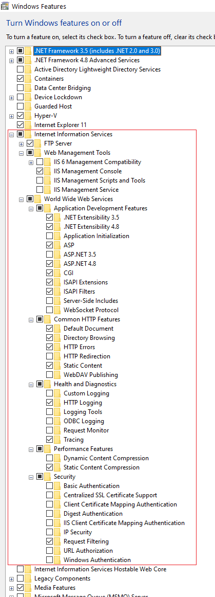

# Set up direct integration of Italian FatturaPA with SDI

[!include [banner](../includes/banner.md)]

> [!IMPORTANT]
> Electronic invoicing for Italy might not currently support all the functions that are available for electronic invoices in Microsoft Dynamics 365 Finance and Dynamics 365 Supply Chain Management.

This article provides information that will help you to get started with Electronic invoicing for Italy in Finance and Supply Chain Management. It guides you through the configuration steps that are country/region-dependent in Regulatory Configuration Services (RCS). These steps complement the steps that are described in [Get started with Electronic invoicing](e-invoicing-get-started.md).

> [!NOTE]
> The solution for direct integration with SDI supports digital signing of documents using separately stored certificate files only. Qualified digital signature which requires additional hardware involvement or online connection to certification service providers is not supported.

## Prerequisites

Before you complete the steps in this article, the following prerequisites must be met:

- Obtain SDICoop service channel accreditation in the Exchange system (SDI) government portal.
- Complete the steps in [Get started with Electronic invoicing](e-invoicing-get-started.md).
- Import the **Italian FatturaPA (IT)** electronic invoicing feature (version 3 or later) into RCS from the Global repository. For more information, see the [Import an Electronic invoicing feature from the Microsoft configuration provider](e-invoicing-get-started.md#import-an-electronic-invoicing-feature-from-the-microsoft-configuration-provider) section of the previously mentioned "Get started with Electronic invoicing" article.
- Add links from the required certificates to the service environment. The required certificates include the Digital signature certificate, Certificate authority (CA) certificate, and Clients certificate. For more information, see the [Create a digital certificate secret](e-invoicing-get-started-service-administration.md#create-a-digital-certificate-secret) section of the "Get started with Electronic invoicing service administration" article.

## Country/region-specific configuration for the Italian FatturaPA (IT) Electronic invoicing feature

Complete the following procedures before you deploy the application setup to your connected Finance or Supply Chain Management app.

This section complements the [Country/region-specific configuration of application setup](e-invoicing-get-started.md#country-specific-configuration-of-application-setup) section of the "Get started with Electronic invoicing" article.

### Create a new number sequence for ProgressivoInvio

1. Sign in to RCS.
2. In the **Globalization feature** workspace, select **Environment setup**, and then select **Service environments**.
3. Select the service environment that you want, and then, in the **Number sequences** section, select **Add**.
4. Enter a name for the new sequence (for example, **ProgressivoInvio**), and then select **Save**.

### Create a new chain of certificates

1. Sign in to RCS.
2. In the **Globalization feature** workspace, select **Environment setup**, and then select **Service environments**.
3. Select **Key Vault parameters**.
4. Add links to the following certificates:

    - **CAentrate.cer** (or **CAEntratetest.cer** in the case of a test environment)
    - **CAActalisOV.cer** (in the case of a production environment)
    - Client identity certificate (Usually, this certificate is generated while the user performs registration of the SDICoop service channel, and it's named SDI-12345678901, where 12345678901 is a company VAT number.)
    - Certificate for digital signature (This certificate is required for the PA flow.)

    For more information, see the [Create a digital certificate secret](e-invoicing-get-started-service-administration.md#create-a-digital-certificate-secret) section of the "Get started with Electronic invoicing service administration" article.

5. Select **Chain of certificates**.
6. Select **New**, enter a name (for example **SDIChainProd** or **SDIChainTest**), and then, in the **Certificates** section, add the following certificates in the order that they're listed in here:

    1. **CAentrate.cer** (or **CAEntratetest.cer** in the case of a test environment)
    2. **CAActalisOV.cer** (in the case of a production environment)
    3. Client identity certificate

7. Save your changes, and close the page.

### Create a new feature

1. Sign in to RCS.
2. In the **Electronic reporting** workspace, in the **Configuration providers** section, mark your company's configuration provider as active.
3. In the **Globalization feature** workspace, in the **Features** section, select the **Electronic invoicing** tile.
4. On the **Electronic invoicing features** page, select **Add** \> **Based on existing feature**.
5. Under **Microsoft configuration provider**, select **Italian FatturaPA (IT)** as a base feature, enter a name, and then select **Create feature**.

### Align Electronic reporting configurations

The following procedures must be completed for all Electronic reporting (ER) format configurations that are used in the feature: **Sales invoice (IT)** and **Project invoice (IT)**.

#### Set up payment method substitution

1. On the **Electronic invoicing features** page, select the feature to edit.
2. On the **Versions** tab, verify that the **Draft** version is selected.
3. On the **Configurations** tab, select a configuration, and then select **Edit**.
4. On the **Mapping** tab, select **$PaymentMethodSubstitution**, and then select **Edit** \> **Edit formula**.
5. Align the formula to the payment methods that are configured in the Finance app.
6. Save your changes, close the formula designer, and then select **OK**.

#### Add a user input parameter for the ProgressivoInvio value

1. On the **Electronic invoicing features** page, on the **Mapping** tab, select **Add root**.
2. Select **General\\User input parameter**. 
3. Enter a name for the new parameter (for example, **ProgressivoInvioUIP**), and then select **OK**.

#### Change formula for the file name

1. On the **Electronic invoicing features** page, on the **Mapping** tab, select **Edit filename**.

    > [!NOTE]
    > Make sure that the root element of the format is selected in the left part of the page.

2. In the formula designer, paste the following formula for the file name. This formula contains a link to the parameter that you previously added. If the name of the parameter is different, align the formula accordingly.

    ```vb
    IF(Invoice.InvoiceBase.CountrySpecificData.EInvoiceParameters_IT.TransmitterInformation.IsFilingForSameLegalEntity,
      Invoice.InvoiceBase.CountrySpecificData.EInvoiceParameters_IT.CompanyInformation.CountryISOCode,
      Invoice.InvoiceBase.CountrySpecificData.EInvoiceParameters_IT.TransmitterInformation.CountryRegionId)&
    IF(Invoice.InvoiceBase.CountrySpecificData.EInvoiceParameters_IT.TransmitterInformation.IsFilingForSameLegalEntity,
      Invoice.InvoiceBase.CountrySpecificData.EInvoiceParameters_IT.CompanyInformation.FiscalCode,
      Invoice.InvoiceBase.CountrySpecificData.EInvoiceParameters_IT.TransmitterInformation.TaxExemptNumber)
    & "_"
    & RIGHT(FORMAT("0000%1", ProgressivoInvioUIP), 5)
    & ".xml"
    ```

3. Save your changes, and close the formula designer.

#### Bind ProgressivoInvio value

1. In the format designer, go to the next node of the format in the left part of the page: 

    XMLHeader\\p:FatturaElettronica\\FatturaElettronicaHeader\\DatiTrasmissione\\ProgressivoInvio\\String

2. On the **Mapping** tab, select the **ProgressivoInvioUIP** parameter that you previously added.
3. Select **Bind**.
4. Save your changes, and close the page.

### Set up application-specific parameters

1. On the **Electronic invoicing features** page, select the feature to edit.
2. On the **Versions** tab, verify that the **Draft** version is selected.
3. On the **Configurations** tab, select a configuration, and then select **Application specific parameters**.
4. In the **Lookups** section, make sure that the **List of Natura reverse charge subcategories** lookup is selected.
5. In the **Conditions** section, select **Add**.
6. Add specific conditions for each subcategory that is defined in the system, and then save your changes.

    > [!NOTE]
    > In the **Name** column, you can select the **\*Blank\*** or **\*Not blank\*** placeholder value instead of a specific value.

### Configure a processing pipeline for export

1. On the **Electronic invoicing features** page, select the feature to edit.
2. On the **Setups** tab, select **Sales invoices**, and then select **Edit**.
3. In the **Processing pipeline** section, go through the actions, and set all the required fields:

    - For the **Sign document** action, in the **Certificate name** field, specify the Digital signature certificate (only for **PA** flow setups).
    - For the **Submit** action, add a value to the **URL address** and **Certificates** fields. The value of the **Certificates** field is a chain of certificates that was added in one of the previous sections (**SDIChainProd** or **SDIChainTest**).
    - For the **Generate format** action, in the **Configuration user input parameters** section, select the **ProgressivoInvioUIP** parameter, change its **Data type** value to **sequence**, and then, in the **Value** field, select one of the available values.

4. In the **Applicability rules** section, go through the clauses, and review or set the required fields:
    - Review the **LegalEntityID** clause and update with the correct value from your legal entity.

5. Select **Validate** to ensure that all required fields have been set.
6. Save your changes, and close the page.
7. On the **Setups** tab, select **Project invoices**, and then select **Edit**.
8. Repeat steps 3 through 6 for project invoices and for **PA** setups.

### Configure the processing pipeline for import

1. On the **Electronic invoicing features** page, select the feature to edit.
2. On the **Setups** tab, select **Import invoices**, and then select **Edit**.
3. In the **Data channel** section, on the **Parameters** tab, in the **Data channel** field, enter a string value.
4. On the **Applicability rules** tab, set the fields for the setup. You can use the default **Channel** clause by passing the value that you set for the **Data channel** field in the previous step to the **Value** field.

    

5. Select **Validate** to ensure that all required fields have been set.

### Deploy the feature

1. Complete, publish, and deploy the feature to the service environment. For more information, see the [Deploy the Electronic invoicing feature to Service environment](e-invoicing-get-started.md#deploy-the-electronic-invoicing-feature-to-service-environment) section of the "Get started with Electronic invoicing" article.
2. Deploy the feature to the connected application. For more information, see the [Deploy the Electronic invoicing feature to Connected application](e-invoicing-get-started.md#deploy-the-electronic-invoicing-feature-to-connected-application) section of the "Get started with Electronic invoicing" article.

### Set up Finance

#### Import Electronic reporting configurations

1. Sign in to your Finance environment.
2. In the **Electronic reporting** workspace, in the **Configuration providers** section, select the **Microsoft** tile.
3. Select **Repositories** \> **Global** \> **Open**.
4. Select and import the **Customer invoice context model** (version 54 or later), **Invoice model mapping**, and **Vendor invoice import (IT)** configurations.

    > [!NOTE]
    > Version 52 of the **Customer invoice context model** configuration requires Dynamics 365 Finance version 10.0.32. If you have an earlier version of the app, see the next section.

#### Align the customer invoice context model

This procedure must be completed only for Finance versions that are earlier than 10.0.32.

1. In the **Electronic reporting** workspace, in the **Configuration providers** section, select the **Microsoft** tile.
2. Select **Repositories** \> **Global** \> **Open**.
3. Select and import **Customer invoice context model** (version 50).
4. In the **Electronic reporting** workspace, in the **Configuration providers** section, mark your company's configuration provider as active, and then select **Reporting configurations**.
5. Select **Customer invoice context model**, and then select **Create configuration**.
6. Select **Derive from Name: Customer invoice context, Microsoft** to create a derived configuration.
7. In the **Draft** version, select **Designer**.
8. In the **Data model** tree, select **Map model to datasource**.
9. In the **Definitions** tree, select **CustomerInvoice**, and then select **Designer**.
10. In the **Data sources** tree, select **$Context\_DocumentType\\Value**, select **Edit**, and then select **Edit formula**.
11. Specify the following formula.

    ```vb
    IF(CustInvoiceJour.'creditNote()', "Customer credit note", "Customer invoice")
    & IF('$Context_ISOCode'.Value = "IT",
       IF(LEN(CustInvoiceJour.'>Relations'.InvoiceAccount.AuthorityOffice_IT) = 6, " PA", ""),
       "")
    ```

12. Save your changes, close the designer page, and then select **OK**.
13. Save your changes, and close the **Model mapping designer** page.
14. In the **Definitions** tree, select **ProjectInvoice**, and then select **Designer**.
15. In the **Data sources** tree, select **$Context\_DocumentType\\Value**, select **Edit**, and then select **Edit formula**.
16. Specify the following formula.

    ```vb
    IF(ProjInvoiceJour.'isCreditNote_CZ()', "Project credit note", "Project invoice")
    & IF('$Context_ISOCode'.Value = "IT",
      IF(LEN(ProjInvoiceJour.'>Relations'.CustTable.AuthorityOffice_IT) = 6, " PA", ""),
      "")
    ```

17. Save your changes, close the designer page, and then select **OK**.
18. Save your changes, and close the **Model mapping designer** page.
19. On the **Reporting configurations** page, select the **Draft** version of the configuration, and then select **Change status** \> **Complete**.
18. Use this derived configuration instead of **Customer invoice context model** in the next sections.

After you upgrade your Finance environment to version 10.0.32, we recommend that you import and use **Customer invoice context model** version 54 or later.

#### Configure Electronic document parameters

1. Go to **Organization administration** \> **Setup** \> **Electronic document parameters**.
2. On the **Features** tab, find and select the **Italian electronic invoice** feature, and then select **Enable**.
3. On the **Electronic document** tab, make sure that the fields for **Customer invoice journal** and **Project invoice** are set according to the information in [Configure the application setup](e-invoicing-get-started.md#configure-the-application-setup).

    

### Set up vendor invoice import 

1. In Finance, in the **Electronic reporting** workspace, in the **Configuration providers** section, mark your company's configuration provider as active.
2. Select **Reporting configurations**.
3. Select **Customer invoice context model**, and then select **Create configuration**.
4. Select **Derive from Name: Customer invoice context, Microsoft** to create a derived configuration.
5. In the **Draft** version, select **Designer**.
6. In the **Data model** tree, select **Map model to datasource**.
7. In the **Definitions** tree, select **DataChannel**, and then select **Designer**.
8. In the **Data sources** tree, expand the **\$Context\_Channel** container.
9. In the **Value** field, select **Edit**. 
10. Enter the name of the data channel. The name should have a maximum of 10 characters. It should match the value of the **Data channel** parameter of the data channel for the Electronic invoicing feature in RCS.
11. Save your changes, and then go to **Reporting configurations** \> **Complete configuration version**.
12. On the **External channels** tab, in the **Channels** section, select **Add**.
13. In the **Channel** field, enter **\$Context Channel** value.
14. Enter values in the **Description** and **Company** fields.
15. In the **Document context** field, select the new configuration that you derived from **Customer invoice context model**. The mapping description should be **Data channel context**.
16. On the **Import sources** tab, select **Add**, and then set the following values:

    - **Name:** OutputFile
    - **Data entity name:** Vendor invoice header (**Data entity:** VendorInvoiceHeaderEntity)
    - **Model mapping:** Vendor invoice import (IT)

    

> [!NOTE]
> If you have import vendor invoices from different sources, you can create several external channels and several derived configurations that have different **\$Context Channel** values. For example, you might want to import vendor invoices for different legal entities.

## Proxy server setup

This section provides information that will help you set up and configure the proxy service for communication between the Exchange system (SDI) and the Electronic invoicing service.

### Create an app registration

1. Use the following Windows PowerShell script to create a self-signed certificate for service-to-service (S2S) authentication.

    ```powershell
    $certOutputLocation = "C:\certs\proxytest"
    $certName = "sdiProxyClientS2SCert"
    $certPassword = "123"

    $certCerFile = Join-Path $certOutputLocation "$certName.cer"
    $certPfxFile = Join-Path $certOutputLocation "$certName.pfx"

    $securePassword = ConvertTo-SecureString $certPassword -AsPlainText -Force

    $cert = New-SelfSignedCertificate -KeyLength 2048 -KeyExportPolicy Exportable -FriendlyName "CN=$certName" -CertStoreLocation Cert:\CurrentUser\My -Subject $certName -Provider "Microsoft Enhanced RSA and AES Cryptographic Provider"

    Export-Certificate -Cert $cert -FilePath $certCerFile -type CERT | Out-Null
    Export-PfxCertificate -Cert $cert -FilePath $certPfxFile -Password $securePassword | Out-Null
    ```

2. Save the .pfx certificate file to the key vault. This certificate will be mentioned later as **App Registration Certificate**.
3. Sign in to the [Azure portal](https://portal.azure.com) as an administrator.
4. Create an app registration for the SDI Proxy service.

    1. Go to **App registrations**, create a registration, and then set the following values for it:

        - **Name:** SDI Proxy Client
        - **Supported account types:** Accounts in this organizational directory only (Single tenant)

    2. Select **Register**, and then select the app registration that you just created.
    3. Go to **API permissions**, and select **Grant admin consent**.
    4. Go to **Certificates & secrets**, select **Upload certificate**, and upload the **App Registration Certificate** .cer file for S2S authentication.
    5. Go to **Enterprise applications**, and select the app that you created.
    6. Save the **Application ID** (client ID) and **Object ID** values for the app.
    7. The Invoicing Service team must grant the app access to the service. Send the values of the following parameters to <D365EInvoiceSupport@microsoft.com>:

        - AAD Tenant ID
        - LCS Environment ID
        - Application ID
        - Object ID

    > [!NOTE]
    > The Object ID for an application is different on the **App registrations** and **Enterprise applications** pages. Use the Object ID value from **Enterprise applications** page.

5. In RCS, add the app to the application list for your service environment.

    1. Go to **Globalization features** \> **Environments** \> **Electronic Invoicing** \> **Service environments**, and select your environment.
    2. In the **Applications** section, add a row to the grid, and enter the name and object ID of the app.

        

    3. Select **Save**, and then select **Publish**.

### Create an Azure virtual machine

1. In the [Azure portal](https://portal.azure.com), go to **Virtual machines**, and select **Create new**.
2. On the **Basics** tab, select your subscription and resource group. The values should be the subscription and resource group where your key vault and Blob storage are located.
3. Select the region. This value should be the region where your Finance environment is deployed.
4. Add the administrator's user name and password, and save them to the key vault.
5. In the **Select inbound ports** field, select **HTTPS (443)** and **RPD (3389)**.

    > [!NOTE]
    > We recommend that you disable the **RDP (3389)** port when the system goes to production. You can re-enable it if you must connect to the virtual machine (VM) for troubleshooting purposes.
    >
    > We recommend that you use the Windows Server 2019 Datacenter operating system (OS). The proxy application sample might have issues if it runs on another type of OS.

    

6. On the **Disks** tab, on the **Advanced** FastTab, select the **Use managed disks** checkbox. Leave the **Ephemeral OS disk** checkbox cleared.

    

7. On the **Networking** tab, under the **Public IP** field, select **Create new**.

    

8. In the **Create public IP address** dialog box, in the **SKU** field group, select the **Standard** option. In the **Assignment** field group, select the **Static** option.

    

9. On the **Management** tab, clear the **Auto-shutdown** checkbox to disable automatic shutdown.
10. Set the **Guest OS updates** field to **Manual**, and then set any other policies.
11. Review and create the VM.
12. In the new VM, go to **Identity** \> **System assigned**, and set the **Status** option to **On**.
13. Grant the VM access to the key vault.

    1. In the key vault, go to **Access control (IAM)** \> **Role assignments**.
    2. Select **Add role assignment**, and then set the following fields:

        1. In the **Role** field, specify **Key Vault Secrets User**.
        2. In the **Assign access to** field, specify **Virtual machine**.
        3. In the **Subscription** field, specify your subscription.
        4. In the **Select** field, specify your VM.

    3. Go to **Access policies**.
    4. Select **Add Access Policy**, and then set the following fields:

        1. In the **Selected principal** field, select your VM.
        2. In the **Certificate** section, select **List** and **Get** permissions.
        3. In the **Secret** section, select **List** and **Get** permissions.

14. In the [Azure portal](https://portal.azure.com), go to **Public IP addresses**, and select the IP address that was created in the VM.
15. Go to **Configuration**, and set the Domain Name System (DNS) name.

### Prepare the proxy service environment

Follow these steps on the machine where the proxy service is hosted.

1. Connect to the VM by using Remote Desktop Connection.
2. Open the Local Machine Certificate snap-in. For more information, see [How to: View certificates with the MMC snap-in](/dotnet/framework/wcf/feature-details/how-to-view-certificates-with-the-mmc-snap-in).
3. Import the **caentrate.cer** certificate into the [Trusted Root Certification Authorities store](/dotnet/framework/wcf/feature-details/working-with-certificates#certificate-stores).
4. Import the **CAEntratetest.cer** certificate into Trusted Root Certification Authorities store (only for test environment).
5. Import the **SistemaInterscambioFatturaPA.cer** certificate for production and the **SistemaInterscambioFatturaPATest.cer** certificate for testing into the Trusted People store.
6. In Control Panel, open **Turn Windows features on or off**, or go to **Server Manager** \> **Add Roles and Features** for the server OS, and turn on Internet Information Services (IIS) features:

    - Web Management Tools
        - IIS Management Concole
    - World Wide Web Services
        - Application Development Features
            - .NET Extensibility 4.7 (or 4.8)
            - ASP
            - ASP.NET 4.7 (or 4.8)
            - CGI
            - ISAPI Extensions
            - ISAPI Filters
        - Common HTTP Features
            - Default Document
            - Directory Browsing
            - HTTP Errors
            - Static Content
        - Health and Diagnostics
            - HTTP Logging
            - Tracing
        - Performance Features
            - Static Content Compression
        - Security
            - Request Filtering
	- .NET Framework 4.7 Features
	    - WCF Services
		    - HTTP Activation

    

### Set up the SDI Proxy service in IIS

1. In Microsoft Dynamics Lifecycle Services (LCS), go to the Shared asset library, and select **Data package** as the asset type.
2. Find **Electronic Invoicing Service Sdi Proxy v1.1**, and download it to the VM.
3. Configure the service.

    1. Unzip the **Electronic Invoicing Service Sdi Proxy** archive folder that you downloaded.
    2. In the **src\\FattureService** folder, open the **appsettings.json** file, and set the following parameters:

        - **KeyVaultUri** – Specify the address of the key vault that stores the client certificate for the invoicing service.
        - **TenantId** – Specify the globally unique identifier (GUID) of the customer's tenant.
        - **EnvironmentId** – Specify the ID of the LCS environment.
        - **ClientId** – Specify the app ID of the intermediate services app registration in the customer's tenant.
        - **ClientCertificateName** – Specify the name of the **App Registration Certificate** in the key vault.
        - **SecurityServiceClientOptions.Endpoint** – Specify the URL of the security service.
        - **SecurityServiceClientOptions.Resource** – Specify the scope to obtain the token for.
        - **InvoicingServiceClientOptions.Endpoint** – Specify the endpoint of the invoicing service. This value should be the same endpoint that is used for RCS and Finance.
        - **InvoicingServiceClientOptions.ServiceEnvironmentId** – Specify the name of the service environment that's configured in RCS.
        - **NotificationsFolder** – Specify the folder to save incoming notification files in. For example, **C:\\\\Files\\\\**.

    3. In the **web.config** file, find the following line, and add the thumbprint of the proxy server certificate.

        `<serviceCertificate findValue="[certificate thumbprint]" storeLocation="LocalMachine" storeName="My" x509FindType="FindByThumbprint">`

        > [!TIP]
        > When the system goes to production, you can change some values in the web.config file to help reduce the amount of log information that is collected and help save disk space. In the **\<system.diagnostics\>\<source\>** node, change the value of the **switchValue** to **Critical,Error**. For more information, see [MS Service Trace Viewer](/dotnet/framework/wcf/service-trace-viewer-tool-svctraceviewer-exe).
		
	4. Build the solution.

4. Open IIS Manager. In the tree on the left, remain in the root node. On the right, select **Server Certificates**.

    

5. Open the menu, and select **Import**.
6. In the **Import Certificate** dialog box, in the **Certificate file (.pfx)** field, specify the path of the .pfx file for the proxy server certificate. Usually, this file is generated while you perform registration of the SDICoop service channel, and it's named sdiproxy.com.pfx, where sdiproxy.com is a DNS that's assigned to the proxy VM.

    

7. Select and hold (or right-click) **Sites**, and then select **Add website**.
8. In the **Add Website** dialog box, in the **Site name** field, enter a name for the site.
9. In the **Physical path** field, point to the **src\\FattureService** folder.
10. In the **Binding type** field, select **https**.
11. In the **Host name** field, specify the host name.
12. Leave the **IP address** and **Port** fields set to the default values.
13. Make sure that the **Require Server Name Indication** checkbox is cleared, because SDI doesn't support that technology.
14. In the **SSL certificate** field, select the proxy server certificate that you imported.
15. In the **Application pool** field, specify a pool for the site, and make a note of its name (for example, **SdiAppPool**).

    

16. After you've finished creating the website, open the menu for **SSL Settings**.

    

17. Select the **Require SSL** checkbox, and then, in the **Client certificates** field group, select the **Require** option.

    

18. Open **Directory Browsing**, and select **Enable**.
19. In any web browser, go to **serverDNS/TrasmissioneFatture.svc**. A standard page about the service must appear or you may get a server error, such as 403 - Forbidden. This step is needed to ensure that the **serverDNS** is accessible and not hidden by a firewall or something else.

    

20. Create the following folders to store logs and files:

    - **C:\\Logs\\** – Store log files here. These files can be viewed by [MS Service Trace Viewer](/dotnet/framework/wcf/service-trace-viewer-tool-svctraceviewer-exe).
    - **C:\\Files\\** – Store all the response files here.

21. In File Explorer, grant **NETWORK SERVICE** and **IIS AppPool\\SdiAppPool** (or **IIS AppPool\\DefaultAppPool** if you're using the default pool) access to the **Logs** and **Files** folders.

    1. Select and hold (or right-click) one of the folders, and then select **Properties**.
    2. In the **Properties** dialog box, on the **Security** tab, select **Edit**.
    3. Add the users if they aren't listed.
    4. Repeat steps 1 through 3 for the other folder.

    

## Privacy notice 

Enabling the **Italian electronic invoice** feature might require that limited data be sent. This data includes the organization's tax registration ID. An administrator can enable and disable the Italian electronic invoice feature. To disable the feature, follow these steps.

1. Go to **Organization administration** \> **Setup** \> **Electronic document parameters**.
2. On the **Features** tab, select the rows that contain the **Italian electronic invoice** feature, and then select **Disable now**.

Data that is imported from these external systems into this Dynamics 365 online service are subject to our [privacy statement](https://go.microsoft.com/fwlink/?LinkId=512132). For more information, see the "Privacy notice" section in country/region-specific feature documentation.

## Additional resources

- [Electronic invoicing overview](e-invoicing-service-overview.md)
- [Get started with Electronic invoicing service administration](e-invoicing-get-started-service-administration.md)
- [Get started with Electronic invoicing](e-invoicing-get-started.md)

[!INCLUDE[footer-include](../../includes/footer-banner.md)]
